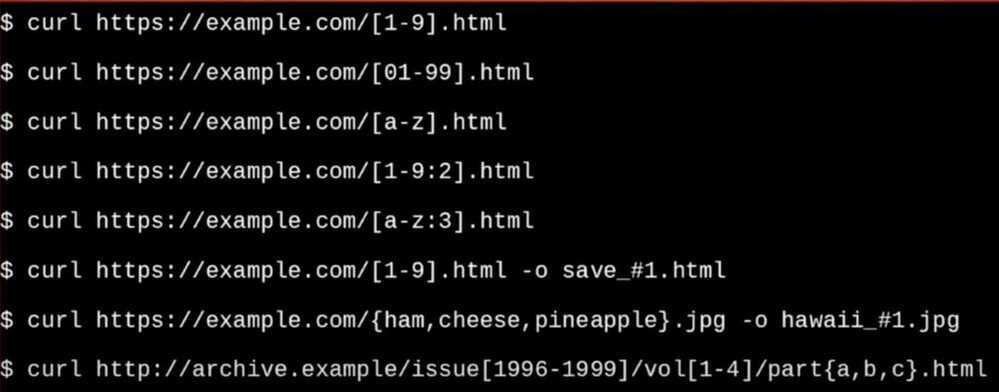

# Curl

curl is a tool to transfer data from or to a server, using one of the supported protocols (DICT, FILE, FTP, FTPS, GOPHER, HTTP, HTTPS, IMAP, IMAPS, LDAP, LDAPS, POP3, POP3S, RTMP, RTSP, SCP, SFTP, SMB, SMBS, SMTP, SMTPS, TELNET and TFTP). The command is designed to work without user interaction.

curl offers a busload of useful tricks like proxy support, user authentication, FTP upload, HTTP post, SSL connections, cookies, file transfer resume, Metalink, and more.

curl is powered by libcurl for all transfer-related features.

## Install

```bash
brew uninstall curl
brew install curl-openssl
echo 'export PATH="/usr/local/opt/curl-openssl/bin:$PATH"' >> ~/.zshrc

curl --http2 http://example.com/

# Options
-o <file>    # --output: write to file
-u user:pass # --user: Authentication
-v           # --verbose
-vv          # Even more verbose
-s           # --silent
-I           # --head: headers only
-i           # response headers

# Request
-X POST          # --request
-L               # follow link if page redirects

# Data
-d 'data'    # --data: HTTP post data, URL encoded (eg, status="Hello")
-d @file     # --data via file
-G           # --get: send -d data via get

# Headers
-A <str>         # --user-agent
-b name=val      # --cookie
-b FILE          # --cookie
-H "X-Foo: y"    # --header
--compressed     # use deflate/gzip

# SSL
    --cacert <file>
--capath <dir>
-E, --cert <cert>     # --cert: Client cert file
--cert-type       # der/pem/eng
-k, --insecure        # for self-signed certs

# Cookies
# save the cookie
curl -c cookiejar.txt https://www.facebook.com

# send the cookie with the request
curl -b cookiejar.txt https://www.facebook.com
```

https://tools.keycdn.com/http2-test

## Examples

```bash
# Post data:
curl -d password=x http://x.com/y
curl -X GET https://httpbin.org/anything -d "{'value':'panda'}"

# Auth/data:
curl -u user:pass -d status="Hello" http://twitter.com/statuses/update.xml

# multipart file upload
curl -v -include --form key1=value1 --form upload=@localfilename URL

# Setting headers
    ○ curl -i -H "Accept-Encoding: gzip" https://httpbin.org/anything
    ○ curl -X POST https://httpbin.org/anything -H "Content-Type: application/json" --data {"value":"panda"} -d '{"value": "panda"}'
    ○ curl -i -X DELETE https://httpbin.org/anything
    ○ curl -H "Accept-Language: es-ES" https://twitter.com > test.html

# curl an image file
    curl -X GET https://httpbin.org/image/jpeg > test.jpg   #don't use -i since it will corrupt the image

# others
    curl -i https://httpbin.org/status/200
    curl -i https://httpbin.org/status/400

    curl https://httpbin.org/anything \
        -u sk_test_4eC39HqLyjWDarjtT1zdp7dc: \
        -d amount=999 \
        -d currency=usd \
        -d receipt_email="jenny.rosen@example.com"

# curl output only status code
    curl -s -o /dev/null -w "%{http_code}" http://www.example.org/

# run in a loop
    while true; do curl http://google.com; sleep 1; done
    while true; do curl -s -o /dev/null -w "%{http_code}" http://www.google.com/; done
```

### URL Globbing



### Timeout parameters

curl has two options : `--connect-timeout` and `--max-time`

`--connect-timeout <seconds>`

Maximum time in seconds that you allow the connection to the server to take. This only limits the connection phase, once curl has connected this option is of no more use. Since 7.32.0, this option accepts decimal values, but the actual timeout will decrease in accuracy as the specified timeout increases in decimal precision. See also the -m, --max-time option.

`-m, --max-time <seconds>`

Maximum time in seconds that you allow the whole operation to take. This is useful for preventing your batch jobs from hanging for hours due to slow networks or links going down. Since 7.32.0, this option accepts decimal values, but the actual timeout will decrease in accuracy as the specified timeout increases in decimal precision. See also the --connect-timeout option.

## HealthChecks

`curl -f -s -m 2 -o /dev/null -I http://localhost:8070`

https://jvns.ca/blog/2019/08/27/curl-exercises

https://curl.haxx.se/book.html

[**https://www.youtube.com/watch?v=I6id1Y0YuNk&ab_channel=freeCodeCampTalks**](https://www.youtube.com/watch?v=I6id1Y0YuNk&ab_channel=freeCodeCampTalks)

## Alternative

https://github.com/httpie/httpie

HTTPie is a command-line HTTP client. Its goal is to make CLI interaction with web services as human-friendly as possible. HTTPie is designed for testing, debugging, and generally interacting with APIs & HTTP servers. Thehttp&httpscommands allow for creating and sending arbitrary HTTP requests. They use simple and natural syntax and provide formatted and colorized output.

https://httpie.io
