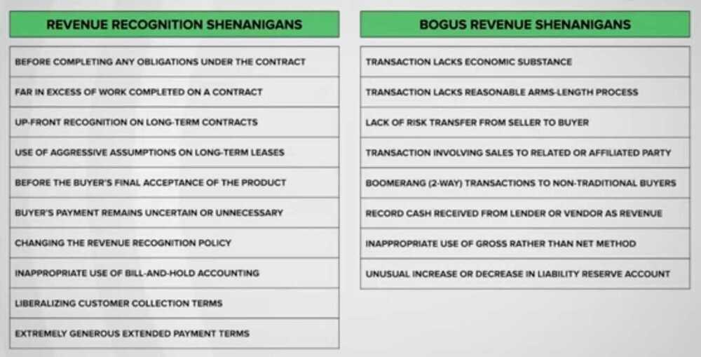

# 0 Accounting for Finance

[Accounting 101 (taught by a non-accountant)](https://www.youtube.com/playlist?list=PLUkh9m2BorqmKaLrNBjKtFDhpdFdi8f7C)

This is a course of short webcasts (about 12-20 minutes apiece), designed to introduce you to the basics of accounting, but more from the perspective of a user of financial statements than from someone who cares about accounting rules and standards. So, be forewarned! I have no qualms about saying terrible things about accounting standards and rule writers, rewriting accounting rules to fit my perspectives on valuation and corporate finance, and ignoring vast segments of accounting statements as useless in financial analysis.

| **Session Webcast** | **Short Description** | **Supplementary Material** |
|---|---|---|
| **Preview** | Introduction to sessions | Provides an introduction to (my) version of an accounting class. Perhaps, morea warning, than a sales pitch! |
| **1** | Financial Statements: An Overview | Provides an overview of the three financial statements and what they aim to do (and sometimes fail to do). |
| **2** | Income Statements: Measuring Profits | Go through an income statement, drawing distinctions between operating & financing expenses and measures of profitability. |
| **2A** | Income Statements: Illustrations | Look at the income statements of a diverse set of companies, at different stages of life cycle and in different sectors. |
| **3** | Balance Sheets: Asset Base and Debt Due | Go through a balance sheet, looking at how assets get recorded on it, and how that measurement affects accounting measures of equity. |
| **3A** | Balance Sheets: Illustrations | Look at the balance sheets of a diverse set of companies, at different stages of life cycle and in different sectors. |
| **4** | Cashflow Statements: Cash In and Out | Go through a cash flow statement, drawing out information that it provides on cash earnings and cash flows. |
| **4A** | Cash Flow Statements: Illustrations | Look at the cashflow statements of a diverse set of companies, at different stages of life cycle and in different sectors. |
| **5** | Accounting Inconsistencies & Consequences | Look at the items (stock based compensation, R&D, leases) where there are accounting inconsistencies, and how they play out in the statements. |
| **5A** | Accounting Inconsistencies: Illustrations | Look at the how to resolve inconsistencies in accounting in real-world examples. |
| **6** | Financial Ratios: Of comps and peer groups | Ratiosare scaling mechanisms, allowing for comparisons across companies and acrosstime. In this session, I look at a range of ratios that can help in analysis. |
| **6A** | Financial Ratios: Illustrations | Look at using financial ratios to make judgments about profitability, leverage and liquidity with real-world examples. |

## Courses

- Accounting - https://www.accountingcoach.com/accounting-basics/outline
- **Aswath Damodaran - Foundations of Finance**

## References

[Data Update 1 for 2022: It's Moneyball Time!](https://youtu.be/QlQqJpxcHCM)

[How Companies Cook Their Books (Part 1) | ET Money](https://www.youtube.com/watch?v=RsNTz5YLOxQ)

- Bringing Time To A Halt
- In Excess Of Work Completed
- Assets Leased To Customers
- Before The Buyer's Final Acceptance
- Transactions Lacking Economic Substance
- When Loan Is Not A Liability, But A Sale
- Masquerading As A Large Company

[How Companies Cook Their Books Part 2 | ET Money](https://youtu.be/ah4-G4CsGAE)

- Failure to Record an Expense
- Playing with Reserves
- Pushing Expenses for later to boost income
- Using One-Time Events Creatively
- Boosting Income through Misleading Classifications
- Shifting Losses to Discontinued Operations

All Accounts

- Application of Funds (Assets)
    - Current Assets
        - Accounts Receivable
            - Debtors
        - Bank Accounts
        - Cash In Hand
            - Cash
        - Loans and Advances (Assets)
        - Securities and Deposits
            - Earnest Money
        - Stock Assets
            - Stock In Hand
        - Tax Assets
    - Fixed Assets
        - Capital Equipments
        - Electronic Equipments
        - Furnitures and Fixtures
        - Office Equipments
        - Plants and Machineries
        - Buildings
        - Accumulated Depreciations
    - Investments
    - Temporary Accounts
        - Temporary Opening
- Expenses
    - Direct Expenses
        - Stock Expenses
            - Cost of Goods Sold
            - Expenses Included In Valuation
            - Stock Adjustment
    - Indirect Expenses
        - Administrative Expenses
        - Commission on Sales
        - Depreciation
        - Entertainment Expenses
        - Freight and Forwarding Charges
        - Legal Expenses
        - Marketing Expenses
        - Miscellaneous Expenses
        - Office Maintenance Expenses
        - Office Rent
        - Postal Expenses
        - Print and Stationary
        - Rounded Off
        - Salary
        - Sales Expenses
        - Telephone Expenses
        - Travel Expenses
        - Utility Expenses
        - Write Off
        - Exchange Gain/Loss
        - Gain/Loss on Asset Disposal
- Income
    - Direct Income
        - Sales
        - Service
    - Indirect Income
- Source of Funds (Liabilities)
    - Capital Account
        - Reserves and Surplus
        - Shareholders Funds
    - Current Liabilities
        - Accounts Payable
            - Creditors
            - Payroll Payable
        - Stock Liabilities
            - Stock Received But Not Billed
        - Duties and Taxes
            - TDS
        - Loans (Liabilities)
            - Secured Loans
            - Unsecured Loans
            - Bank Overdraft Account

## Cheatsheet

#### cashflow

- Operating Cash Flow: Cash generated or consumed by the company's regular operations.
- Formula: Net Income + Non-cash Expenses - Changes in Working Capital.
- Free Cash Flow: Cash available after all expenses and investments have been accounted for.
- Formula: Operating Cash Flow - Capital Expenditures.

#### revenue

- Gross Revenue: Total revenue generated from sales before deducting any costs or expenses.
- Formula: Total units sold x Average selling price per unit.
- Net Revenue: Revenue remaining after deducting discounts, returns, and allowances.
- Formula: Gross Revenue - Discounts - Returns - Allowances.

#### Cost

- Cost of Goods Sold (COGS): Direct costs associated with producing or delivering the product.
- Formula: Cost of raw materials + Labor cost + Manufacturing overhead.
- Gross Profit: Revenue minus the COGS.
- Formula: Net Revenue - COGS.
- Operating Expenses: Expenses incurred in running the business, including salaries, marketing costs, and administrative expenses.
- Formula: Employee salaries + Marketing expenses + Rent + Utilities.

#### profit

- Gross Profit Margin: The percentage of gross profit relative to revenue.
- Formula: (Gross Profit / Net Revenue) x 100.
- Operating Profit (EBIT): Profit earned from core operations before interest and taxes.
- Formula: Gross Profit - Operating Expenses.
- Net Profit: Profit remaining after deducting all expenses, including taxes and interest.
- Formula: Operating Profit - Taxes - Interest

#### financial

- Return on Investment (ROI): Measures the profitability of an investment relative to its cost.
- Formula: (Net Profit from Investment / Cost of Investment) x 100.
- Earnings Before Interest, Taxes, Depreciation, and Amortization (EBITDA): Measures a company's operating - rformance.
- Formula: Operating Profit + Depreciation + Amortisation.

#### accounting

- Accounts Receivable (AR) Turnover: Measures how quickly the company collects payments from customers.
- Formula: Net Revenue / Average Accounts Receivable.
- Accounts Payable (AP) Turnover: Measures how quickly the company pays its suppliers.
- Formula: COGS / Average Accounts Payable.

#### investment

- Return on Investment (ROI): Measures the profitability of an investment relative to its cost.
- Formula: (Net Profit from Investment / Cost of Investment) x 100.
- Payback Period: Length of time required to recover the initial investment.
- Formula: Cost of Investment / Annual Cash Flows.
