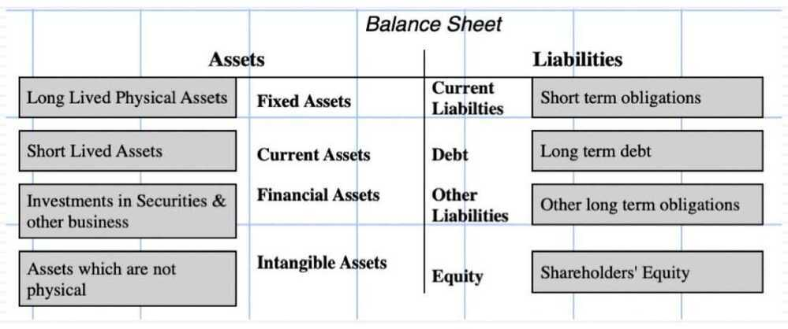
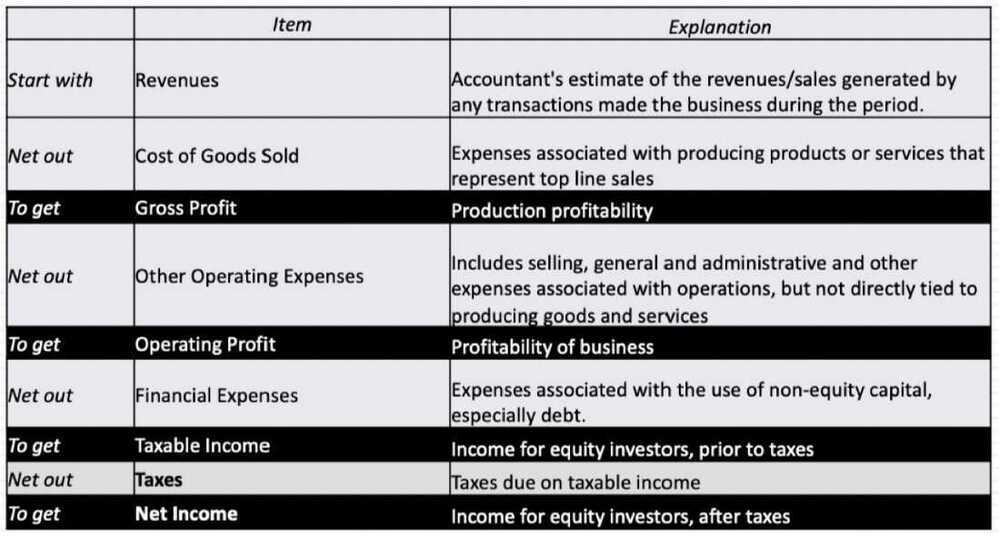
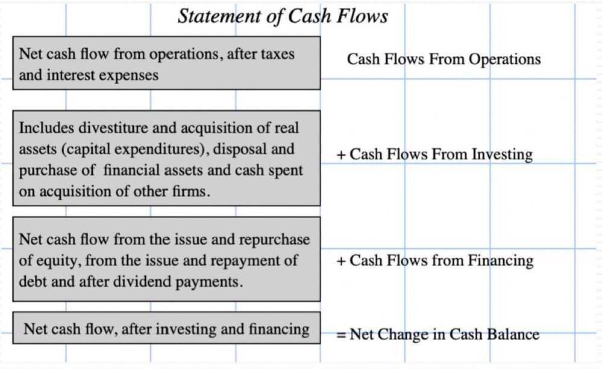

# 1 Accounting First Steps

## The Accountant's Role

- To check transactions and operations, as they occur
- To record them in a consistent manner
- To report the results in standardized form
- Much as accounting wants to make itself more relevant and central to businesses, it is not the role of accounting:
    - Forecast the future, no matter how tempted
    - Value assets or operations
- Bluntly put, an accountant is a historian, chronicling events that have already occurred, not predicting the future

## The Accounting Questions

- What do you own?
    - List out the assets that a business has invested in, and how much it spend on those investments and perhaps what these assets are worth today
- What do you owe?
    - Specify the contractual commitments that a business has to meet, to stay in business. Simply put, this should include all borrowings, but is not restricted to those.
- How much money did you make?
    - Measure the profitability of the business, both with accounting judgements on expenses, and based upon cash in and cash out

## Annual Report

- The Annual Report (AR) of a company is an official communication from the company to its investors and other stakeholders
- The management discussion and analysis is one of the most important sections in the AR. It has the management's perspective on the country's overall economy, their outlook on the industry they operate in for the year gone by, and what they foresee for the year ahead
- The AR contains 3 financial statements - **Profit & Loss statement, Balance Sheet, and Cash Flow statement**
- The **standalone statement** contains the financial numbers of only the company into consideration. However the **consolidated statements** contain the company and its subsidiaries financial numbers.

[How to Read Annual Report of any Company | Includes Worksheet for Annual Report Analysis - YouTube](https://www.youtube.com/watch?v=V28LpTApAww)

## The Accounting Statements

- **The balance sheet,** which summarizes what a firm owns and owes at a point in time, as well as an estimate of what equity is worth (through accounting eyes)
- **The income statement,** which reports on how much a business earned in the period of analysis, while providing detail on revenues and expenses
- **The statement of cash flows,** which reports on cash inflows and outflows for a measure of cash earnings (as opposed to accounting earnings) and cash flows

### Balance Sheet

### Income statement

### Statement of Cash Flows

## The Interconnections

## The Accounting Standards

- Accounting is a rule-driven process, and over time, those rules have been formalized, especially for publicly traded companies. This formalization is driven by two consideration:
    - *Standardization*, to allow for comparisons across companies
    - *First principles*, to ensure that earnings, asset value and cash flows measure what they are supposed to measure.
- While accounting standards around the world remain different, they have converged (for the most part) around two standards:
    - GAAP (Generally Accepted Accounting Principles), representing rules developed by FASB (Financial Accounting Standards Board) to cover US financial reporting
    - IFRS (International Financial Reporting Standards), representing rules developed by IASB (International Accounting Standards Board) for companies listed globally, followed by about 90 countries as of 2020.

## The Bottom Line

- The raw material that we use to do financial analysis and valuation almost always takes the form of accounting statements
- Consequently, it behooves us all to understand how accountants think (even if we disagree with them) in putting these statements together
- The challenge is that accounting thinking keeps chaning, as we move through time, and we have to understand those changes (both the what and the why), to keep up with them

## Double Entry Accounting

Double-entry accounting is **a system that requires two book entries - one debit and one credit - for every transaction within a business**. Your books are balanced when the sum of each debit and its corresponding credit equals zero

[What Is Double-Entry Accounting? - NerdWallet](https://www.nerdwallet.com/article/small-business/double-entry-accounting)

[Double Entry: What It Means in Accounting and How It's Used](https://www.investopedia.com/terms/d/double-entry.asp)

[Fundamental analysis](https://www.youtube.com/playlist?list=PLX2SHiKfualFGenPFh2onjzsh8TeprEmU)
