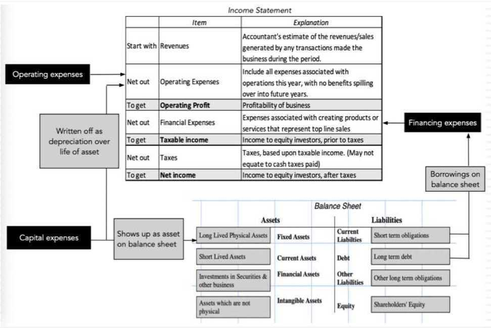
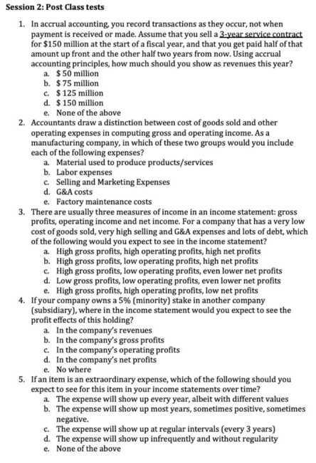
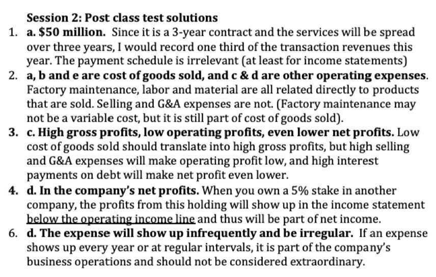

# 2 Income Statements & Profitability Measures

## Measuring Income: Accrual versus Cash Accounting

- In accrual accounting, you record the transactions when they occur, rather than when cash flows occur.
    - Revenues are recorded when a product or service is sold, not when the customer pays for that product or service
    - Expenses are recorded consistently, with the expenses associated with producing the sold product or service shown in the period, even though you may have spent the money in a prior period or will not pay until a future period
- In cash accounting, you record revenues when you get paid for providing a product or service, and expenses when you pay
- Unless you are a small or personal business, you will have to follow accrual accounting rules

## Classifying Expenses: Operating, Financing and Capital Expenses

- **Operating expenses** are expenses associated with the operations of the business. That includes not only the direct costs of producing the product or service the firm sells, but also other expenses associated with production, including selling, general and administrative (SG&A) expenses
- **Financing expenses** are expenses associated with the use of non-equity financing. Most often, this takes the form of interest expenses on debt
- **Capital expenses** are expenses that provide benefits over many years. For a manufactureing company, these can take the form of plant and equipment. For non-manufacturing companies, they can take on less conventional and tangible forms (and accounting has never been good at dealing with these).

## Revisiting the Income Statement

## Revenue Recognition

- For many firms, revenue recongnition is a simple process, where once a product or service is sold, it is recorded as revenues.
- For some firms, especially those that sell products or services over many years, it becomes trickier, since the question of how much of the revenue to record in the year of the sale and how much in subsequent years becomes debatable.
    - Under ASC 606: "The new model's core principle for revenue recognition is to "depict the transfer of promised goods or services to customers in an amount that reflects the consideration to which the entity expects to be entitled in exchange for those goods or services."
    - Thus, for a real estate developer working on a multi-year construction, revenues should be recognized as contruction progresses, and for a software firm that enters in a contract over many years, performance obligations will determine when revenues get recognized

## Revenue Breakdowns

- As companies enter multiple businesses and different geographies, it is useful to know where they generate their revenues.
- While the breakdown can sometimes be provided in income statements, they are more likely to be part of the footnotes to the financial statements:
    - Companies generally break down revenues by geography, though the degree of detail can vary
    - Companies also break down revenues by business segment, though there is an element of subjectivity to the segment categorization

## Operating Expenses: A Break Down

- COGS (Cost of Goods Sold) versus other operating expenses: Operating expenses are broadly broken down into expenses directly related to producing the goods or services that give rise to revenues, i.e. cost of goods sold, and expenses that are related to operations, but which are not as directly tied to revenues.
    - The former are netted out from revenues to get to gross profits
    - The latter get netted out of gross profits to get to operating income
- Selling, General and Adminstrative Costs: In many companies, the largest non-operating expense is S, G & A, an amorphous item which can include everything but the proverbial kitchen sink

## Deprecation: Accounting, Tax and Economic Forms

- **Economic depreciation** reflects the loss in value (earning power) in an asset, as it ages. It requires nuance, and will vary across even the same type of assets, depending on how it is used.
- **Accounting depreciation** is more mechanical and is driven largely by the aging of the asset, with the differences often being in whether it happens uniformly over the life of the asset or is more accelerated.
- **Tax depreciation** reflects what the tax authorities will allow as depreciation for purposes of computing taxable income

## Financial Expenses

- The most common financial expense is **interest expense on debt,** either in the form of bank loans or corporate bonds
- As accountants classify other commitments (such as leases) as debt, **some of the interest expense is implicit,** i.e. it is calculated by accountants based upon their assessment of the debt equivalent value of commitements and current interest rates.
- In some companies, interest expenses are netted out against interest income earned by the company on its cash holdings and financial investments, and reported as a **net interest expense.** If interest income exceeds interest expense, this number will measure net interest income.

## Income from non-operating investments

- Cash & Marketable Securities: Income earned on cash holdings (which is invested in marketable securities, like treasury bills and commercial paper in most companies) will be reported either as a stand alone income or netted against interest expenses.
- Cross holdings in other companies: The reporting can vary depending upon the magnitude of your holding:
    - When you hold a (small or minority) portion of another company, the income from that holding will usually be reported in the income statement.
    - However, if you hold a majority stake of another company, you will generally have to consolidate your financials. That will require you to count 100% of the subsidiary's revenues, operating expenses and operating income as your own.

## Extraordinary Income / Expenses

- As the term implies, extraordinary income and expenses are designed to capture what a company does not face in the ordinary course of operations.
- Extraordinary items include
    - One-time expense or gain from sale of assets or divisions
    - Write offs or charges associated with past project, lawsuits or fines
    - Impairment of goodwill from acquisitions in the past
- If an item is truly extraordinary, it should show up infrequently and the amount associated with it should vary. If it shows up every year, it is not extraordinary, even if switches signs (goes from profits in some years to losses in others)

## Pro-forma Accounting: Con game or legitimate restatement?

- In recent years, companies have become creative in reporting pro-forma financial statements
    - In some cases, they do so to correct for what they believe are accounting inconsistencies.
    - In other cases, they are motivated by the desire to increase their profitability.
- As investors, you should never take pro-forma financials at face value but devise your own smell test on what should be added back and what should not to get to proforma income. In general, there are two items you should focus the most attention to:
    - The movement of expenses from operating to capital, sometimes merited, sometimes not.
    - The removal of expenses because they are one time or extraordinary

## Gross Profit vs. Net Income

Two critical profitability metrics for any company include gross profit and net income.

- Gross profit refers to a company's profits after subtracting the costs of producing and distributing its products.
- Gross profit determines how well a company can earn a profit while managing its production and labor costs.
- Net income indicates a company's profit after all of its expenses have been deducted from revenues.
- Net income is an all-inclusive metric for profitability and provides insight into how well the management team runs all aspects of the business.
- Net income is often referred to simply as the **bottom line.**

## Transfer Pricing

- Transfer pricing accounting occurs when goods or services are exchanged between divisions of the same company.
- A transfer price is based on market prices in charging another division, subsidiary, or holding company for services rendered.
- Companies use transfer pricing to reduce the overall tax burden of the parent company.
- Companies charge a higher price to divisions in high-tax countries (reducing profit) while charging a lower price (increasing profits) for divisions in low-tax countries.
- The IRS states that transfer pricing should be the same between intercompany transactions as it would have been had the company done the transaction outside the company.

[Transfer Pricing: What It Is and How It Works, With Examples](https://www.investopedia.com/terms/t/transfer-pricing.asp)

