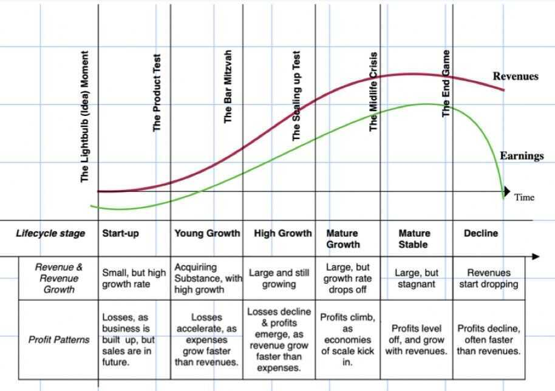
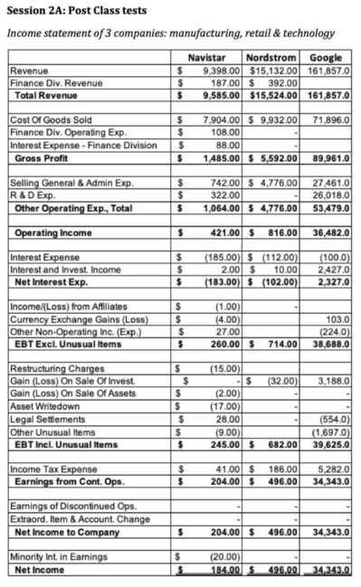
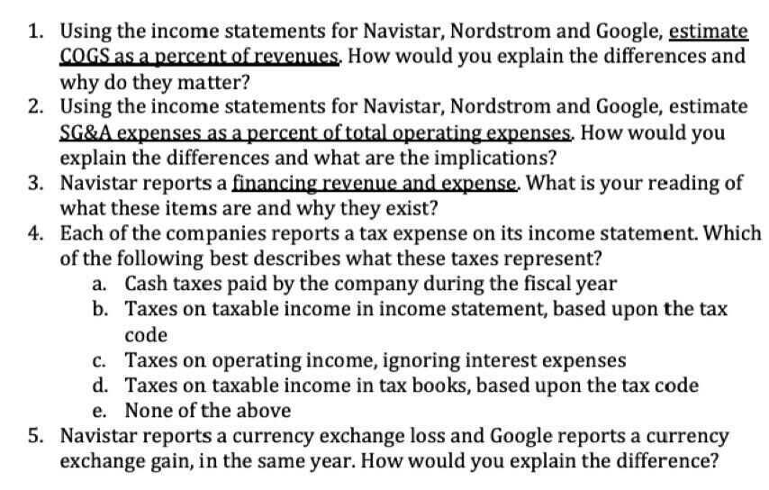
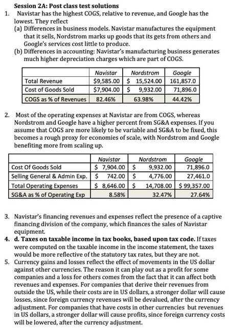

# 2A Income Statement Comparisons

## Income Statement: A Life Cycle Perspective

## Sector and Industry Differences

The accounting standards that govern how companies measure revenues and earnings may be the same across companies, but there are some sector-specific differences

- For commodity companies, the differences often arise from costs expended exploring for commodity reserves and extracting the commodity from reserves
- For financial service companies, the challenge often lies in defining revenues and debt, since the latter is less a source of capital and more raw material

## Bottom Line

- Much is made of the differences in accounting standards around the world and across businesses, but the reality is that accounting standards are converging across the world, rather than diverging
- While revenues come in different forms for different companies and operating expenses take varied forms, the end game with gross profit, operating and net income remains the same, i.e., to measure profits are different levels
- In theory, you should be therefore able to compare these numbers across companies, but in practice, accounting inconsistencies in how the expenses get measured and categorized can create problems

