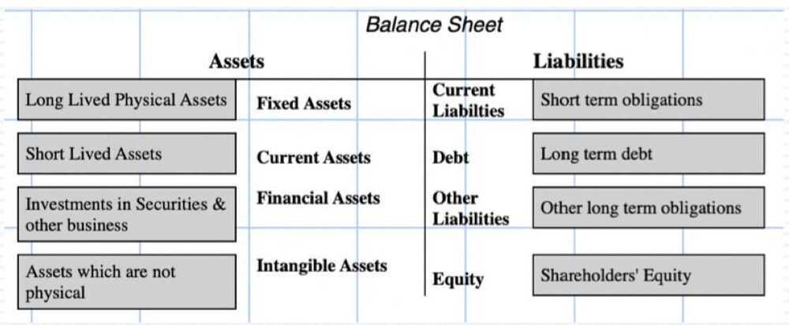
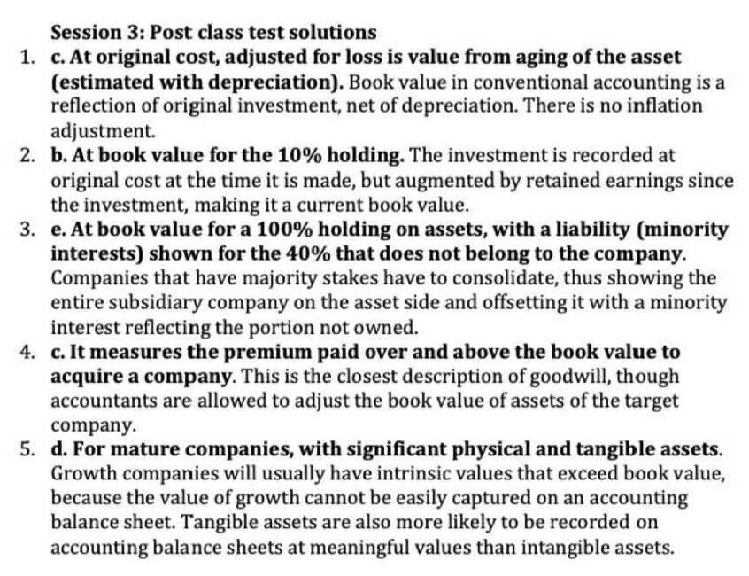

# 3 Balance Sheets

## Balance Sheets - Assets Owned & Money Owed

## The Balance Sheet: Dueling Views

- **Record of capital invested:** There are some (including me) who believe that the main function of a balance sheet is to record how much a business has invested in its assets-in-place, i.e., the assets that allow for its current operations to occur.
- **Measure of current value:** There is a large and perhaps dominant school of though among accountants, or at least accounting rule writers, that a balance sheet should reflect the value of the business today.
- **Liquidation value:** There is a third school, with lenders to the firm among its primary members, who feel that a balance should reflect what you would get the assets of the firm, if you liquidated them today.

## Revisiting the Balance Sheet

## Fixed and Current Assets

- **The Old Way:** If you are old enough to learned your accounting two or three decades ago, the way you were taught to value fixed and current assets was to show them at orignial cost, net of accounting depreciation.
- **The New Way:** As accounting has increasingly adopted the fair value standard, there has been a move to mark assets to current market value.
- **Divergent Effects:** The difference in values that you get for assets, using the two approaches, varies. It is
    - Greater on older assets than on newer ones
    - Greater on fixed assets than current assets

## Financial Assets

- Financial assets can take the form of holdings of securities or part ownership of other companies, private or public.
- With holdings of publicly traded securities, the movement to using current market prices to mark up their values is almost complete
- With equity ownership in other companies, the rules can vary depending on
    - Whether the stake is viewed as a majority stake (>50%) or a minority stake. The former will lead to full consolidation (where 100% of the susidiaries revenues and operating income will be included in the parent company's financials, with the portion that is not owned shown as minority or non-controlling interest on the liability side) and with the latter, the actual stake will be shown as an asset.
    - With a minority stake, whether it is held for trading or as a long-term investment. With the former, the holding will be marked to market. With the latter, it will be shown at book value terms.

## Intangible Assets

- **Big game:** Accountants talk a big game when it comes to intangible assets, and from that talk, you would think that they have figured out how to value the big intangibles (brand name, management quality etc.).
- **But different reality:** In reality, accountants are much better at valuing small-bore intangibles like licenses and customer lists, where the earnings and cash flows from the intangible are observable and forecastable than they are at valuing the big intangibles.

## Goodwill: The most dangerous intangible

- After all the talk of intangibles in accounting, it is telling that the bulk of intangible assets on accounting balance sheets across the world take the form of one item: goodwill.
- Goodwill may sound good, but it is a plug variable that signifies little.
    - For goodwill to manifest itself on a balance sheet, a company has to do an acquisition.
    - When that acquisition occurs, goodwill is measured as the difference between the price paid on the acquisition and the target company's asset value (dressed up book value).
    - It shows up as an asset because without it in place, balance sheets would not balance.

## Goodwill impairment: Valuable information or make-work-for-accountants?

- **Old rules:** For much of the last century, goodwill once created in an acquistion, was written off on autopilot, often amortized over long periods in equal installments.
- **New rules:** In the late 1990s, both GAAP and IFRS rewrote the rules, requiring accountants to revisit goodwill estimates each year, and make judgements on whether the goodwill had been impaired or not. To make that judgement, accountants would have to revisit the target company valuations and decide whether the value had increased (in which case goodwill would be left unchanged) or decreased (and goodwill would be impaired).
- **Is it informational?** The rationale for this rule change was to provide information to markets, but since goodwill impairements are often based upon market pricing movements (in the sector) and lag them by months and sometimes years, the effect of goodwill impairements on stock prices has been negligible.

## Current Liabilities

- Current liabilities can be broadly broken into three groups:
    - Non-interest-bearing liabilities, such as accounts payable an supplier credit, which represent part of normal operations.
    - Interest-bearing short-term borrowings such as commercial paper, short term debt and the short term portion (`<1 year`) of long term debt.
    - Deferred salaries, taxes and other amounts due in the short term.
- When computing non-cash working capital, we do not include interest-bearing short term debt in the calculation, moving it instead into the debt column

## Debt Due

- When companies borrow money, it can take three forms:
    - Corporate bonds, represent debt raised from public markets
    - Bank lons, debt raised from banks and other lending institutions
    - Lease debt, arising out of lease contacts requiring lease payments in future years. Until 2019, only leases classified as capital leases qualified, but since 2019, operating lease commitments are also debt.
- The mark-to-market movement on the asset side of the balance sheet has been muted on the liability side of the balance sheet. Bank debt, for the most part, is recorded as originally borrowed, and corporte bonds due, are for the most part not marked to market.

## Debt details

- While balance sheets are the repositories for total debt due, broken down into current and long term, there is additional information on debt in the footnotes, for most companies.
- This additional information can be on two fronts:
    - Individual debt due, with stated interest rates and maturities.
    - Additional features on the debt, including floating/fixed and straight/convertible provisions.
    - A consolidated table of when debt repayments come due, by year

## Shareholder's equity

- **Old ways:** The shareholders' equity in a business was a reflection of its entire history, since it started with the equity brought in to start the business, adds on equity augmentations over time as well as the cumulation of retained earnings.
- **New ways:** The shareholders' equity in a business reflects the jumbled mess of mark-to-market accounting, with all of its contradictions.
- **My cynical view:** Old or new ways, shareholders' equity (or book equity) has little hope of ever being a measure of the intrinsic value of equity in a business. This quixotic quest on the part of accounting will do more damage than good.

- **Par value:** This is a throwback in time and should be ignored
- **Company age:** Since shareholders' equity reflects a company's cumulated history of equity raises and retained earnings, young companies will tend to have far less shareholders' equity than older companies, of equivalent market value.
- **Capitalization effects:** Since only capitalized expenses become part of assets, shareholders' equity can be skewed by accounting rules and corporate actions on what is capitalized and what is expensed.
- **Buyback effects:** Both dividends and buybacks reduce shareholders' equity, by reducing it, but the magnitude of buybacks makes their effect more dramatic.
- **Negative equity?** There is no mathematical reason why shareholders' equity cannot become negative, either because a company has lost money for an extended period or because of large buyback/write off.

