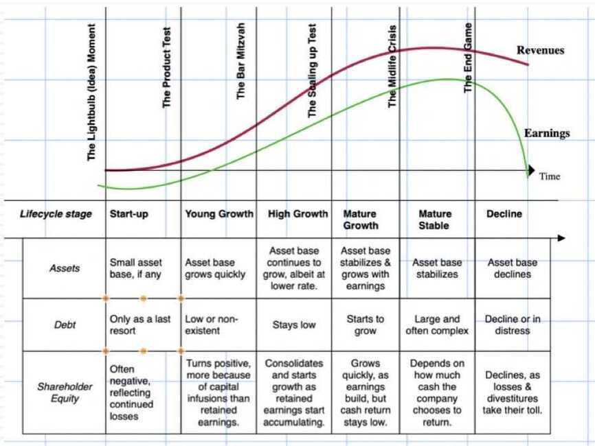

# 3A: Balance Sheet Comparisions

## Balance Sheet: A Life Cycle Perspective

## Sector and Industry Differences

- As with income statements, there are differences in what shows up on balance sheets in different sectors, though the accounting standards governing all companies may be the same
- In particular, the divergences play out on both sides of the balance sheet:
  - On the asset side, it can show up in how much of the value comes from tangible as opposed to intangible assets
  - For acquisitive companies, it can also show up as uniquely accounting items like goodwill

## Bottom Line

- A balance sheet is the financial statement that most reflects the history of a company, since contructed correctly it is the cumulated result of all of the company's activities during its existence
- That said, there is disagreement even among accountants as to what the history should reveal, with old-time accounting arguing that it should reflect what the company has invested in its existing assets, not what they are worth today, and fair-value accounting arguing that it should reflect its current value
- The end result is that balance sheets today are a mess, measuring neither invested capital nor fair value. The most useful items on a balance sheet now are
  - Cash & marketable securities, since it is not subject to nuance
  - Debt, since it measures closely what is owed (at least on interest bearing liabilities)
