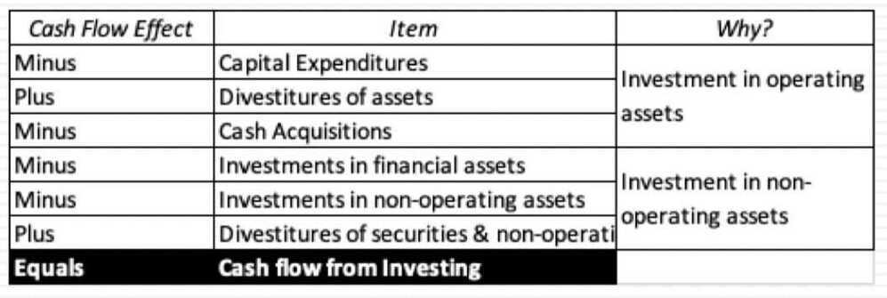
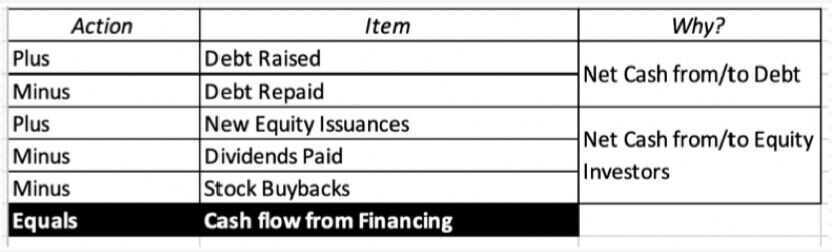

# 4: Cash Flow Statements - Cash In and Cash Out

## The End Game with Cash Flows

- The surface level objective of a statement of cash flows is to explain how much the cash balance of a business changed during a period and why it changed.
- Embedded in the statement of cash flows, though, is other information including:
    - How much cash earnings the company had during the period, as contrasted with accural earnings (in income statements)
    - How much and where the company reinvested cash during the period to sustain and grow its business
    - How much cash it raised from or returned to its debt and equity investors
- The statement of cash flows preserves the signs on cash flows, with negative cash flows shown as minuses and positive cash flows as pluses. It also looks at cash flows through the eyes of equity investors in the company

## Revisiting the Cash Flow Statement

### Cash flows from Operations

#### The working capital effect?

- Embedded in the cash flow from operations is the change in working capital items, exclusing cash
    - Non-cash working capital = non-cash current assets - non-debt current liabilities
    - As increase in non-cash working capital will decrease cash flows, whereas a decrease in non-cash working capital will increase cash flows
- To the extent that non-cash working capital ties up cash and capital, a firm with higher needs for the working capital will have lower cash flows from operations, for any given level of net income, than a firm with lower needs

### Cash flows from Investing

#### Operating or Non-operating assets

- The investing activities section includes investments in both operating and non-operating assets, except for investment in liquid, close to riskless securities, which is treated as cash & marketable securities
- The investments into operating assets, whether internal (cap ex, net of divestitures) or external (acquisitions of other companies) are the engine that drives growth in the operating line items (revenues, operating income etc.) Note that acquisitions funded with stock will not show up here for obvious reasons
- The investments into non-operating assets create a separate source of value, where the payoff will not show up in the operating line items but below the operating income line, as income from cross holdings or securities

### Cash flows from Financing

## Debt cash flows

- While interest expenses show up in the operating cash flow section, by reducing net income and showing up in deferred taxes, debt repayments are part of the financing section
- To the extent that some or all of these debt repayments are funded with debt issuances, the net effect on cash flows can be neutralized or become positive
- **If total debt increases during a period, it will represent a cash inflow, and if it decreases, it will be a cash outflow. Companies that embark on plans to bring their debt down (up) over time should therefore expect these consequences**

## Dividends and Buybacks

- Until the 1980s, the only cash flow that was received by equity investors in publicly traded companies was dividends. The effect of paying dividends is simple: it reduces the cash balance at the company and increases the cash in the pockets of every shareholder who receives dividends.
- Starting in the 1980s, US companies have returned increasing amounts to their shareholders in the form of buybacks.
    - The effect of buying back stock is exactly the same as paying dividends, to the company, with cash leaving the company.
    - Fore shareholders, though, the cash flow effect is disparate. Those shareholders who sell their shares back get cash form the company, and those that do not get no cash, but get a larger share of the equity left in the company.
    - Both dividends and buybacks reduce shareholder equity on the balance sheet.

## Free Cash Flow to Equity - FCFE

- A measure of equity cash usage, free cash flow to equity calculates how much cash is available to the equity shareholders of a company after all expenses, reinvestment, and debt are paid.
- Free cash flow to equity is composed of net income, capital expenditures, working capital, and debt.
- The FCFE metric is often used by analysts in an attempt to determine the value of a company.
- FCFE, as a method of valuation, gained popularity as an alternative to the **dividend discount model (DDM)**, especially for cases in which a company does not pay a dividend.

https://www.investopedia.com/terms/f/freecashflowtoequity.asp

## Dividend Discount Model (DDM)

The dividend discount model (DDM) is a quantitative method used for predicting the price of a company's stock based on the theory that its present-day price is worth the sum of all of its future [dividend](https://www.investopedia.com/terms/d/dividend.asp) payments when [discounted](https://www.investopedia.com/terms/d/discounting.asp) back to their present value. It attempts to calculate the fair value of a stock irrespective of the prevailing market conditions and takes into consideration the dividend payout factors and the market expected returns. If the value obtained from the DDM is higher than the current trading price of shares, then the stock is undervalued and qualifies for a buy, and vice versa.

https://www.investopedia.com/terms/d/ddm.asp

## Time Value of Money (TVM)

- Money is worth more today than in the future
- Time value of money means that a sum of money is worth more now than the same sum of money in the future
- This is because money can grow only through investing. An investment delayed is an opportunity lost
- The formula for computing the time value of money considers the amount of money, its future value, the amount it can earn, and the time frame
- For savings accounts, the number of compounding periods is an important determinant as well

https://www.investopedia.com/terms/t/timevalueofmoney.asp

## Potential Dividends (FCFE)

