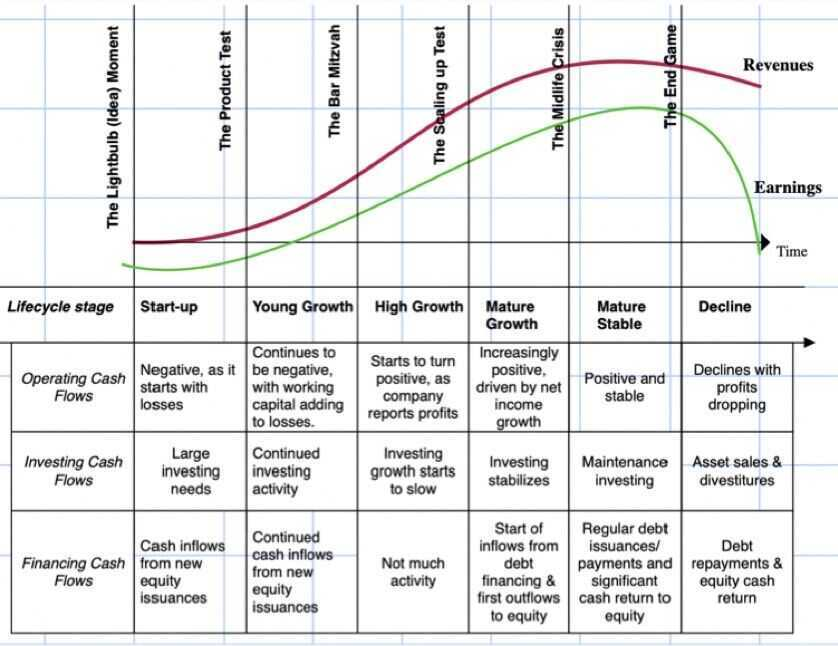
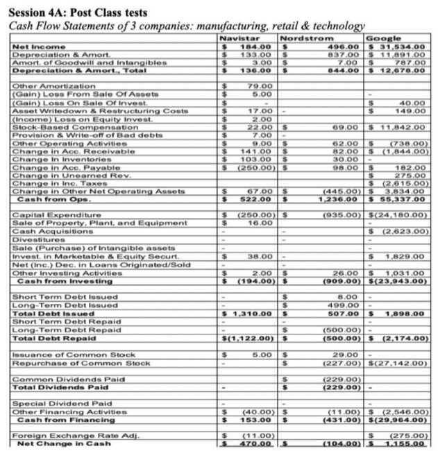
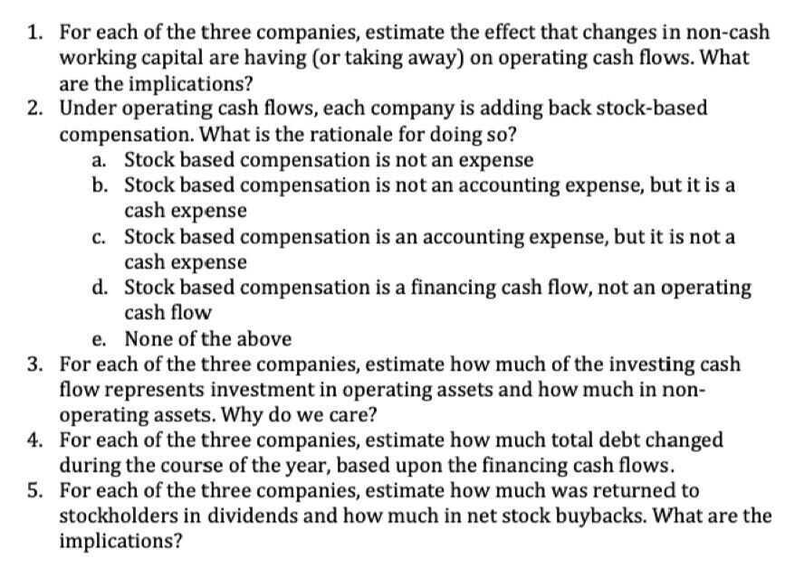
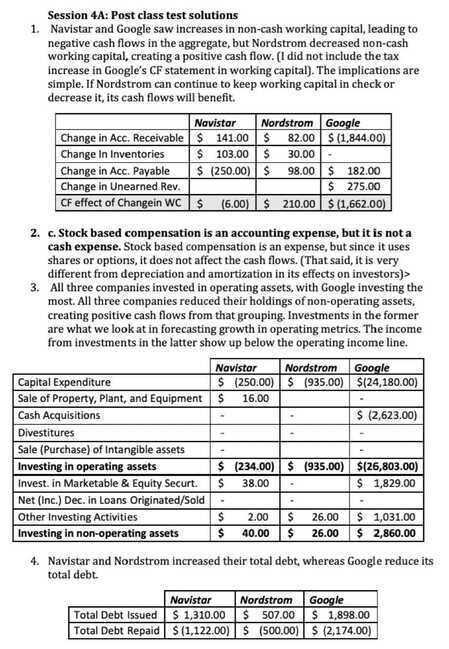
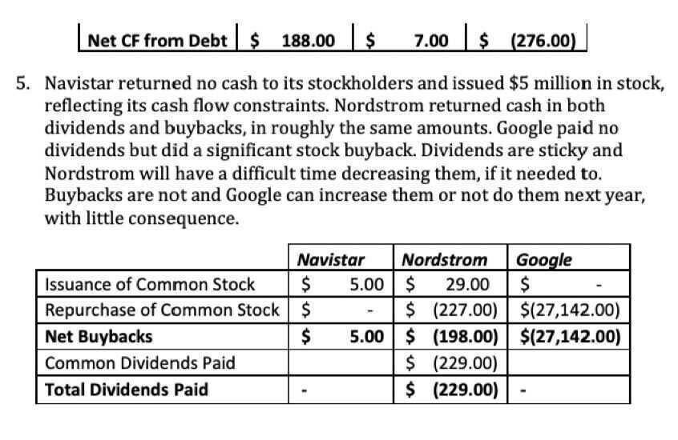

# 4A: Cash Flow Statement Comparisons

## Cash Flows: A Life Cycle Perspective

## Sector and Industry Differences

- The statement of cash flows is perhaps the most direct of financial statements, since it is based upon cash flows in and cash flows out. It is thus the one statement that accounting game playing affects the least
- While the objective of the statement might be explaining why the cash balance changes, it is the repository for all of the items needed to estimate cash flows
- While it is not uncommon for income statements and cash flows to send divergent messages about a firm's financial well being, consistent differences between the two can be a indicator of accounting problems

## Bottom Line

- The statement of cash flows looks at cash flows through the eyes of the equity investors in a business
    - Thus, if you are trying to compute cash flows to equity investors, all of the information you will need should be on the statement
    - You should also be able to see what equity investors received as cash flows
- If your objective is to estimate cash flows, prior to debt payments, you can start with the statement of cash. flows but you have to trace interest expenses (netted out to get to net income and add them back

