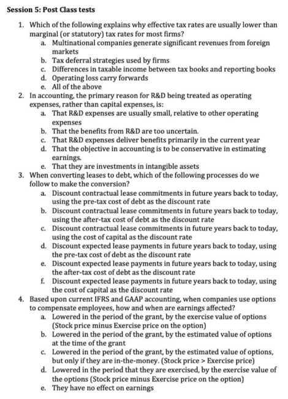
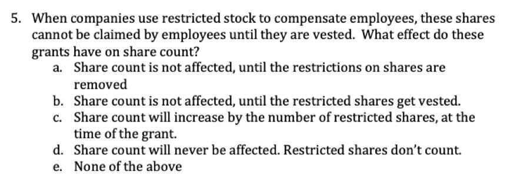
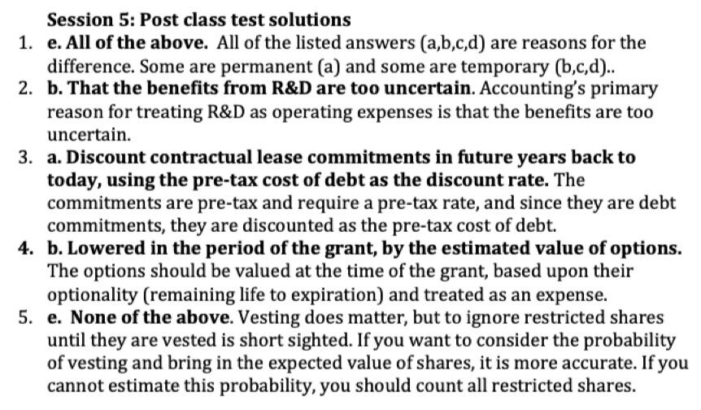

# 5: Cleaning Up Accounting

## The Accountant's Role

- Accountants like order and consistency, as can be seen in their propensity to write rules
- That said, much of accounting as practiced today was developed in detail in the 20th century for the manufacturing firms that dominated that century
- As the center of economic gravity has shifted from manufacturing to technology & service companies, and corporate financial behavior has changed over time, accountants have struggled with four key issues:
    - Taxes, and the actions that companies take to avoid or delay paying them
    - Managerial compensation in the form of equity (stock)
    - Commitments that are contractual but are not debt
    - Investments for long term benefits that are not in physical assets

1. Taxes: Dueling Tax Rates

   - Marginal tax rate

The marginal tax rate is the tax rate in the statutory tax codes. Thus, in 2020, a US company should be paying 21% of its taxable income in the US as federal taxes. Since US companies now operate on a regional tax model, the marginal tax rate for multinationals will reflect where they make (or report to make) their taxable income

- Effective Tax Rate

The effective tax rate for a company reflects the taxes and taxable income it reports in its income statement, which is based on accural accouting

Effective tax rate = Taxes / Taxable Income

- Cash Tax Rate

The cash tax rate for a company reflects the taxes it actually pays on its taxable income

Deferred Tax Assets & Liabilities

- For most companies, the effective tax rate will be lower than the marginal tax rate, reflecting
    - Operations in countries with lower tax rates
    - (Legal) Tax deferral and avoidance strategies
- When there are differences between what is expensed and what is reported as taxable income between the reporting a deferred tax liability (asset) if the company pays less (more) in taxes on its tax books than it reports in its financial statements
- The logic for doing so is simple. The items that give rise to less (more) taxes paid in the current period will reverse and result in more (less) taxes paid in future periods

Net Operating Losses & Carryforwards

- When a US company loses money, it is allowed to carry those losses forward and use them to reduce taxes paid in future years
    - Until the Tax Reform Act of 2017, the NOL could be carried back two years and used to reduce taxes paid in prior years (as a tax credit) and forward 20 years
    - The Tax Reform Act of 2017 removed the carry back provision and allows losses to be carried forward indefinitely.
- When a company has losses that are over multiple years, these losses are cumulated over time as a Net Operating Loss (NOL) and should be disclosed in a company's financials

2. Stock Based Compensation is an Operating Expense
    - Companies have used stock-based compensation to reward employees for decades for two reasons:
        - To align the interests of employees & managers with thoses of the shareholders
        - To make up for the absence of cash (to provide compensation packages that are competitive)
    - Stock-based compensation primarily takes two forms:
        - Options to buy the company's stock (or invest in its equity) at a fixed price for a specified period
        - Shares in the company, sometimes with restrictions on trading on those shares (restricted shares)

What type of expense is it?

- No matter what the motive for providing stock-based compensation (to align interests or to make up for lack of cash), it is clearly a compensation expense
    - If a grant is large and occasional, and primarily driven by the desire to align interests, there is an argument that it should be spread out over time
    - If a company uses stock-based compensation consistently, and more to make up for its cash poor status than to align interests, it is an annual expense
- To expense stock-based compensation, you have to value of the options or stock given to employees, at the time they are granted
    - Until 2004, companies were allowed leeway to estimate the value of option grants based upon exercise value at the time of the grant
    - After 2004, FAS 123 requires companies to value options based upon their time premium (using option pricing models) and show that expense in the year the options are granted

## Is it a cash flow?

- Now that options and restricted stock are treated (correctly) as compensation, and expensed in the years they are granted, the debate has shifted to the question of whether they are non-cash expenses (like depreciation), deserving of being added back to get to cash flows
- Most companies and analysts seem to have come down on yes as the answer, and many companies add back stock-based compensation to get to adjusted earnings
- I disagree strongly. There is a fundamental difference between a non-cash expense like depreciation, where you pay nothing, and giving a share of equity (options or shares) in lieu of cash

3. Leases are debt
    - The essence of debt: When you borrow money, you create contractual obligations for the future, and a failure to meet them can put your survival as a going concern at risk
    - Lease contracts: When you sign a lease contract, you create commitments for the futre, and a failure to meet these commitments will put your survival at risk. Put simply, there is no reason (and there never has been) to treat leaves as debt
    - Accounting for leases: Until 2019, accountants disagreed and broke leases down into two groups
        - Capital leases, where the lessee has effective ownership of the asset, is treated as debt, with a couter asset
        - Operating leases, where the lessee has (temporary) use of the asset for a period, were treated as operating expenses, with no debt or counter assets on the balance sheet

Starting in 2019, both GAAP and IFRS are requiring companies to treat all lease commitments as debt, no matter how structured

## Capitalizing Leases

- The process of converting lease commitments to debt follows a simple process, akin to how any bank debt or corporate bond can be valued
- Here are the steps
    - Start with the contractual lease commitments for future years, by year
    - Compute the pre-tax cost of borrowing for the firm today, based upon its default risk
    - Take the present value of lease commitments, using the pre-tax cost of debt as your discount rate
- The present value of lease commitments is treated as debt, with the same value shown as a counter-asset
- To complete the cycle, you compute interest expenses on the lease debt and depreciation on the counter asset and bring into your income statement
    - Interest expense on lease debt = PV of lease commitments * pre-tax cost of debt
    - Depreciation on lease asset is computed using the life of the lease (as the life of the asset) and the depreciation method chosen

## Other Contractual Commitments

- While accounting has (finally) come to terms with treating leases as debt, there are a whole host of contractual commitments that share the same characteristics as leases, and require the same treatment
- Here are some examples

    1. Purpose commitments for many manufacturing firms

    2. Content commitments at a streaming company (like Netflix)

    3. Player contracts for a sports team

4. **R&D is a cap ex**
    - **If the essence of a capital expenditure is that it is an expense whose expected benefits are not just in the current period, but in future periods, research and development expenses clearly fit the bill**
    - **That said, accouting rules around the world, for the most part, require companies to expense R&D, using one of two rationale**
        - **The benefits of R&D are too uncertain. Consequently, they should be expensed until the R&D is closer to commercial development**
        - **It is better to be conservative in estimating earnings**
    - **Neither justification makes sense**
        - **Uncertainty is never used with other types of capital expenditure (building a factory to make a new and untested product) as the divining rod for capital vs operating expenses**
        - **Accouting should deliver the most realistic estimate of earnings, not the most conservative**

## Capitalizing R&D

- To capitalize R&D, there are 3 steps
    - Step 1: Estimate an amortizable life for R&D by making your best judgement on how long it takes, on average, for R&D to pay off (as commerical success)
    - Step 2: Collect R&D expenses from past years (going back as long as the amortizable life). If you company has not been in existence for that long, collect as many years as you can
    - Step 3: For each of the past years of R&D, estimate
        - How much you will be amortizing this year
        - How much of the R&D expense remains unamortized
    - To complete the cycle, here are the last steps
        - Adjust earnings by adding back the current year's R&D expense and subtracting out the amortization of past years R&D
        - Show the unamortized R&D as an asset, and show the same amount as an increase in book equity

## Other Capital Investments

- There are other expenses that fit the R&D profile, i.e., expenses designed to create benefits over many years, but since there investments are not in physical assets, they are treated as operating expenses
- Here are some examples
    - Advertising expenses by a consumer product company to build up brand name
    - Recruiting and training expenses by a consulting firm to build its consulting practice
    - Exploration costs for an oil company
    - Customer acquisition costs for a subscriber or user based company

## The Bottom Line: Trust, but verify

- Accouting statements reflect not only an "accouting" view of the company, but the burden of accouting history and legacy rules
- When analyzing a company, you should start with accouting statements, but you should have no qualms about changing, modifying or redoing them to reflect what you are trying to do with the data in those statements

