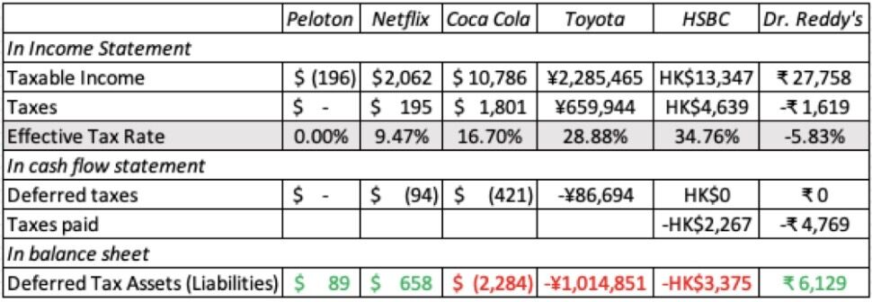
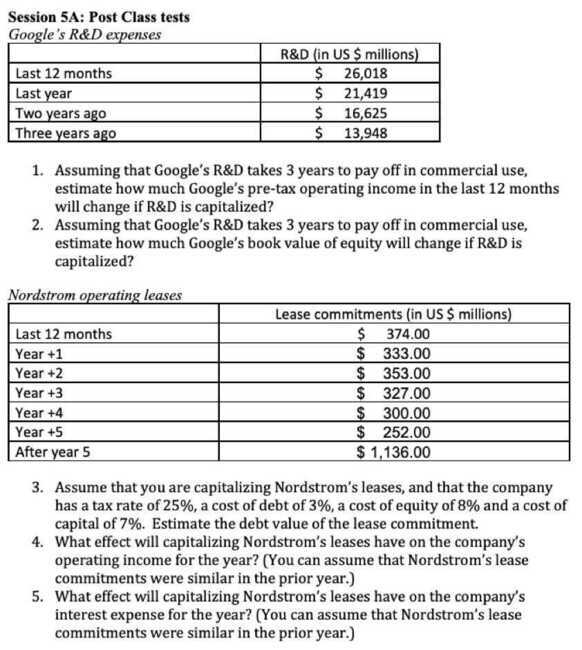
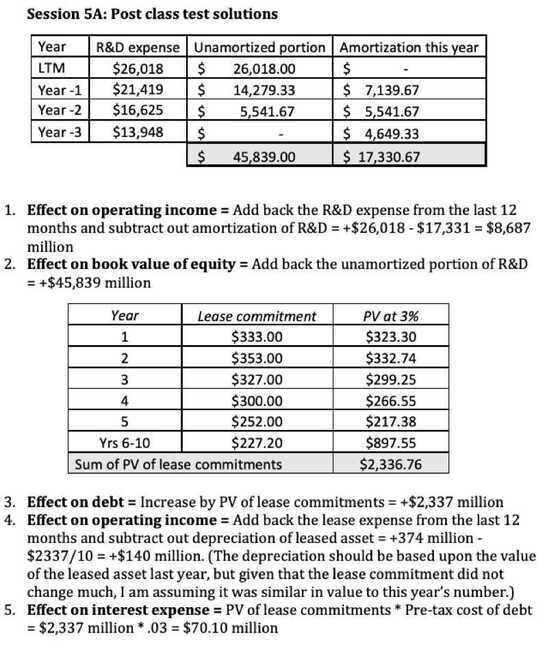

# 5A: Accounting Inconsistency Examples

## Tax Rates

## Non-debt commitments

- In general, interest-bearing debt will show up on balance sheets, though some of it may be included in current liabilities (if due in less than a year) and the rest as debt
- There are other contractual commitments that have historically not shown up on balance sheets, but should be treated like debt
- The most common of these commitments is operating leases, but IFRS and GAAP have finally made the 'right' decision and started including them as debt in 2019

## Consequences for the company

- **Debt increases:** The debt on the balance sheet is augmented by the present value of lease commitments
- **A counter asset is created:** Equivalent to the lease debt
- **Operating income changes:** since you add back the current year's lease expense and reduce it by depreciation. Net income does not or should not change.
    - Interest expenses go up by the interest portion of the current year's lease payment
    - Depreciation is increased by the depreciation on the lease asset (using the prior year's value)
- Taxes and net income do not change, since you replace one tax deductible expense (operating lease) with two (interest and depreciation) of equivalent value

## Non-physical capital expenses

- While accountants almost always treat investments in physical assets as capital expenses and show them on the balance sheet, they are inconsistent and unpredictable when it comes to investments in non-physical assets
    - A pharmaceutical company that buys a patent from another one is allowed to treat that expenditure as a capital expenditure, but one that does R&D to arrive at the same result is not
    - A company reliant on human capital for its value is almost never required to treat what it invests in human capital for the long term (recuriting and training, for example) as capital expenditures
    - A subscriber/user based company that spends money acquiring users or subscribers generally is not allowed to treat the money spent acquiring customers as capital expenditures

## Stock Based Compensation

- Companies following IRFS and GAAP report the current year's stock-based compensation as an operating expense, valuing both options and restricted stock at the time of issuance
    - That said, the residue of past option grants will show up in the footnotes of these companies, with relevant information on remaining maturity and exercise price
    - The restricted stock units granted in past years will show up as part of the discussion of share count
- In both cases, companies will then try to reverse the accounting charge, claiming it is non-cash in reporting pro-forma or adjusted earnings

## Bottom Line

- Accounting statements are just raw material: In corporate finance and valuation, financial statements are raw data that should be viewed as accounting opinion and not fact
- That you should mold to your own needs: To the extent that accounting perspectives can be outdated or reflect a different set of priorities, you should feel no qualms about redoing or reconstructing accounting statements
- But your choices will have consequences: That can have consequences for how you measure profits, invested capital and even share count. The company that you see will be closer to the truth than the company described in accounting statements
- Markets don't follow (and are more sensible than) accountants: For the most part, markets learn and move on faster than accountants do. Thus, markets have been pricing in retailers, on the assumption that leases are debt for decades, while accountants made the change in 2019

