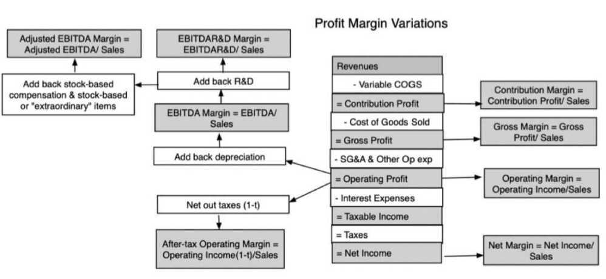
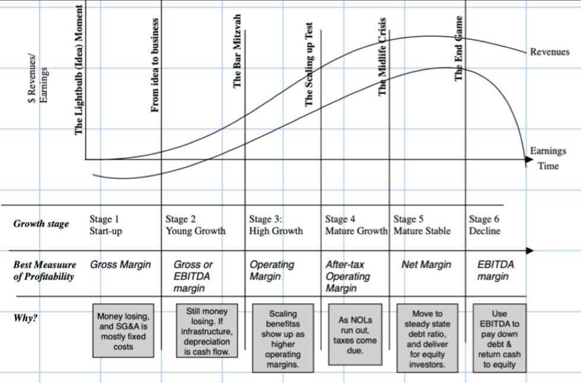
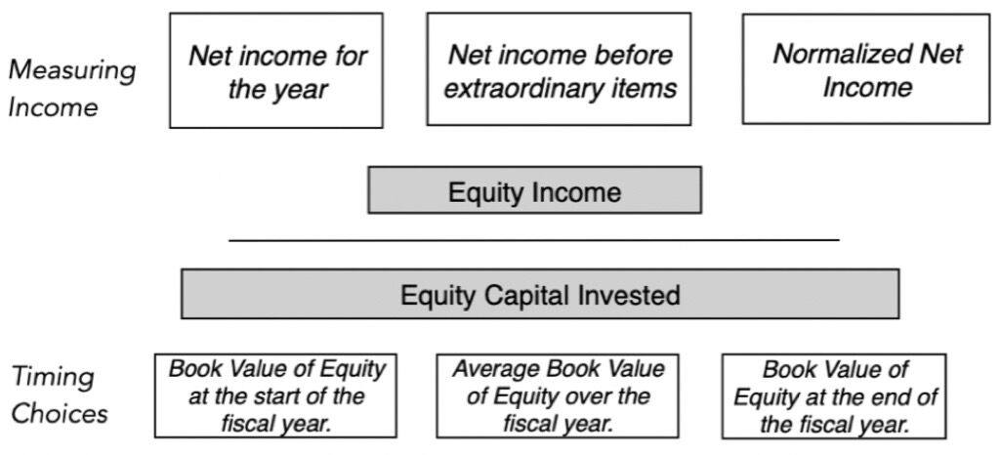
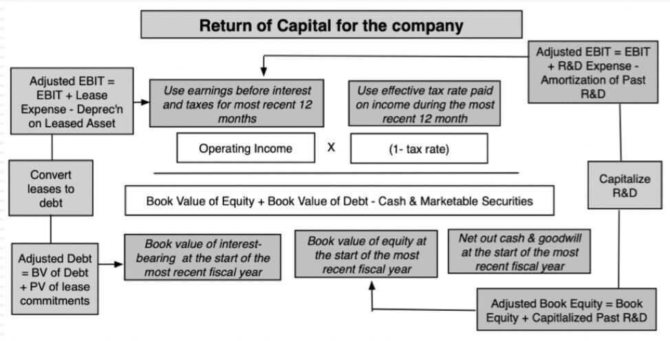

# 6: Accouting Financial Ratios - Profitability Measures

### From Absolutes to Ratios

- Financial statements measure operations in absolute terms, i.e. in dollars, rupees or reais, depending upon the currency of denomination
- Absolute measures are difficult, if not impossible, to compare across companies, since bigger companies, all else held constant, should have bigger dollar profits and carry more debt
- Ratios scale absolute values to each other, and allow for
    - Comparisons across companies
    - Comparisons across time
    - Comparisons to benchmarks

## 1. Profit Margins

### Contribution & Gross Margins: The Costs of Production

- **Contribution margin** measures the pure profits that you generate with every marginal unit you sell, since it nets out only the variable cost associated with producing that unit, giving many software companies close to 100% contribution margins
- **Gross margins** are a close relative, providing a direct measure of marginal profitability and an indirect measure of how revenue increases flow into profits. To illustrate, Zoom, one of the few stocks that has seen its value increase during the crisis, reported a gross marin of 92% in 2019
- **Companies with high contribution and high gross margins have much more profit potential, other things remaining equal, than companies with low margins**

### Operating Margins: Measures and Implications

- Operating margins measure what is left after the other operating expenses of the company, which cannot be directly traced to individual unit sales, but are nevertheless necessary for its operations
- To the extent that these other operating costs (like SG&A) are fixed (or more fixed) than the costs of production, the difference between gross and operating margins becomes a simple proxy for potential economies of scale.
- Companies with high gross margins and low operating margins should see operating profits (and margins) improve much faster as they scale up than companies where operating and gross margins are similar

### EBITDA Margin: Measures and Implications

- The EBITDA is a rough measure of operating cash flows, rough because it is before taxes and capital expenditures
- Notwithstanding that, it remains a measure of the cash generating capacity of a company, prior to discretionary choices (on how much to reinvest and borrow) and is used by
    - Lenders to determine whether the company can afford to borrow money, since debt has to be paid before capital expenditures are made
    - Equity investors to decide whether the entire business is fairly valued, before it tries to expand its asset base
- **Companies with high EBITDA margins generate higher cash flows per dollar of revenues and should be able to borrow more than companies with lower EBITDA margins**

### Net Margins: Measures and Implications

- Netting out taxes and interest expenses, and adding back income from cash and cross holdings, yields net margin, a measure of what equity investors get to keep out of every dollar of revenues
- It is a mixed and noisy measure, reflecting a company's operating model, its tax liabilities and its financial leverage (since debt creates interest expenses and affects taxes), as well as non-operating assets
- **Companies with high net margins deliver more profits for equity investors, in the aggregate, but perhaps not a per share basis (if debt is the reason why net margins are lower than operating margins).**

## A Life Cycle View of Margins

## 2. Accounting Returns

- With accounting returns, profits are scaled to measures of investment in a project or business
- Broadly speaking, there can be differences in how accounting returns are measured based upon
    - How profits are measured, i.e., to just equity investors (net income) or to both debt and equity investors and whether profits are before or after taxes. In most cases, it is accrual income that is the basis for returns
    - How investment is measured, i.e., investment made just by equity investors or by debt and equity investors. In most cases, accounting returns use the book value as the basis of investment measurement
    - With any measure of accounting return, you can get different values depending upon timing, i.e., start of the period, end of the period or average for invested capital
- **Consistency rule:** A consistent measure of accounting return will measure both profits and investment to the same group (equity or capital)

### Return on Equity

### Return on Invested Capital

## 3. Efficiency Ratios

- Efficiency ratios measure the revenue payoff that companies get from reinvesting back in their businesses
- Turnover ratios, with revenues in the numerator are the most widely used measured of efficiency, though the denominator can vary:
    - Working Capital Turnover = Sales / Non-cash Working capital (or individual items of working capital, like investory or receivables)
    - Asset Turnover = Sales / Total Assets
    - Capital Turnover = Sales / Invested Capital

## 4. Measuring Financial Leverage

- Debt Ratios measure how much a company has borrowed, relative to overall capital or to earnings/cashflows
- Debt can be scaled to overall capital or just to equity
    - Debt to Capital = Debt / (Debt + Equity): This is a measure of how much of the capital in a company comes from debt
    - Debt to Equity = Debt / Equity: This is a close variant of debt to capital, with debt stated as a percent of equity
- Debt can also be measured relative to earnings / cashflows
    - Debt to EBITDA = Debt / EBITDA : This measures how much debt a company has relative to the cash it generates from operations, before taxes and capital expenditures

### Variants on calculation

- What to include in debt
    - Only long term debt
    - All interest bearing debt
    - Debt inclusive of commitments (like leases)
- Book or Market
    - Book values for debt and equity (from balance sheet)
    - Market values, measured as market cap for equity in a publicly traded firm, and if doable, market value of debt
- Gross or Net
    - Gross debt is all debt
    - Net debt is all debt minus cash & marketable securities

Operating Leverage - [Seeking wisdom in the Indian Stock Markets | SOIC](https://soic.in/blog-description/operatingleverage)

- "Disproportionate increase in profits caused by a moderate increase in sales is often a result of operating leverage." - SOIC
-

## 5. Measuring Liquidity / Credit Risk

- Coverage Ratios: These ratios measure how much buffer or coverage a company has in meeting commitments
    - With interest coverage ratio, the commitment is interest expenses, and it is scaled to operating income
    - With fixed charge coverage ratio, the commitment is expanded to include debt payments, and it is scaled to operating income + fixed charges
- Liquidity Ratios: There ratios measure how much liquidity companies have, to cover near-term needs or expenses:
    - Current ratio, measure current assets relative to current liabilities
    - Quick ratio, looks at only liquid current assets relative to current liabilities.
