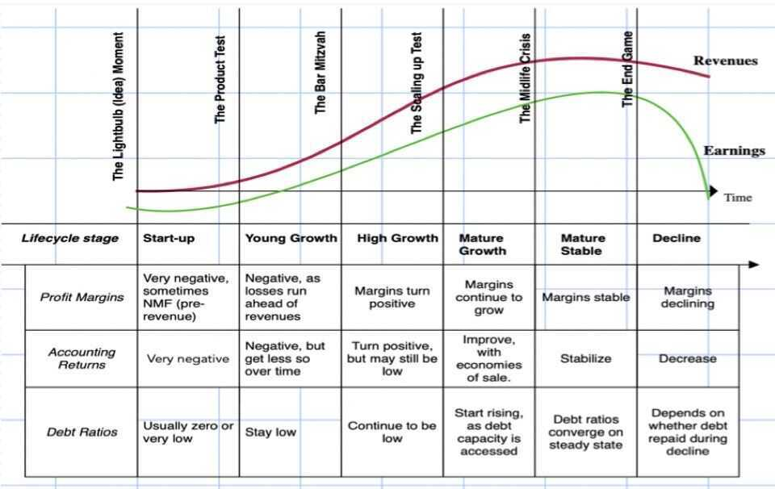
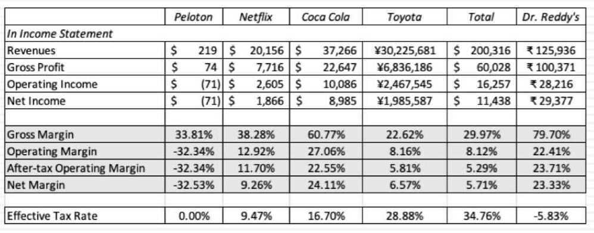
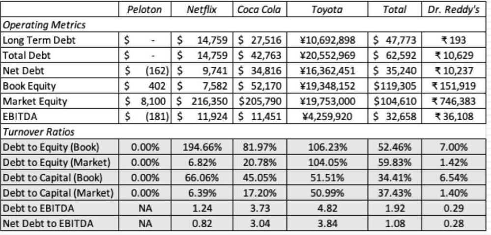
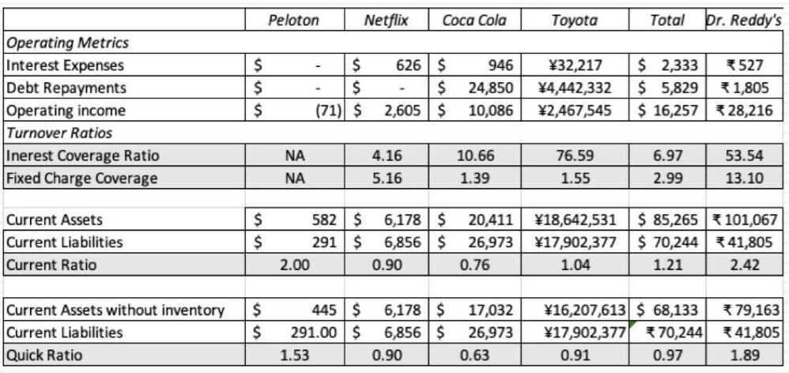

# 6A: Ratio Analysis

## Financial Ratios: A Life Cycle Perspective

## Profitability Ratios

**And analysis**

- Young to old: Young companies often have negative or very low margins, for two reasons
    - They are still building up their revenues
    - Some of their operating expenses are associated with future growth, not current operations
- Business Differences: High gross margin businesses have the advantage: Companies like Coca Cola (brand name consumer product) and Dr. Reddy's Labs (pharmaceutical) start with sky-high gross margins, which then feed into high operating and net margins
- Leverage Effects: Companies with high debt ratios can have low net margins, while operating margins stay high

## Accounting Returns

**Reflections of**

- **Competitive Advantages:** If accounting returns are fair measure of true returns, they are the repository for competitive advantages.
    - Industries where barriers to entry are high or other competitive advantages prevail should have higher returns on capital than companies without these advantages
    - Companies with strong competitive advantages within an industry should earn higher returns than their peer group
- **Accounting choices and inconsistencies:** Accouting can affect and sometimes skew returns
    - By misclasifying capital, operating and financial expenses
    - By taking write offs to reflect mistakes made in the past

## Efficiency Ratios

**The dark side of growth**

- **The growth trade off:** Growth has a good side, insofar as it lets a company scale up its operations, but it has a dark side, which is that companies have to reinvest to deliver that growth
- **Scaling up measure:** Turnover ratios look at the link between what a company has to reinvest, and how much its revenues grow over time. Companies that are more efficient on this measure will be able to grow revenues, with less reinvestment
    - **Young to old:** The link between company age and turnover ratios will vary across different business types, with older companies becoming more efficient in some, and less in others
    - **Accouting effects:** The problems associated with accouting choices and inconsistencies will affect turnover ratios as well

## Debt Ratios

**Debt, the double edged sword**

- **Source of capital:** Debt is source is capital for a business, just as equity is. There is nothing inherently good or bad about it, but in most parts of the world, it is a trade off between tax benefits that accrue to borrowing and distress risk
- **Measurement choices:** When comparing across companies, you have to measure debt consistently across companies. However, it is usually better to focus on
    - Total debt, rather than a subset of debt
    - Market value, rather than book value
- **Gross vs Net Debt:** While the rationale for nettting cash out from debt is impeccable, cash is a transient asset, here today and can be gone tomorrow

## Coverage & Liquidity Ratios

**And analysis**

- Safety in numbers: All else held equal, companies that score higher on interest and fixed charge coverage ratios should have more buffer than companies that score lower
- Normalization: That said, the ratios can be skewed by year-to-year changes, especially in operating income and debt depayments
    - For companies in volatile businesses, this can translate into big swings in coverage ratios from good to bad years. The solution is to use an average across time
    - For young companies, the coverage ratios can look bad, at least as they start the growth process, but these companies can grow operating income quickly to gain buffers

## Final Thoughts

- **Less is more**

  If you decide to use financial ratios, less is more. Choose the ratios that you want, rather than create noise by computing multiple ratios

- **A means to an end**

  Ratios, by themselves, are just numbers and mean nothing, unless you use them to make judgements about what your company does well or badly, and how this affects your perspective for the company

- **Past versus future**

  While your ratios are in the past, investing and corporate finance are about the future
