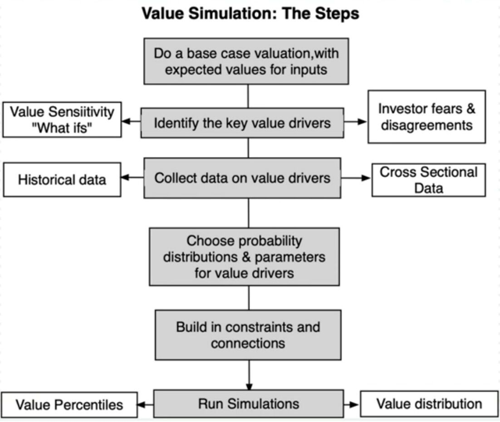

# Corporate Finance

Corporate finance is an area of [finance](https://en.wikipedia.org/wiki/Finance) that deals with sources of funding, the [capital structure](https://en.wikipedia.org/wiki/Capital_structure) of corporations, the actions that managers take to increase the [value](https://en.wikipedia.org/wiki/Value_investing) of the firm to the [shareholders](https://en.wikipedia.org/wiki/Shareholder), and the tools and [analysis](https://en.wikipedia.org/wiki/Analysis) used to allocate financial resources. The primary goal of corporate finance is to [maximize](https://en.wikipedia.org/wiki/Shareholder_value) or increase [shareholder value](https://en.wikipedia.org/wiki/Valuation_(finance)).Although it is in principle different from [managerial finance](https://en.wikipedia.org/wiki/Managerial_finance) which studies the financial management of all firms, rather than [corporations](https://en.wikipedia.org/wiki/Corporations) alone, the main concepts in the study of corporate finance are applicable to the financial problems of all kinds of firms.

Correspondingly, corporate finance comprises two main sub-disciplines.

- [Capital budgeting](https://en.wikipedia.org/wiki/Capital_budgeting) is concerned with the setting of criteria about which value-adding projects should receive investment funding, and whether to finance that investment with [equity](https://en.wikipedia.org/wiki/Ownership_equity) or [debt](https://en.wikipedia.org/wiki/Debt) capital.
- [Working capital](https://en.wikipedia.org/wiki/Working_capital) management is the management of the company's monetary funds that deal with the short-term [operating](https://en.wikipedia.org/wiki/Business_operations) balance of [current assets](https://en.wikipedia.org/wiki/Current_asset) and [current liabilities](https://en.wikipedia.org/wiki/Current_liability); the focus here is on managing cash, [inventories](https://en.wikipedia.org/wiki/Inventory), and short-term borrowing and lending (such as the terms on credit extended to customers).

The terms corporate finance andcorporate financierare also associated with [investment banking](https://en.wikipedia.org/wiki/Investment_banking). The typical role of an [investment bank](https://en.wikipedia.org/wiki/Investment_bank) is to evaluate the company's financial needs and raise the appropriate type of capital that best fits those needs. Thus, the terms "corporate finance" and "corporate financier" may be associated with transactions in which capital is raised in order to create, develop, grow or acquire businesses. Recent legal and regulatory developments in the U.S. will likely alter the makeup of the group of arrangers and financiers willing to arrange and provide financing for certain highly leveraged transactions.

Financial management overlaps with the financial function of the [accounting profession](https://en.wikipedia.org/wiki/Accounting_profession). However, [financial accounting](https://en.wikipedia.org/wiki/Financial_accounting) is the reporting of historical financial information, while financial management is concerned with the allocation of capital resources to increase a firm's value to the shareholders.

https://en.wikipedia.org/wiki/Corporate_finance

## Vendor Due Diligence

## Due Diligence

Due diligence is an investigation, audit, or review performed to confirm the facts of a matter under consideration. In the financial world, due diligence requires an examination of financial records before entering into a proposed transaction with another party.

## Due Diligence for Stock Investors and Start-Up Investors

1. Analyze the Capitalization of the Company
2. Revenue, Profit, and Margin Trends
3. Competitors and Industries
4. Valuation Multiples
5. Management and Share Ownership
6. Balance Sheet
7. Stock Price History
8. Stock Dilution Possibilities
9. Expectations
10. Examine Long and Short-term Risks

In the mergers and acquisitions (M&A) world, there is a delineation between "hard" and "soft" forms of due diligence

'Hard' due diligence is concerned with the numbers. 'Soft' due diligence is concerned with the people, within the company and in its customer base

https://www.investopedia.com/terms/d/duediligence.asp

## Scenario Analysis

- Scenario analysis is best employed when the outcomes of a project are a function of the macro economic environment and/or competitive responses
- There are a couple of ways in which you can structure scenario analysis
    - Best-case, Worst-case analysis, where you set all the inputs at their most optimistic and most pessimistic levels. In general, this leaves you with findings that are not of much practical use
    - Plausible scenarios: Here, you define what you feel are the most plausible scenarios (allowing for the interaction across variables) and come up with estimates for each scenario
- For scenario analysis to be most useful, you have to be able to
    - List scenarios to cover all possible outcomes
    - Estimate probabilities for the scenarios
    - Complete with an expected value

## Simulation in Valuation

## Aswath Damodaran (NYU)

Corporate Finance - https://www.youtube.com/playlist?list=PLUkh9m2BorqnDenjSLZ2DHIXrdxoN4Bn_

Investment Philosophies - https://www.youtube.com/playlist?list=PLUkh9m2BorqlDJlnBXUaJaMRNE7UDckn6

### Company Structures

A company in which another company owns a significant stake, is called its **associate company.**

However, in this case, the shareholding is less than 50%.

If the shareholding is higher than 50%, the company is called a **subsidiary company.**

Because the ownership is less than 50%, the parent company is not required to consolidate (include) the associate company’s results in its financial statements.

For example: Hashtag Loyalty is an associate company of Jubilant FoodWorks.
