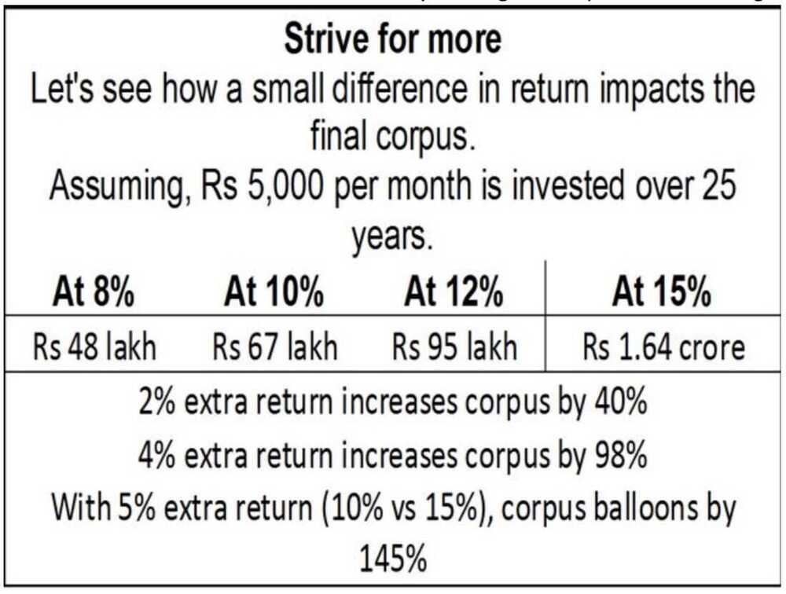

# Asset Classes

https://freefincal.com/hdfc-corporate-bond-fund

VPF - https://cleartax.in/s/pf-vs-vpf

[Employee Provident Fund (EPF) - How it works | Interest Rate | Withdrawal Rules | Budget | ETMONEY - YouTube](https://www.youtube.com/watch?v=lBagn--KERk)

- 1 lakh LTCG
- Top 10 focused stocks - Marcellus PMS

## Buying

https://www.joinhoney.com

## Two types of income

- Active Income where the time and effort you put pays for just that time
- Passive Income where past efforts makes you money (all time - 24x7)

## Fixed Income / Debt

- Wintwealth (Wint Wealth)
- https://altifi.ai

- Sequence of Returns - [what sequence of returns risk](https://www.youtube.com/watch?v=GruEpZFBvQg&ab_channel=freefincal-PrudentDIYInvesting) - [Why Understanding Sequence Risk is Crucial for Investing Success!](https://freefincal.com/sequence-returns-risk/)
- [Why does the sequence of returns risk matter when there are periodic withdrawals I Ft Ravi Saraogi - YouTube](https://www.youtube.com/watch?v=nEbSOyKzpMc&ab_channel=ZerodhaVarsity)
- [Do not make these 15 investing mistakes!!](https://www.youtube.com/watch?v=BDDrd98WYL8)
- [Does Buy-And-Hold Investing Still Work? | ET Money](https://youtu.be/0Fe_qjdgJSM)
- [How To Find Multi-baggers (100x) In The Stock Market? | ET Money](https://www.youtube.com/watch?v=YwwhtZuJkyU)
- [Be careful with these Mutual Fund Categories | Thematic | Sector Funds | Multi-Cap | ET Money](https://youtu.be/1zgSvdQXw0I)
- [Intangible Assets: The Invisible Superhero Of Investing | ET Money](https://youtu.be/XG4esIF_eGE)

## Alternative Investments

[Alternative Investment Options | Should You Go for them? | ET Money](https://www.youtube.com/watch?v=_dAH-7EdAUw)

[Toys for Billionaires: Sports Franchises as Trophy Assets - YouTube](https://www.youtube.com/watch?v=sx2Jx5vaRhc)

Alternative investments are of many types: There are hedge funds, private equity, commodities like agricultural produce, energy and metals, etc. Then there is real estate, venture capital, private debt placement, peer-to-peer lending, investing in start-ups, arts & antiques, vintage coins, stamps, etc. In addition to the higher returns most alternative investments are not linked to the stock markets or even the bond markets which then acts as an asset hedge and can be used by investors to diversify one's portfolio.

### P2P LENDING (Peer to peer lending)

In P2P lending programs depositors or lenders earn more interest on their money and likewise, more borrowers can get access to finance with customized approval procedures. In essence, P2P lending platforms like Faircent, Lendbox, LiquiLoans, RupeeCircle etc. act more as facilitators and risk mitigators. In the process, they provide a range of facilities which includes on-boarding, credit evaluation, agreement signing, disbursement of loans and collection services. Individual lenders can now select borrowers per their preferred loan criteria, location, profile, reason for loan loan tenure which is typically between 3 to 36 months and their desired rate of interest which ranges from 12 to 35%.

### FRACTIONAL REAL ESTATE

Traditionally, investing in real estate requires capital ranging from a few lakhs to a few crores. But now platforms like Strata, PropShare etc. have made it possible for retail investors to own commercial real estate in smaller proportions. The business model starts off with the fractional ownership platform identifying an investable Grade A property like a commercial building or a warehouse. Ofcourse, the properties that are identified almost always has an existing tenant who's been locked on a long-term contract which helps with cash flow visibility. Fractional ownership startups generally charge an annual asset management fee of about 1% and they also take in share of the profits over a particular hurdle rate. From an investor's perspective Like any real estate, the owner receives a monthly rental income which comes with built-in rent escalations. Additionally, the investor also benefits from the price appreciation that these properties have over the years.

- Strata for investment in commercial property

#### REIT (Real Estate Investment Trusts) / Real Estate Mutual Funds

https://cleartax.in/s/reit-funds

[What are REITs? 5 Steps to analyse and invest in REITs? REIT investing for beginners - YouTube](https://youtu.be/XhCeX98vY28?si=rI5kfNdiq2R9UgiW)

[What’s the Difference Between REIT and InVit? - The 1% News](https://news.onepercentclub.io/invest/whats-the-difference-between-reit-and-invit/5719/)

### HIGH YIELDING FIXED INCOME INVESTMENTS

For the last two years, fixed deposit investors have been a grieving lot with FD returns struggling to match the inflation rate. But now, we are seeing a boom in start-ups offering bonds, structured debt and other high yielding fixed income instruments to retail investors as they look to make a dent in the 1.5 trillion dollar fixed deposit market. One of these weapons of FD destruction are high yielding debt instruments which in addition to offering higher interest rates also allows investors to put in amounts as low as 10,000 rupees. Platforms like Wint Wealth, BondsKart, AltiFi etc. offer products like government bonds, AAA rated papers from lending institutions, high yielding BBB rated corporate bonds, private bond placements and also structured debt.

### INVOICE DISCOUNTING

There is usually a time lag between a vendor supplying goods or services and he getting paid for it. Now, to better manage cash flows during this period, vendors typically approach a bank or a financial institution who then purchases these receivables at a discount for upfront cash. Today, several platforms like KredX, Jiraaf, TradeCred etc. have skipped the banking connection and match vendors and investors who are keen to participate in this financial opportunity Now, invoices can run into lakhs and even crores which is why these platforms break up an invoice into manageable parts allowing investors to buy a fraction of the unpaid invoice amount. The minimum investment amount changes from deal to deal but we do see transactions starting from 50,000 rupees in some cases. These opportunities typically run for a short tenure of 30 to 90 days and the pre-tax IRR can be as high as 15%.

Is a method of financing used by small businesses to fulfil their working capital requirements

[TradeCred](https://www.tradecred.com/)

### Masterworks

Masterworks is the first platform for buying and selling shares representing an investment in iconic artworks.

https://www.masterworks.com

### Others

- [Growpital](https://www.growpital.com/)
- [Tyke - Invest Securely in Indian Startups](https://tykeinvest.com/)

## Strategies

- **Value Investing** - https://www.youtube.com/watch?v=CZA3rVOfti8
- **Growth Investing** - https://www.youtube.com/watch?v=TLGalocqj00

## 5 Warren Buffet Tips

- Invest in a business and not in a stock as of a specific company
- Don't have too many stocks in your portfolio
- Invest in what you understand
- Read, read and extensively read
- Earlier you start better it would be

- "Price is what you pay, value is what you get." ([2008](http://www.berkshirehathaway.com/letters/2008ltr.pdf))
- "For investors as a whole, returns decrease as motion increases." ([2005](http://www.berkshirehathaway.com/letters/2005ltr.pdf))
- "Be fearful when others are greedy and greedy only when others are fearful." ([2004](http://www.berkshirehathaway.com/letters/2004ltr.pdf))
- "You only find out who is swimming naked when the tide goes out." ([2001](http://www.berkshirehathaway.com/letters/2001.html))

https://www.cbinsights.com/research/buffett-berkshire-hathaway-shareholder-letters

[9 Important Lessons from Warren Buffett's Letters to Shareholders | ET Money](https://youtu.be/GSBtCxVLRqA)

- Don't have debt rise faster than income
- Don't have income rise faster than productivity
- Do all that you can to raise your productivity

https://www.youtube.com/watch?v=PHe0bXAIuk0

## Steps

- Term Life Insurance
- Buy a house with a home loan: Tips to maximize benefits
- How to reduce risk in an investment portfolio
- Jot down clearly the dates when you need money (do not just write the year, time to be specific!)
- For all goals that occur within 15 years, stick to the FDs (too late for equity here)
- You can consider some exposure to equity mutual funds only for goals more than 15 years away.
- Start slowly. Make a small investment in an equity fund. Say 10% of what you park in FD or RD each month. observe the volatility and then gradually increase exposure

https://freefincal.com/download-re-assemble-e-book-on-our-6th-birthday

https://www.financialexpress.com/money/exhausted-your-ppf-investment-limit-here-are-some-other-fixed-investment-options-for-risk-averse-investors/1594500/lite

https://freefincal.com/mutual-fund-faq-new-investors

[**https://freefincal.com/how-rohits-early-struggles-defined-his-investment-journey/**](https://freefincal.com/how-rohits-early-struggles-defined-his-investment-journey/)
[**https://freefincal.com/how-abhisek-funded-his-marriage-is-on-track-to-financial-freedom/**](https://freefincal.com/how-abhisek-funded-his-marriage-is-on-track-to-financial-freedom/)

## Financial planning

- https://www.businesstoday.in/magazine/money-today/investment/as-good-as-it-gets/story/256057.html
- [Build Your Own Stock Portfolio Tracker On Google Sheets](https://youtu.be/qtY1NOVQ6iE)
- [The best stock tracker templates for Google Sheets](https://www.spreadsheetclass.com/google-sheets-stock-tracker-templates/)
- [Stock Portfolio Tracking Spreadsheet - Google Sheets](https://docs.google.com/spreadsheets/d/1Ajox_mGj_prTqfIWSSF1xcaDEBm6ZuZZDInZ1Es-_bM/edit#gid=4)
- Finshots Money Financial Planning Calculator - https://docs.google.com/spreadsheets/d/13LUIThaOS_QLXAtQz4gxEA7v5UaZQsp3/edit#gid=262879150

## Courses

Finance for Everyone

https://www.edx.org/course/finance-everyone-smart-tools-decision-michiganx-fin101x-1

## Gold / Diamond

- Import duty on gold in India was 15% now it's 6%
- There is also no customs tax on gold jewelry and ornaments that weigh less than 20 grams and are valued at less than INR 50,000. For ornaments weighing between 20 grams and 100 grams, a flat 10% customs charge is applied to the entire declared value. In addition to basic customs duty, IGST and other taxes may also apply.
- Dubai does not impose a tax on gold
- GST - 3% on total value of jewellery
- [Gold jewellery cost calculation: How jewellers calculate price of gold jewellery](https://economictimes.indiatimes.com/wealth/spend/gold-jewellery-cost-calculation-how-jewellers-calculate-price-of-gold-jewellery/articleshow/109873223.cms?from=mdr)
- [Jewelbox's $100M consumer opportunity 💍](https://shorts.growthx.club/p/jewelboxs-100m-consumer-opportunity)
- [Planning to exchange old jewellery for new? Know the income tax rules | Mint](https://www.livemint.com/money/personal-finance/selling-old-jewellery-to-buy-new-one-know-the-income-tax-rules-which-apply-gold-silver-jewels/amp-11730291704859.html)

### American diamonds / cubic zirconia / faux bijoux

Cubic zirconia is a man-made, lab-created gemstone that resembles a diamond. It is made of zirconium dioxide and is optically flawless. This means that it looks very similar to a natural diamond, but it is much more affordable. The stones are created in a laboratory, which makes them much less expensive than natural diamonds.

[What Is American Diamond Jewellery? | Lara Heems Jewellery](https://www.laraheems.com/blogs/news/what-is-american-diamond-jewellery)

[The Ultimate Guide on American Diamond Aka Cubic Zirconia Jewellery - Tarinika India](https://www.tarinika.in/blogs/news/the-ultimate-guide-on-american-diamond-aliasaka-cubic-zirconia-jewellery)

### Soverign Gold Bond (SGB)

- Buy it in secondary market instead of applying for new issue
- Interest - 2.5 % (taxable) (simple interest given biannually)
- Discount of Rs.50 per gram
- Exit option at 5 years and maturity at 8 years
- No tax on capital gain
- SGB are tradable on stock exchange
    - Capital gain is taxable
    - LTCG with indexation available
- No TDS (pay in returns)
- 4KG per individual per year limit
- [Best Ways to Invest in Gold | Sovereign Gold Bond vs ETFs vs Mutual Fund vs Digital & Physical Gold - YouTube](https://www.youtube.com/watch?v=sJR0ge1779w)
- [How to Invest in Gold | Sovereign Gold Bonds (SGB) vs Digital Gold vs Gold ETF vs Gold Mutual Fund - YouTube](https://www.youtube.com/watch?v=9UWNdpryusM)
- Sold before 3 years - Short Term Capital Gains
    - Gains added to income
    - Taxed as per income tax slab
- Sold after 3 years - Long term Capital Gains
    - 20% tax after indexation

[Calculated the Returns | Gold vs Digital Gold vs SGB vs ETF | SHOCKING RESULTS | LLA - YouTube](https://www.youtube.com/watch?v=UcXeVBMbC_E)

[Sovereign Gold Bonds or Multi-Asset Funds: Which should I use for gold diversification?](https://freefincal.com/sovereign-gold-bonds-or-multi-asset-funds-which-should-i-use-for-gold-diversification/)

[Should we include gold in our long term investment portfolios? | freefincal](https://www.youtube.com/watch?v=VUx1h9OLp4I)

- No benefit in including gold in your portfolio for returns
- Negative correlation between equity and gold
- 50% equity + 50% bond perform the best, lower beta (volatility) and same alpha (excess returns)

[How to earn higher returns from sovereign gold bonds | Sovereign gold bonds on stock exchanges - YouTube](https://www.youtube.com/watch?v=t2xVVmjzzZA)

## National Pension Scheme (NPS)

[How Much Monthly Pension Does NPS Give? | ET Money](https://youtu.be/908WbEQRG04)

[NPS tax benefits: How you can claim tax deductions for NPS under old, new income tax regimes - BusinessToday](https://www.businesstoday.in/personal-finance/tax/story/nps-tax-benefits-how-you-can-claim-tax-deductions-for-nps-under-old-new-income-tax-regimes-413754-2024-01-17)

Additional Tax Benefit is available to Subscribers under Corporate Sector, under section 80CCD (2) of Income Tax Act. Employer's NPS contribution (for the benefit of employee) up to 10 per cent of salary (Basic + DA), is deductible from taxable income, up to 7.5 Lakh

NPS Vatsalya

- [NPS Vatsalya: Your child can get more than Rs 10 crore on retirement if you put Rs 10,000 a year till he is 18; how to invest in NPS Vatsalya](https://economictimes.indiatimes.com/wealth/invest/nps-vatsalya-your-child-can-get-more-than-rs-10-crore-on-retirement-if-you-put-rs-10000-a-year-till-he-is-18-how-to-invest-in-nps-vatsalya/articleshow/113481724.cms?from=mdr)
- [NPS Vatsalya Scheme: Eligibility, Tax Benefits and How to Apply Online?](https://cleartax.in/s/nps-vatsalya-scheme)
- Taxation is not announced yet
- [What you need to know before considering NPS Vatsalya](https://freefincal.com/what-you-need-to-know-before-considering-nps-vatsalya/)

## Indian

- Nifty 50 (NSE)
- Nifty Next 50 (NSE)
- Sensex (30% in BSE by free-float market capatiliation)
- Motilal Oswal Nasdaq 100 Fund (Foreign index available in india)
- Nippon BANKBEES ETF

https://www.moneycontrol.com/mutual-funds/amc-details/RC

Since Nifty50 companies form over 75% of the free-float market capitalisation of Nifty100, the allocation of Nifty50 and Nifty Next50 could be 75:25 in the portfolio

It is prudent to keep a third of the equity portfolio in mutual funds that invest in **foreign stocks.**

For foreign equity allocation, the ideal option would a fund like Vanguard Global Stock Index Fund that holds the biggest companies in developed countries in the proportion of their free-float market capitalisation. Since this option is not available for Indian investors, we can allocate up to 20% of the total equity portfolio in funds like Motilal Oswal Nasdaq 100 Fund of Fund. For taxation, these funds are treated like debt mutual funds; but that is fine since we diversify the portfolio to reduce risk not to increase the return.

A better approach, therefore, is to take the middle path. Invest half the Indian equity investment in index funds (Nifty50 and Nifty Next50 with 75:25 allocation) and the remaining equally in 3 to 4 multicap funds managed by fund managers with a proven track record of over ten years. Up to 20% of the equity portfolio can be kept in foreign equity index funds

https://freefincal.com/build-equity-mutual-fund-portfolio

## Tips

- Invest less during bullish market (SIP 25%)
    - importance of not getting caught up in bull markets - speculative investments during bull markets can lead to huge loss of principal investment.
- Invest more during bearish market (SIP 75%)

## Resources

https://freefincal.com/best-mutual-funds-2019-quarter-three

https://freefincal.com/my-stock-portfolio-vs-nifty-jan-2021

https://youtu.be/xiiAn0lShj8

https://www.youtube.com/c/SUBRAMONEYPVSUBRAMANYAM/videos

[How To Retire Rich In Your 20's 🔥 | Financial Freedom 🔥 | 5 Rules Of Money 💸 |](https://youtu.be/LKRKTE33JR8)

## Links

[10 Investing Tips for Young Investors | Basics of Investing for Beginners](https://www.youtube.com/watch?v=OKxDncq_cl4)

- Thou shall know thy goal
- Thou shall respect time & be patient
- Thou shall build a strong foundation
- Thou shall not chase historical performance
- Thou shall stay away from hot tips
- Thou shall invest only in what one understands
- Thou shall not use debt
- Thou shant check portfolio everyday
- Thou shall always be learning

[Warren Buffett Explains How to Invest in 2023](https://www.youtube.com/watch?v=U9KxB0BKf-I)

[5 Secrets of Quant Mutual Fund which consistently ranks it in India’s Best Mutual Fund schemes](https://www.youtube.com/watch?v=WqFMhqRhVbw)

[How anchoring bias  affects your investing decisions](https://www.youtube.com/watch?v=UcdKmVjM3ww)

[How I TRIPLED My Money in 3 Years by Copying Peter Lynch Investing Strategy? | One Up On Wall Street](https://www.youtube.com/watch?v=J9rbQDCo-l8)

[BOOST your SIP Returns by Upto 2% p.a. 🦸‍♂️ | Four Easy-to-Implement SIP Investing Strategies](https://www.youtube.com/watch?v=WT8_9-ll7XU)

[Summary of Benjamin Graham's Intelligent Investor | The Best Book on Investing - YouTube](https://www.youtube.com/watch?v=ltWCUf73vrk)

[Don’t Invest your PAISA Here. It will destroy your wealth. - YouTube](https://www.youtube.com/watch?v=Aqnv2y9eKlg)

- ULIP
- Derivatives - F&O
- Intraday/Buy Today Sell Tomorrow/Momentum/Swing Trading
- Active Large Cap Mutual Funds
- Peer 2 Peer Lending like 12% Club
- Corporate Bonds
- Flats/Apartments in 10+ years old buildings
- Penny Stocks
- Initial Public Offering
- Cryptocurrency
	- [Tax on cryptos: How Budget 2025 has changed Virtual Digital Asset taxation; check details - Tax on cryptos: How Budget 2025 has changed Virtual Digital Asset taxation; check details BusinessToday](https://www.businesstoday.in/personal-finance/tax/story/tax-on-cryptos-how-budget-2025-has-changed-virtual-digital-asset-taxation-check-details-463210-2025-02-03)
