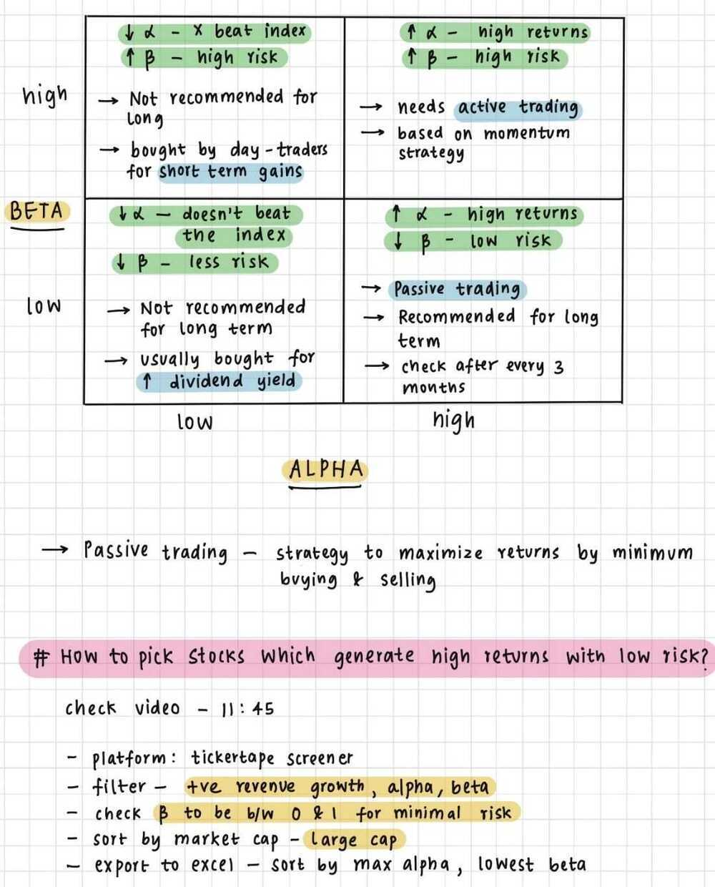
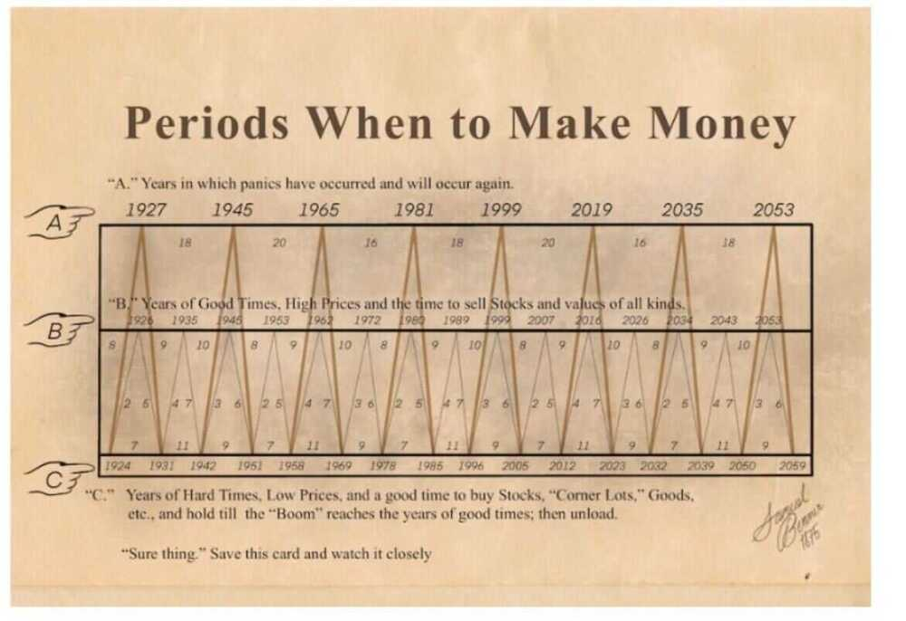

# Checklist / Tips

## Choosing companies

- Legacy Planning - we do not want a situation where a rich child living abroad has equal share in your house where a not-so-rich 2nd child lives. This can lead to hardship for the 2nd child. This is a complex subject and some vision on your part is necessary.
- Estate Planning
- Living Will

## Choosing Stocks

- **PE less than 15** (avg - 30, not more than 30)
- Fundamental Analysis
    - Annual report
    - Management discussions
    - Audit report
    - Important ratio
    - Industry analysis
- Valuation (Undervalued vs Overvalued)
    - Price to sales
    - PE
    - PV / EBITDA
- Technical Analysis
    - MACD
    - RSI
    - Bollinger Bands

## Benjamin Graham's Stock Screener

- PE ratio < Inverse of yield on AAA corporate bonds
- PE ratio < 40% of average PE ratio over the last 5 years
- Divident yield > 2/3rd of AAA corporate bond yield
- Price < 2/3rd of book value
- Price < 2/3rd of net current assets
- Debt equity ratio < 1
- Current assets > 2x current liabilities
- Debt < 2x net current assets
- 10Y historical EPS growth > 7%
- No more than 2 years of negative earnings in last 10 years

## Warren Buffett's Principles

Business

- Simple and understandable
- Consistent & predictable operating history
- Favourable long term prospects
- Presence of economic moat

Management

- Candid and honest managers
- Leaders and not followers

Financial

- High return on equity
- Strong owner's earnings
- High and stable profit margin
- Advocated use of discounted cash flow

Market

- Use conservative estimates of earnings
- Greed and fear amongst investors

## Things to keep in mind

- Risk and Return go hand in hand. Higher the risk, higher the return. Lower the risk, lower is the return.
- Investment in fixed income is a good option if you want to protect your principal amount. It is relatively less risky. However, you have the risk of losing money when you adjust the return for inflation. Example -- A fixed deposit which gives you 9% when the inflation is 10% means you are losing a net 1% per annum. Fixed-income investment is best suited for ultra risk-averse investors
- Investment in Equities is a great option. It is known to beat inflation over a long period of time. Historically equity investment has generated returns close to 14-15%. However, equity investments can be risky
- Real Estate investment requires a large outlay of cash and cannot be done with smaller amounts. Liquidity is another issue with real estate investment -- you cannot buy or sell whenever you want. You always have to wait for the right time and the right buyer or seller to transact with you.
- Gold and silver are known to be a relatively safer but the historical return on such investment has not been very encouraging.

## Buy strength and sell weakness

Strength is represented by a bullish (blue) candle and weakness by a bearish (red) candle. Hence whenever you are buying ensure it is a blue candle day and whenever you are selling, ensure it's a red candle day.

## Be flexible with patterns (quantify and verify)

While the text book definition of a pattern could state a certain criteria, there could be minor variations to the pattern owing to market conditions. So one needs to be a bit flexible. However one needs to be flexible within limits, and hence it is required to always quantify the flexibility.

## Look for a prior trend

If you are looking at a bullish pattern, the prior trend should be bearish and likewise if you are looking for a bearish pattern, the prior trend should be bullish.

## What youngsters are doing

- **Put money in experiences (strong)**
    - Adventure activities / outdoor activities
    - **Foreign trips (traveling)**
- **Buy gadgets**
    - **Apple (iphone), airpods (status symbol) (bigger status than houses)**
- **Wifi internet is a must**
    - Jio / Airtel
- **FMCG**
    - snacks / maggi / pasta (ready to eat) more than dal/rice/staples
- Don't believe in buying flats/homes (strong)
- Buy/rent car (strong)
    - **uber/ola**
    - Buy bikes (weak)
- Invest in education (go for abroad studies take education loan)
- Don't buy gold/jewellry
- Buy fashionable clothes
- Netflix / tiktok / instagram / facebook / games (pubg)
    - mobile gaming more than pc or xbox and other gaming
- Healthy foods / yoga / gym
- **Don't cook a lot (order food from outside) (strong)**
    - Zomato / swiggy / grofers / amazon / flipkart
- Rent stuff more than buy (fridges/ac/washing machine)
- coworking / coliving
- Education for children
    - **daycare**
    - preschool
    - nursery
    - coaching

Markets can remain irrational longer than you can remain solvent -- John Maynard Keynes

Two basic rules when trading: (1) if you don't bet, you can't win. (2) if you lose all your chips, you can't bet -- Larry Hite

"When companies increase the number of job postings on their websites, we anticipate an increase in sales and earnings in the future," says Alex Nekrasov, an assistant professor of accounting at the University of Illinois at Chicago. "When they cut them, it means some not-so-good times are likely ahead, probably sales and earnings will decline."

## There are three principles of intelligent investing

- An intelligent investor always analyzes the long-term evolution and management policies of a company before investing.
- An intelligent investor always protects themselves from losses by diversifying investments.
- An intelligent investor never looks for crazy returns but focuses on safe and steady profit.

## Checklist

- The stock should form a recognizable candlestick pattern
- S&R should confirm the trade. The stoploss price should be around S&R
    - For a long trade, the low of the pattern should be around the support
    - For a short trade, the high of the pattern should be around the resistance
- Volumes should confirm to the trade
    - Presence of above average volumes on both buy and sell day
    - Low volumes are not encouraging and hence do feel free to hesitate taking a trade where the volumes are low
- Look at the trade from the Dow Theory perspective.
    - Primary, secondary trends
    - Double, triple, range formations
    - Recognisable Dow formation
- Indicators should confirm
    - Scale the size higher if the confirm
    - If they don't confirm, go ahead with the original plan
- RRR should be satisfactory
    - Think about your risk appetite and identify your RRR threshold
    - For a complete beginner, I would suggest the RRR to be as high as possible as this provides a margin of safety
    - For an active trader, I would suggest a RRR of at least 1.5

Now, hypothetically imagine a situation where you are looking at opportunity to buy shares of Karnataka Bank Limited. On a particular day, Karnataka Bank has formed a bullish hammer, assume everything ticks on the checklist:

- Bullish hammer is a recognizable candlestick pattern
- The low of the bullish hammer also coincides with the support
- The volumes are above average
- There is also an MACD crossover (signal line turns greater than the MACD line)

With all four checklist points being ticked off I would be very glad to buy Karnataka Bank. Hence I place an order to buy, let us say for 500 shares.

However, imagine a situation where the first 3 checklist conditions are met but the 4th condition (indicators should confirm) is not satisfied. What do you think I should do?

I would still go ahead and buy, but instead of 500 shares, I'd probably buy 300 shares.

This should hopefully convey to you how I tend to (and advocate) the use of indicators.

When Indicators confirm, I increase my bet size, but when Indicators don't confirm I still go ahead with my decision to buy, but I scale down my bet size.

However I would not do this with the first three checklist points. For example, if the low of the bullish hammer does not coincide in and around the support, then I'll really reconsider my plan to buy the stock; in fact I may skip the opportunity, and look for another opportunity.

But I do not treat the indicators with the same conviction. It is always good to know what indicators convey, but I don't base my decisions on that. If the indicators confirm, I increase the bet size, if they don't, I still go ahead with my original game plan.

When you identify a trading opportunity, always look how the trade is positioned from the Dow Theory perspective. For example if you are considering a long trade based on candlesticks, then look at what the primary and secondary trend is suggesting. If the primary trend is bullish, then it would be a good sign, however if we are in the secondary trend (which is counter to the primary) then you may want to think twice as the immediate trend is counter to the long trade.

[Top 11 Financial Planning Thumb Rules | Learn With ETMONEY - YouTube](https://www.youtube.com/watch?v=w3Y0-Keho9Y)

[10 RULES of INVESTING for Smarter & Faster Financial Decisions | Learn Investment Basics w/ Examples - YouTube](https://www.youtube.com/watch?v=rfScEFtcx3s)

- RULE OF 72
- RULE OF 114
- RULE OF 70
- 10-5-3 RULE
- 100 MINUS AGE RULE
- 4% WITHDRAWAL RULE
- 50-30-20 RATIO
- 3X EMERGENCY FUND RULE
- 1 WEEK SPENDING RULE
- 40% EMI RULE
- 20X LIFE COVER RULE

## How to Get Rich (Without Getting Lucky) by Naval Ravikant

- Seek wealth, not money or status

**Wealth is having assets that earn while you sleep**

**Money is how we transfer time and wealth**

**Status is your place in the social hierarchy**

- Undestand **ethical wealth creation** is possible

If you secretly despise wealth, if will elude you

- Ignore people playing **status games**

They gain status by attacking people playing **wealth creation games**

- You're not going to get rich **renting** out your time

You must own **equity -** a piece of business - to gain your financial freedom

- You will get rich by giving **society** what it wants but does not yet know how to get. At scale
- Pick an industry where you can play long-term **games** with long-term **people**
- The internet has massively broadned the possible **space of careers.** Most people haven't figured this out yet
- Play **iterated games.** All the **returns** in life, whether in wealth, relationships, or knowledge, come from **compound interest.**
- Pick business partners with high intelligence, enery and above all integrity
- Don't partner with cynics and pessimists. Their beliefs are self-fulfilling
- Learn to **sell.** Learn to **build.** If you can do both, you will be unstoppable
- Arm yourself with **specific knowledge, accountability,** and **leverage**
- Specific knowledge is knowledge that you cannot be **trained for.** If society can train you, it can train someone else, and replace you
- Speific knowledge is found by pursuing your genuine curiosity and passion rather than whatever is hot right now
- Building specific knowledge will feel like play to you but will look like work to others
- When specific knowledge is **taught**, it's through apprenticeships, not schools
- Specific knowledge is often highly technical or creative. It cannot be outsourced or automated
- Embrace accountability and take business risks under your own name. Society will reward you with responsibility, equity and leverage
- The most accountable **people** have singular brands: Oprah, Trump, Kanye, Elon
- Give me a **lever** long enough, and a place to **stand,** and I will move the earth
- **Fortunes** requires leverage. Business leverage comes from capital with **no marginal cost** of replication.
- Capital means money. To **raise** money, apply your specific knowledge, with accountability, and show resulting good judgment
- **Labor** means people working for you. It's the oldest & most fought-over form of leverage. Labor leverage will impress your parents, but don't waste your life chasing it
- Capital & labor are **permission leverage.** Everyone is chasing capital, but someone has to give it to you. Everyone is trying to lead, but someone has to follow you
- Code & media are **permissionless leverage.** They're the leverage behind the newly rich. You can create software & media that works for you while you sleep
- An **army of robots** is freely available - it's just packed in data centers for heat & space efficiency. Use it
- If you can't code, write books & blogs, record videos & podcasts
- Leverage is a force multiplier for your **judgement**
- Judgement requires experience, but can be built faster by learning foundational skills
- There is no skill called **business.** Avoid business magazines and business classes
- Study microeconomics, ethics, game theory, mathematics, and psychology, computers, persuasion.
- **Reading** is faster than listening. **Doing** is faster than watching.
- You should be too busy to "do coffee" while still keeping an uncluttered calendar
- Set & enforce an aspirational **personal hourly rate.** If fixing a problem will save less than hourly rate, ignore it. If outsourcing a task will cost less than your hourly rate, outsource it
- Work as hard as you can. Even though who you work with and what you work on are more important than how hard you work
- Become **the best** in the world at what you do. Keep redefining what you do until that is true
- There are no get rich quick schemes. That's just someone else getting rick off you
- Apply specific knowledge, with leverage, and eventually you will get what you deserve
- When you're finally wealthy, you'll realize that it **wasn't** what you were seeking in the first place. But that's for another day

[Psychology of Money Book Review | Ankur Warikoo Hindi](https://youtu.be/DpyMvwF4OSE)

- Being rich is not equal to being wealthy
- Staying wealthy is very different from getting wealthy
- Controlling your time is the biggest wealth
- Use money to gain controll over your time
- Know what is enough
- Luck is very important
- Live below your means
- Money is not important if you can't sleep at night
- Save as much as you can

[10 Commandments of Wealth Building | ET Money](https://youtu.be/vBuzDz0l0No)

- THOU SHALL LIVE WITHIN ONE'S MEANS
- THOU SHALL KNOW THY PURPOSE
- THOU SHALL MAKE ONE'S MONEY WORK HARDER THAN SELF
- THOU SHALL RESPECT TIME
- THOU SHALL MAKE FRIENDS WITH COMPOUNDING
- THOU SHALL APPLY LEVERAGE
- THOU SHALL AIM TO BE CONTENDED
- THOU SHALL NOT ASSUME SHORTCUTS
- THOU SHALL ALWAYS BE LEARNING
- THOU SHALL GIVE MORE VALUE THAN ONE TAKES

[Picking Stocks for Long term Investing in 2021 | Investment Strategy for Beginners | Ankur Warikoo](https://www.youtube.com/watch?v=krwSDbuHWd4)

- Max alpha (growth) with lowest beta (risk)

[Charlie Munger: The 5 Investing Tricks That Made Him a Billionaire](https://youtu.be/w4d0e3Jpu9s)

- Invert!

Example - is the stock good invert to why is this stock not good

- Know What You Don't Know
- Rational Thinking
- Keep It Simple!
- Read a lot!
- Deep specialization in 1 thing
- Don't panic if your portfolio is 50% down, it's natural
    - Never panic sell
    - Take the opportunities
    - Understand what you're buying
    - Buy good companies
    - Focus on the long term
- Know what are your limits

[7 Hacks To Help You Make Better Financial Decisions | ET Money](https://www.youtube.com/watch?v=0g_vykxuuos)

- Chunking
- Reframing
- Fear Setting
- Mistake Board
- Man Muss Immer Umkehren
- Think Like A Statistician
- This Happened Because

[8 Most Important Principles when Investing in Equity | Stocks & Mutual Funds | ET Money](https://youtu.be/88lRk40wwN4)

- Know what kind of investor you are
- Expect volatility and profit from it
- Control the risk
- Have a safety margin
- Ignore the noise
- Don't use leverage while investing in equities
- Mind your emotions
- Long term works best

https://freefincal.com/10-financial-lessons-from-10-years-of-blogging

[10 financial lessons from 10 years of blogging](https://youtu.be/1EB6DIHZWWw)

- Nothing works all the time, at all places.
- Never cherry-pick returns; Always cherry-pick risk.
- There is no compounding in equity or equity mutual funds.
- Everyone times the market!
- We need money to make money!
- Market crashes are scary but a sideways market is the worst!
- Appreciating the sequence of returns is crucial for investment success.
- Fortune favours the disciplined.
- Humility matters.
- There are multiple solutions to most problems in life.
- Salvation lies within

[How To Make The Most Of Stock Market Corrections | ET Money](https://youtu.be/LNnand4V2h0)

- Don't Panic
- But Stocks Of Strong Businesses
- Unpunish Your Mistakes With Tax-Loss Harvesting
- Build A Portfolio That Fits Your Risk Tolerance
- Continue Your SIPs

[The Peter Cundill Investing Approach | Value Investing | ET Money](https://www.youtube.com/watch?v=d5210kusW5U)

- Curiosity
- Patience
- Concentration
- Attention to details
- Calculated Risks
- Independent mind
- Humility
- Consistency and routines
- Sound body along with a sound mind
- Personal responsibility

### Positive Risk Reward Opportunity

A situation when the UPSIDE potential of an asset is much greater than the potential downside, or the downside is limited but the upside is UNLIMITED

### Consumption smoothing

Consumption smoothing refers to **a process of achieving a balance between spending for today's needs and saving for the future**. The aim is to balance out spending and saving during the different phases of life. It is a major financial planning challenge for anyone to achieve this balance.

[Consumption Smoothing Definition, Affect on Living Standards](https://www.investopedia.com/terms/c/consumption-smoothing.asp)

## Links

[How to make money in stocks](../../book-summaries/how-to-make-money-in-stocks)

[Basic personal finance math - YouTube](https://www.youtube.com/watch?v=qoY2lz5IOGs&ab_channel=ZerodhaVarsity)

- Future value of money / opportunity cost
- Present value of money / discount

[How to invest in a bull market | NIFTY at an all-time high | Should you buy, hold, or sell? - YouTube](https://www.youtube.com/watch?v=t78IbEUMynQ)

[Warren Buffett Explains the 7 Rules Investors Must Follow in 2023 - YouTube](https://www.youtube.com/watch?v=PEPrpSCZkeU)

[GitHub - JerBouma/PersonalFinance: Tracking your income and expenses automatically.](https://github.com/JerBouma/PersonalFinance)

[First Pillar of Investing - Avoid investing in Fragile companies - Introducing the Fragility Score Card: Financial Statement Analysis made easy](https://www.budgetiger.in/p/introducing-the-fragility-score-card)

