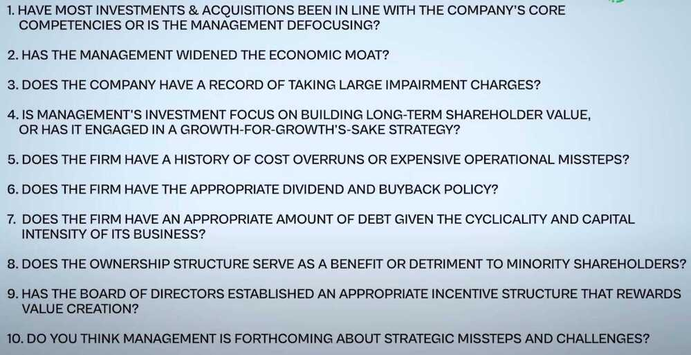

# Company's Management

[Evaluating Company's Management For Stock Buying | ET Money](https://youtu.be/kiYqad1gz5c)

While most investors focus on a company's PE ratio, it's earnings growth, return on equity etc. .. very few pay enough attention to the quality of people running that business. Presence of a sound management team is what will differentiate a good business from a great one. In Fact no one knows this better than Warren Buffett who has often said and I quote:

"OVER TIME, THE SKILL WITH WHICH A COMPANY'S MANAGERS ALLOCATE CAPITAL HAS AN ENORMOUS IMPACT ON THE ENTERPRISE'S VALUE. CHARLIE AND I LOOK FOR COMPANIES THAT HAVE ABLE AND TRUSTWORTHY MANAGEMENT. YOU NEED TWO THINGS - A MOAT AROUND THE CASTLE, AND YOU NEED A KNIGHT IN THE CASTLE WHO IS TRYING TO WIDEN THE MOAT AROUND THE CASTLE."

So, you need two things. A moat around the castle and you need a knight who is continuously trying to widen that moat. So the big question facing us is how do we identify companies with managers who do a remarkable job of delivering value to their shareholders consistently and put the interests of their shareholders above their own. The 4C framework is nothing but 4 essential characteristics by which we evaluate managements. The first C stands for capable or capability, the second C is commitment, the third C is candidness or candid and the fourth C in our framework is compassion.

## CAPABILITY

Now, capability can be looked at and measured in multiple ways

- MANAGEMENT TEAM
- FUTURE STRATEGY & DIRECTION
- CAPITAL ALLOCATION EFFICIENCY
- DEBT MANAGEMENT

## COMMITMENT

There is little doubt that we all seek a management team and a business leader who is committed to creating long-term value for its shareholders. Now a phrase like "creating long-term shareholder value" might seem like a buzzword but if we distill it down there are a few areas that can give us a better picture of how committed the management is:

- COMPENSATION
- INSIDER BUYING
- RELATED PARTY TRANSACTIONS
- SKIN IN THE GAME

## CANDID

A candid business leader is someone who is transparent with what is going wrong with the business as he or she is about it's success stories. Being candid goes to the root of integrity .. which also shows that the management team is not only principled but also has strong morals and the courage to report when a mistake has happened.

For example - I joined NIIT Limited right out of B-school in 2002. which believe me was a horrible time to be in the IT education business. But in spite of the tech bubble and everything that was happening to the stock price it was really pleasant and surprising to see the company Chairman, Rajendra Singh Pawar and the co-founders never shying away from communicating the goods and bads in analyst calls, shareholder meetings and even to 22 year old freshers like me. That's the kind of management team we want as investors. Someone who is not going to hide problems but will tell it upfront together with the possible damage and the potential solutions that can mitigate or overcome these problems. Now, to see how truthful the promoters or management team is likely to be one needs to know if any of the executives has done anything fraudulent, illegal or questionable in the past which can be accomplished with a simple background check on Google.

## COMPASSION

Finally, there is the compassionate side of management. And while this might come across as strange and surprising there have been enough studies that show that companies and managers who care for their employees, environment, culture and the softer side of leadership also turn out to be the winners in shareholder value creation. For example - Glassdoor does this annual survey on the best places to work. And it is no surprise that the top companies in the 2022 version which included NVIDIA, Hubspot, Box.com, Google etc. have also been amongst the top performing stocks in the last 5 years. So there's definitely some causality here between having happy, contended at work employees and the stock performance of a company.

To put it differently, a compassionate management is like building a digital moat around one's business which not only attracts the best talents in the industry but also retains these happy-to-work employees.

## Founder-led Companies vs Corporate Companies

- [The Rise & Fall of Under Armour - YouTube](https://www.youtube.com/watch?v=HeWdxezd_CU)
- [Founder-Led Companies Outperform the Rest - Here’s Why](https://hbr.org/2016/03/founder-led-companies-outperform-the-rest-heres-why)

## Others

- [Forfeiture of Shares: What They Are and How They Work - INDmoney](https://www.indmoney.com/articles/stocks/forfeiture-of-shares)
