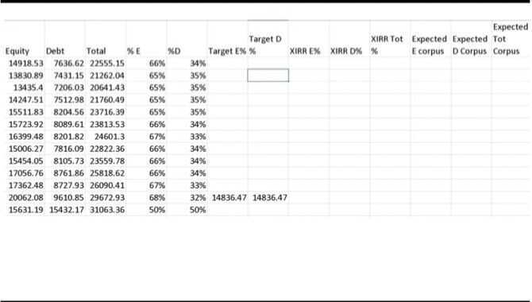

# Portfolios

## Portfolio

- **Equity**
    - **Domestic**
        - Nifty50 (30%)
        - Nifty Next 50 (70%)
    - **International**
        - Technology - NASDAQ
        - S&P500
- **Debt**
    - FD
    - RD
    - PPF (1,50,000)
    - NPS
    - Liquid funds
    - Long Term Bonds
    - Cash (2,00,000)
- **Gold**
    - Soverign Gold Bond - SGB
    - Gold ETF
- Property
    - REITs
- P2P
- Trading
    - IPOs
    - ESG (To borrow Winston Churchill's words, ESG is "a riddle, wrapped in a mystery, inside an enigma.")
    - Day trader
- Crypto

## Asset Allocation

- Strategic asset allocation
- Tactical asset allocation
- Dynamic asset allocation

[Top Asset Allocation Strategies for Financial Freedom - The 1% News](https://news.onepercentclub.io/invest/top-asset-allocation-strategies-for-financial-freedom/5451/)

## Modern Portfolio Theory

https://www.investopedia.com/terms/m/modernportfoliotheory.asp

https://en.wikipedia.org/wiki/Modern_portfolio_theory

## Permanent Portfolio

- **Stocks**(25%) When the markets do well. Direct equity or mutual funds. Even an index fund should do.
- **Cash**(25%) during a recession. For example a liquid fund
- **Gold**(25%) during inflation
- **Long Term Bonds**(25%) during deflation and prosperity

Invest half the Indian equity investment in index funds (Nifty50 and Nifty Next50 with 75:25 allocation) and the remaining equally in 3 to 4 multicap funds managed by fund managers with a proven track record of over ten years. Up to 20% of the equity portfolio can be kept in foreign equity index funds

Young professional investors should allocate around 70% of their investable amount in Equity, 20% in Precious metals, and the rest in Fixed income investments. A retired person could invest 80 percent of his saving in fixed income, 10 percent in equity markets and 10 percent in precious metals.

## Goal based portfolio investment

How to get started?

- If you can invest Rs. 3000 a month
- Invest 1500 a month in equity and 1500 in fixed income

What are the next steps?

- Track your portfolio once a month
- Learn to study portfolio volatility, impact of asset allocation, rebalancing and diversification
- Redo financial planning calculation with de-risking strategy

How to choose a financial product?

- It should be liquid
- It should have the potential to provide a post-tax return close to what is necessay for a goal
- Visible risks must be understood
- Invisible risk must be appreciated
- Risk: reward; taxation; liquidity

|                            **Why am I investing**                             | **Child's future** |
| :---------------------------------------------------------------------------: | :----------------: |
|                       When do I need the money? (years)                       |         15         |
|               What is the current cost if I need the money now?               |      5,00,000      |
|                By what rate will this cost increase each year?                |        12%         |
|                    What would be this cost after 25 years?                    |     27,36,783      |
|                What return can I expect from equity after tax?                |         9%         |
|           How much equity should I initially have in my portfolio?            |        50%         |
|            What return can I expect from fixed income (after tax)?            | 6% PPF / Gilt MF?  |
|          What return can I initially expect from the full portfolio?          |        7.5%        |
| For the above annualised portfolio return how much should I invest each year? |      1,14,862      |
|                       Where should I invest in equity?                        |                    |

- Freefincal Basics of Porfolio management

https://freefincal.com/can-i-use-these-two-index-funds-for-retirement-instead-of-nifty-nifty-next-50

- Nifty next 50 (Nifty Blend 40:60 / 30:70) Mid cap - S&P 400 Mid Cap and maybe SENSEX also (Nifty50/NiftyNext50 - 70:30)
    - Nifty 100 equal weight (better returns, low risk)
    - Nifty 100 Low Vol 30

## Good Portfolios

1. 5000 per month SIPs

   - ICICI Prudential Focused Bluechip Fund - Direct
   - Kotak Select Focus Fund - Regular
   - Mirae Asset Emerging Bluechip Fund - Regular
   - ABSL Pure Value Fund - Regular
   - Reliance Small Cap Fund - Direct

2. 6 schemes with double digit annualised returns
    - Parag Parikh long term equity fund (12.89%)
    - Axis bluechip fund (10.93%)
    - iifl focused equity fund (10.92%)
    - Axis midcap fund (10.56%)
    - Mirae asset emerging bluechip fund (10.56%)
    - Canara robeco bluechip equity fund (10.42%)

## 3-bucket portfolio

- Bucket A: 3-years expenses and emergency funds: 10% savings bank account, 90% Short Term Debt mutual fund. Bucket total = 100%.
- Bucket B: long term equity: 30% Nifty-50, 20% Nasdaq-100, 5% Commodities, 15% hybrid equity fund, 30% stocks. Bucket total = 100%.
- Bucket C: long term, Govt backed debt

## 4 Fund Portfolio

1. Index Fund - Nifty50
2. Index Fund - Midcap
3. Bond Fund - Short-term, Medium-term, Bank/PSU
4. Gold Fund - Gold Fund, Gold ETF

## Contrarian Investment Strategies

### Losers Portfolio

What if you invest in companies that give the worst returns? Can you beat the markets with a Loser Portfolio? Valuation guru Aswath Damodaran says it works in the US.  Is it possible with Indian stocks? Let’s find out.

We did a simple exercise to put this theory to the test. Every year, we picked the worst-hit stocks (by price decline) and invested an equal amount in each. The idea was simple: We wanted to check if big losers bounce back.

First, we selected the 35 biggest losers of FY15 (Apr 1, 2014 - Mar 31, 2015). Invested Rs 10,000 in each of them on Apr 1, 2015. Total investment = Rs 3.5 lakh. A year later (by Mar 31, 2016), the returns were 21.7%. How did the BSE 500 fare? It was down 7.8%. We repeated this exercise for the next financial year. We invested Rs 10,000 each in 35 stocks that fell the most in FY16. The investment was done on Apr 1, 2016. The returns came out to be 53.7% vs BSE 500’s 24.0%. We repeated this exercise for the next 8 years. Out of 10 years, the loser portfolio did better than the BSE 500 in 8 years. Average 10-year returns of the portfolio = 31.5%. This was much higher than the average 10-year BSE 500 returns of 14.3%. To put these returns into context, here’s how the portfolio grew: The ‘Loser Portfolio’ grew to ₹45.9 lakh.

If you had invested in the BSE 500, it would have grown to ₹40 lakh. We also checked this strategy for buy & hold. Basically, we kept on holding the initial 35 stocks and added new loser stocks every year.

Here’s how the numbers stack up:

- Total investment = ₹35 lakh
- Final portfolio value = ₹2.4 crore.
- BSE 500 = ₹73.3 lakh

Does this strategy ONLY work for a portfolio of 35 stocks? Not really. We also used this strategy with a portfolio of 20, 15, and 10 worst-performing stocks. Surprisingly, every portfolio beat the benchmark over the 10-year horizon. Why does this work?

There are possibly two factors at play.

- Mean Reversion
- Contrarian Approach

In his book Investment Fables, Damodaran explains that if the price of a stock is down, it should generally rise to its long-term average.  Secondly, when investing in a loser's portfolio, you are generally acting against the crowd. In a way, you are taking a contrarian bet.
If you plan to use this strategy, here are some smart filters that can help:

- Consider a portfolio of losers
- Filter based on market cap to avoid illiquid stocks
- Cap loss % to avoid stocks with structural issues

Let's understand them one by one.

#### Portfolio Approach

- Well, this strategy works best in a portfolio approach.
- Why? Not all the flops of last year give stellar returns in following years.
- But the few that do bounce back often rally so hard, they end up driving the entire portfolio’s returns on their own. (See 5th image)

#### Filtering Market Cap

- We only picked stocks with a market cap above ₹1,000 crore.
- Why? Because below ₹1,000 cr, companies are often illiquid (hard to buy/sell) and highly volatile.

#### Capping Loss

- We avoided companies that fell more than 50%, as such sharp declines often signal deeper issues like poor management or structural problems.
- One important caveat: survivorship bias.
- Our analysis includes only those companies that are still around today.
- But some of the biggest losers may have disappeared—delisted, merged, or gone bust.

So, this is one risk you should keep in mind with this strategy.

- [I Made 38% Return with LOSERS PORTFOLIO \| Contrarian Investing Strategy \| Aswath Damodaran - YouTube](https://www.youtube.com/watch?v=U6T4FqBOeEQ)
- [8 Contrarian Investing Strategies \| 31% Return from "Portfolio of Losers" \| Contra Mutual Funds - YouTube](https://www.youtube.com/watch?v=EtuJa-TnSc4)
- [Post from ET Money - YouTube](http://youtube.com/post/UgkxLXxgFaXKXbiNqK8BdW8VChMlG1-ZpePa?si=VP4Nwe3TRLIu38V_)

## Savings

1. Equity-oriented Mutual funds (50%)
2. Fixed Income (30%) - AAA-rated corporate bonds
3. Gold (10%)

    - Sovereign gold bond scheme
    - Do not buy Sovereign Gold Bond for returns! What you "get" will depend on luck!

4. Exchange-traded fund (Index ETF) (10%)

Always have 60-70% large cap regardless of age

- If you are going to invest less than Rs. 10,000 a month in equity funds, just one fund will do
- For people less than 25 lakh in equity mutual funds, I would recommend two mutual funds only
- Above that and only above that, a third fund can be added to reduce concentration and performance risk

- For a one-fund equity portfolio
    - Single aggressive hybrid fund or single large and midcap or single multi-cap fund with do
- For a three-fund portfolio:
    - Combo 1 - Large-cap, Aggressive hybrid, mid-cap
    - Combo 2 - Large-cap, Mid-cap, Small-cap
    - Combo 3 - Aggressive hybrid, balanced advantage, mid-cap

## The Core Satellite Strategy

Let us say, a market participant has a corpus of Rs.500,000/-. This corpus can be split into two unequal portions, for example the split can be 60 -- 40. The 60% of capital which is Rs.300,000/- can be invested for a long term period in fundamentally strong companies. This 60% of the investment makes up the core of the portfolio. One can expect the core portfolio to grow at a rate of at least 12% to 15% CAGR year on year basis.

The balance 40% of the amount, which is Rs.200,000/- can be utilized for active short term trading using Technical Analysis technique on equity, futures, and options. The Satellite portfolio can be expected to yield at least 10% to 12% absolute return on a yearly basis.

[Vijay Kedia’s Rs 35,000 to Rs 1,800 Crore Journey: Secrets Behind 16,000x Returns ! - YouTube](https://youtu.be/sBrVejRrZBk)

## Portfolios

- [An insight on Motilal Oswal Hedged Equity Multi-factor Strategy - AIF - YouTube](https://www.youtube.com/watch?v=rOmibLlyH8Y)
- [6 Steps to build momentum portfolio | What is a momentum portfolio? | How to measure momentum? - YouTube](https://www.youtube.com/watch?v=eMuGV8t3ejo)
- [Saurabh Mukherjea & the Power of Consistent Compounders | Marcellus Investment Managers - YouTube](https://www.youtube.com/watch?v=qqw9lM1E3Fc)
- [How to Find Multibagger Stocks? I Studied 44 Stocks with over 1000% returns in the Narendra Modi era - YouTube](https://www.youtube.com/watch?v=eAFurcWZM-k)
- [How to Build a Portfolio of Monopoly Stocks in India | 27% CAGR in Last 5 Years | Worksheet Included - YouTube](https://www.youtube.com/watch?v=R2KM1SJuED0)
- [How to Make Money in Stocks using CANSLIM System | William O'Neil - YouTube](https://www.youtube.com/watch?v=dJlRl0aJX3I)
- [Earn Extra 5% by RENTING your Shares | Stock Lending and Borrowing Mechanism | SLBM - YouTube](https://www.youtube.com/watch?v=SNy6GWe-pGI)
- [How to Find Cash Rich Companies at Best Valuations? | Cash Rich Stocks on Screener and Ticker Tape - YouTube](https://www.youtube.com/watch?v=EKApea7F8U4)
- [Top Dividend Investing Strategies ft. Dividend Aristocrats & High Dividend Yielding Stocks - YouTube](https://www.youtube.com/watch?v=OHtujNk9pTU)
- [Multibagger Stocks for 2023 | 22% Returns in 11 years from this 10 Bagger Portfolio Framework - YouTube](https://www.youtube.com/watch?v=NTUeXmp4wkY)
- [Best Sector to Invest for Long Term | Business Cycles & Ambit's Sector Attractiveness Framework - YouTube](https://www.youtube.com/watch?v=mTXkio4dE0Y)
- [How to Identify Fundamentally STRONG Stocks using the FRAGILITY Scorecard | Stock Selection Strategy - YouTube](https://www.youtube.com/watch?v=FaMM4Dhe3D8)
- [Best Sector to Invest for Long Term | Business Cycles & Ambit's Sector Attractiveness Framework - YouTube](https://www.youtube.com/watch?v=mTXkio4dE0Y)
- [Inside Ashish Kacholia’s Stock Portfolio: Key Lessons from His Investment Strategy 🐳 - YouTube](https://www.youtube.com/watch?v=kUWE1T26du8)
- [Learn How To Invest In Stock Market For Beginners | Ep 34 - YouTube](https://www.youtube.com/watch?v=Ao7WHrRw_VM)
- [Nasdaq vs Nifty: How to divide your stock portfolio across Wall Street and Dalal Street in 2025 - The Economic Times](https://economictimes.indiatimes.com/markets/stocks/news/nasdaq-vs-nifty-how-to-divide-your-stock-portfolio-across-wall-street-and-dalal-street-in-2025/articleshow/116846787.cms)
- [How do I invest a lump sum I don't need for the next 5-7 years?](https://freefincal.com/how-do-i-invest-a-lump-sum-i-dont-need-for-the-next-5-7-years/)
