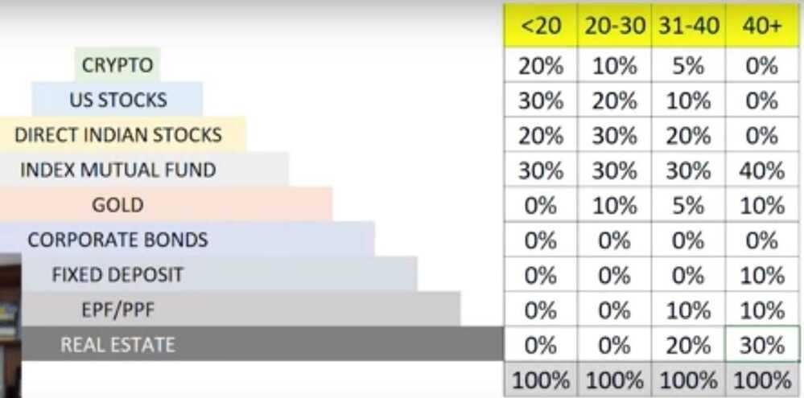

# Portfolios

## Portfolio

- **Equity**
  - **Domestic**
    - Nifty50 (30%)
    - Nifty Next 50 (70%)
  - **International**
    - Technology - NASDAQ
    - S&P500
- **Debt**
  - FD
  - RD
  - PPF (1,50,000)
  - NPS
  - Liquid funds
  - Long Term Bonds
  - Cash (2,00,000)
- **Gold**
  - Soverign Gold Bond - SGB
  - Gold ETF
- Property
  - REITs
- P2P
- Trading
  - IPOs
  - ESG (To borrow Winston Churchill's words, ESG is "a riddle, wrapped in a mystery, inside an enigma.")
  - Day trader

## Modern Portfolio Theory

<https://www.investopedia.com/terms/m/modernportfoliotheory.asp>

<https://en.wikipedia.org/wiki/Modern_portfolio_theory>

## Permanent Portfolio

- **Stocks**(25%) When the markets do well. Direct equity or mutual funds. Even an index fund should do.
- **Cash**(25%) during a recession. For example a liquid fund
- **Gold**(25%) during inflation
- **Long Term Bonds**(25%) during deflation and prosperity

Invest half the Indian equity investment in index funds (Nifty50 and Nifty Next50 with 75:25 allocation) and the remaining equally in 3 to 4 multicap funds managed by fund managers with a proven track record of over ten years. Up to 20% of the equity portfolio can be kept in foreign equity index funds

Young professional investors should allocate around 70% of their investable amount in Equity, 20% in Precious metals, and the rest in Fixed income investments. A retired person could invest 80 percent of his saving in fixed income, 10 percent in equity markets and 10 percent in precious metals.

## Goal based portfolio investment

How to get started?

- If you can invest Rs. 3000 a month
- Invest 1500 a month in equity and 1500 in fixed income

What are the next steps?

- Track your portfolio once a month
- Learn to study portfolio volatility, impact of asset allocation, rebalancing and diversification
- Redo financial planning calculation with de-risking strategy

How to choose a financial product?

- It should be liquid
- It should have the potential to provide a post-tax return close to what is necessay for a goal
- Visible risks must be understood
- Invisible risk must be appreciated
- Risk: reward; taxation; liquidity

| **Why am I investing** | **Child's future** |
|:---:|:---:|
| When do I need the money? (years) | 15 |
| What is the current cost if I need the money now? | 5,00,000 |
| By what rate will this cost increase each year? | 12% |
| What would be this cost after 25 years? | 27,36,783 |
| What return can I expect from equity after tax? | 9% |
| How much equity should I initially have in my portfolio? | 50% |
| What return can I expect from fixed income (after tax)? | 6% PPF / Gilt MF? |
| What return can I initially expect from the full portfolio? | 7.5% |
| For the above annualised portfolio return how much should I invest each year? | 1,14,862 |
| Where should I invest in equity? |

- Freefincal Basics of Porfolio management

<https://freefincal.com/can-i-use-these-two-index-funds-for-retirement-instead-of-nifty-nifty-next-50>

- Nifty next 50 (Nifty Blend 40:60 / 30:70) Mid cap - S&P 400 Mid Cap and maybe SENSEX also (Nifty50/NiftyNext50 - 70:30)
  - Nifty 100 equal weight (better returns, low risk)
  - Nifty 100 Low Vol 30

## Good Portfolios

1. 5000 per month SIPs

   - ICICI Prudential Focused Bluechip Fund - Direct
   - Kotak Select Focus Fund - Regular
   - Mirae Asset Emerging Bluechip Fund - Regular
   - ABSL Pure Value Fund - Regular
   - Reliance Small Cap Fund - Direct

2. 6 schemes with double digit annualised returns
    - Parag Parikh long term equity fund (12.89%)
    - Axis bluechip fund (10.93%)
    - iifl focused equity fund (10.92%)
    - Axis midcap fund (10.56%)
    - Mirae asset emerging bluechip fund (10.56%)
    - Canara robeco bluechip equity fund (10.42%)

## 3-bucket portfolio

- Bucket A: 3-years expenses and emergency funds: 10% savings bank account, 90% Short Term Debt mutual fund. Bucket total = 100%.
- Bucket B: long term equity: 30% Nifty-50, 20% Nasdaq-100, 5% Commodities, 15% hybrid equity fund, 30% stocks. Bucket total = 100%.
- Bucket C: long term, Govt backed debt

## Savings

1. Equity-oriented Mutual funds (50%)
2. Fixed Income (30%) - AAA-rated corporate bonds
3. Gold (10%)

    - Sovereign gold bond scheme
    - Do not buy Sovereign Gold Bond for returns! What you "get" will depend on luck!

4. Exchange-traded fund (Index ETF) (10%)

Always have 60-70% large cap regardless of age

- If you are going to invest less than Rs. 10,000 a month in equity funds, just one fund will do
- For people less than 25 lakh in equity mutual funds, I would recommend two mutual funds only
- Above that and only above that, a third fund can be added to reduce concentration and performance risk

- For a one-fund equity portfolio
  - Single aggressive hybrid fund or single large and midcap or single multi-cap fund with do
- For a three-fund portfolio:
  - Combo 1 - Large-cap, Aggressive hybrid, mid-cap
  - Combo 2 - Large-cap, Mid-cap, Small-cap
  - Combo 3 - Aggressive hybrid, balanced advantage, mid-cap

## The Core Satellite Strategy

Let us say, a market participant has a corpus of Rs.500,000/-. This corpus can be split into two unequal portions, for example the split can be 60 -- 40. The 60% of capital which is Rs.300,000/- can be invested for a long term period in fundamentally strong companies. This 60% of the investment makes up the core of the portfolio. One can expect the core portfolio to grow at a rate of at least 12% to 15% CAGR year on year basis.

The balance 40% of the amount, which is Rs.200,000/- can be utilized for active short term trading using Technical Analysis technique on equity, futures, and options. The Satellite portfolio can be expected to yield at least 10% to 12% absolute return on a yearly basis.

## Term life insurance

- Annual Salary * 10
- Only one exclusion
  - Suicide in 1 year or 2 years
  - honour death by accident
  - exclude death due to natural calamity or death due to war
- Simple term insurance which will give 100% money to nominee
- No other features/riders
- Till age 50/60
- Build wealth more than the insurance
- Don't buy single pay policy

<https://freefincal.com/re-assemble-step-3-buy-term-life-insurance>

- <https://freefincal.com/what-you-need-to-know-before-buying-term-insurance>
- PNB met Life
  - Sum insured without tax detection
  - HLV (Human Life Value) - 9 crore
  - 35 years (till 60 years)
    - 5 crore - 46020
      - 39000
    - 3 crore - 27612 (incl tax)
      - 23400
    - 1 crore - 10974
      - 9300
  - 10 years
    - 1 cr - 7906
    - 3 cr - 19470
  - One time pay option
- What will happen if I don't pay premium after certain age

1. Term plan - ICICI Prudential iProtect Smart: Rs 50 lakh

2. Health Insurance - ICICI Lombard Family Floater: Rs 3 lakh

<https://joinditto.in>

## Portfolios

[An insight on Motilal Oswal Hedged Equity Multi-factor Strategy - AIF - YouTube](https://www.youtube.com/watch?v=rOmibLlyH8Y)
