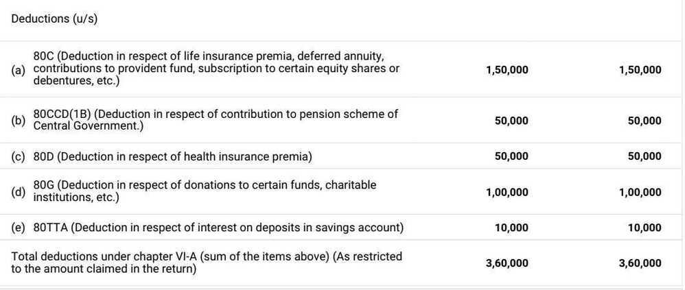

# Returns / Tax / Taxes / ITR

https://taxbuddy.com

Tax evasion (punishable) vs tax avoidance (your legitimate right) of saving tax

Tax Consulation - https://www.charteredclub.com/tax-consultation-with-ca-karan-batra

Input tax credit

**Period: April 1, 2022 - March 31, 2023**

- Financial Year: 2022 - 2023
- Assessment Year: 2023 - 2024

### Direct and indirect taxes

- Direct taxes are paid directly to the government and are levied on one's income and profits.
- Indirect taxes are totally opposite and are paid to the government if one makes any purchases of goods and services.

### GST

Businesses must register for GST and pay taxes on their taxable items and services if their annual revenue exceeds **Rs.** **40 lakhs for goods and Rs.** **20 lakhs for services**.

[GST Registration | Online GST Registration Process](https://cleartax.in/s/gst-registration)

[Input Tax Credit under GST - Conditions To Claim](https://cleartax.in/s/input-tax-credit-under-gst)

[Input Tax Credit under GST - Check Conditions To Claim](https://www.bajajfinserv.in/what-is-input-tax-credit-under-gst)

[BENEFITS of Amazon Business Account - YouTube](https://www.youtube.com/watch?v=iURSaIqXPyg&ab_channel=TheInventar)

### GST vs Income Tax

Income Tax and GST are 2 completely different Acts and tax different things.

Mr. India earns INR 1 crore by selling services to Indian parties. This is professional income for Mr. India. GST on these services applies at 18%

#### GST

Mr. India will collect the following amount from his clients:

|Particulars|INR|
|---|---|
|Fees for services|1,00,00,000|
|Add: GST @ 18%|18,00,000|
|Total Collection|1,18,00,000|

This INR 18,00,000 of GST collected will be paid to the Government. Accordingly, **GST is an indirect tax - the clients bear the burden of this amount**.

#### Income Tax

Mr. India will be liable to pay income tax on this INR 1 crore at [slab rates](https://www.thegalacticadvisors.com/tax-rates-individual). This is a tax on your income - a Direct Tax. This goes out of your pocket.

[A Comprehensive Guide on Tax for Freelancers](https://www.thegalacticadvisors.com/post/comprehensive-guide-on-tax-for-freelancers)

[Input Tax Credit under GST - Check Conditions To Claim](https://www.bajajfinserv.in/what-is-input-tax-credit-under-gst)

## CA

1. Insurance receipt
2. NGO receipt
3. Add your name while filling, and not from individual portal
4. HUF / consultant (for better tax savings)

F&O - 2.5 lakh profit exemption per financial year

## LTCG / Tax Loss Harvesting

To prevent gains from building up, experts suggest harvesting. This means booking a portion of your profits and reinvesting the proceeds. So you sell a part of your equity holdings to book long term capital gains, and then buy back the same shares or mutual fund units.

Harvest losses too when you still can

This exercise can be replicated even when you are investing via SIPs in mutual funds. If you started the SIP about a year ago, start redeeming units after they complete a year and reinvest the proceeds in the same or different fund. This will reset the buying price and ensure your capital gains do not overshoot the Rs 1 lakh tax free threshold.

if you are not able to set off your entire capital loss in the same year, you can carry forward these losses for up to 8 assessment years.

https://economictimes.indiatimes.com/wealth/tax/heres-a-trick-to-lower-your-tax-on-capital-gains-from-equity/articleshow/73095582.cms

[7 Questions to Ask Before Selling Equity Mutual Funds or Stocks | ETMONEY](https://www.youtube.com/watch?v=KJ4kinqOW6c)

[What is Tax Harvesting | What is Tax Loss Harvesting | Tax Harvesting in Mutual Funds](https://www.youtube.com/watch?v=t_y0kNP-apY)
[How to Save Capital Gain Tax? Use Tax Loss Harvesting to Save Tax in Stock Market - YouTube](https://www.youtube.com/watch?v=E_CKrnF4CtY)

[How I Saved ₹2 Lakhs in Taxes with Tax Loss Harvesting? A Must-Know for all Investors - YouTube](https://www.youtube.com/watch?v=E_CKrnF4CtY)

[Tax on Equity Mutual Funds in India | Income Taxation on Capital Gains & Dividends](https://www.youtube.com/watch?v=G-DFuEi7NcA)

https://cleartax.in/s/marginal-relief-surcharge

10% surcharge for people earning more than 50 lakh (get marginal relief surcharge)

[Tax Harvesting vs Portfolio Rebalancing: What is the difference?](https://freefincal.com/tax-harvesting-vs-portfolio-rebalancing-what-is-the-difference/)

## Taxability

For taxation purposes, all mutual funds with investments lower than 65% in equity instruments are considered debt funds. Short-term capital gains of less than 36 months are taxed corresponding to the investor's income tax slab.

A tax rate of 20% is levied on long-term capital gains above 36 months after indexation. Indexation refers to the adjustment of the price of debt funds after factoring in the inflation between the years when that fund was purchased and the year when you sell them. This adjustment allows for the inflation of purchase price, thereby bringing down the overall quantum of capital gains. Subsequently, your taxable income reduces proportionately.

## Indexation

Indexation is a technique to adjust income payments by means of a price index, in order to maintain the purchasing power of the public after inflation, while de-indexation is the unwinding of indexation.

[Cost Inflation Index For FY 2023-24, Index Table, Meaning, Calculation](https://cleartax.in/s/cost-inflation-index)

https://cleartax.in/s/indexation-helps-reduce-tax-debt-fund-gains

https://groww.in/blog/indexation-in-mutual-funds-meaningbenefits-and-more

https://www.youtube.com/watch?v=KKlsYoSaKAs

### Unrealized Gains / Unrealized Loss / "paper" profits or losses

An unrealized gain is a potential profit that exists on paper, resulting from an investment. It is an increase in the value of an [asset](https://www.investopedia.com/terms/a/asset.asp) that has yet to be sold for cash, such as a stock position that has increased in value but still remains open. A gain becomes [realized](https://www.investopedia.com/terms/r/realizedprofit.asp) once the position is sold for a profit.

### Key Takeaways

- An unrealized gain is a theoretical profit that exists on paper, resulting from an investment that has not yet been sold for cash.
- Unrealized gains are recorded on the financial statements differently depending on the type of security.
- Gains do not affect taxes until the investment is sold and a realized gain is recognized.

https://www.investopedia.com/terms/u/unrealizedgain.asp

## Income Tax

| Income Tax Slabs        | Tax Rate for Individual & HUF Below the Age Of 60 Years |
|------------------------|------------------------------------------------|
| Up to ₹2,50,000*       | Nil                                                     |
| ₹2,50,001 to ₹5,00,000  | 5% of total income exceeding ₹2,50,000                  |
| ₹5,00,001 to ₹10,00,000 | ₹12,500 + 20% of total income exceeding ₹5,00,000       |
| Above ₹10,00,000        | ₹1,12,500 + 30% of total income exceeding ₹10,00,000    |

An additional 4% Health & education cess will be applicable on the tax amount calculated as above.

Surcharge: 10% of income tax, where total income exceeds Rs.50 lakh up to Rs.1 crore.

Surcharge: 15% of income tax, where the total income exceeds Rs.1 crore.

So ~3cr or 2% of Indians out of 140cr invest.

ITR filings for FY 20/21 by income.

~4.8cr ₹5lks

~90lks ₹5 to ₹10lks

~43lks ₹10lks

If people have to invest or spend more, they need to earn at least ₹2.5lks/yr?

### Incomes exempt from paying tax

1. Income from Agriculture (Agriculture Income)
2. Gifts Received from Relatives
3. Income from Gratuity
4. Scholarships
5. Certain Pensions - Pensions received by recipients of gallantry awards like the Mahavir Chakra, Param Vir Chakra, and Vir Chakra are tax-free. Additionally, the pension received by family members of Indian Armed Forces personnel is also exempt from tax.

[Certain Pensions | Zee Business](https://www.zeebiz.com/personal-finance/photo-gallery-income-tax-season-non-taxable-5-types-income-exempt-from-taxation-agriculture-gifts-gratuity-scholarships-pension-300544/certain-pensions-300549)

## Freelancing / Freelancer

- ITR4
- If the total tax liability during a financial year exceeds Rs.10,000, the taxpayer is required to pay taxes every quarter. This is called advance tax.
- If the total revenue from freelancing work is not more than Rs. 20 lakhs, then GST does not apply.
- GST returns have to be filed quarterly or monthly based on your turnover and if you have opted for the composition scheme. Composition dealers and those with annual sales below Rs.1.5 crore for the supply of goods can file quarterly returns. **For service providers, the limit is Rs.50 lakhs.**

### 44ADA - Presumptive Tax Scheme for Professionals

The benefit of section 44ADA can be taken only by those specified professionals whose annual gross receipts are under Rs.50 lakh (This limit is Rs.75 lakh, provided 95% of the receipts are through recognised banking channels).

The presumptive scheme of taxation reduces the compliance burden on small professions and facilitates ease of doing business. Under the presumptive scheme of taxation, profits/taxable income is presumed at 50% of the gross receipts.

Taxes can be significantly reduced. For 60 lakh under 44ADA tax is only around 7L instead of 12L in normal method.

[Section 44ADA – Presumptive Tax Scheme for Professionals](https://cleartax.in/s/section-44ada)

[Section 44ADA - Presumptive Tax for Professionals](https://groww.in/p/tax/section-44ada-of-income-tax-act)

### Deductions

- Rent of the property
- Repairs undertaken
- Depreciation
- Office expenses
- Travel Expenses
- Meal, entertainment or hospitality expenses
- Local taxes and insurance for your own business property
- Domain registration and apps purchased
- Mobile / Wifi Bills

[Freelancers and Taxes - Income Tax for Freelancers](https://cleartax.in/s/income-tax-for-freelancers)

[**A Comprehensive Guide on Tax for Freelancers**](https://www.thegalacticadvisors.com/post/comprehensive-guide-on-tax-for-freelancers)

LUT (Letter of Undertaking) - [GST: How to file an LUT?](https://www.thegalacticadvisors.com/post/gst-how-to-file-an-lut) - let's you export goods or services without payment of GST

## Deductions

### Deduction U/S 10 - HRA

- House Rent - 8300 * 12 = 99600 (PAN not required)
- Parents can claim property taxes paid by them and also claim a 30% standard deduction from this rental income.
- If they are more than 60 years old, they will also enjoy a higher minimum income exemption limit (Rs.3 lakh for those who have aged above 60 years old and Rs.5 lakh for those who are aged above 80 years old).
- Individuals paying rent but not receiving house rent allowance can claim a deduction under Section 80GG. Also, the individual, spouse or children should not own a house property in the place of employment, business or location where the individual ordinarily resides for claiming this deduction.

- https://freefincal.com/tax-benefits-hra-home-loans
- [Can I pay rent to my parents to save tax?](https://cleartax.in/s/can-i-pay-rent-to-my-parents-to-save-tax)
- [House Rent Allowance (HRA) - What is House Rent Allowance, HRA Exemption And Tax Deduction](https://cleartax.in/s/hra-house-rent-allowance)

#### HRA Calculator

- [Online House Rent Allowance (HRA) Calculator | The 1% Club](https://calculators.onepercentclub.io/hra-calculator)
- [HRA Calculator - Online Calculate your House Rent Allowance](https://cleartax.in/paytax/HraCalculator)

#### TDS on rent

- https://eportal.incometax.gov.in/iec/foservices/#/login
- e-file > e-pay tax (Pay quarterly)
- New Payment
- 26 QC (TDS on Rent of Property)
- Form
    - Residential Status of the Landlord - Resident
    - Whether more than one Tenant* - No
    - PAN of landlord -
    - Flat door building -
    - Type of property - Both
    - Address details - Same
    - Period of Tenancy - 11
    - Total value of rent paid - 90000
    - Value of rent paid last month - 81000
    - Amount paid credited - 81000
    - Rate at which rent deducted - 10
    - Amount of tax deducted at source - 9000
- Netbanking - HDFC Bank

- [What is the TDS provision for rent paid by individuals above Rs 50,000?](https://news.cleartax.in/what-is-the-tds-provision-for-rent-paid-by-individuals-above-rs-50000/6672/)
- [tds penalty: Paying house rent of more than Rs 50000 per month? Penalty you will pay for not deducting TDS - The Economic Times](https://economictimes.indiatimes.com/wealth/tax/paying-house-rent-of-rs-50000-or-more-per-month-penalty-you-will-pay-for-not-deducting-tds/articleshow/104176779.cms?from=mdr)
- [TDS on Rent: Section 194I Explained and Calculation Guidelines](https://www.canarahsbclife.com/blog/tax-saving/how-to-calculate-tds-on-rent)
- [TDS on Rent payment of More Than Rs. 50000 P.M. By Individuals/ HUFs](https://taxguru.in/income-tax/tds-payment-rent-rs-50000-month-individuals-hufs.html)
- [Form 16C: TDS Certificate On Rent And Challan 26QC](https://cleartax.in/s/know-form-16c-challan-26qc-deducting-tds-rent)

#### Why 11 Months?

By keeping the lease duration to 11 months, landlords can ensure that the regulations of the Rent Control Act do not apply to their agreement. This allows for greater flexibility in dictating the terms of the lease, including the rent and the tenure of the lease.

Most rental agreements in India are 11 months long because it allows landlords to avoid the Rent Control Act's regulations, which can restrict the terms of the lease. This gives landlords more flexibility to specify the lease's terms, including the rent and the length of the lease. The agreements are typically renewed every 11 months, which gives both parties the opportunity to revise the terms as per their convenience.

An 11-month lease agreement also allows the landlord to set the rent based on the current market scenario. The parties involved don't need to pay any stamp duty and registration charges for an 11-month rent agreement. They can also easily renew such agreements using stamp duty paper of Rs. 100 when deciding to extend the rental contract.

However, the agreement doesn't have to be for 11 months. Renewable/extendable agreements of three to five years can also be made as per the assent of the parties.

Alternatively, the landlord and the tenant may mutually agree to not get the agreement registered, which can help them avoid paying the stamp duty and registration fee.

[Why Most Lease Agreements are for 11 Months in India?](https://www.linkedin.com/pulse/why-most-lease-agreements-11-months-india-realtysmartz/)

### Others

Sec 80D - Medical Insurance Premium (If the policy covers a senior citizen then exemption is Rs.50,000/-) for self and family- Existing or new policy bought between April 2019 till March 2020.

Medical Insurance 80D for Parents (Here you can claim the amount upto maximum of Rs 25,000 per annum for the premiums paid for your parents. If your parents are senior citizens, the amount is increased to Rs 30,000 per annum. You can also claim preventive health check-up amount of Rs 5,000 for your parents too.)

Sec 80DD - Handicapped Dependent (Medical Treatment on handicapped dependent, Copies of medical bills and duly completed Form 10-IA have to be submitted.)

- Rs 75,000 (Starting from the financial year 2015-16) where disability is more than 40% and less than 80%.
- Rs 1,25,000 (Starting fromthe financialyear 2015-16) where disability is more than 80%.
- These deductions are allowed irrespective of your actual expenditure.

Sec 80E - Repayment of Loan for higher education (only Interest)

Sec 80GG - Rent Paid

Sec 80U - Handicapped

### Sec 80TTA / 80TTB - Interest on saving a/c (upto 10000)

- Exemption upto 10,000 for interest earned in savings bank account (less than 60 years) - does not include fixed deposit / RD
- Exemption upto 50,000 for interest earned for term deposits / RD for age greater than 60 years

[**https://cleartax.in/s/claiming-deduction-on-interest-under-section-80tta**](https://cleartax.in/s/claiming-deduction-on-interest-under-section-80tta)

### 80DDB - Dependent Critical Illness (upto 1,00,000)

### DEDUCTION U/S 80C (Max 150000)

Contribution to Pension Fund (Jeevan Suraksha)

Life Insurance Premium on life of self/spouse/child only

Deferred Annuity

### Public Provident Fund in own name/spouse/child only

ULIP of UTI/LIC in own name or spouse and child only

Repayment of Housing Loan (Only principal)

Contribution to Pension Fund or UTI or Notified Mutual Fund

Investment in ELSS made in units of Notified Mutual Fund

Children Tuition Fee: Restricted to a max of 2 Children

Deposit in home loan account scheme of NHB/HDFC

5 yrs. Term deposit in a Sch.Bank

Others (please specify)

Others (please specify)

DEDUCTION U/S 80CCCAnnuity/Pension Plan

DEDUCTION U/S 80CCDNotified Pension Scheme (NPS) (Max 50000)

Asset Classes (Equity, Corporate debt, Government Bonds and AlternativeInvestmentFunds)

### DEDUCTION U/S 24

Interest on Housing Loan on fully constructed accomodation only (Limit - 200,000)

Interest if the loan is taken before 01/04/99 on fully constructed accomodation only (Limit - 30,000)

### 10(5) LTA

- 13739

https://economictimes.indiatimes.com/wealth/tax/how-to-claim-lta-from-your-employer/articleshow/66246473.cms?from=mdr

[Leave Travel Allowance (LTA) Rules 2024: How to claim, calculate - The 1% News](https://news.onepercentclub.io/taxation/leave-travel-allowance-lta-rules-eligibility-how-to-claim-calculate-latest-updates/3048/)

Loss from business and profession cannot be set off against income chargeable to tax under the head "Salaries". 8) Loss under the head "house property" shall be allowed to be set-off against any other head of income only to the extent of Rs. 2,00,000 for any assessment year.

## Tax

1. Max - 1.5 lakh

- PF - tax free upto 1 lakh

- Rent

[17 Best Income Tax Saving Schemes & Plans in 2023](https://scripbox.com/tax/tax-saving-options/)

https://www.etmoney.com/blog/beyond-section-80c-10-ways-to-save-taxes

## ITR

1. If you have an income from just salary, one house property and bank deposits (Savings, FD, RD, Flexi RD), it is ITR1 (total income up to 50 L).
2. If you have income specified in a) and income from selling Real Estate, Stocks, Mutual fund units, derivatives, gold etc, or you have withdrawn EPF/PPF, it is ITR2 (individual or HUF with no business income)
3. If in addition to the above, you (or HUF) have income from a business or proprietorship, ITR3
4. For people having a presumptive business it is ITR4 (no capital gains allowed). This form is for Individuals, HUFs and Firms having income up to Rs 50 lakh and having business income from Business or profession which is computed under the presumptive taxation schemes (sections 44AD, 44ADA or 44AE). Income from Salary, one house property and bank deposits can also be filled in ITR 4.

https://freefincal.com/which-itr-form-should-i-use

## Stocks Tax

https://www.youtube.com/watch?v=nfX-esge_3o

## Foreign Stocks

### ITR Form to disclose foreign investments

You should choose the right ITR form to report these details in order to avoid any Income Tax notice. If a taxpayer has foreign investments, he or she will have to disclose the same in the Schedule of Foreign Assets (FA) using the Form ITR-2 or ITR-3.

### Who should declare foreign assets?

Taxpayers need to mandatorily declare all their foreign assets in the ITR, and that also includes investments in US stocks or assets in any other countries. If an individual has taxable income that is below the basic exemption limit of Rs 3 lakh but has stocks in foreign countries, he or she will still need to file the ITR to disclose the stock holdings.

Foreign stocks have to be declared in the ITR every year until the taxpayer has their name on it. In case of failure to declare the foreign stocks or any foreign asset like real estate, bank deposits, accounts, or insurance policies, the taxpayer will be liable to inspection by the tax department under the Black Money and Imposition of Tax Act, 2015. Besides the scrutiny, they can be penalised with up to Rs 10 lakh fine.

### Taxation for foreign investments and stocks

In India, when a foreign stock is sold after a term of two years, the profit earned from it is treated as long-term capital gains (LTCG) and is taxed at 20 percent (surcharge extra), with indexation benefit. While short-term capital gains (STCG) are taxed at the income slab rates. There is no tax liability on capital gains for the foreign-born.

Also, the dividend income earned on foreign investments is taxed at the pre-defined tax slab rates in India. In the US, when the dividend is paid, the government withholds a flat 25 percent as tax. India has a Double Taxation Avoidance Agreement (DTAA) with the US, due to which one can claim the tax paid in the US to avoid the tax liability in India while filing the ITR.

[Income Tax Return Filing: Invested in foreign assets and stocks? Follow these steps to declare holding in ITR | Zee Business](https://www.zeebiz.com/personal-finance/income-tax/news-income-tax-return-filings-how-to-file-foreign-assets-and-stocks-in-itr-filing-foreign-stock-investment-tax-declaration-capital-gains-tax-stst-242083)

#### Dividend for msft stocks

Basically the only issue will come with dividends (this is missed in 26AS and needs to be declared to avoid discrepancy), and while declaring we give a tax for ~31.2% in the portal afaik. However the US laws state that 25% to be deducted for indians earning dividends in US firms. So form 67 needs to be filled in for taking back the extra 25% we paid for the dividends.

## Inward remittances

**Purpose Code**

- P1006 - Business and management consultancy and public relations services taxation
- **P0802** - Software consultancy implementation other than those covered in SOFTEX form

[Foreign Inward Remittance Certificate for India (FIRC) - Upwork Customer Service & Support | Upwork Help](https://support.upwork.com/hc/en-us/articles/11494386652179-Foreign-Inward-Remittance-Certificate-for-India-FIRC-)

[Foreign Remittances | Fees for Technical Services | TDS Requirement](https://taxguru.in/income-tax/foreign-remittances-fees-technical-services-tds-requirement.html)

[DTAAs with special reference to DTAA between India and Singapore](https://taxguru.in/income-tax/dtaas-special-reference-dtaa-india-singapore.html)

[Singapore & India Double Tax Agreement DTA | GuideMeSingapore - by Hawksford](https://www.guidemesingapore.com/business-guides/taxation-and-accounting/double-tax-treaties/singapore-india-double-tax-treaty-guide)

[What Are Telegraphic Transfer (TT) Buying/Selling Rates? - Wise](https://wise.com/au/blog/telegraphic-transfer-buying-rates)

## NRI Taxes

[Income Tax for NRI](https://cleartax.in/s/income-tax-for-nri)

An NRE account is **a bank account opened in India in the name of an NRI, to park his foreign earnings**; whereas, an NRO account is a bank account opened in India in the name of an NRI, to manage the income earned by him in India. These incomes include rent, dividend, pension, interest, etc.

Interest earned on an NRE account and FCNR account is tax-free. Interest on NRO accounts is taxable in the hands of an NRI.

[How to file ITR as an OCI on Indian income? | Mint](https://www.livemint.com/money/personal-finance/how-to-file-itr-as-an-oci-on-indian-income-11674492598587.html)

Overseas Citizen of India (OCI) card - [How to Register for OCI card - Check the Fees & Status](https://www.bankbazaar.com/passport/how-to-register-oci-card.html)

## Terms

### Marginal Tax Rate

What Is the Marginal Tax Rate? The marginal tax rate is the amount of additional tax paid for every additional dollar earned as income. The average tax rate is the total tax paid divided by total income earned. A 10 percent marginal tax rate means that 10 cents of every next dollar earned would be taken as tax.

### Offshore Bank Account

An offshore account is one that is opened by a citizen outside her home country. This does not apply only to Indian citizens. A citizen of the US, opening a bank account in Canada has also opened an offshore bank account.

[Offshore Bank Account: Everything You Need to Know](https://www.winvesta.in/blog/offshore-bank-account/)

## Real estate taxation

[Tax on Stocks, Mutual Funds, Gold and Real Estate | STCG and LTCG | ETMONEY](https://www.youtube.com/watch?v=sYtnOVgdH_I)

## Taxes on house (Section 54F)

- In respect of capital gains arising on sale any asset other than a residential house, an individual or an HUF can claim exemption from long term capital gains if the net sale consideration in respect of such asset is invested for acquiring a residential house within a period of two years after sale of such asset.
- Under Section 54F you should not own more than one residential house property on the date of sale of the asset except the one in respect of which you are claiming the exemption
- Purchase of the plot by you in your wife’s name will be treated as gift to your wife. As per the provisions of Section 64 of Income Tax Act, all the income arising on property gifted to your spouse is required to be added in your hands.
- Any gift given to a spouse is exempt from tax. However, if the spouse has no income and the gift is an income generating asset, the income from that asset may be clubbed with the income of the spouse who gifted the asset under clubbing provisions. If both husband and wife wish to claim tax benefit for their joint investments, they may have to enter into a simple agreement bifurcating proportionate ownership for housing loan repayment to reflect in their respective tax returns.

[How buying a new home can save you capital gains tax on shares, mutual funds | Mint](https://www.livemint.com/money/personal-finance/how-buying-a-new-home-can-save-you-capital-gains-tax-on-shares-mf/amp-11696266337863.html)

[Taxes on ETF / Equity Mutual Funds](economics/finance-investing/stocks-equity.md)

[I plan to buy house by selling shares. Can some income tax exemption be claimed? | Mint](https://www.livemint.com/money/personal-finance/i-plan-to-buy-house-by-selling-shares-can-some-income-tax-exemption-be-claimed-11648266159497.html)

[Bought plot in wife's name who is a homemaker. On sale, how income tax is calculated | Mint](https://www.livemint.com/money/personal-finance/bought-plot-in-wife-s-name-who-is-a-homemaker-on-sale-how-income-tax-is-calculated-11666516847336.html)

[Section 54EC- Deduction on LTCG Through Capital Gain Bonds](https://cleartax.in/s/section-54ec-bonds)

- Till 50 lakh of LTCG, buy NHAI bonds, get 5% interest rate with 5 year lock in and only pay taxes on interest earned on NHAI bonds and principle which was going to be taxed becomes tax free.

### Points

1. Only certain investment avenues qualify for tax perks-long-term capital assets like listed & unlisted stocks, foreign shares, equity funds, and physical gold, except for house property.
2. It's not just the winnings, it's the whole corpus. Imagine you tossed #50 lakh into stocks, and after 5 years, you're up €40 lakh. Now, here's the kicker: to snag that dream house, you have to spend the whole 90 lakh (your original investment plus the profit).
3. Purchase should be made within 1 year before or 2 years after the date of transfer of the original asset. If you're building it from scratch, make sure those walls go up within 3 years. Wanna dodge taxes? You can, if you bought a residential property one year before the sale of the asset.
4. No doubling up properties. When you cash out those assets, make sure you're not already lounging in more than one house
5. That cash is earmarked for one thing and one thing only: a house. Land and commercial properties do not apply.
6. Once you've bagged that dream house, **you have to stay put for at least 3 years**. No sneaking off early! If you bail before the clock runs out, be ready to cough up tax, penalty, and interest on the long-term capital gains from the sale date.
7. A lot of people jumped on this tax-saving bandwagon, so the government had to lay down some restrictions. Here's the deal: Deduction from capital gains on investment in residential house under sections 54 and 54F are capped at Rs. 10 crore.

## Property Taxes

Property tax is calculated by the municipal authorities in proportion tothe assessed value of the property.There are mainly three ways of calculating property tax:

### Capital Value System (CVS)

The tax is levied as a percentage of the market value of the property. This market value is determined by the government and is based on the locality of the property. The market value is revised and published yearly. Mumbai follows this system.

### Annual Rental Value System or Rateable Value System (RVS)

Under this system, the tax is calculated on the yearly rental value of the property. This is not necessarily the actual rent amount being collected; rather it is the rental value decided by the municipal authority based on the size, location, condition of the premises, proximity to landmarks, amenities etc. Examples of municipalities following this system of property tax include Hyderabad and Chennai.

### Unit Area Value System (UAS)

In this system, the tax is levied on the per unit price of the built-up area of the property. This price is fixed (per square foot per month) based on the expected returns of the property as per its location, land price, and usage, and is then multiplied with its built-up area. Municipalities like Delhi, Kolkata, Bengaluru, Patna and Hyderabad follow this system for property tax calculation.

[Everything to know about property tax and how it is calculated | HDFC Bank Ltd](https://www.hdfc.com/blog/home-finance/what-property-tax-and-how-it-calculated)

[What is Property Tax? - Types & Calculation](https://groww.in/p/tax/property-tax)

## Nominee / Will

[Nominee vs Legal Heir: Who is the true owner of a deceased person's assets? - The 1% News](https://news.onepercentclub.io/legal/nominee-vs-legal-heir-who-is-the-true-owner-of-a-deceased-persons-assets/2249/)

## Special allowance

[Special Allowance in India: Taxation & Calculation - Tax2win](https://tax2win.in/guide/special-allowance)

[Special Allowance in India - Taxation, Exemption Limit, Calculation](https://cleartax.in/s/special-allowance-india)

[Special Allowance in India - Taxation & Calculation](https://www.bankbazaar.com/tax/special-allowance.html)

[What is Special Allowance? - Taxation and Calculation in India](https://groww.in/p/tax/special-allowance)

[Dearness Allowance - Meaning, Types, Taxation & How to Calculate?](https://scripbox.com/tax/dearness-allowance)

## Inheritance Tax

[Let's talk about inheritance tax](https://finshots.in/archive/lets-talk-about-inheritance-tax/)

## Penalty / Notices / Fines - Section 148

As per the amendment in the Finance Act 2021, with effect from 1st April 2021, the time limit up to which the assessing officer can re-open the assessment of the taxpayer is as follows;

- Up to three years from the end of the relevant assessment year in normal cases and
- Beyond three years but not more than ten years from the end of the relevant assessment year, if the assessing officer has material evidence that income of Rs.50 lakh or more for a financial year has escaped assessment.

[Income Tax Notice - How To Check And Authenticate?](https://cleartax.in/s/income-tax-notice)

[Tax dept won’t be able to re-open ITR after 3 yrs from filing](https://economictimes.indiatimes.com/wealth/personal-finance-news/tax-dept-wont-be-able-to-re-open-itr-after-3-yrs-from-filing/articleshow/80627970.cms?from=mdr)

[Summary of Penalties Under the Income Tax Act](https://cleartax.in/s/income-tax-act-penalties)

[Penalty Under Income Tax Act](https://cleartax.in/s/penalty-income-tax-act)

[Section 148 of Income Tax Act: Notice Under Assessment or Reassessment](https://cleartax.in/s/notice-section-148-income-tax-act)

## Liberalised Remittance Scheme (LRS)

Under the Liberalised Remittance Scheme (LRS), all resident individuals are allowed to freely remit up to USD 2,50,000 per financial year (April – March) for any permissible current or capital account transaction or a combination of both. The Scheme is not available to corporates, partnership firms, HUF, Trusts etc.

### What is the current TCS (Tax Collected at Source) rate for LRS?

It is 5% of the remittance amount above INR 7 Lakhs. From October 1, 2023 onwards, the rate will be 20% of the remittance amount. TCS (Tax Collected at Source) amount will be visible on your Form 26AS.

## Links

[How To (LEGALLY) Never Pay Taxes - Do This Today - YouTube](https://www.youtube.com/watch?v=248o4zc9RmI)

[Section 10 Of Income Tax Act: Exemptions, Allowances and How To Claim It?](https://cleartax.in/s/section-10-of-income-tax-act)

[How to Save TAX](https://www.youtube.com/watch?v=BfSx7qcDxx4)

[Make your Income Tax ZERO! | Ultimate Tax Saving Masterclass | LLA - YouTube](https://www.youtube.com/watch?v=orK0WFvN0OU&ab_channel=LabourLawAdvisor)

1. Professional Pursuit Allowance - no limit
2. Uniform Allowance
3. Mobile Allowance
4. Internet Charges
5. Books/subscription/periodicals
6. Furniture
7. Children education - 9600 for 2 children
8. Food allowance/voucher
