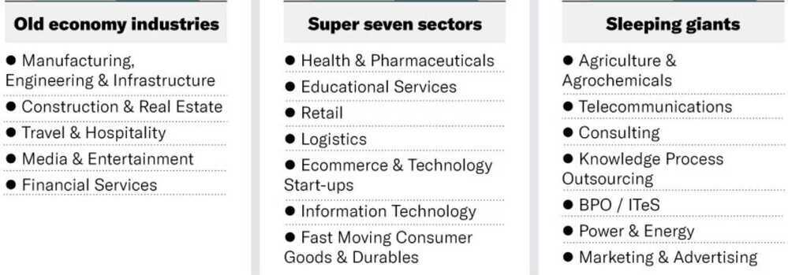
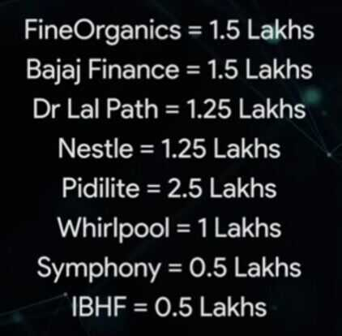

# Stocks / Equity

The stock market is a device for transferring money from the impatient to the patient - Warren Buffet

https://marcellus.in/newsletter/consistent-compounders/studying-the-holiday-schedule-of-consistent-compounders

Selling stock is as important as buying stock

Don't sell the stocks which gives you high returns, sell the negative or no returns stock

Equity risk premium

Stocks are forward looking

### Taxes on ETF / Equity Mutual Funds

Long-term capital gains from the transfer of equity shares (listed and non-listed) or from stake sales in a startup can be avoided under section 54F of the Income Tax Act, 1961, if the gains are invested in residential property.

You can claim exemption against any long-term capital gains tax liability if you invest the net sale proceeds of such capital asset for buying a residential house within two years or get a residential house constructed within three years from the date of sale of such asset. One can claim this exemption even if you have already purchased a house within one year prior to sale of long-term capital gains asset.

## Screener

- https://www.screener.in/explore
- https://www.screener.in/screens/103296/52-week-lows
- https://www.screener.in/screens/343087/fii-buying
- https://www.tickertape.in/screener/equity/prebuilt/SCR0001
- https://www.screener.in/screens/218753/marcellus-little-champs
- https://www.screener.in/screens/395078/consistent-compounders-marcellus
- https://www.screener.in/screens/523311/rising-giants-marcellus

## NiftyETF

## Company / Companies

- Adani Energy
- HINDUNILVR
- ASIANPAINT
- PIDILITIND
- TCS
- HDFCBANK
- INFY
- COLPAL
- ITC
- MARICO
- HINDPETRO
- IOC
- COALINDIA
- VEDL
- GODREJCP
- WIPRO
- DABUR

## Freefincal direct equity list

- Happiest Minds
- Dixon
- V-Guard / Havells

### [3 Electric vehicle stocks for Long term investments | 3 Best EV Stocks in India | - YouTube](https://www.youtube.com/watch?v=bEHjawBxChI)

- Mahindra and Mahindra
- Exide
- Tata motors
- Powergrid
- Olectra - electric buses

## Marcellus

1. Private sector banks

2. Asian Paints and Berger Paints (the most efficient paint manufacturers), Astral Poly (the most efficient CPVC pipe manufacturer), Pidilite (the most efficient adhesives and waterproofing manufacturer) and Titan (the most efficient jeweler).

- HDFC Bank
- Dr Lal PathLabs
- GMM Pfaudler
- Amrutanjan

https://marcellus.in/blogs/three-distinct-layers-of-polarization-in-the-indian-stock-market

## 10 Fav stocks of mutual funds beyond Nifty50

- Bharat Electronics - Rs. 36,877 cr
- HAL - Rs. 20,961 cr
- PFC - Rs. 20,901 cr
- Zomato - Rs. 19,932 cr
- Avenue Supermarkets - Rs. 19,527 cr
- Interglobe Aviation - Rs. 19,329 cr
- Cummings India - Rs. 17,686 cr
- SBI Life - Rs. 17,645 cr
- TVS Motor - Rs. 17,527 cr
- Motherson - Rs. 15,427 cr

## Top retail investors

1. Rakesh Jhunjhunwala and Associates
2. Premji and Associates
3. Radhakishan Damani
4. Mukul Agrawal
5. Mukul Mahavir Prasad Agarwal
6. Rajeev Thakkar - PPFAS - PPFCF

https://www.moneycontrol.com/india-investors-portfolio

## Robo Advisor / ETMoney Genius

[ET Genius - A marketing gimmic or actually Genius? : r/IndiaInvestments](https://www.reddit.com/r/IndiaInvestments/comments/sf9erc/comment/ity5lt4/?context=3)

## Links

- [Contrarian Investing | Is Contrarian Investing Profitable? | ET Money](https://youtu.be/vnQRuNuJckE)
- [8 Contrarian Investing Strategies | 31% Return from "Portfolio of Losers" | Contra Mutual Funds - YouTube](https://www.youtube.com/watch?v=EtuJa-TnSc4)
- [Stock Market Investing Strategies - YouTube](https://www.youtube.com/playlist?list=PLJND7T5G_LHDgNeP6OgIrwlOC0h0LNAH6)
- [How should Traders & Investors, trade or invest in a Bear Market? - YouTube](https://www.youtube.com/watch?v=GIIs2Pp_COY)
- [Finshots is a stock-picking genius. But…](https://finshots.in/markets/finshots-is-a-stock-picking-genius-but/)
- [Why portfolio rebalancing is important for investment success](https://freefincal.com/why-portfolio-rebalancing-is-important-for-investment-success/)
- [My Stock Portfolio Analysis: Mar 2024](https://freefincal.com/my-stock-portfolio-analysis-mar-2024/)
- [SIP Top-Up: The Mindboggling math of SIP top up](https://www.hdfcfund.com/knowledge-stack/mf-vault/weekend-bytes/sip-top-mindboggling-math-sip-top)
- [SWP: A smarter way to manage periodic expenses](https://www.hdfcfund.com/knowledge-stack/mf-vault/weekend-bytes/swp-smarter-way-manage-periodic-expenses)
- [Want to time the market? Here is how you can do it right! - YouTube](https://www.youtube.com/watch?v=m9nT_Ik4nOM&ab_channel=freefincal-PrudentDIYInvesting)
