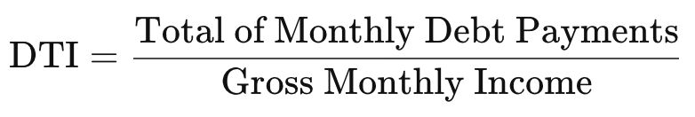

# Finance Terms

## Asset Classes

1. Fixed income instruments
    - Fixed deposits offered by banks
    - Bonds issued by the Government of India
    - Bonds issued by Government related agencies such as HUDCO, NHAI, etc
    - Bonds issued by corporate's

2. Equity
3. Real estate
4. Commodities (precious metals)

## Chartered Financial Analyst (CFA)

The Chartered Financial Analyst (CFA) program is a [postgraduate](https://en.wikipedia.org/wiki/Postgraduate_education)[professional certification](https://en.wikipedia.org/wiki/Professional_certification) offered internationally by the American-based [CFA Institute](https://en.wikipedia.org/wiki/CFA_Institute)(formerly the Association for Investment Management and Research, or AIMR) to investment and financial professionals.

It has the academic standing of a [masters degree](https://en.wikipedia.org/wiki/Master%27s_degree) in the [European Union](https://en.wikipedia.org/wiki/European_Union) and [United Kingdom](https://en.wikipedia.org/wiki/United_Kingdom)(Level 7 by [NARIC](https://en.wikipedia.org/wiki/National_Academic_Recognition_Information_Centre)), with level 2 being equivalent to a [bachelors degree](https://en.wikipedia.org/wiki/Bachelor%27s_degree)(Level 6 [NARIC](https://en.wikipedia.org/wiki/National_Academic_Recognition_Information_Centre)).The charter has highest level of global legal, regulatory, and academic recognition of finance-related qualifications, exempting CFA charterholders from various industry regulatory and/or academic requirements depending on the country (see [CFA Regulatory Recognition](https://en.wikipedia.org/wiki/Chartered_Financial_Analyst#Global_Regulatory_and_Legal_Recognition)).

The program teaches a wide range of subjects relating to [advanced investment analysis](https://en.wikipedia.org/wiki/Investment_management), including [security analysis](https://en.wikipedia.org/wiki/Security_analysis), [statistics](https://en.wikipedia.org/wiki/Statistics), [probability theory](https://en.wikipedia.org/wiki/Probability_theory), [fixed income](https://en.wikipedia.org/wiki/Bond_(finance)), [derivatives](https://en.wikipedia.org/wiki/Derivative_(finance)), [economics](https://en.wikipedia.org/wiki/Economics), [financial analysis](https://en.wikipedia.org/wiki/Financial_analysis), [corporate finance](https://en.wikipedia.org/wiki/Corporate_finance), [alternative investments](https://en.wikipedia.org/wiki/Alternative_investment), [portfolio management](https://en.wikipedia.org/wiki/Investment_management), and provides a generalist knowledge of [other areas of finance](https://en.wikipedia.org/wiki/List_of_finance_topics). A candidate who successfully completes the program and meets other professional requirements is awarded the "CFA charter" and becomes a "CFA charterholder". As of April 2021, at least 170,000 people are charterholders globally, growing 7% annually since 2012.Successful candidates take an average of four years to earn their CFA charter.

https://en.wikipedia.org/wiki/Chartered_Financial_Analyst

## Accrual

Accrual (accumulation) of something is, in [finance](https://en.wikipedia.org/wiki/Finance), the adding together of [interest](https://en.wikipedia.org/wiki/Interest) or different [investments](https://en.wikipedia.org/wiki/Investments) over a period of time. It holds specific meanings in [accounting](https://en.wikipedia.org/wiki/Accounting), where it can refer to accounts on a [balance sheet](https://en.wikipedia.org/wiki/Balance_sheet) that represent liabilities and non-cash-based assets used in [accrual-based accounting](https://en.wikipedia.org/wiki/Basis_of_accounting#Accrual_basis). These types of accounts include, among others, [accounts payable](https://en.wikipedia.org/wiki/Accounts_payable), [accounts receivable](https://en.wikipedia.org/wiki/Accounts_receivable), [goodwill](https://en.wikipedia.org/wiki/Goodwill_(accounting)), [deferred tax](https://en.wikipedia.org/wiki/Deferred_tax)[liability](https://en.wikipedia.org/wiki/Liability_(accounting)) and future interest expense

- **Accrued revenue:** revenue is recognized before cash is received.
- **Accrued expense:** expense is recognized before cash is paid out.

## TAM (Total Addressable or Accessible Market)

## Amortization

- the action or process of gradually writing off the initial cost of an asset.

    Ex - due to the amortization of initial costs, the risks of negative working capital are mitigated

- the action or process of reducing or paying off a debt with regular payments

    Ex - because of amortization, you'll own your home by the end of the loan term

- a period in which a debt is reduced or paid off by regular payments

    75% of the mortgages have an amortization of 25 years or less

## Debt Burden Ratio (DBR) / Debt to Income Ratio (DTI)

The debt-to-income (DTI) ratio is a personal finance measure that compares an individual's monthly debt payment to his or her monthly [gross income](https://www.investopedia.com/terms/g/grossincome.asp). Your gross income is your pay before taxes and other deductions are taken out. The debt-to-income ratio is the percentage of your gross monthly income that goes to paying your monthly debt payments.

- The debt-to-income (DTI) ratio measures the amount of income a person or organization generates in order to service a debt.
- A DTI of 43% is typically the highest ratio a borrower can have and still get qualified for a mortgage, but lenders generally seek ratios of no more than 36%.
- A low DTI ratio indicates sufficient income relative to debt servicing, and makes a borrower more attractive.

https://www.investopedia.com/terms/d/dti.asp

## Rolling Returns

Rolling returns, also known as "rollingperiodreturns" or "rollingtime periods," are annualized averagereturnsfor a period, ending with the listed year.Rolling returnsare useful for examining the behavior ofreturnsfor holding periods, similar to those actually experienced by investors.

Looking at a portfolio or fund's rolling returns will give performance results that are smoothed over several periods throughout its history. Such information often paints a more accurate picture for an investor than a single snapshot of one period.

- Rolling returns are annualized average returns for a period, ending with the listed year.
- Rolling returns are useful for examining the behavior of returns for holding periods, similar to those actually experienced by investors.
- These can also be used to smooth past performance to account for several periods instead of a single instance.
- Trailing twelve months is one commonly used rolling return measure.

https://www.investopedia.com/terms/r/rollingreturns.asp

Variable cost positive

~~Fixed cost positive~~

Contribution-margin-positive

Free cash flow positive

## PAT - Profit After Tax

## PBT - Profit Before Tax

## ARR - Annual Recurring Revenue

ARR is a subscription-based company's yearly revenue from a subscription

## NIM - Net Interest Margin

Net interest margin or NIM denotes the difference between the interest income earned and the interest paid by a bank or financial institution relative to its interest-earning assets like cash. Thanks to its frequent usage, it's become a part of the banking and financial lexicon.

Net interest margin = (Investment returns -- interest expenses) / average earning on assets

https://economictimes.indiatimes.com/definition/NIM

https://www.investopedia.com/terms/n/netinterestmargin.asp

## ROCE (Return on Capital Employed)

- Return on capital employed (ROCE) is a financial ratio that measures a company's profitability in terms of all of its capital.
- Return on capital employed is similar to return on invested capital (ROIC).
- Many companies may calculate the following key return ratios in their performance analysis: return on equity (ROE), return on assets (ROA), return on invested capital (ROIC), and return on capital employed.

https://www.investopedia.com/terms/r/roce.asp

## EMI - Equated Monthly Installments

## Money Markets

The moneymarket is a market section where 'cash' is borrowed for a short time -- 1 day to a few months. In most economies, the money market securities are considered 'equivalent' to cash.Investopedia has this definition:"The money market is part of the fixed-income market that specializes in short-term debt securities that mature in less than one year. Most money market investments often mature in three months or less. Because of their quick maturity dates, these are considered cash investments. Money market securities are issued by governments, financial institutions, and large corporations as promises to repay debts. They are considered extremely safe and conservative, especially during volatile times"

CBLO - Collaterized Borrowing and Lending Obligations

BFSI - Banking, Financial Services and Insurance

## Corporate Earnings Announcement

This is perhaps one of the important events to which the stocks react. The listed companies (trading on stock exchange) are required to declare their earning numbers once in every quarter, also called the quarterly earnings numbers. During an earnings announcement, the corporate gives out details on various operational activities including:

- How much revenue the company has generated?
- How has the company managed its expense?
- How much money the company paid in terms of taxes and interest charges?
- What is the profitability during the quarter?

## AUM

In [finance](https://en.wikipedia.org/wiki/Finance), assets under management(AUM), sometimes calledfunds under management(FUM), measures the total [market value](https://en.wikipedia.org/wiki/Market_value) of all the [financial assets](https://en.wikipedia.org/wiki/Financial_asset) which a [financial institution](https://en.wikipedia.org/wiki/Financial_institution) such as a [mutual fund](https://en.wikipedia.org/wiki/Mutual_fund), [venture capital firm](https://en.wikipedia.org/wiki/Venture_capital_firm), or [broker](https://en.wikipedia.org/wiki/Broker) manages on behalf of its clients and themselves.

https://en.wikipedia.org/wiki/Assets_under_management

## CAS (Consolidated Account Statement)

## Dollar Cost Averaging (DCA) / Rupee Cost Averaging / SIP

Dollar-cost averaging (DCA) is an investment strategy in which an investor divides up the total amount to be invested across periodic purchases of a target asset in an effort to reduce the impact of volatility on the overall purchase. The purchases occur regardless of the asset's price and at regular intervals.

- Dollar-cost averaging refers to the practice of systematically investing equal amounts, spaced out over regular intervals, regardless of price.
- The goal of dollar-cost averaging is to reduce the overall impact of volatility on the price of the target asset; as the price will likely vary each time one of the periodic investments is made, the investment is not as highly subject to volatility.
- Dollar-cost averaging aims to avoid making the mistake of making one lump-sum investment that is poorly timed with regard to asset pricing.

## Fixed vs Floating Interest Rate

- A floating exchange rate is determined by the private market through supply and demand.
- A fixed, or pegged, rate is a rate the government (central bank) sets and maintains as the official exchange rate.
- The reasons to peg a currency are linked to stability. Especially in today's developing nations, a country may decide to peg its currency to create a stable atmosphere for foreign investment.

[Floating Rate vs. Fixed Rate: What's the Difference?](https://www.investopedia.com/trading/floating-rate-vs-fixed-rate/)

## Others

- Non-Intitutional Buyers (NII)
- Qualified Institutional Buyers (QIB)
- Foreign Institutional Buyers (FII)
- Grey Market Premium (GMP)
- Non-oil, non-gold imports / exports (NONG imports / exports)
- ACORD Data Standards -  [ACORD - Wikipedia](https://en.wikipedia.org/wiki/ACORD)
- Disposition - the natural qualities of a person’s character, a usual way of behaving
- subordination agreement - A subordination agreement is a legal document that establishes the priority of debts owed to a borrower. It's also known as a priority agreement.

## Questions

https://www.toptal.com/finance/finance-managers/interview-questions

https://www.toptal.com/finance/financial-controllers/interview-questions

https://www.toptal.com/finance/finance-directors/interview-questions

[Glossary of Financial Management Terms | Springer Publishing](https://connect.springerpub.com/content/book/978-0-8261-6199-4/back-matter/bmatter2)

[Financial Ratios](https://www.investopedia.com/financial-ratios-4689817)
