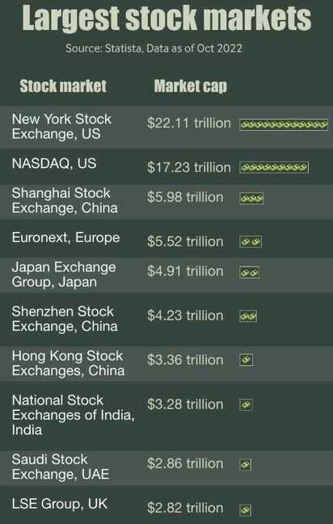

# Facts

- Real state capitalization, economy - 340 trillion dollar
- Global Equity market - 80 trillion dollar
- Global debt and bond market - 250 trillion dollar
- Global gold - 7 trillion dollar

## Global Wealth

- Total Global Wealth - $463.6 trillion
- Owned by billionaires - ~$13 trillion (2755 billionaires)
- Top 0.01% individuals - ~$51 trillion (11% of total wealth)
- Total circulation - Physical money and money in bank accounts (savings + current): $40 trillion
- Broad money: $90 trillion (all the money circulating in the economy including physical money)
- Crypto market cap: $852.45 billion

### Growth

- USA: $25T. India: $3.5T. India grows at 7% while USA grows at 2%. At these growth rates, ~ India adds $250B every year (7% x $3.5T) ~USA adds $500B every year (2% x $25T). USA adds 2x of India. India is doing incredibly well.
- USA adds 2x of India in GDP despite lower growth rates. The media says India is the fastest growing economy, which is true. Mathematics and data reveal the reality that even with fast growth, it will take a long time for India to catch up with USA and China. While our progress is impressive, surpassing these economic giants is a distant goal.

## Gold

- Market cap: $11.7 trillion
- Above Ground Reservers: 205,238 tonnes (data as of end 2021)
- Gold demand by purpose (2022)
    - Jewellery fabrication - 2230 tonnes
    - Technology - 330.2 tonnes
    - Investment - 1005.8 tonnes
    - Central banks and other financial institutions - 453.8 tonnes

### Gold Reserves

#### Top 10 Countries With the Most Gold Reserves

1. United States: 8,133 metric tons ($480.84 billion)
2. Germany: 3,355 metric tons ($198.35 billion)
3. Italy: 2,452 metric tons ($144.97 billion)
4. France: 2,437 metric tons ($144.08 billion)
5. Russia: 2,299 metric tons ($135.92 billion)
6. China: 1,948 metric tons ($115.17 billion)
7. Switzerland: 1,040 metric tons ($61.49 billion)
8. Japan: 846 metric tons ($50.02 billion)
9. India: 785 metric tons ($46.41 billion)
10. Netherlands: 612 metric tons ($36.18 billion)

[Which World Countries Have the Most Gold?](https://www.madisontrust.com/information-center/which-world-countries-have-the-most-gold/)

[What Countries Have the Largest Gold Reserves?](https://www.investopedia.com/ask/answers/040715/what-countries-have-largest-gold-reserves.asp)

## Continent wise household wealth

- North America - $158.1 trillion
- Europe - $106.3 trillion
- Asia - $180.6 trillion
- Latin America - $12.5 trillion
- Africa - $5.8 trillion

## Largest sovereign wealth funds

