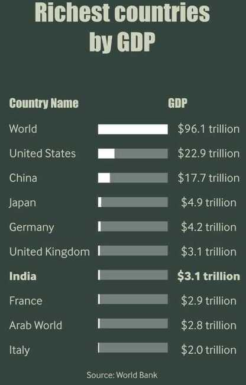

# Gross Domestic Product (GDP)

A monetary measure of the market value of all final goods and services produced in a period (quarterly or yearly).

## Determining gross domestic product (GDP)

GDP can be determined in three ways, all of which should, theoretically, give the same result. They are the production (or output or value added) approach, the income approach, and the speculated expenditure approach. It is representative of the total output and income within an economy.

The most direct of the three is the production approach, which sums the outputs of every class of enterprise to arrive at the total. The expenditure approach works on the principle that all of the product must be bought by somebody, therefore the value of the total product must be equal to people's total expenditures in buying things. The income approach works on the principle that the incomes of the productive factors ("producers", colloquially) must be equal to the value of their product, and determines GDP by finding the sum of all producers' incomes.

## Production approach

Also known as the Value Added Approach, it calculates how much value is contributed at each stage of production.

This approach mirrors the [OECD](https://en.wikipedia.org/wiki/OECD "OECD") (Organisation for Economic Co-operation and Development) definition given above.

1. Estimate the gross value of domestic output out of the many various economic activities;
2. Determine the [intermediate consumption](https://en.wikipedia.org/wiki/Intermediate_consumption "Intermediate consumption"), i.e., the cost of material, supplies and services used to produce final goods or services.
3. Deduct intermediate consumption from gross value to obtain the gross value added.

[Gross value added](https://en.wikipedia.org/wiki/Gross_value_added "Gross value added") = gross value of output - value of intermediate consumption.

Value of output = value of the total sales of goods and services plus value of changes in the inventory.

The sum of the gross value added in the various economic activities is known as "GDP at factor cost".

GDP at factor cost plus indirect taxes less subsidies on products = "GDP at producer price".

For measuring output of domestic product, economic activities (i.e. industries) are classified into various sectors. After classifying economic activities, the output of each sector is calculated by any of the following two methods:

1. By multiplying the output of each sector by their respective market price and adding them together
2. By collecting data on gross sales and inventories from the records of companies and adding them together

The value of output of all sectors is then added to get the gross value of output at factor cost. Subtracting each sector's intermediate consumption from gross output value gives the GVA (=GDP) at factor cost. Adding indirect tax minus subsidies to GVA (GDP) at factor cost gives the "GVA (GDP) at producer prices".

## Income approach

The second way of estimating GDP is to use "the sum of primary incomes distributed by resident producer units".

If GDP is calculated this way it is sometimes called gross domestic income (GDI), or GDP (I). GDI should provide the same amount as the expenditure method described later. By definition, GDI is equal to GDP. In practice, however, measurement errors will make the two figures slightly off when reported by national statistical agencies.

This method measures GDP by adding incomes that firms pay households for factors of production they hire - wages for labour, interest for capital, rent for land and profits for entrepreneurship.

The US "National Income and Expenditure Accounts" divide incomes into five categories:

1. Wages, salaries, and supplementary labour income
2. Corporate profits
3. Interest and miscellaneous investment income
4. Farmers' incomes
5. Income from non-farm unincorporated businesses

These five income components sum to net domestic income at factor cost.

Two adjustments must be made to get GDP:

1. Indirect taxes minus subsidies are added to get from factor cost to market prices.
2. Depreciation (or [capital consumption allowance](https://en.wikipedia.org/wiki/Capital_consumption_allowance "Capital consumption allowance")) is added to get from net domestic product to gross domestic product.

Total income can be subdivided according to various schemes, leading to various formulae for GDP measured by the income approach. A common one is:

**GDP** = **COE** + **GOS** + **GMI** + taxes less subsidies on production and imports **TP & M** - **SP & M**

- **Compensation of employees** (COE) measures the total remuneration to employees for work done. It includes wages and salaries, as well as employer contributions to [social security](https://en.wikipedia.org/wiki/Social_security "Social security") and other such programs.
- **Gross operating surplus** (GOS) is the surplus due to owners of incorporated businesses. Often called [profits](https://en.wikipedia.org/wiki/Profit_(accounting) "Profit (accounting)"), although only a subset of total costs are subtracted from [gross output](https://en.wikipedia.org/wiki/Gross_output "Gross output") to calculate GOS.
- **Gross mixed income** (GMI) is the same measure as GOS, but for unincorporated businesses. This often includes most small businesses.

The sum of **COE**, **GOS** and **GMI** is called total factor income; it is the income of all of the factors of production in society. It measures the value of GDP at factor (basic) prices. The difference between basic prices and final prices (those used in the expenditure calculation) is the total taxes and subsidies that the government has levied or paid on that production. So adding taxes less subsidies on production and imports converts GDP(I) at [factor cost](https://en.wikipedia.org/wiki/Factor_cost "Factor cost") to GDP(I) at final prices.

Total factor income is also sometimes expressed as:

_Total factor income_ = _employee compensation_ + _corporate profits_ + _proprietor's income_ + _rental income_ + _net interest_

## Expenditure approach

The third way to estimate GDP is to calculate the sum of the final uses of goods and services (all uses except intermediate consumption) measured in purchasers' prices.

Market goods that are produced are purchased by someone. In the case where a good is produced and unsold, the standard accounting convention is that the producer has bought the good from themselves. Therefore, measuring the total expenditure used to buy things is a way of measuring production. This is known as the expenditure method of calculating GDP.

#### Components of GDP by expenditure

**GDP (Y)** is the sum of **consumption (C)**, **investment (I)**, **government Expenditures (G)** and **net exports (X - M)**.

**Y** = **C** + **I** + **G** + **(X − M)**

Here is a description of each GDP component:

- **C (consumption)** is normally the largest GDP component in the economy, consisting of private expenditures in the economy ([household final consumption expenditure](https://en.wikipedia.org/wiki/Household_final_consumption_expenditure "Household final consumption expenditure")). These personal expenditures fall under one of the following categories: [durable goods](https://en.wikipedia.org/wiki/Durable_good "Durable good"), nondurable goods, and services. Examples include food, rent, jewelry, gasoline, and medical expenses, but not the purchase of new housing.
- **I (investment)** includes, for instance, business investment in equipment, but does not include exchanges of existing assets. Examples include construction of a new [mine](https://en.wikipedia.org/wiki/Mining "Mining"), purchase of software, or purchase of machinery and equipment for a factory. Spending by households (not government) on new houses is also included in investment. In contrast to its colloquial meaning, "investment" in GDP does not mean purchases of [financial products](https://en.wikipedia.org/wiki/Financial_market "Financial market"). Buying [financial products](https://en.wikipedia.org/wiki/Financial_services "Financial services") is classed as '[saving](https://en.wikipedia.org/wiki/Saving "Saving")', as opposed to investment. This avoids double-counting: if one buys shares in a company, and the company uses the money received to buy plant, equipment, etc., the amount will be counted toward GDP when the company spends the money on those things; to also count it when one gives it to the company would be to count two times an amount that only corresponds to one group of products. Buying [bonds](https://en.wikipedia.org/wiki/Bond_(finance) "Bond (finance)") or companies' [equity shares](https://en.wikipedia.org/wiki/Share_capital "Share capital") is a swapping of [deeds](https://en.wikipedia.org/wiki/Deed "Deed"), a transfer of claims on future production, not directly an expenditure on products; buying an existing building will involve a positive investment by the buyer and a negative investment by the seller, netting to zero overall investment.
- **G (government spending)** is the sum of [government expenditures](https://en.wikipedia.org/wiki/Government_spending "Government spending") on [final goods](https://en.wikipedia.org/wiki/Final_good "Final good") and services. It includes salaries of [public servants](https://en.wikipedia.org/wiki/Public_servants "Public servants"), purchases of weapons for the military and any investment expenditure by a government. It does not include any [transfer payments](https://en.wikipedia.org/wiki/Transfer_payment "Transfer payment"), such as [social security](https://en.wikipedia.org/wiki/Social_security "Social security") or [unemployment benefits](https://en.wikipedia.org/wiki/Unemployment_benefits "Unemployment benefits"). Analyses outside the USA will often treat government investment as part of _investment_ rather than _government spending_.
- **X (exports)** represents gross exports. GDP captures the amount a country produces, including goods and services produced for other nations' consumption, therefore exports are added.
- **M (imports)** represents gross imports. Imports are subtracted since imported goods will be included in the terms **G**, **I**, or **C**, and must be deducted to avoid counting foreign [supply](https://en.wikipedia.org/wiki/Supply_and_demand "Supply and demand") as domestic.

Note that **C**, **I**, and **G** are expenditures on [final goods](https://en.wikipedia.org/wiki/Final_good "Final good") and services; expenditures on intermediate goods and services do not count. (Intermediate goods and services are those used by businesses to produce other goods and services within the accounting year.) So for example if a [car manufacturer](https://en.wikipedia.org/wiki/Car_manufacturer "Car manufacturer") buys [auto parts](https://en.wikipedia.org/wiki/Auto_parts "Auto parts"), assembles the car and sells it, only the final car sold is counted towards the GDP. Meanwhile, if a person buys replacement auto parts to install them on their car, those are counted towards the GDP.

According to the U.S. Bureau of Economic Analysis, which is responsible for calculating the national accounts in the United States, "In general, the source data for the expenditures components are considered more reliable than those for the income components"

## Types of GDP?

GPD can be measured in several different ways.  The most common methods include:

- **Nominal GDP -** the total value of all goods and services produced at current market prices. This includes all the changes in market prices during the current year due to inflation or deflation.
- **Real GDP -** the sum of all goods and services produced at constant prices. The prices used in determining the Gross Domestic Product are based on a certain base year or the previous year. This provides a more accurate account of economic growth, as it is already an inflation-adjusted measurement, meaning the effects of inflation are taken out.
- **Actual GDP -** real-time measurement of all outputs at any interval or any given time. It demonstrates the existing state of business of the economy.
- **Potential GDP -** ideal economic condition with 100% employment across all sectors, steady currency, and stable product prices.

## Facts

- US GDP - 21 lakh crore USD (21 trillion)
- China GDP - 14.7 lakh crore USD (14.7 trillion)
- India GDP - 2.6 lakh crore USD (2.6 trillion)

## Links

[Gross domestic product - Wikipedia](https://en.wikipedia.org/wiki/Gross_domestic_product)

[What is GDP? | CA Rachana Ranade](https://www.youtube.com/watch?v=d9mQ3P6DimI)
