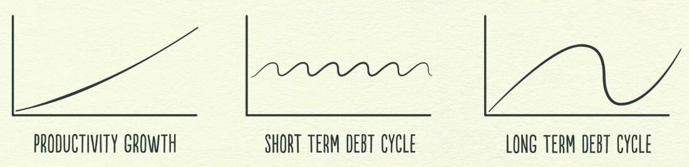
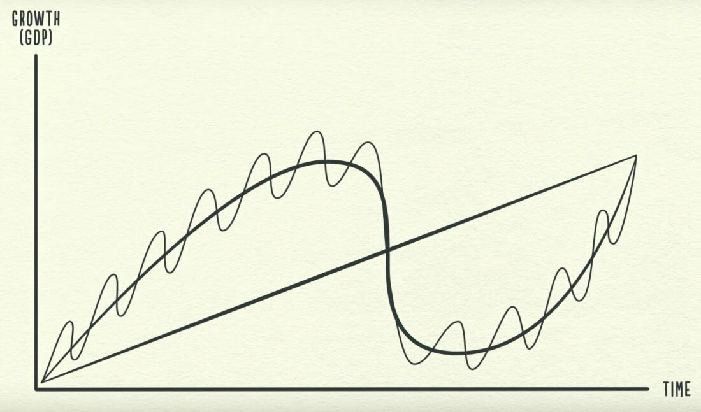

# Intro

[**https://en.wikipedia.org/wiki/Outline_of_economics**](https://en.wikipedia.org/wiki/Outline_of_economics)

Crash Course - [Economics](https://www.youtube.com/playlist?list=PL8dPuuaLjXtPNZwz5_o_5uirJ8gQXnhEO)

## How the economic machine works

1. Transactions

    Exchanging money or credit for goods, services or financial assets

2. Market
3. Government

   - Central government (collect taxes and spend money)
   - Central bank (control the amount of credit and money in the economy)
       - Influencing interest rates
       - Printing new money

4. Credit is the most important part of economy (biggest and most volatile)

   - Lenders
   - Borrowers
       - Creditworthy borrower
            1. The ability of repay
            2. Collateral if he can't

5. One person's spending is another's person income

6. Credit is bad if it increases overspending on luxury items, it is good if it is used to increase productivity.

7. Debt swings

   - **Short term debt cycle: 5-8 years**

    Average business cycle -- the time between **recessions** -- is about **eight** years.

   - **Long term debt cycle: 75-100 years**

      - Long term debt peak
      - Deleveraging

    Less spending -> Less income -> Less wealth -> Less credit -> Less borrowing

    Solving deleveraging

      - Cut spending (Austerity)
      - Reduce debt (Debt restructuring)
          - Central government deficit (budget deficit)
      - Redistribute wealth (from the haves to the have nots)
      - Print money (Inflationary and stimulative)
          - Central bank prints money to buy financial assets and government bonds
      - Beautiful deleveraging

8. Asset
9. Liability
10. Inflation
    - Packaged Inflation / Shrinkflation / Shadow Inflation
    - Stagflation

    <https://finshots.in/archive/secret-inflation>

    Why Constant Inflation is Bad

    If people start thinking that the price rise could persist indefinitely, then, they'll panic. They'll ask for a pay rise. Landlords will start raising rent indiscriminately. Businesses will bump up the final price of everyday items like milk and bread.

    Ergo, that expectation and consequent behaviour alone could trigger further inflation.

    It's a vicious cycle.

11. Deflation
12. Recession
13. Expansion
14. Debt burden

    - High debt burden
    - Low debt burden

15. Depression
16. Reflation
17. Lost decade

Book - <https://www.principles.com/big-debt-crises> Free pdf

## Economic machine of a country

- Capital - all the stuff that a business might use, including intangibles like ideas
- Labor - people's work
- Natural resources

## Finance activites

- PFR - Project Finance Report
- Cost model
- WCM - Working Capital Management
  - Capex planning requirement
  - Dealing with recieables and payable
- Treasury management
- Corporate action planning
- Investor relation

## Others

<https://finshots.in/archive/finshots-special-how-to-be-a-rational-investor>
