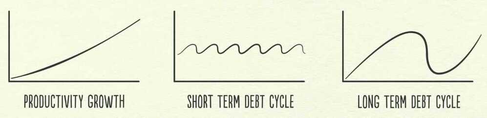
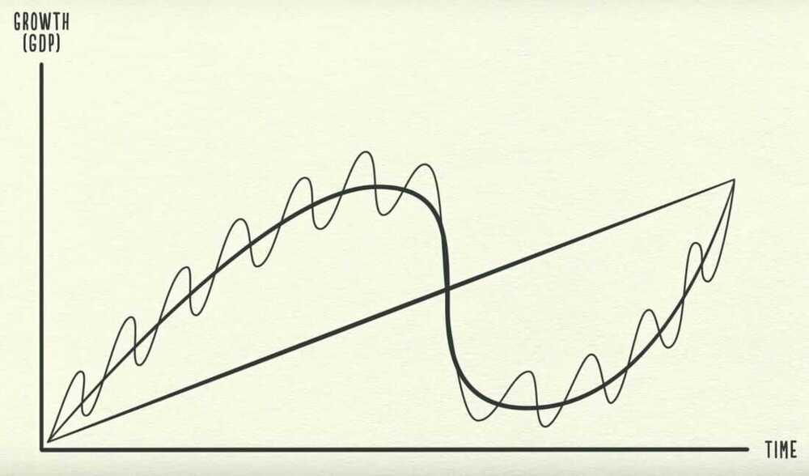

# Intro

[**https://en.wikipedia.org/wiki/Outline_of_economics**](https://en.wikipedia.org/wiki/Outline_of_economics)

Crash Course - [Economics](https://www.youtube.com/playlist?list=PL8dPuuaLjXtPNZwz5_o_5uirJ8gQXnhEO)

WEF - You will own nothing and be happy about it

Any changes made to the economy changes atleast 3 more things

Yes, the planet got destroyed, but for a beautiful moment in time we created a lot of value for shareholders.

## How the economic machine works

### 1. Transactions

Exchanging money or credit for goods, services or financial assets

### 2. Market

### 3. Government

- Central government (collect taxes and spend money)
- Central bank (control the amount of credit and money in the economy)
    - Influencing interest rates
    - Printing new money

### 4. Credit is the most important part of economy (biggest and most volatile)

- Lenders
- Borrowers
    - Creditworthy borrower
  1. The ability of repay
  2. Collateral if he can't

### 5. One person's spending is another's person income

### 6. Credit is bad if it increases overspending on luxury items, it is good if it is used to increase productivity

### 7. Debt swings

#### Short term debt cycle: 5-8 years

Average business cycle -- the time between **recessions** -- is about **eight** years.

#### - Long term debt cycle: 75-100 years

- Long term debt peak
- Deleveraging

Less spending -> Less income -> Less wealth -> Less credit -> Less borrowing

Solving deleveraging

- Cut spending (Austerity)
- Reduce debt (Debt restructuring)
    - Central government deficit (budget deficit)
- Redistribute wealth (from the haves to the have nots)
- Print money (Inflationary and stimulative)
    - Central bank prints money to buy financial assets and government bonds
- Beautiful deleveraging

### 8. Asset

### 9. Liability

### 10. Inflation

- Packaged Inflation / Shrinkflation / Shadow Inflation
- Stagflation

https://finshots.in/archive/secret-inflation

Why Constant Inflation is Bad

If people start thinking that the price rise could persist indefinitely, then, they'll panic. They'll ask for a pay rise. Landlords will start raising rent indiscriminately. Businesses will bump up the final price of everyday items like milk and bread.

Ergo, that expectation and consequent behaviour alone could trigger further inflation.

It's a vicious cycle.

### 11. Deflation

### 12. Recession

### 13. Expansion

### 14. Debt burden

- High debt burden
- Low debt burden

### 15. Depression

### 16. Reflation

### 17. Lost decade

Book - https://www.principles.com/big-debt-crises Free pdf

[Money’s Mostly Digital, So Why Is Moving It So Hard? - YouTube](https://www.youtube.com/watch?v=8xzINLykprA&ab_channel=WendoverProductions)

[Who Controls All of Our Money? - YouTube](https://www.youtube.com/watch?v=mQUhJTxK5mA&ab_channel=ColdFusion)

- Permit me to issue and control the money of a nation, and I care not who makes its laws. -- Mayer Amsheel Rothschild
- I was as secretive - indeed, as furtive - as any conspirator. Discovery, we knew, simply must not happen, or else all our time and effort would be wasted. If it were to be exposed that our particular group had got together and written a banking bill, that bill would have no chance whatever of passage by Congress. -- Frank A. Vanderlip
- It is well enough that people of the nation do not understand our banking and monetary system, for if they did, I belive that there would be a revolution before tomorrow morning -- Henry Ford

## Economic machine of a country

- Capital - all the stuff that a business might use, including intangibles like ideas
- Labor - people's work
- Natural resources

## Finance activites

- PFR - Project Finance Report
- Cost model
- WCM - Working Capital Management
    - Capex planning requirement
    - Dealing with recieables and payable
- Treasury management
- Corporate action planning
- Investor relation

## Others

https://finshots.in/archive/finshots-special-how-to-be-a-rational-investor

[William Ackman: Everything You Need to Know About Finance and Investing in Under an Hour | Big Think - YouTube](https://www.youtube.com/watch?v=WEDIj9JBTC8)

[Peter Lynch 1994 Lecture - YouTube](https://www.youtube.com/watch?v=72Pq5zKEi_g&ab_channel=GiraffeValue)

[The Cost of Cash | Mark Smalley | TEDxYouth@Kenyalang - YouTube](https://www.youtube.com/watch?v=66ctEX47I4E)
