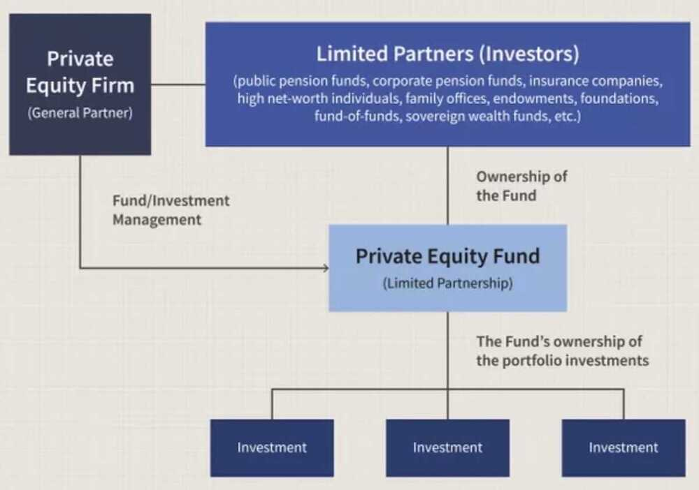

# Investment Banking

[Careers in finance - Investment Banking (Part 2) - YouTube](https://www.youtube.com/watch?v=3ivP6-y8tN8&ab_channel=ZerodhaVarsity)

[Careers in finance - Public and private markets (Part 3) - YouTube](https://www.youtube.com/watch?v=PjQSs621oII&ab_channel=ZerodhaVarsity)

## Investment banking

Investment banking is a specific division of banking related to the creation of capital for other companies, governments, and other entities.

- Investment banking activities include underwriting new debt and equity securities for all types ofcorporations, aiding in the sale of securities, and helping to facilitatemergers and acquisitions, reorganizations, and broker trades for both institutions and private investors.
- Investment bankers help corporations, governments, and other groups plan and manage the financial aspects of large projects.

Companies - Goldman Sachs, Morgan Stanley, JPMorgan Chase, Bank of America Merrill Lynch, and Deutsche Bank

https://www.coursera.org/courses?query=investment%20banking

https://www.investopedia.com/terms/i/investment-banking.asp

## Private Equity

Private equity is an [alternative investment](https://www.investopedia.com/terms/a/alternative_investment.asp) class and consists of capital that is not listed on a public exchange. Private equity is composed of funds and investors that directly invest in [private companies](https://www.investopedia.com/terms/p/privatecompany.asp), or that engage in [buyouts](https://www.investopedia.com/terms/b/buyout.asp) of public companies, resulting in the [delisting](https://www.investopedia.com/terms/d/delisting.asp) of public equity. Institutional and retail investors provide the capital for private equity, and the capital can be utilizedto fundnew technology, make [acquisitions](https://www.investopedia.com/terms/a/acquisition.asp), expand working capital, and to bolster and solidify a balance sheet.

A private equity fundhas [Limited Partners](https://www.investopedia.com/terms/l/limited-partner.asp)(LP), who typically own 99 percent of shares in a fund and have [limited liability](https://www.investopedia.com/terms/l/limitedliability.asp), and [General Partners](https://www.investopedia.com/terms/g/generalpartner.asp)(GP), who own 1 percent of shares and have full liability. The latter are also responsible for executing and operating the investment.

- Private equity is an alternative form of private financing, away from public markets, in which funds and investors directly invest in companies or engage in buyouts of such companies.
- Private equity firms make money by charging management and performance fees from investors in a fund.
- Among the advantages of private equity are easy access to alternate forms of capital for entrepreneurs and company founders and less stress of quarterly performance. Those advantages are offset by the fact that private equity valuations are not set by market forces.
- Private equity can take on various forms, from complex leveraged buyouts to venture capital.
- Private equity firms raise money from institutional investors and accredited investors for funds that invest in different types of assets.

Multiple of Invested Capital ("MOIC") and Internal Rate of Return ("IRR") are two metrics that are used in private equity to calculate an investor's return on investment. However, that's where the similarities end.

## Startup Funds

- [Surge](https://www.surgeahead.com)
- Crowdfunding
- Indiegogo
- kickstarter
- Patreon
- https://www.gofundme.com/c/blog/top-crowdfunding-sites
- [100X.VC | Top Pre-Seed and Seed Stage VC Fund for Indian Startups](https://www.100x.vc/)

https://www.investopedia.com/articles/markets/011116/worlds-top-10-private-equity-firms-apo-bx.asp

- The Blackstone Group Inc.
- [BlackRock - YouTube](https://www.youtube.com/watch?v=qs_mWvf6yRI)
- Kohlberg, Kravis & Roberts (KKR)
- CVC Capital Partners
- The Carlyle Group Inc.
- Thoma Bravo
- EQT
- Vista Equity Partners
- TPG Capital
- Warburg Pincus LLC
- Neuberger Berman Group LLC
- https://www.strikerpartners.com - The Graham Group
- Chris Kolenaty - Founder of Snow Leopard Ventures / Snow Leopard Global Capital Management
- QED Investors / qedinvestors (Nigel Morris founder of capital one)

The main Private Equity firms operating in India

- [ICICI Venture Fund Management](https://www.iciciventure.com/)
- [Kotak Private Equity Group](https://alternateassets.kotak.com/kotak-private-equity-fund.php)
- [Chryscapital](http://www.chryscapital.com/)
- [Sequoia Capital](https://www.sequoiacap.com/india/)
- [India Value Fund](https://www.cdcgroup.com/en/our-impact/fund/india-value-fund-iv/)
- [Baring Private Equity Partners](http://www.bpepindia.com/)
- [Ascent Capital](https://docs.google.com/document/d/1IYRDuAZrmcHPn0P0oJmiasNG6fgWSRbCeIakMGX7ZT0/edit#heading=h.txeagdimnuwj)
- [Everstone Capital](https://www.everstonecapital.com/)
- [https://www.linkedin.com/in/rajeshgsf/](https://www.linkedin.com/in/rajeshgsf/)

Best Startup Accelerators 🚀

1. PearX ($250k-$2m)
2. Accel Atoms ($500k)
3. Antler ($200k for 8%)
4. Soma Capital ($100k)
5. Sequoia Arc (Variable)
6. a16z Speedrun ($750k)
7. LAUNCH ($125k for 7%)
8. OpenAI Converge ($1m)
9. Techstars ($20k for 6%)
10. Alchemist ($25k for 5%)
11. NEO ($600k Uncapped)
12. AngelPad ($120k for 7%)
13. The Mint ($500k for 10%)
14. AI2 Incubator ($50-$150k)
15. HF0 ($125k for 7% + $375k)
16. AI Grant ($250k Uncapped)
17. Betaworks AI Camp ($500k)
18. 500 Startups ($112.5k for 6%)
19. Entrepreneur First ($125k for 8%)
20. Y Combinator ($125k for 7% + $375k)
21. Conviction Embed ($150k Uncapped)
22. Founders Fellowship ($150k for 5-10%)
23. SPC Fellowship ($400k for 7% + $600k)

## Most popular types of private equity funding

- **Distressed funding:** Also known as vulture financing, money in this type of funding is invested in troubled companies with underperforming business units or assets. The intention is to turn them around by making necessary changes to their management or operations or make a sale of their assets for a profit. Assets in the latter case can range from physical machinery and real estate to intellectual property, such as patents. Companies that have filed under [Chapter 11 bankruptcy](https://www.investopedia.com/terms/c/chapter11.asp) in the United States are often candidates for this type of financing. There was an increase in distressed funding by private equity firms after the 2008 financial crisis

- **[Leveraged Buyouts](https://www.investopedia.com/terms/l/leveragedbuyout.asp):** This is the most popular form of private equity funding and involves buying out a company completely with the intention of improving its business and financial health and reselling it for a profit to an interested party or conducting an IPO. Up until 2004, sale of non-core business units of publicly listed companies comprised the largest category of leveraged buyouts for private equity.The leveraged buyout process works as follows. A private equity firm identifies a potential target and creates a [special purpose vehicle](https://www.investopedia.com/terms/s/spv.asp)(SPV) for funding the takeover. Typically, firms use a combination of debt and equity to finance the transaction. Debt financing may [account](https://www.investopedia.com/articles/active-trading/121015/understanding-accounting-private-equity-funds.asp) for as much as 90 percent of the overall funds and is transferred to the acquired company's balance sheet for tax benefits. Private equity firms employ a variety of strategies, from slashing employee count to replacing entire management teams, to turn around a company.

A leveraged buyout (LBO) is the acquisition of another company using a significant amount of borrowed money (bonds or loans) to meet the cost of acquisition. The assets of the company being acquired are often used as collateral for the loans, along with the assets of the acquiring company.

- A leveraged buyout occurs when the acquisition of another company is completed almost entirely with borrowed funds.
- Leveraged buyouts declined in popularity after the 2008 financial crisis, but they are once again on the rise.
- In a leveraged buyout (LBO), there is usually a ratio of 90% debt to 10% equity.
- LBOs have acquired a reputation as a ruthless and predatory business tactic, especially since the target company's assets can be used as leverage against it.

https://www.investopedia.com/terms/l/leveragedbuyout.asp

https://en.wikipedia.org/wiki/LBO_valuation_model

- **[Real Estate Private Equity](https://www.investopedia.com/terms/p/private-equity-real-estate.asp):** There was a surge in this type of funding after the 2008 financial crisis crashed real estate prices. Typical areas where funds are deployed are commercial real estate and real estate investment trusts ([REIT](https://www.investopedia.com/articles/03/013103.asp)). Real estate funds require higher minimum capital for investment as compared to other funding categories in private equity. Investor funds are also locked away for several years at a time in this type of funding. According to research firm Preqin, real estate funds in private equity are expected to clock in a 50 percent growth by 2023 to reach a market size of $1.2 trillion.

- **[Fund of funds](https://www.investopedia.com/terms/f/fundsoffunds.asp):** As the name denotes, this type of funding primarily focuses on investing in other funds, primarily mutual funds and hedge funds. They offer a backdoor entry to an investor who cannot afford minimum capital requirements in such funds. But critics of such funds point to their higher management fees (because they are rolled up from multiple funds) and the fact that unfettered diversification may not always result in an optimal strategy to multiply returns.
- **[Venture Capital](https://www.investopedia.com/terms/v/venturecapital.asp):** Venture capital funding is a form of private equity, in which investors (also known as angels) provide capital to entrepreneurs. Depending on the stage at which it is provided, [venture capital can take several forms](https://www.investopedia.com/ask/answers/020415/what-difference-between-private-equity-and-venture-capital.asp). Seed financing refers to the capital provided by an investor to scale an idea from a prototype to a product or service. On the other hand, early stage financing can help an entrepreneur grow a company further while a Series A financing enables them to actively compete in a market or create one.

https://www.investopedia.com/terms/p/privateequity.asp

## Venture Capital

Venture capital (VC) is a form of private equity and a type of financing that investors provide to [startup](https://www.investopedia.com/terms/s/startup.asp) companies and small businesses that are believed to have [long-term growth](https://www.investopedia.com/terms/l/longtermgrowth.asp) potential. Venture capital generally comes from well-off investors, investment banks, and any other financial institutions. However, it does not always take a monetary form; it can also be provided in the form of technical or managerial expertise. Venture capital is typically allocated to small companies with exceptional growth potential, or to companies that have grown quickly and appear poised to continue to expand.

Though it can be risky for investors who put up funds, the potential for above-average returns is an attractive payoff. For new companies or ventures that have a limited operating history (under two years), venture capital is increasingly becoming a popular - even essential - source for raising money, especially if they lack access to [capital markets](https://www.investopedia.com/terms/c/capitalmarkets.asp), bank loans, or other debt instruments. The main downside is that the investors usually get [equity](https://www.investopedia.com/terms/e/equity.asp) in the company, and, thus, a say in company decisions.

- Venture capital financing is funding provided to companies and entrepreneurs. It can be provided at different stages of their evolution, although it often involves early and seed round funding.
- Venture capital funds manage pooled investments in high-growth opportunities in startups and other early-stage firms and are typically only open to accredited investors.
- Venture capital has evolved from a niche activity at the end of the Second World War into a sophisticated industry with multiple players that play an important role in spurring innovation.

https://www.investopedia.com/terms/v/venturecapital.asp

[How I Raised $2 Million From Investors (My YC Demo Day Pitch Breakdown)](https://youtu.be/5ip-Zf4mGeU)

[How I Raised $2.6M WITHOUT A Product | GrowthX Insider - YouTube](https://www.youtube.com/watch?v=eyfX5et4tUM)

## Private Equity vs. Venture Capital

[Private equity](https://www.investopedia.com/terms/p/privateequity.asp) and [venture capital](https://www.investopedia.com/terms/v/venturecapital.asp)(VC) invest in different types and sizes of companies, commit different amounts of money, and claim different percentages of equity in the companies in which they invest.

- Private equity is capital invested in a company or other entity that is not publicly listed or traded.
- Venture capital is funding given to startups or other young businesses that show potential for long-term growth.
- Private equity and venture capital buy different types of companies, invest different amounts of money, and claim different amounts of equity in the companies in which they invest.

With private equity, multiple investors' assets are combined, and these pooled resources are used to acquire parts of a company, or even an entire company. Private equity firms do not maintain ownership for the long term, but rather prepare an exit strategy after several years. Basically, they seek to improve upon an acquired business and then sell it for a profit.

A venture capital firm, on the other hand, invests in a company during its earliest stages of operation. It takes on the risk of providing new businesses with funding so that they can begin producing and earning profits. It is often the startup money provided by venture capitalists that gives new businesses the means to become attractive to private equity buyers or eligible for investment banking services.

https://www.investopedia.com/ask/answers/020415/what-difference-between-private-equity-and-venture-capital.asp

## Angel Investor - https://www.lennysnewsletter.com/p/angel-investing

For small businesses, or for up-and-coming businesses in emerging industries, venture capital is generally provided by [high net worth individuals](https://www.investopedia.com/terms/h/hnwi.asp)(HNWIs)-also often known as "[angel investors](https://www.investopedia.com/terms/a/angelinvestor.asp)"-and venture capital firms. The National Venture Capital Association (NVCA) is an organization composed of hundreds of venture capital firms that offer to fund innovative enterprises.

Angel investors are typically a diverse group of individuals who have amassed their wealth through a variety of sources. However, they tend to be [entrepreneurs](https://www.investopedia.com/terms/e/entrepreneur.asp) themselves, or executives recently retired from the business empires they've built.

### [Pre-Money vs. Post-Money: What's the Difference?](https://www.investopedia.com/ask/answers/difference-between-premoney-and-postmoney/)

- Pre-money and post-money differ in the timing of valuation.
- Pre-money valuation refers to the value of a company not including external funding or the latest round of funding.
- Post-money valuation includes outside financing or the latest capital injection. It is important to know which is being referred to, as they are critical concepts in valuation.
