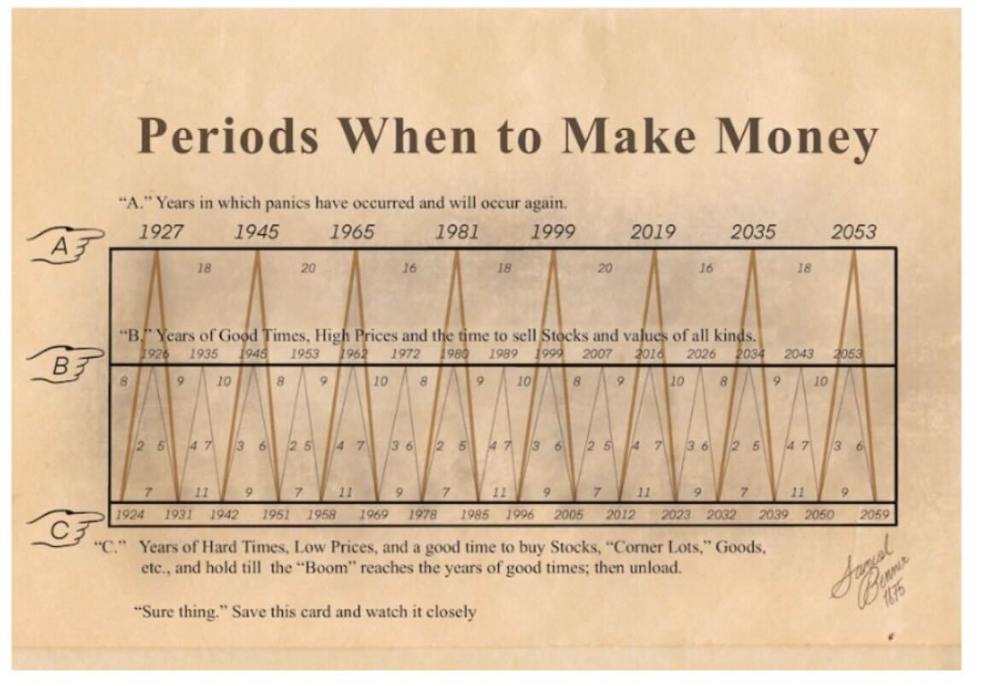
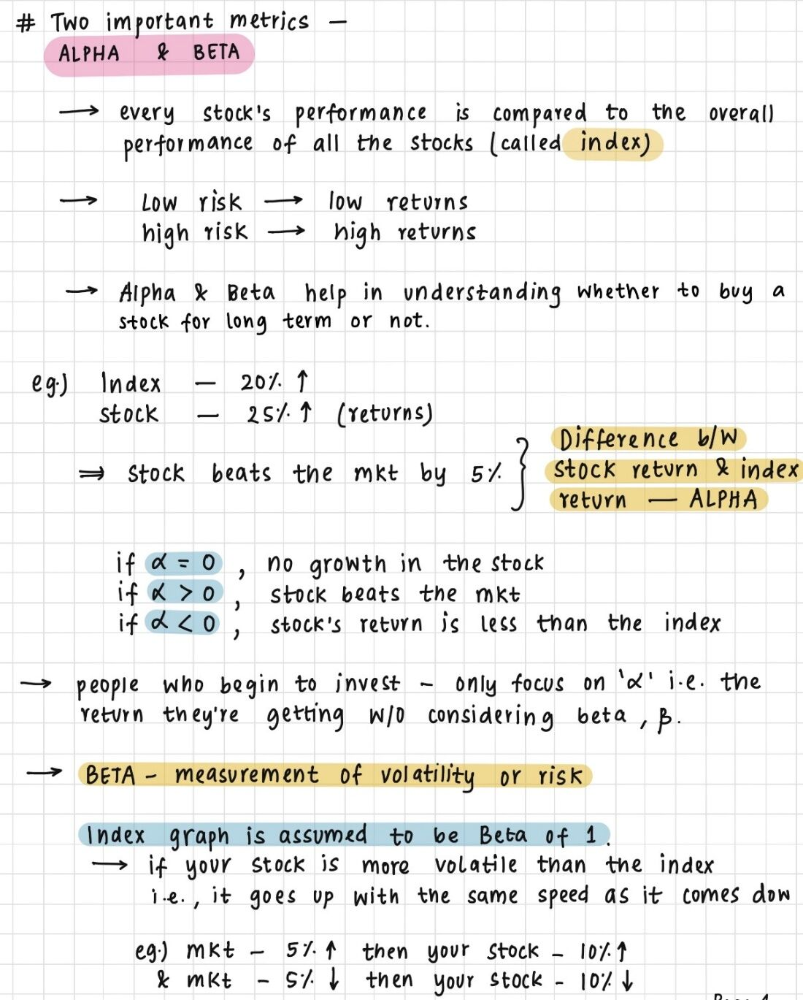
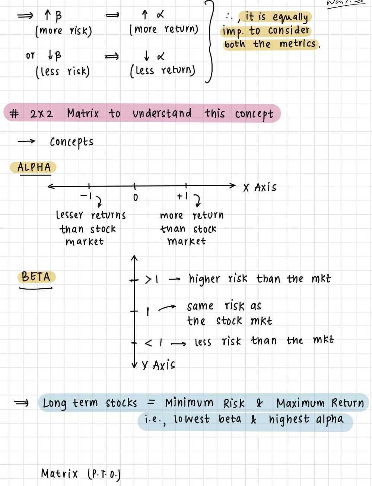
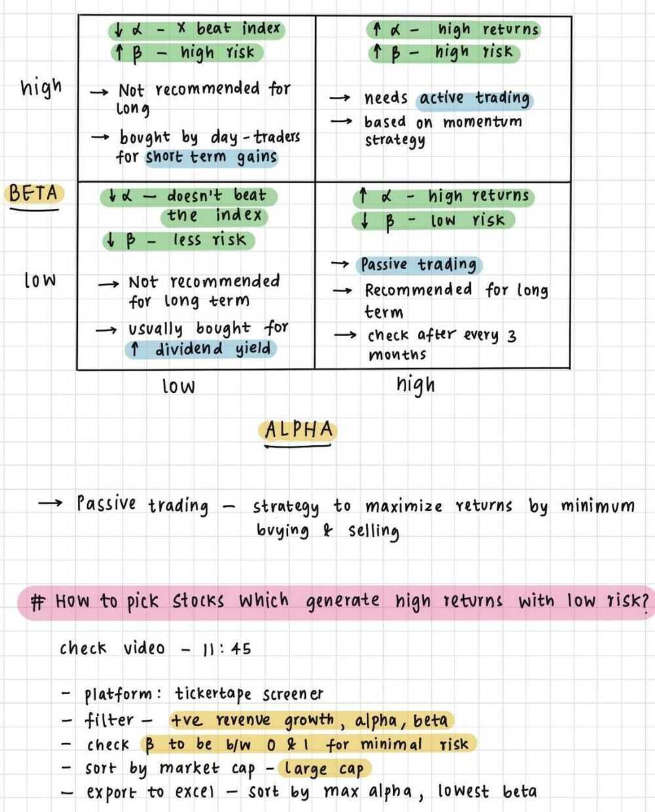
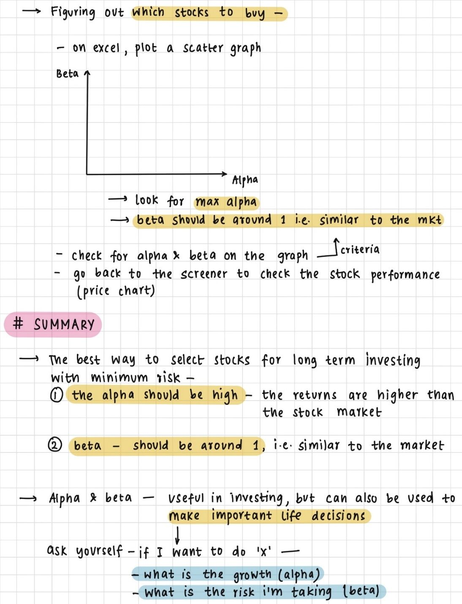

# Technical Analysis Checklist

**Category:** Investment Frameworks
**Type:** Stock Selection
**Last Updated:** 2026-06-08

## Overview

Technical analysis focuses on price action, patterns, and indicators to identify trading opportunities. This checklist provides a systematic approach to evaluating technical setups.

## Core Technical Indicators

### Primary Indicators

- **MACD (Moving Average Convergence Divergence)**
  - Crossover signals
  - Divergence from price
  - Histogram momentum

- **RSI (Relative Strength Index)**
  - Overbought (`>` 70)
  - Oversold (`<` 30)
  - Divergence signals

- **Bollinger Bands**
  - Price volatility
  - Breakout signals
  - Mean reversion setups

See: [Technical Indicators](economics/market-mechanics/technical-analysis/technical-indicators.md)

## The Complete Technical Checklist

Use this 6-point checklist for every trade setup:

### 1. ✅ Recognizable Candlestick Pattern

**The stock should form a recognizable pattern:**

- Bullish: Hammer, Morning Star, Bullish Engulfing
- Bearish: Shooting Star, Evening Star, Bearish Engulfing
- Continuation: Doji, Spinning Top at support/resistance

**Flexibility Principle:**

- Textbook definitions are guidelines, not absolutes
- Market conditions may create minor variations
- Be flexible within limits - **quantify and verify**
- Don't force patterns that aren't there

See: [Candlestick Patterns](economics/market-mechanics/technical-analysis/technical-analysis-basics.md)

### 2. ✅ Support & Resistance (S&R) Confirmation

**S&R should confirm the trade:**

**For Long Trades:**

- Low of the pattern should be **around support**
- Stop loss below support level
- Risk-reward favorable from support

**For Short Trades:**

- High of the pattern should be **around resistance**
- Stop loss above resistance level
- Risk-reward favorable from resistance

**S&R Guidelines:**

- Previous highs/lows
- Psychological levels (round numbers)
- Fibonacci retracement levels
- Moving average levels (50-day, 200-day)

### 3. ✅ Volume Confirmation

**Volumes should confirm the trade:**

- **Presence of above-average volumes** on both buy and sell day
- Low volumes are **not encouraging** - hesitate on low-volume setups
- Volume precedes price - institutional activity shows in volume first

**Volume Analysis:**

- Compare to 30-day average volume
- 2x average volume = strong confirmation
- Declining volume in uptrend = warning
- Rising volume in downtrend = confirmation

### 4. ✅ Dow Theory Perspective

**Look at trade from Dow Theory context:**

- **Primary Trend:** What's the main market direction?
- **Secondary Trend:** Counter-trend moves within primary
- **Formations:**
  - Double/triple tops and bottoms
  - Range formations
  - Recognizable Dow formations

**Trade Alignment:**

- **Best:** Trade aligned with primary trend
- **Caution:** Trade against secondary trend (counter to primary)
- **Avoid:** Trade against strong primary trend

**Key Insight:** If considering a long trade but we're in secondary downtrend (counter to primary uptrend), think twice - immediate trend is against you.

### 5. ✅ Indicator Confirmation

**Indicators should confirm:**

**If Indicators Confirm:**

- **Scale position size higher**
- Increases conviction
- Better risk-reward

**If Indicators Don't Confirm:**

- **Reduce position size** (e.g., 300 shares instead of 500)
- Still take the trade if first 4 points are solid
- Indicators are supporting evidence, not primary decision factor

**Important Philosophy:**

*"When Indicators confirm, I increase my bet size. When Indicators don't confirm, I still go ahead with my decision to buy, but I scale down my bet size."*

*"I would NOT do this with the first three checklist points. For example, if the low of the bullish hammer does not coincide with support, I'll reconsider the plan or skip the opportunity."*

**Indicator Hierarchy:**

- **Critical:** Pattern, S&R, Volume
- **Supporting:** Indicators (MACD, RSI, etc.)

### 6. ✅ Risk-Reward Ratio (RRR)

**RRR should be satisfactory:**

**Guidelines by Experience:**

- **Complete Beginner:** RRR as high as possible (provides margin of safety)
- **Active Trader:** Minimum RRR of 1.5

**Calculation:**

```text
RRR = Potential Profit / Potential Loss
RRR = (Target - Entry) / (Entry - Stop Loss)
```

**Example:**

- Entry: Rs 100
- Target: Rs 115
- Stop Loss: Rs 95
- RRR = (115-100) / (100-95) = 15/5 = 3.0 ✅ Excellent

## Trading Principles

### Buy Strength, Sell Weakness

- **Strength** = Bullish (blue/green) candle
- **Weakness** = Bearish (red) candle

**Rules:**

- When **buying**, ensure it's a blue candle day
- When **selling**, ensure it's a red candle day
- Don't buy on red days, don't sell on green days

### Look for Prior Trend

**Reversal Setups:**

- Bullish pattern → Prior trend should be **bearish**
- Bearish pattern → Prior trend should be **bullish**

**Continuation Setups:**

- Pattern confirms existing trend
- Trend is your friend

## Example Trade Setup

**Karnataka Bank Limited - Bullish Trade:**

**Checklist Review:**

1. ✅ Bullish hammer (recognizable pattern)
2. ✅ Low of hammer coincides with support
3. ✅ Volumes above average
4. ✅ MACD crossover (signal line `>` MACD line)
5. ✅ Primary trend is bullish
6. ✅ RRR is 3.0

**Decision:** Buy 500 shares (full position)

**Scenario 2 - Missing Indicator Confirmation:**

If first 3 points are met but no MACD crossover:

- **Still buy**, but reduce to 300 shares (60% position)
- First 3 points are more important than indicators

**Scenario 3 - Missing S&R Confirmation:**

If hammer low doesn't coincide with support:

- **Reconsider the plan**
- May skip opportunity entirely
- Look for another setup

## Position Sizing Based on Confirmation

| Checklist Items Met | Position Size | Conviction |
|---------------------|---------------|------------|
| All 6 points | 100% | Very High |
| First 4 points (no indicators) | 60-70% | High |
| First 3 points only | 30-50% | Medium |
| Less than 3 critical points | Skip trade | Low |

## Investment Wisdom

### Naval Ravikant - How to Get Rich

**Wealth Creation:**

- Seek **wealth**, not money or status
- **Wealth** = assets that earn while you sleep
- **Money** = transfer mechanism for time and wealth
- **Status** = place in social hierarchy

**Key Principles:**

1. **Ethical wealth creation is possible** - Don't despise wealth
2. **Ignore status games** - Focus on wealth creation
3. **Don't rent out your time** - Must own equity for freedom
4. **Give society what it wants** at scale
5. **Play long-term games** with long-term people
6. **Leverage compound interest** - All returns come from compounding

**Leverage:**

- **Capital leverage:** Money working for you
- **Labor leverage:** People working for you (hardest to get)
- **Code & Media leverage:** Permissionless - software/content working 24/7
- An **army of robots** is available - data centers working for you

**Specific Knowledge:**

- Cannot be trained (if trainable, you're replaceable)
- Found by pursuing genuine curiosity and passion
- Feels like play to you, looks like work to others
- Often highly technical or creative
- Cannot be outsourced or automated

**Become the best** in the world at what you do - keep redefining until true.

### Psychology of Money (Morgan Housel)

**Key Lessons:**

- **Being rich ≠ being wealthy**
- **Staying wealthy** is different from getting wealthy
- **Controlling your time** is the biggest wealth
- **Use money to gain control** over your time
- **Know what is enough**
- **Luck is very important** - acknowledge it
- **Live below your means**
- **Money is not important** if you can't sleep at night
- **Save as much as you can**

### Charlie Munger's 5 Tricks

1. **Invert!** - Ask "Why is this stock NOT good?"
2. **Know What You Don't Know** - Circle of competence
3. **Rational Thinking** - Remove emotions
4. **Keep It Simple!** - Complexity is enemy
5. **Read A Lot!** - Continuous learning
6. **Deep Specialization** in one thing

**Market Crash Wisdom:**

- Don't panic if portfolio is 50% down - it's natural
- **Never panic sell**
- **Take the opportunities** (buy the dip)
- **Understand what you're buying**
- **Buy good companies**
- **Focus on long term**

### 10 Commandments of Wealth Building

From ET Money:

1. **LIVE WITHIN ONE'S MEANS**
2. **KNOW THY PURPOSE** (financial goals)
3. **MAKE MONEY WORK HARDER THAN SELF** (passive income)
4. **RESPECT TIME** (start early)
5. **MAKE FRIENDS WITH COMPOUNDING**
6. **APPLY LEVERAGE** (wisely)
7. **AIM TO BE CONTENTED** (know what's enough)
8. **NOT ASSUME SHORTCUTS** (no get-rich-quick)
9. **ALWAYS BE LEARNING**
10. **GIVE MORE VALUE THAN ONE TAKES**

## Financial Planning Rules

### Top 11 Thumb Rules

1. **Rule of 72:** Years to double = 72 / Interest Rate
2. **Rule of 114:** Years to triple = 114 / Interest Rate
3. **Rule of 70:** Inflation impact - Years to halve purchasing power = 70 / Inflation Rate
4. **10-5-3 Rule:** Expected returns - Equity 10%, Debt 5%, FD 3%
5. **100 Minus Age Rule:** Equity allocation % = 100 - Age
6. **4% Withdrawal Rule:** Withdraw 4% of corpus annually in retirement
7. **50-30-20 Ratio:** 50% needs, 30% wants, 20% savings
8. **3X Emergency Fund Rule:** 3-6 months expenses in liquid funds
9. **1 Week Spending Rule:** Wait 1 week before big purchases
10. **40% EMI Rule:** Total EMIs `<` 40% of monthly income
11. **20X Life Cover Rule:** Life insurance = 20x annual income

## 8 Principles for Equity Investing

From ET Money:

1. **Know what kind of investor you are** (risk tolerance)
2. **Expect volatility and profit from it** (buy dips)
3. **Control the risk** (position sizing, diversification)
4. **Have a safety margin** (margin of safety in valuation)
5. **Ignore the noise** (media hype, tips)
6. **Don't use leverage** while investing in equities
7. **Mind your emotions** (fear and greed)
8. **Long term works best** (time in market `>` timing market)

## 7 Financial Decision Hacks

From ET Money:

1. **Chunking** - Break big decisions into smaller parts
2. **Reframing** - Look at problem from different angle
3. **Fear Setting** - Define worst-case scenario
4. **Mistake Board** - Learn from past errors
5. **Man Muss Immer Umkehren** - Always invert (Munger principle)
6. **Think Like A Statistician** - Probabilities, not certainties
7. **This Happened Because** - Understand causation

## Market Correction Strategy

From ET Money:

1. **Don't Panic** - Corrections are normal
2. **Buy Stocks Of Strong Businesses** - Quality over quantity
3. **Tax-Loss Harvesting** - Offset gains with losses
4. **Build Risk-Appropriate Portfolio** - Match risk tolerance
5. **Continue Your SIPs** - Rupee cost averaging

## Peter Cundill's Investing Approach

Value investing qualities:

1. **Curiosity** - Always learning
2. **Patience** - Wait for right opportunity
3. **Concentration** - Deep research on few stocks
4. **Attention to Details** - Numbers don't lie
5. **Calculated Risks** - Measured risk-taking
6. **Independent Mind** - Think for yourself
7. **Humility** - Acknowledge mistakes
8. **Consistency and Routines** - Disciplined process
9. **Sound Body & Sound Mind** - Physical/mental health
10. **Personal Responsibility** - Own your decisions

## Tips

**Market Timing:**

- Buy long-term FDs during **high interest rate** environment
- Don't buy too much mid/small/micro cap in bull run

**Investment Philosophy:**

- Max alpha (growth) with lowest beta (risk)
- Positive risk-reward opportunity: Limited downside, unlimited upside
- **Consumption smoothing:** Balance spending today vs saving for future

## Images & Visual References









## Related Topics

- [Fundamental Checklist](economics/investment-frameworks/stock-selection/fundamental-checklist.md)
- [Technical Analysis Basics](economics/market-mechanics/technical-analysis/technical-analysis-basics.md)
- [Technical Indicators](economics/market-mechanics/technical-analysis/technical-indicators.md)
- [Candlestick Patterns](economics/market-mechanics/technical-analysis/technical-analysis-basics.md)

## Resources

### Videos

- [Top 11 Financial Planning Thumb Rules - ET Money](https://www.youtube.com/watch?v=w3Y0-Keho9Y)
- [10 Rules of Investing - ET Money](https://www.youtube.com/watch?v=rfScEFtcx3s)
- [Psychology of Money - Ankur Warikoo](https://youtu.be/DpyMvwF4OSE)
- [10 Commandments of Wealth Building - ET Money](https://youtu.be/vBuzDz0l0No)
- [Picking Stocks for Long Term - Ankur Warikoo](https://www.youtube.com/watch?v=krwSDbuHWd4)
- [Charlie Munger: 5 Investing Tricks](https://youtu.be/w4d0e3Jpu9s)
- [7 Hacks For Better Financial Decisions - ET Money](https://www.youtube.com/watch?v=0g_vykxuuos)
- [8 Principles for Equity Investing - ET Money](https://youtu.be/88lRk40wwN4)
- [Peter Cundill Investing Approach - ET Money](https://www.youtube.com/watch?v=d5210kusW5U)
- [How To Make Most Of Stock Market Corrections - ET Money](https://youtu.be/LNnand4V2h0)

### Articles

- [10 Financial Lessons from 10 Years of Blogging - Freefincal](https://freefincal.com/10-financial-lessons-from-10-years-of-blogging)
- [Basic Personal Finance Math - Zerodha](https://www.youtube.com/watch?v=qoY2lz5IOGs)
- [How to Invest in Bull Market](https://www.youtube.com/watch?v=t78IbEUMynQ)
- [Warren Buffett's 7 Rules for 2023](https://www.youtube.com/watch?v=PEPrpSCZkeU)

### Tools

- [Personal Finance Tracker - GitHub](https://github.com/JerBouma/PersonalFinance) ⭐ 127
