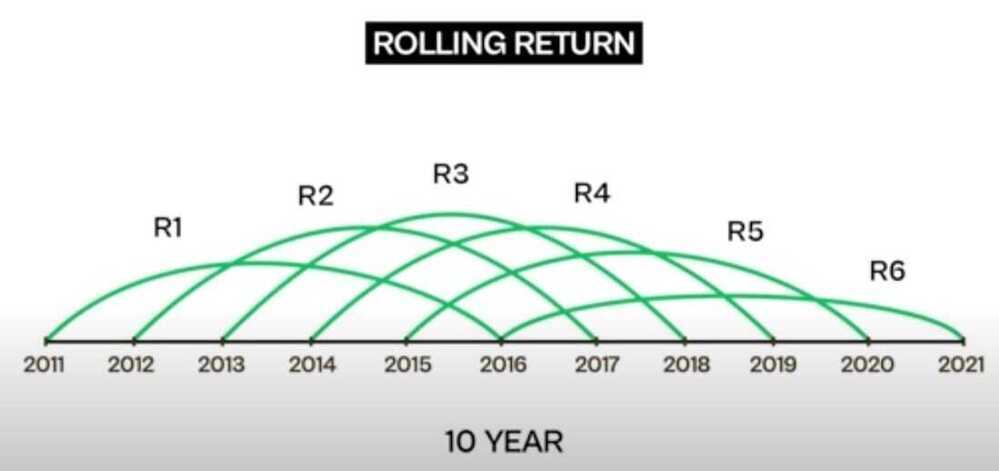

# Investment Terms

[Annual vs Trailing vs Rolling Returns Explained | ET Money](https://youtu.be/ncMwF6HQ92Y)

## Annual Returns

## Trailng Returns

Helps investors measure the average annual returns between 2 dates

Limitations - Trailing returns requires an element of luck or timing which complicates it when recency bias is added

## Rolling Returns

Rolling returns is based on calculating returns for a particular period on a continuous basis

**Annual and Rolling Returns, helps gauge performance consistency or volatility of a fund or portfolio**

**Trailing Returns, Showcases investors the compounding effect on returns**

## Absolute Return

Absolute Returns % = (Current Value - Invested Value)/Invested Value * 100

Example: If you invested Rs 10,000 and now its value is Rs 11,000 then your absolute returns % is (11,000- 10,000)/10,000 * 100 % = 10 %

Note that in calculating absolute returns, there is no relevance of the time it took to get those returns. In the above example, the investment of Rs 10,000 could have become Rs 11,000 in 1 year or in 10 years, the absolute returns % remains the same i.e. 10%.

## Compounded Annual Growth Rate (CAGR) / Annualized Total Return

Compound annual growth rate (CAGR) is the [rate of return](https://www.investopedia.com/terms/r/rateofreturn.asp) that would be required for an investment to grow from its beginning balance to its ending balance, assuming the profits were reinvested at the end of each year of the investment's lifespan.

Compound annual growth rate (CAGR) is a business and investing specific term for the [geometric progression](https://en.wikipedia.org/wiki/Geometric_progression) ratio that provides a constant rate of return over the time period

An absolute return can be misleading if you want to compare two investments. CAGR helps you answer this question -- I bought Infosys at 3030 and held the stock for 2 years and sold it 3550. At what rate did my investment grow over the last two years?

CAGR factors in the time component which we had ignored when we computed the absolute return.

Applying this to answer the question..

`{[3550/3030]^(1/2) -- 1} = 8.2%`

This means the investment grew at a rate of 8.2% for 2 years. Considering the fact that Indian fixed deposit market offers a return of close to 8.5% return with capital protection an 8.2% return suddenly looks a bit unattractive.

So, always use CAGR when you want to check returns over multiple years. Use absolute return when your time frame is for a year or lesser.

What if you have bought Infosys at 3030 and sold it at 3550 within 6 months? In that case you have generated 17.16% in 6 months which translates to 34.32% (17.16% * 2) for the year.

So the point is, if you have to compare returns, its best done when the return is expressed on an annualized basis.

https://www.investopedia.com/terms/c/cagr.asp

Anannualizedtotalreturnis the geometric average amount of money earned by an investment each year over a given time period. It is calculated as a geometric average to show what an investor would earn over a period of time if the annualreturnwas compounded.

https://www.investopedia.com/terms/a/annualized-total-return.asp

## NPV (Net Present Value)

Net present value (NPV) is the difference between the present value of cash inflows and the present [value](https://www.investopedia.com/terms/v/valuation.asp) of cash outflows over a period of time. NPV is used in [capital budgeting](https://www.investopedia.com/terms/c/capitalbudgeting.asp) and investment planning to analyze the profitability of a projected investment or project. NPV is the result of calculations used to find today's value of a future stream of payments.

- Net present value, or NPV, is used to calculate the current total value of a future stream of payments.
- If the NPV of a project or investment is positive, it means that the discounted present value of all future cash flows related to that project or investment will be positive, and therefore attractive.
- To calculate NPV, you need to estimate future cash flows for each period and determine the correct discount rate.

### What Net Present Value Can Tell You

NPV accounts for the time value of money and can be used to compare similar investment alternatives.

NPV looks to assess the profitability of a given investment on the basis that a dollar in the future is not worth the same as a dollar today. Money loses value over time due to [inflation](https://www.investopedia.com/terms/i/inflation.asp). However, a dollar today can be invested and earn a return, making its future value possibly higher than a dollar received at the same point in the future.

For example, an investor could receive $100 today or a year from now. Most investors would not be willing to postpone receiving $100 today. However, what if an investor could choose to receive $100 today or $105 in one year? The 5%[rate of return](https://www.investopedia.com/terms/r/rateofreturn.asp)(RoR) for waiting one year might be worthwhile for an investor unless another investment could yield a rate greater than 5% over the same period.

If an investor knew they could earn 8% from a relatively safe investment over the next year, they would choose to receive $100 today and not the $105 in a year, with the 5% rate of return. In this case, 8% would be the discount rate.

### Positive vs. Negative NPV

A positive NPV indicates that the projected earnings generated by a project or investment - in present dollars - exceeds the anticipated costs, also in present dollars. It is assumed that an investment with a positive NPV will beprofitable.

An investment with a negative NPV will result in a net loss. This concept is the basis for the [Net Present Value Rule](https://www.investopedia.com/terms/n/npv-rule.asp), which dictates that only investments with positive NPV values should be considered.

### Net Present Value vs. Payback Period

The [payback period](https://www.investopedia.com/terms/p/paybackperiod.asp), or "payback method," is a simpler alternative to NPV. The payback method calculates how long it will take for the original investment to be repaid. A drawback is that this methodfails to account for the time value of money. For this reason, payback periods calculated for longer investments have a greater potential for inaccuracy.

Moreover, the payback period is strictly limited to the amount of time required to earn back initial investment costs. It is possible that the investment's rate of return could experience sharp movements. Comparisons using payback periods do not account for the long-term profitability of alternative investments.

## NPV vs. Internal Rate of Return (IRR)

The [internal rate of return](https://www.investopedia.com/terms/i/irr.asp)(IRR) is very similar to NPV except that the discount rate is the rate that reduces the NPV of an investment to zero. This method is used to compare projects with different lifespans or amounts of required capital.

For example, IRR could be used to compare the anticipated profitability of a three-year project that requires a $50,000 investment with that of a 10-year project that requires a $200,000 investment. Although the IRR is useful, it is usually considered inferior to NPV because it makes too many assumptions about reinvestment risk and capital allocation.

## Why Are Future Cash Flows Discounted?

NPV uses discounted cash flows due to the time value of money (TMV). The time value of money is the concept that money you have now is worth more than the identical sum in the future due to its potential earning capacity through investment and other factors such as inflation expectations. The rate used to account for time, or the discount rate, will depend on the type of analysis undertaken. Individuals should use theopportunity costof putting their money to work elsewhere as an appropriate discount rate - simply put, it's the rate of return the investor could earn in the marketplace on an investment of comparable size and risk.

https://www.investopedia.com/terms/n/npv.asp

## MOIC

MOIC is a quick indicator of the return on your investment. Another way to think about this is that it shows the total value of a portfolio. In quantifying this return, the metric focuses onhow muchrather thanwhen.

For example, using the equation above, if I invested $100 and my total value is $500, the MOIC is 5x. You'll notice that time was not factored into this calculation. Two deals with an MOIC of 5x have the same return regardless ofwhenthey achieve it.

https://cobaltlp.com/blog/moic-and-irr-an-important-distinction-in-private-equity

## IRR (Internal Rate of Return)

The internal rate of return (IRR) is a metric used in [capital budgeting](https://www.investopedia.com/terms/c/capitalbudgeting.asp) to estimate the profitability of potential investments. The internal rate of return is a [discount rate](https://www.investopedia.com/terms/d/discountrate.asp) that makes the [net present value](https://www.investopedia.com/terms/n/npv.asp)(NPV) of all cash flows from a particular project equal to zero. IRR calculations rely on the same formula as NPV does.

It is important for a business to look at the IRR as the plan for future [growth](https://www.investopedia.com/terms/i/internalgrowthrate.asp) and expansion.

https://www.investopedia.com/terms/i/irr.asp

## XIRR (Extended Internal Rate of Return)

XIRR is a measure of return used when multiple investments (at different points in time) are made in a financial instrument (For a SIP type investment)

You can think of XIRR as nothing but an aggregation of multiple CAGRs. If you make multiple investments in a fund, you can use the XIRR formula to calculate your overall CAGR for all those investments taken together.

In case of SIP or even multiple lumpsums, many times absolute returns number might seem a bit low, especially for investors just starting out. The reason is that your money has been invested over time and not all at once.

For eg in case of a SIP of Rs 10,000 for an year, only the first 10,000 is invested for the entire year, the next 10,000 will be invested for only 11 months, the one after that for only 10 months and so on with the last 10,000 being invested for just one month.

https://freefincal.com/what-is-xirr

## IRR vs CAGR

The [compound annual growth rate](https://www.investopedia.com/terms/c/cagr.asp)(CAGR) measures the return on an investment over a certain period of time. The IRR is also a [rate of return](https://www.investopedia.com/terms/r/rateofreturn.asp) but is more flexible than the CAGR. While CAGRsimply uses the beginning and ending value, IRR considers multiple cash flows and periods -- reflecting the fact that cash inflows and outflows often constantly occur when it comes to investments. IRR can also be used in [corporate finance](https://www.investopedia.com/terms/c/corporatefinance.asp) when a project requires cash outflows upfront but then results in cash inflows as investments pay off.

The most important distinction is thatCAGRis straightforward enough that it can be calculated by hand. In contrast, more complicated investments and projects, or those that have many different cash inflows and outflows, are best evaluated using IRR. To back into the IRR rate, a financial calculator, Excel, or portfolio accounting system is ideal.

https://www.investopedia.com/ask/answers/070914/what-are-main-differences-between-compound-annual-growth-rate-cagr-and-internal-rate-return-irr.asp

## APR (Annual Percentage Rate)

Annual percentage rate (APR) refers to the yearly interest generated by a sum that's charged to borrowers or paid to investors. APR is expressed as a percentage that represents the actual yearly [cost of funds](https://www.investopedia.com/terms/c/costoffunds.asp) over the term of a loan or income earned on an investment. This includes any fees or additional costs associated with the transaction, but it does not take [compounding](https://www.investopedia.com/terms/c/compounding.asp) into account. The APR provides consumers with a bottom-line number they can compare among lenders, credit cards or investment products.

- An annual percentage rate (APR) is the yearly rate charged for a loan or earned by an investment.
- Financial institutions must disclose a financial instrument's APR before any agreement is signed.
- The APR provides a consistent basis for presenting annual interest rate information, in order to protect consumers from misleading advertising.
- An APR may not reflect the actual cost of borrowing because lenders have a fair amount of leeway in calculating it, excluding certain fees.
- APR shouldn't be confused with APY (annual percentage yield), a calculation that takes the compounding of interest into account.

https://www.investopedia.com/terms/a/apr.asp

## APY (Annual Percentage Yield)

The annual percentage yield (APY) is the real rate of return earned on an investment, taking into account the effect of compounding interest. Unlike simple interest, compounding interest is calculated periodically and the amount is immediately added to the balance. With each period going forward, the account balance gets a little bigger, so the interest paid on the balance gets bigger as well.

### KEY TAKEAWAYS

- APY is the actual rate of return that will be earned in one year if the interest is compounded.
- Compound interest is added periodically to the total invested, increasing the balance. That means each interest payment will be larger, based on the higher balance.
- The more often interest is compounded, the higher the APY will be.
- APY has a similar concept as annual percentage rate (APR), but APR is used for loans.
- The APY on checking, savings, or certificate of deposit holdings will vary across product and may have a variable or fixed rate.

https://www.investopedia.com/terms/a/apy.asp

### GFCF - Gross fixed capital formation
