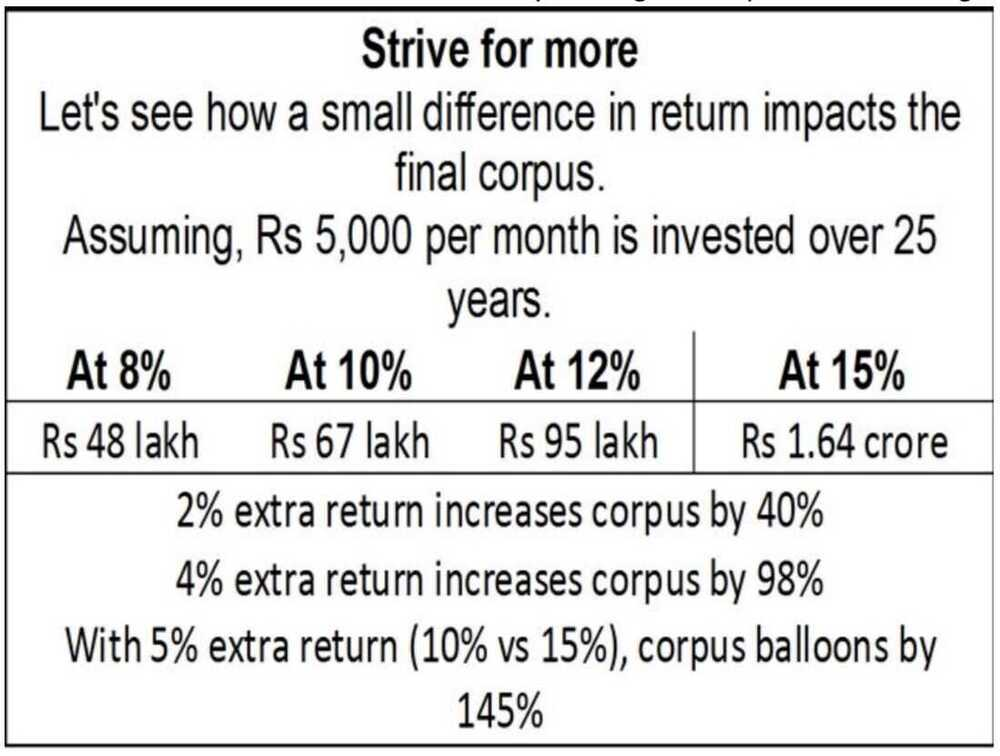

**Category:** Learning Resources
**Last Updated:** 2026-06-08

## Warren Buffett's 5 Core Tips

1. **Invest in a business, not in a stock** - Understand the company
2. **Don't have too many stocks** - Concentrated portfolio of quality
3. **Invest in what you understand** - Stay within circle of competence
4. **Read, read, and extensively read** - Continuous learning
5. **Start as early as possible** - Time is your biggest advantage

## Classic Warren Buffett Quotes

- "Price is what you pay, value is what you get." ([2008](http://www.berkshirehathaway.com/letters/2008ltr.pdf))
- "For investors as a whole, returns decrease as motion increases." ([2005](http://www.berkshirehathaway.com/letters/2005ltr.pdf))
- "Be fearful when others are greedy and greedy only when others are fearful." ([2004](http://www.berkshirehathaway.com/letters/2004ltr.pdf))
- "You only find out who is swimming naked when the tide goes out." ([2001](http://www.berkshirehathaway.com/letters/2001.html))

Read: [Warren Buffett's Letters to Shareholders - CB Insights](https://www.cbinsights.com/research/buffett-berkshire-hathaway-shareholder-letters)

## Investment Strategy Tips

### Market Timing

- **Invest less during bullish markets** (SIP 25%) - Don't get caught up in bull market speculation
- **Invest more during bearish markets** (SIP 75%) - Buy when others are fearful

### Investment Principles

- Don't have debt rise faster than income
- Don't have income rise faster than productivity
- Do all you can to raise your productivity

Watch: [Ray Dalio - How The Economic Machine Works](https://www.youtube.com/watch?v=PHe0bXAIuk0)

## 10 Commandments for Young Investors

From: [10 Investing Tips for Young Investors](https://www.youtube.com/watch?v=OKxDncq_cl4)

1. **Thou shall know thy goal** - Define clear financial objectives
2. **Thou shall respect time & be patient** - Let compounding work
3. **Thou shall build a strong foundation** - Emergency fund, insurance first
4. **Thou shall not chase historical performance** - Past returns don't guarantee future
5. **Thou shall stay away from hot tips** - No shortcuts to wealth
6. **Thou shall invest only in what one understands** - Circle of competence
7. **Thou shall not use debt** - Avoid leverage for investing
8. **Thou shant check portfolio everyday** - Avoid emotional decisions
9. **Thou shall always be learning** - Continuous education
10. **Practice discipline and patience** - Consistency beats timing

## Investment Steps for New Investors

### Foundation First

1. **Term Life Insurance** - Protect dependents
2. **Buy a house with home loan** - Real estate for stability
3. **Build emergency fund** - 6-12 months expenses
4. **Health insurance** - Medical emergencies coverage

### Goal-Based Planning

- **Jot down clearly the dates when you need money** - Be specific (not just year)
- **For goals within 15 years** - Stick to FDs (too late for equity volatility)
- **For goals `>15` years away** - Consider equity mutual funds
- **Start slowly** - 10% of FD/RD amount in equity, observe volatility, then increase

Read: [Re-Assemble E-Book - Freefincal](https://freefincal.com/download-re-assemble-e-book-on-our-6th-birthday)

## What NOT to Invest In

From: [Don't Invest Your PAISA Here](https://www.youtube.com/watch?v=Aqnv2y9eKlg)

**Wealth Destroyers:**

1. **ULIP** - High charges, poor returns
2. **Derivatives (F&O)** - 95% traders lose money
3. **Intraday/BTST/Momentum/Swing Trading** - Gambling, not investing
4. **Active Large Cap Mutual Funds** - Underperform index after fees
5. **Peer-2-Peer Lending** (12% Club, etc.) - High default risk
6. **Corporate Bonds** (non-AAA rated) - Credit risk not worth extra yield
7. **Flats in 10+ year old buildings** - Maintenance issues, depreciation
8. **Penny Stocks** - Manipulation, liquidity issues
9. **IPO oversubscription** - Lottery, not investing
10. **Cryptocurrency** - Extreme volatility, regulatory uncertainty
    - Note: [Tax on Virtual Digital Assets - Budget 2025](https://www.businesstoday.in/personal-finance/tax/story/tax-on-cryptos-how-budget-2025-has-changed-virtual-digital-asset-taxation-check-details-463210-2025-02-03)

## Essential Learning Resources

### Videos

- [9 Lessons from Warren Buffett's Letters - ET Money](https://youtu.be/GSBtCxVLRqA)
- [Warren Buffett Explains How to Invest in 2023](https://www.youtube.com/watch?v=U9KxB0BKf-I)
- [Peter Lynch Investing Strategy - One Up On Wall Street](https://www.youtube.com/watch?v=J9rbQDCo-l8)
- [BOOST SIP Returns by 2% - 4 Strategies](https://www.youtube.com/watch?v=WT8_9-ll7XU)
- [Benjamin Graham's Intelligent Investor Summary](https://www.youtube.com/watch?v=ltWCUf73vrk)
- [Buy-And-Hold Investing Still Works? - ET Money](https://youtu.be/0Fe_qjdgJSM)
- [How To Find Multi-baggers (100x) - ET Money](https://www.youtube.com/watch?v=YwwhtZuJkyU)

### Behavioral Finance & Biases

- [Anchoring Bias in Investing](https://www.youtube.com/watch?v=UcdKmVjM3ww)
- [15 Investing Mistakes to Avoid](https://www.youtube.com/watch?v=BDDrd98WYL8)
- [Intangible Assets in Investing - ET Money](https://youtu.be/XG4esIF_eGE)

### Mutual Funds

- [Quant Mutual Fund - 5 Secrets](https://www.youtube.com/watch?v=WqFMhqRhVbw)
- [Mutual Fund FAQ for New Investors - Freefincal](https://freefincal.com/mutual-fund-faq-new-investors)
- [Be Careful with Thematic/Sector/Multi-Cap Funds - ET Money](https://youtu.be/1zgSvdQXw0I)

### Sector-Specific

- [THIS Sector is Quietly Winning in India - Aditya Khemka](https://youtu.be/3sYmIUtvabk)
- [Where to invest Rs 1 Lakh, 10 Lakh, 1 Crore](https://youtu.be/tA3NonQ9m8s)

### Courses

- [Finance for Everyone - edX](https://www.edx.org/course/finance-everyone-smart-tools-decision-michiganx-fin101x-1)

## YouTube Channels to Follow

- **Subra Money (P.V. Subramanyam):** [Channel](https://www.youtube.com/c/SUBRAMONEYPVSUBRAMANYAM/videos)
  - Retirement planning, goal-based investing
- **ET Money:** Mutual funds, personal finance
- **Freefincal:** DIY investing, financial planning

## Books

### Must-Reads

- **The Intelligent Investor** - Benjamin Graham
- **One Up On Wall Street** - Peter Lynch
- **Berkshire Hathaway Shareholder Letters** - Warren Buffett

## Risk Management

Read: [Steps to Minimize Risk in Investment Portfolio - Freefincal](https://freefincal.com/steps-to-minimize-risk-in-your-investment-portfolio/)

## Case Studies & Real Stories

- [How Rohit's Early Struggles Defined His Investment Journey](https://freefincal.com/how-rohits-early-struggles-defined-his-investment-journey/)
- [How Abhisek Funded His Marriage & is on Track to Financial Freedom](https://freefincal.com/how-abhisek-funded-his-marriage-is-on-track-to-financial-freedom/)

## Tools & Platforms

See: [Tools & Platforms](economics/learning-resources/tools-platforms.md)

## Related Topics

- [Asset Classes Overview](economics/investment-frameworks/core-concepts/asset-classes-overview.md)
- [Stock Selection Framework](economics/investment-frameworks/stock-selection/stocks-equity-basics.md)
- [Personal Finance Framework](economics/personal-finance/wealth-building/personal-finance-framework.md)

## Image Reference

