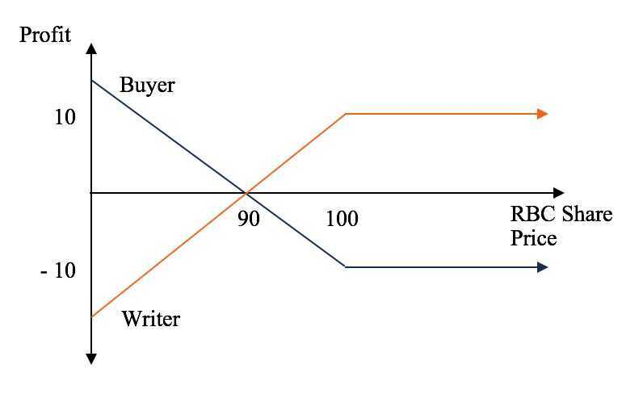

# Futures / Options / Trading

Buy the rumor, sell the news

## Trading

- Start with paper trading account
- 264 trading days
- Nifty lot size - 75
- Bank Nifty lot size - 25

## Shorting / Short

[How Short Sellers Make BIG Money in the Stock Markets | Short Selling Explained - YouTube](https://www.youtube.com/watch?v=rSXZVcl21eY)

## Derivative

- Forward
- Futures
- Options
- Swaps

- Forwards and Swaps doesn't trade
- Only Futures and Options are traded on stock market
- Derivaties are primarily used for Hedging and Speculation
- Speculation - Earn profit
- Hedging - Reduce losses
- Future and options have expiry period
- Near, Next and Far month expiry periods
- Last thursday of every month that month future will expire (if thursday is holiday, then it will be wednesday and so on)

Futures are derivative financial contracts

Obligate the parties to transact an asset at a predetermined future date and price

- Cash based settlement
- Delivery based settlement

## Futures Trading

Futures Trading involves trading in contracts in the derivatives markets. This module covers the various intricacies involved in undergoing a futures trade including margins, leverages, pricing, etc

## Options Theory for Professional Trading

An option is a contract where the price of the options is based on an underlying. Options contracts grant the buyer the right to buy the underlying without a compulsory obligation.

## Option Strategies

The module covers various options strategies that can be built with a multi-dimensional approach based on Market trend involving Option Greeks, Risk-Return, etc.

- Straddles
- Strangles
- Ratio spread

## Stock Option

A [stock option](http://personal.fidelity.com/products/stockoptions/exercise.shtml) is a privilege giving its holder the right to purchase a particular stock at a price agreed upon by the assignor and the holder (called the "grant price") within a specified time. Note that a stock option is a right, not an obligation, to purchase the stock, meaning that the option holder may choose to not exercise the option.

## What Does It Mean to Exercise a Stock Option?

Exercising a stock option means purchasing the shares of stock per the stock option agreement. The benefit of the option to the option holder comes when the grant price is lower than the market value of the stock at the time the option is exercised. Here's an example:

You receive a stock option as part of your compensation package as a new employee at your company. The grant (strike) price of the option is $50 per share. Your option vests (see below). The price per share for the company stock is currently $100. You decide to exercise your option. You will purchase your shares at the grant price ($50 per share). As the owner of the shares, you now have the choice of selling them or holding them. If you decide to sell at the current per share price, you will enjoy an immediate profit of $50 per share ($100 sell price minus the $50 purchase price), less taxes, fees and any other applicable expenses.

An exercise price is a price at which you can buy the shares in the future irrespective of what the true price of the share may be at any given point. At the time of offering the shares, the price was 1 USD. But after 4 years, even if the price of each share is 100 USD, you will only pay 1 USD to buy a share.

## What is Vesting?

"[Vesting](https://www.upcounsel.com/vesting)" refers to the date upon which the stock option becomes exercisable. In other words, the option holder must wait until the option "vests" before he can purchase the stock under the option agreement. A vesting date is a common feature of stock options granted as part of an employee compensation package. The purpose of the vesting date is to ensure the employee's commitment to his job position and to making the company a success.

## What is the Option Expiration Date?

All stock options come with an expiration date, that is, the last date by which the option holder must exercise her option or lose it.

American Options can be exercised anytime before expiry. European Options (which is what we have in India) can be only exercised on the expiration date.

## Types of Stock Options

The [IRS](https://www.irs.gov/taxtopics/tc427.html) recognizes two types of stock options: statutory and non-statutory. Options granted through an [employee stock purchase plan](https://www.upcounsel.com/employee-stock-purchase-plan) or [incentive stock option (ISO)](https://www.upcounsel.com/incentive-stock-options) plan are considered statutory stock options. Options not granted through employee stock purchase plans or ISO's are considered non-statutory stock options.

## What are Options: Calls and Puts?

An option is a derivative, a contract that gives the buyer the right, but not the obligation, to buy or sell the underlying asset by a certain date (expiration date) at a specified price ([strike price](https://corporatefinanceinstitute.com/resources/knowledge/trading-investing/strike-price/)). There are two types of options: calls and puts. American-style options can be exercised at any time prior to their expiration. European-style options can only be exercised on the expiration date.

To enter into an option contract, the buyer must pay an option [premium](https://corporatefinanceinstitute.com/resources/knowledge/finance/market-risk-premium/). The two most common types of options are calls and puts:

### Call options (right to buy)

Calls give the buyer the right, but not the obligation, to buy the underlying [asset](https://corporatefinanceinstitute.com/resources/knowledge/finance/marketable-securities/) at the strike price specified in the option contract. Investors buy calls when they believe the price of the underlying asset will increase and sell calls if they believe it will decrease.

### Put options (right to sell)

Puts give the buyer the right, but not the obligation, to sell the underlying asset at the strike price specified in the contract. The writer (seller) of the put option is obligated to buy the asset if the put buyer exercises their option. Investors buy puts when they believe the price of the underlying asset will decrease and sell puts if they believe it will increase.

## Payoffs for Options: Calls and Puts

### Calls

The buyer of a call option pays the option premium in full at the time of entering the contract. Afterward, the buyer enjoys a potential profit should the market move in his favor. There is no possibility of the option generating any further loss beyond the purchase price. This is one of the most attractive features of buying options. For a limited investment, the buyer secures unlimited profit potential with a known and strictly limited potential loss.

If the [spot price](http://lexicon.ft.com/Term?term=spot-market) of the underlying asset does not rise above the option strike price prior to the option's expiration, then the investor loses the amount they paid for the option. However, if the price of the underlying asset does exceed the strike price, then the call buyer makes a profit. The amount of profit is the difference between the market price and the option's strike price, multiplied by the incremental value of the underlying asset, minus the price paid for the option.

For example, a stock option isfor 100 shares of the underlying stock. Assume a trader buys one call option contract on ABC stock with a strike price of $25. He pays $150 for the option. On the option's expiration date, ABC stock shares are selling for $35. The buyer/holder of the option exercises his right to purchase 100 shares of ABC at $25 a share (the option's strike price). He immediately sells the shares at the current market price of $35 per share.

He paid $2,500 for the 100 shares ($25 x 100) and sells the shares for $3,500 ($35 x 100). His profit from the option is $1,000 ($3,500 -- $2,500), minus the $150 premium paid for the option. Thus, his net profit, excluding transaction costs, is $850 ($1,000 -- $150). That's a very nice return on investment (ROI) for just a $150 investment.

#### Selling Call Options

The call option seller's downside is potentially unlimited. As the spot price of the underlying asset exceeds the strike price, the writer of the option incurs a loss accordingly (equal to the optionbuyer's profit). However, if the market price of the underlying asset does not go higher than the option strike price, then the option expires worthless. The option seller profits in the amount of the premium they received for the option.

An example is portrayed below, indicating the potential payoff for a call option on RBC stock, with an option premium of $10 and a strike price of $100. In the example, the buyer incurs a $10 loss if the share price of RBC does not increase past $100. Conversely, the writer of the call is in-the-money as long as the share price remains below $100.

### Puts

A put option gives the buyer the right to sell the underlying asset at the option strike price. The profit the buyer makes on the option depends on how far below the spot price falls below the strike price. If the spot price is below the strike price, then the put buyer is "in-the-money." If the spot price remains higher than the strike price, the option will expire unexercised. The option buyer's loss is, again, limited to the premium paid for the option.

The writer of the put is "out-of-the-money" if the spot price of the underlying asset is below the strike price of the contract. Their loss is equal to the put option buyer's profit. If the spot price remains above the strike price of the contract, the option expires unexercised, and the writer pockets the option premium.

Figure 2 below shows the payoff for a hypothetical 3-month RBC put option, with an option premium of $10 and a strike price of $90. The buyer's potential loss is limited to the cost of the put option contract ($10).

## Applications of Options: Calls and Puts

Options: calls and puts are primarily used by investors to hedge against risks in existing investments. It is frequently the case, for example, that an investor who owns stock buys or sells options on the stock to hedge his direct investment in the underlying asset. His option investments are designed to at least partially compensate for any losses that may be incurred in the underlying asset. However, options may also be used as standalone speculative investments.

## Hedging -- Buying puts

If an investor believes that certain stocks in their portfolio may drop in price but they do not wish to abandontheir position for the long term, they can buy put options on the stock. If the stock does decline in price, then profits in the put options will offset losses in the actual stock.

Investors commonly implement such a strategy during periods of uncertainty, such as [earnings season](https://corporatefinanceinstitute.com/resources/knowledge/finance/earnings-season/). They may buy puts on particular stocks in their portfolio or buy index puts to protect a well-diversified portfolio.[Mutual fund](https://corporatefinanceinstitute.com/resources/knowledge/trading-investing/mutual-funds/) managers often use puts to limit the fund's downside risk exposure.

## Speculation -- Buy calls or sell puts

If an investor believes the price of a security is likely to rise, they can buy calls or sell puts to benefit from such a price rise. In buying call options, the investor's total risk is limited to the premium paid for the option. Their potential profit is, theoretically, unlimited. It is determined by how far the market price exceeds the option strike price and how many options the investor holds.

For the seller of a put option, things are reversed. Their potential profit is limited to the premium received for writing the put. Their potential loss is unlimited -- equal to the amount by which the market price is below the option strike price, times the number of options sold.

## Speculation -- Sell calls or buy puts on bearish securities

Investors can benefit from downward price movements by either selling calls or buying puts. The upside to the writer of a call is limited to the option premium. The buyer of a put faces a potentially unlimited upside but has a limited downside, equal to the option's price. If the market price of the underlying security falls, the put buyer profits to the extent the market price declines below the option strike price. If the investor's hunch was wrong and prices don't fall, the investor only loses the option premium.

https://corporatefinanceinstitute.com/resources/knowledge/trading-investing/options-calls-and-puts

## Summary

- Buy a call option or sell a put option only when you expect the market to go up
- Buy a put option or sell a call option only when you expect the market to go down
- The buyer of an option has unlimited profit potential and limited risk (to the extent of the premium paid)
- The seller of an option has an unlimited risk potential and limited reward (to the extent of the premium received)
- Majority of options traders prefer to trade options only to capture the variation in premiums
- Option premiums tend to gyrate drastically - as an options trader, and you can expect this to happen quite frequently
- Premiums vary as a function of 4 forces called the Option Greeks
- Black & Sholes option pricing formula employs a four forces as inputs to give out a price for the premium
- Markets control the Option Greeks and the Greek's variation itself

## Options Greeks

Option Greeks are foces that influence the premium of an option

### Delta

Delta is an option greek that captures the effect of the direction of the market

Option Delta = Rate of change in premium wrt Underlying

- Call option delta varies between 0 to 1, some trader prefer to use 0 to 100
- Put option delta varies between -1 to 0 (-100 to 0)
- The negative delta value for a put option indicates that the option premium and underlying value moves in the opposite direction
- ATM have a delta of 0.5
- ITM option have a delta of close to 1
- OTM options have a delta of close to 0

[The Option Greeks - Delta](https://www.youtube.com/watch?v=I7YWC_j1ocI)

### Gamma

[Gamma](https://www.youtube.com/watch?v=koJQc3fqxjk)

### Theta

[Theta](https://www.youtube.com/watch?v=fDLJlU8OdP8)

### Vega

[Vega](https://youtu.be/2hmF5gqKEUg)

## Margins

### SPAN (Standard Portfolio Analysis of risk)

SPAN is a popular system developed by CME (Chicago Mercantile Exchange) used to calculate risk and margins for F&O portfolios adopted by many exchanges worldwide. When launched in 2000, the SPAN margin was collected to cover for the worst possible movement in the contract for a single day (called MPOR or minimum Margin Period of Risk). This worst possible scenario is calculated using the Price Scan Range (PSR) of the underlying index or stock. PSR is calculated using the daily volatility of the underlying. Back in 2000, it was set at 3 [standard deviations](https://en.wikipedia.org/wiki/Standard_deviation) of the daily volatility for index contracts and 3.5 standard deviations for stocks

### Exposure margins

are charged over and above SPAN margins to cover for risks that the SPAN margin may not cover. When F&O was introduced in India, this was set to 3% of the contract value for index and 5% (or 1.5 standard deviation, whichever is higher) for stock F&O

### Short Option Minimum (SOM)

Short Option Minimum (SOM) is a minimum margin for all strikes of short option contracts that fall beyond the PSR. For instance, if the Nifty spot is at 16000, and if Nifty has a PSR of ~1000 points (covering a 7% movement), all contracts beyond 17000 CE or 15000 PE would be considered risk free under SPAN and no SPAN margin was required. While exposure margin was still charged, that wasn't considered enough. So, to cover this, an additional minimum short option margin (SOM) of 3% was collected

https://zerodha.com/z-connect/queries/stock-and-fo-queries/history-of-fo-margin-requirements-in-india

## p/c ratio - Put/Call ratio

One way to gauge short-term investor sentiment in the stock market is the put/callratio(P/C ratio). It's an indicator that measures the amount of put activity relative to call activity in the options market.

A "put" or put option is a right to sell an asset at a predetermined price. A "call" or call option is a right to buy an asset at a predetermined price.

- A put option gets the trader the right to sell an asset at a preset price.
- A call option is a right to buy an asset at a preset price.
- If traders are buying more puts than calls, it signals a rise in bearish sentiment.
- If they are buying more calls than puts, watch outfor a bull market ahead

## Exercising Put and Call Options

An options holder may exercise his or her right to buy or sell the contract's underlying shares at a specified price - also called the [strike price](https://www.investopedia.com/video/play/strike-price/).

- Exercising a [put option](https://www.investopedia.com/terms/p/putoption.asp) allows you tosellthe underlying security at a stated price within a specific timeframe.
- Exercising a [call option](https://www.investopedia.com/terms/c/calloption.asp) allows you tobuythe underlying security at a stated price within a specific timeframe.

https://www.upcounsel.com/exercise-stock-options

## Option Chain

An options chain, also known as an option matrix, is a listing of all available [options](https://www.investopedia.com/terms/o/option.asp) contracts for a given security. It shows all listed [puts](https://www.investopedia.com/terms/p/put.asp), calls, their expiration, strike prices, and volume and pricing information for a single underlying asset within a given maturity period. The chain will typically be categorized by expiration date and segmented by calls vs. puts.

An options chain provides detailed quote and price information and should not be confused with an [options series](https://www.investopedia.com/terms/o/optionseries.asp) or cycle, which instead simply denotes the available [strike prices](https://www.investopedia.com/terms/s/strikeprice.asp) or expiration dates.

- An options chain is a table displaying options quotes for a particular underlying security.
- The options chain matrix is updated in real-time showing the last price, trading volume, and best bid and offer for the calls and puts of an options series, typically segmented by expiration date.
- An option's strike price is also listed, which is the stock price at which the investor buys the stock if the option is exercised.

https://www.investopedia.com/terms/o/optionchain.asp

## Open Interest and Trading Volume

### Daily Trading Volume

[Trading volume](https://www.investopedia.com/articles/technical/02/010702.asp) is the number of shares or contracts traded in a given period. When looking at the option's underlying stock, the volume can giveyou insight into the strength of the currentprice movement. Trading volume in options, just like in stocks, is an [indicator](https://www.investopedia.com/terms/i/indicator.asp) of the current interest.

### Open Interest

[Open interest](https://www.investopedia.com/articles/technical/02/112002.asp) is the number of active contracts. It's one of the data fields on most option quote displays, along with [bid price](https://www.investopedia.com/terms/b/bidprice.asp), [ask price](https://www.investopedia.com/terms/a/ask.asp), volume, and [implied volatility](https://www.investopedia.com/terms/i/iv.asp). Yet, many options traders ignore active contracts, which can lead to unforeseen consequences.

https://www.investopedia.com/trading/options-trading-volume-and-open-interest

https://www.exegy.com/2019/08/what-can-high-open-interest-indicate-about-options

## Drawdown

- A drawdown refers to how much an investment or trading account is down from the peak before it recovers back to the peak
- Drawdowns are typically quoted as a percentage, but dollar terms may also be used if applicable for a specific trader
- Drawdowns are a measure of downside volatility
- The time it takes to recover a drawdown should also be considered when assessing drawdowns
- A drawdown and loss aren't necessarily the same thing. Most traders view a drawdown as a peak-to-trough metric, while losses typically refer to the purchase price relative to the current or exit price

https://www.investopedia.com/terms/d/drawdown.asp

## Quantatitive Trading / Quant Trader

[Everything you need to know to become a quant trader (top 5 books)](https://www.youtube.com/watch?v=FuNTNDEUwkw)

- Option Volatility and Pricing by Sheldon Natenberg
- Dynamic Hedging
- Frequently Asked Questions in Quantitative Finance (Second Edition) by Paul Wilmott
- Python for Data Analysis
- Introduction to Linear Algebra
- Advances in Active Portfolio Management
- Technical Analysis is Mostly Bullshit

## Algorithmic trading / Trading bot

https://www.indiratrade.com/algo-trading

https://www.trality.com

[GitHub - JerBouma/AlgorithmicTrading: This repository contains three ways to obtain arbitrage which are Dual Listing, Options and Statistical Arbitrage. These are projects in collaboration with Optiver and have been peer-reviewed by staff members of Optiver.](https://github.com/JerBouma/AlgorithmicTrading)

## Price action strategy

A price action algorithmic trading strategy will look at previous open and close or session high and low prices, and it'll trigger a buy or sell order if similar levels are achieved in the future.

You could, for example, create an algorithm to enter buy or sell orders if the price moves above point X, or if the price falls below point Y. This is a popular algorithm with scalpers who want to make a series of quick but small profits throughout the day on highly volatile markets -- a process known as **high-frequency trading (HFT).**

To create a price action trading algorithm, you'll need to assess whether and when you want to go long or short. You'll also need to consider measures to help you manage your risk, such as stops and limits.

You can configure a price action trading algorithm according to the market, the time frame, the size of the trade and what time of day the algorithm should operate -- which can help you capture volatility as the markets open or close.

## Technical analysis strategy

A technical analysis algo trading strategy relies on technical indicators including Bollinger bands, stochastic oscillators, MACD, the relative strength index and many more.

With this strategy, you'd create an algorithm to act on the parameters of these indicators, such as closing a position when volatility levels spike.

To create a technical analysis strategy, you'll need to research and be comfortable using different technical indicators. For example, you can create algorithms based on Bollinger bands to open or close trades during highly volatile times. Whether you open or close depends on your attitude to risk, and whether you have a long or short position in a rising or falling market.

With a technical analysis strategy, you're less focused on price and more interested in using indicators or a combination of indicators to trigger your buy and sell orders.

## Combination strategy

A combination algorithmic trading strategy uses both price action and technical analysis to confirm potential price movements. Algorithms can then enter buy or sell orders based on this information.

To create a combination trading strategy, you'll need to carry out analysis of historical price action on an underlying market. This means having an understanding of different technical indicators and what they tell you about an asset's previous price movements.

In a combination strategy, you'll need to establish whether you want to go long or short, and when you want the algorithm to trade during the day.

You can configure a combination strategy according to the market, the time frame, the size of the trade and the different indicators that the algorithm is designed to use.

https://www.ig.com/en/trading-platforms/algorithmic-trading

- [Strategies](https://en.wikipedia.org/wiki/Algorithmic_trading#Strategies)
    - [3.1Trading ahead of index fund rebalancing](https://en.wikipedia.org/wiki/Algorithmic_trading#Trading_ahead_of_index_fund_rebalancing)
    - [3.2Pairs trading](https://en.wikipedia.org/wiki/Algorithmic_trading#Pairs_trading)
    - [3.3Delta-neutral strategies](https://en.wikipedia.org/wiki/Algorithmic_trading#Delta-neutral_strategies)
    - [3.4Arbitrage](https://en.wikipedia.org/wiki/Algorithmic_trading#Arbitrage)
        - [3.4.1Conditions for arbitrage](https://en.wikipedia.org/wiki/Algorithmic_trading#Conditions_for_arbitrage)
    - [3.5Mean reversion](https://en.wikipedia.org/wiki/Algorithmic_trading#Mean_reversion)
    - [3.6Scalping](https://en.wikipedia.org/wiki/Algorithmic_trading#Scalping)
    - [3.7Transaction cost reduction](https://en.wikipedia.org/wiki/Algorithmic_trading#Transaction_cost_reduction)
    - [3.8Strategies that only pertain to dark pools](https://en.wikipedia.org/wiki/Algorithmic_trading#Strategies_that_only_pertain_to_dark_pools)
    - [3.9Market timing](https://en.wikipedia.org/wiki/Algorithmic_trading#Market_timing)
- [4High-frequency trading](https://en.wikipedia.org/wiki/Algorithmic_trading#High-frequency_trading)
    - [4.1Market making](https://en.wikipedia.org/wiki/Algorithmic_trading#Market_making)
    - [4.2Statistical arbitrage](https://en.wikipedia.org/wiki/Algorithmic_trading#Statistical_arbitrage)
    - [4.3Event arbitrage](https://en.wikipedia.org/wiki/Algorithmic_trading#Event_arbitrage)
    - [4.4Spoofing](https://en.wikipedia.org/wiki/Algorithmic_trading#Spoofing)

https://en.wikipedia.org/wiki/Algorithmic_trading

https://www.investopedia.com/articles/active-trading/101014/basics-algorithmic-trading-concepts-and-examples.asp

https://www.investopedia.com/articles/trading/11/automated-trading-systems.asp

[Day Trading Strategies for Beginners: Class 1 of 12 by Ross Cameron](https://youtu.be/txWaMpSzHhM)

### How does day trading work?

- The simple concept is that we want to buy stocks that are going to move up
- Day traders profit from volatility. Markets that aren't moving won't give us profits
- When stocks are moving, we can find opportunities to trade and profit
- It's our job to find volatility in the market by hunting for catalysts such as quarterly earnings, press releases, and other types of news

### Why do most traders fail?

- Day trading requires quick decisions and a lot of discipline. Many new traders intially lack the ability to make good decisions and maintain composure while under the stress of a losing position
- Skill and discipline are like muscles that require exercise to grow. Your ability to make quick decisions and follow your trading rules will improve with experience

### How do I find Trades?

- Once I have found stocks that will have the volatility to give us profit potential, I have to find exact entry and exit levels
- I rely on a handful of simple patterns and strategies
- Take the best setups and wait on the sidelines until you see something worth trading

## Resources

- [Option Buying & Selling - Advantages & Disadvantaged Explained!](https://youtu.be/wwZ157RxD4E)
- [Moneyness of option](https://www.youtube.com/watch?v=3J9I0U9w4Ww)
    - In the money (ITM)
    - Out of the money (OTM)
    - At the money (ATM)
- [Power of SHORT STRADDLE in Volatile Markets!](https://www.youtube.com/watch?v=LR5d4HrNYwA)
- [Bhramastra 2 Strategy - Option buying strategy to make money | Intraday Option buying strategy | - YouTube](https://www.youtube.com/watch?v=prt9IQ7Itlw&ab_channel=InvestAajForKal)
- [Option chain analysis | Options trading basics | Call and Put simplified | Option buyer vs seller | - YouTube](https://www.youtube.com/watch?v=WBLUK4vLRHk)
- [Option buying to earn regular income | Option buying strategy by Kunal Saraogi | Options course | - YouTube](https://www.youtube.com/watch?v=otCMZmg3Sgk)
- [Physical settlement of futures and options - YouTube](https://www.youtube.com/watch?v=Llp4xW2GI4s)
- [A Beginner's Guide to Futures and Options | Basics of Futures & Options - YouTube](https://www.youtube.com/watch?v=yhZxQROq8oA)
- [Option Trading strategy | Option buying scalping strategy with less capital? | Option masterclass | - YouTube](https://www.youtube.com/watch?v=G1UaQcqDnRg)
- [Why 90% of Indian Traders Lose Money | Option Trading - YouTube](https://www.youtube.com/watch?v=YmOBZJFWVwQ&ab_channel=MohakMangal)

## Learning

[Day Trading for Beginners - YouTube](https://www.youtube.com/playlist?list=PL0u56lu3jgFf2gBxz7mMq7_0k0UvG7ZOe)

[Value Investing with Sven Carlin, Ph.D. - YouTube](https://www.youtube.com/@Value-Investing)

[MISSION OPTIONS - YouTube](https://www.youtube.com/playlist?list=PLu4JqTPBlGcNctJu1-LcH8OL-dG2DlYCb)

## Auctions Market

During the auction session, the exchange invites offers from fresh sellers for shares that are short delivered. A short delivery happens when the exchange is unable to deliver shares purchased to the demat account because the seller of the shares failed to do so.

### Short Delivery

When the seller of a stock fails to deliver the shares to the exchange for the buyer's demat account, it is known as short delivery. This generally occurs when intraday short positions cannot be closed because of illiquidity or stocks hitting the upper circuit.

[How to participate in the auction markets on Kite?](https://support.zerodha.com/category/trading-and-markets/kite-features/auctions/articles/participation-in-the-auction)

## Why & How of Trading

- [Can Day Traders Really Make Money? - YouTube](https://www.youtube.com/watch?v=vRtVrc0vE8k)
- [Why DAY TRADING is More Profitable than INVESTING - YouTube](https://www.youtube.com/watch?v=WaXSXYcESww)
- [The Truth About Day Trading - YouTube](https://www.youtube.com/watch?v=qhHOmZVAqBE)
- [If You Don't Exit You Don't Survive In Stock Market | Shashwat Amrev | Josh Talks - YouTube](https://www.youtube.com/watch?v=UwGSzhjsceI)
- [The Truth About Day Trading - YouTube](https://www.youtube.com/watch?v=IQAeaWC5wlE)
- [I Tried Day Trading With $1,000 - YouTube](https://www.youtube.com/watch?v=QMK70LE4-AY)

## Links

- [swing-trading](economics/market-terms/swing-trading.md)
