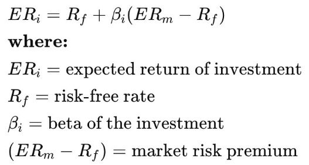

# Others

## Nifty VIX (India Volatility Index)

The India Volatility Index in short is termed India VIX. It indicates the degree of volatility or fluctuation traders expect over the next 30 days in the Nifty50 Index

[Volatility and India VIX](https://www.youtube.com/watch?v=JM_M1RPkCR8)

- Historical Volatility
- Forecasted Volatility
- Implied Volatility
- Avoid buying options when VIX is high
- Avoid selling options when VIX is low

[ET Money Answers Your Questions on Mutual Funds | ET Money](https://youtu.be/Xc2jI6A3M_0)

## Equity Risk Premium

- An equity risk premium is an excess return earned by an investor when they invest in the stock market over a risk-free rate
- This return compensates investors for taking on the higher risk of equity investing
- Determining an equity risk premium is theoretical because there's no way to tell how well equities or the equity market will perform in the future
- Calculating an equity risk premium requires using historical rates of return

https://www.investopedia.com/terms/e/equityriskpremium.asp

[The Price of Risk: With Equity Risk Premiums, Caveat Emptor! - YouTube](https://www.youtube.com/watch?v=uJN3CUcgF8A)

## Capital Asset Pricing Model (CAPM)

The Capital Asset Pricing Model (CAPM) describes the relationship between systematic risk and [expected return](https://www.investopedia.com/terms/e/expectedreturn.asp) for assets, particularly stocks.CAPM is widely used throughout finance for pricing risky [securities](https://www.investopedia.com/terms/s/security.asp) and generating expected returns for assets given the risk of those assets and [cost of capital](https://www.investopedia.com/terms/c/costofcapital.asp).

https://www.investopedia.com/terms/c/capm.asp
