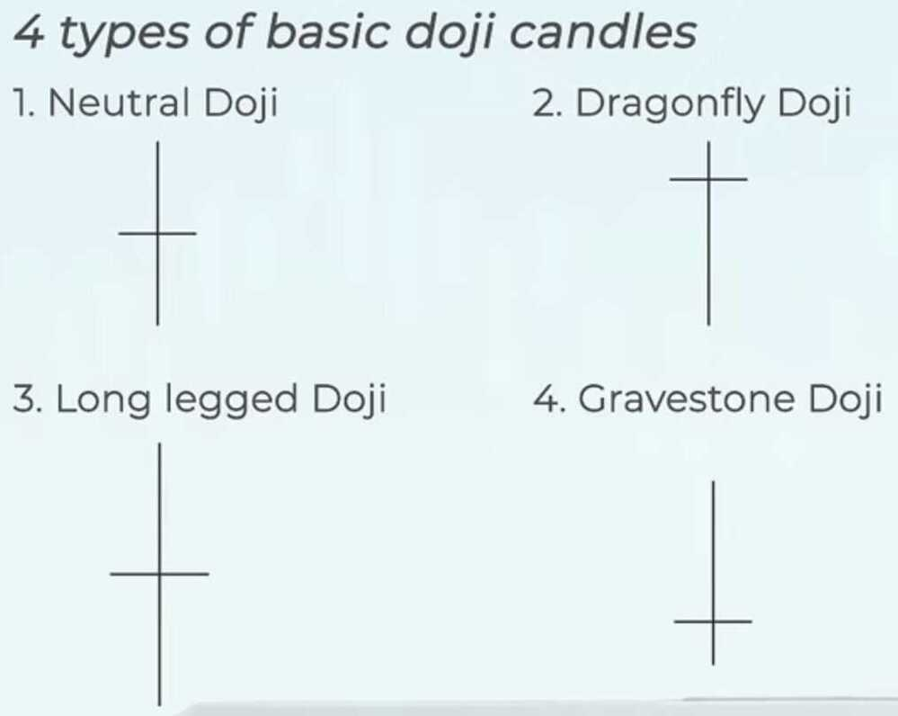
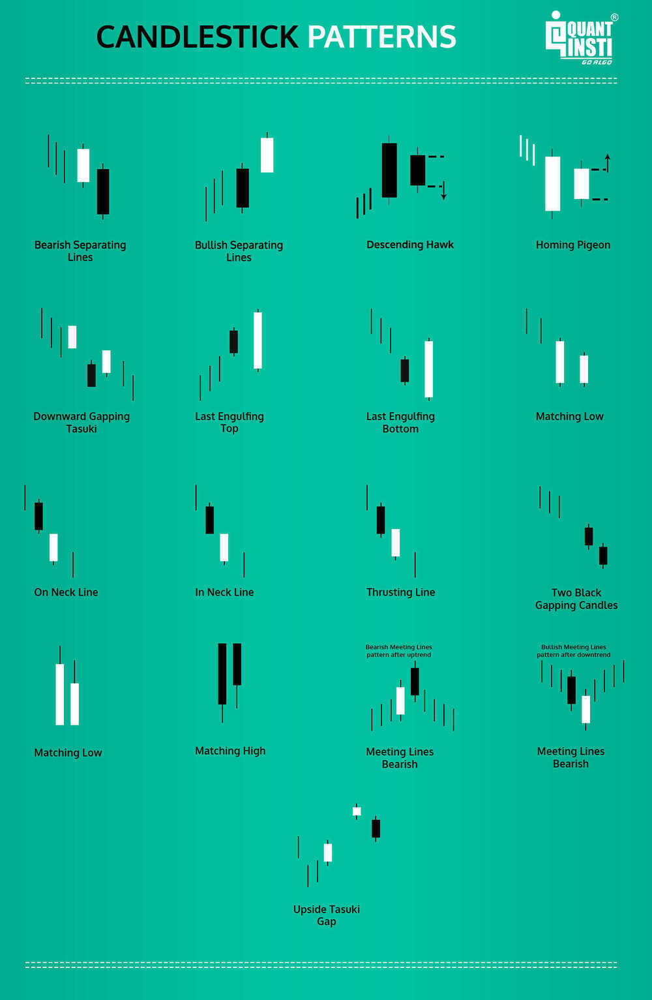
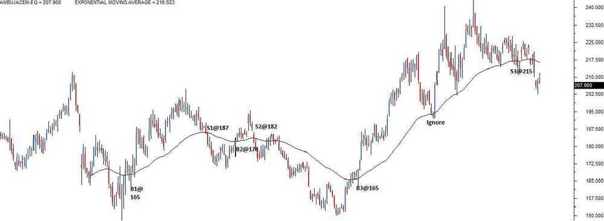
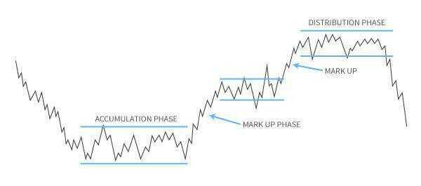

# Technical Analysis

Technical Analysis helps identify trading opportunities using actions of Market Participants through charts, patterns, and indicators.

## The Chart Types

We explore the different chart types used in technical analysis along with its merits and de merits. Specifically we discuss the candlestick chart and why traders prefer **candlesticks** over bar charts.

### Japanese Candlesticks

| **Time Frame** | **Open** | **High** | **Low** | **Close** | **No of Candles** |
|---|---|---|---|---|---|
| **Monthly** | The opening price on the first day of the month | Highest price at which the stock traded during the entire month | Lowest price at which the stock traded during the entire month | The closing price on the last day of month | 12 candles for the entire year |
| **Weekly** | Monday’s opening price | Highest price at which the stock traded during the entire week | Lowest price at which the stock traded during the entire week | The closing price on Friday | 52 candles for the entire year |
| **Daily or EOD** | Opening price of the day | Highest price at which the stock traded during the day | Lowest price at which the stock traded during the day | The closing price of the day | One candle per day, 252 candles for the entire year |
| **Intraday 30 minutes** | The opening price at the beginning of the 1st minute | Highest price at which the stock traded during the 30 minute duration | Lowest price at which the stock traded during the 30 minute duration | The closing price as on the 30th minute | Approximately 12 candles per day |
| **Intraday 15 minutes** | The opening price at the beginning of the 1st minute | Highest price at which the stock traded during the 15 minute duration | Lowest price at which the stock traded during the 15 minute duration | The closing price as on the 15th minute | 25 candles per day |
| **Intraday 5 minutes** | The opening price at the beginning of the 1st minute | Highest price at which the stock traded during the 5 minute duration | Lowest price at which the stock traded during the 5minute duration | The closing price as on the 5th minute | 75 candles per day |

- There are two types of candlesticks -- Bullish candle and Bearish candle. The structure of the candlestick however remains the same
- When close > open = It is a Bullish candle. When close < open = It is a Bearish candle

## Getting Started with Candlesticks

Basic concepts on various candlestick patterns used by traders to make decisions on the market. We also discuss the basic classification of candlestick patterns

The candlesticks are used to identify trading patterns. Patterns in turn help the technical analyst to set up a trade. The patterns are formed by grouping two or more candles in a certain sequence. However, sometimes powerful trading signals can be identified by just single candlestick pattern.

Hence, candlesticks can be broken down into single candlestick pattern and multiple candlestick patterns.

## Single Candlestick Patterns

### Doji - Indecisive

### Hammer candle - Bullish

### Shooting star - Bearish

### 1. Marubozu (bald)

- Bullish Marubozu
- Bearish Marubozu

1. Remember the rules based on which candlesticks work
2. Marubuzo is the only pattern which violates rule number 3 i.e Look for prior trend
3. A bullish marubuzo indicates bullishness
    1. Buy around the closing price of a bullish marubozu
    2. Keep the low of the marubuzo as the stoploss
4. A bearish marubuzo indicates bearishness
    1. Sell around the closing price of a bearish marubozu
    2. Keep the high of the marubuzo as the stoploss
5. An aggressive trader can place the trade on the same day as the pattern forms
6. Risk averse traders can place the trade on the next day after ensuring that it obeys rule number 1 i.e Buy strength, and Sell weakness
7. An abnormal candle lengths should not be traded
    1. Short candle indicates subdued activity
    2. Long candle indicates extreme activity, however placing stoploss becomes an issue.

### 2. Doji

In Japanese, Doji means blunder or mistake

### 3. Spinning Tops

8. A spinning top has a small real body. The upper and lower shadows are almost equal in length
9. The colour of the spinning top does not matter. What matters is the fact that the open and close prices are very close to each other
10. Spinning tops conveys indecision in the market with both bulls and bears being in equal control
11. Spinning top at the top end of the rally indicates that either the bulls are taking a pause before they can resume the uptrend further or the bears are preparing to break the trend. In either case, the trader's stance has to be cautious. If the trader's intent is to buy, he is better off buying only half the quantity and he should wait for the markets to move in his direction
12. Spinning top at the bottom end of the rally indicates that either the bears are taking a pause before they can resume the down trend further or the bulls are preparing to break the trend and take the markets higher. Either case, the trader's stance has to be cautious. If the traders intent is to buy, he is better off buying only half the quantity and he should wait for the markets to make the move
13. Doji's are very similar to spinning tops. Doji also convey indecision in the market. By definition dojis do not have a real body. However in reality, even if a wafer thin body appears it is acceptable
14. A trader's stance based on dojis is similar to stance taken when a spinning top occurs.

### 4. Paper umbrella

- Hammer
- Hanging man

### 5. Shooting star

15. A paper umbrella has a long lower shadow and a small real body. The lower shadow and the real body should maintain the 'shadow to real body' ratio. In case of the paper umbrella the lower shadow should be at least twice the length of the real body
16. Since the open and close prices are close to each other, the color of the paper umbrella should not matter
17. If a paper umbrella appears at the bottom of a down trend, it is called the 'hammer'
18. If the paper umbrella appears at the top end of an uptrend, it is called the hanging man
19. The hammer is a bullish pattern and one should look at buying opportunities when it appears
20. The low of the hammer acts as the stop loss price trade
21. The hanging man is a bearish pattern which appears at the top end of the trend, one should look at selling opportunities when it appears
22. The high of the hanging man acts as the stop loss price for the trade
23. The shooting star is a bearish pattern which appears at the top end of the trend. One should look at shorting opportunities when a shooting star appears
24. The high of the shooting star will be the stop loss price for the trade.

Multiple candlestick patterns are a combination of multiple candles.

## Multiple Candlestick Patterns

25. Engulfing pattern
	- Bullish Engulfing
	- Bearish Engulfing
26. Harami
	- Bullish Harami
	- Bearish Harami
27. Piercing Pattern
28. Dark cloud cover
29. Morning Star
30. Evening Star - It is a bearish candlestick pattern and is formed at the end of an uptrend

### Pattern Analysis

31. Multiple candlestick patterns evolve over two or more trading days
32. The bullish engulfing pattern evolves over two trading days. It appears at the bottom end of downtrend. Day one is called P1 and day 2 is called P2
33. In a bullish engulfing pattern, P1 is a red candle, and P2 is a blue candle. P2's blue candle completely engulfs P1;s red candle
34. A risk taker initiates a long trade at the close of P2 after ensuring P1 and P2 together form a bullish engulfing pattern. A risk averse trader will initiate the trade the day after P2, near the close of the day
35. The stoploss for the bullish engulfing pattern is the lowest low between P1 and P2
36. The bearish engulfing pattern appears at the top end of an uptrend. P1's blue candle is completely engulfed by P2's red candle
37. A risk taker initiates a short trade at the close of P2 after ensuring P1 and P2 together form a bearish engulfing pattern. The risk averse trader will initiate the trade the day after P2, after confirming the day forms a red candle
38. The highest high of P1 and P2 forms the stoploss for a bearish engulfing pattern
39. The presence of a doji after an engulfing pattern tends to catalyze the pattern's evolution.
40. The piercing pattern works very similar to bullish engulfing pattern, except that P2's blue candle engulfs at least 50% and below 100% of P1's red candle
41. The dark cloud cover works similar to the bearish engulfing pattern, except that P2's red candle engulfs at least 50% and below 100% of P1's blue candle.

### Pattern Analysis

42. The harami pattern evolves over 2 trading sessions -- P1 and P2.
43. Day 1 (P1) of the pattern forms a long candle and day 2(P2) of the pattern forms a small candle which appears as if it has been tucked inside the P1's long candle
44. A bullish harami candle pattern is formed at the lower end of a down trend. P1 is a long red candle, and P2 is a small blue candle. The idea is to initiate a long trade near the close of P2 (risk taker). A risk averse trader will initiate the long trade near the close of the day after P2 only after ensuring it forms a blue candle day
45. The stop loss on a bullish harami pattern is the lowest low price between P1 and P2
46. The bearish harami pattern is formed at the top end of an uptrend. P1 is a long blue candle, and P2 is a small red candle. The idea is to initiate a short trade near the close of P2 (risk taker). The risk averse will initiate the short near the close of the day only after ensuring it is a red candle day
47. The stop loss on a bearish harami pattern is the highest high price between P1 and P2.

### Pattern Analysis

48. Price Gaps - **Gap up opening, Gap down opening**
49. Star formation occurs over three trading sessions. The candle of P2 is usually a doji or a spinning top
50. If there is a doji on P2 in a star pattern, it is called a doji star (morning doji star, evening doji star) else it is just called the star pattern (morning star, evening star)
51. Morning star is a bullish pattern which occurs at the bottom end of the trend. The idea is to go long on P3 with the lowest low of the pattern being the stop loss for the trade
52. Evening star is a bearish pattern, which occurs at the top end of an up trend. The idea is to go short on P3, with the highest high of the pattern acting as a stop loss
53. The star formation evolves over a 3 days period, hence both the risk averse and risk taker are advised to initiate the trade on P3
54. Candlesticks portray the traders thought process. One should nurture this thought process as he dwells deeper into the candlestick study

## The Support and Resistance (S&R) - setting price targets

### The Resistance

Resistance is something which stops the price from rising further. The resistance level is a price point on the chart where traders expect maximum supply (in terms of selling) for the stock/index. The resistance level is always above the current market price. The likely hood of the price rising up to the resistance level, consolidating, absorbing all the supply, and then declining is high.

55. The resistance level, indicated by a horizontal line, is higher than the current market price.
56. While the resistance level is at 215, the current candle is at 206.75. The current candle and its corresponding price level are encircled for your reference

For a moment let us imagine Ambuja cements at Rs.206 forming a bullish marubuzo with a low of 202. We know this is a signal to initiate a long trade, and we also know that the stoploss for this trade is at 202. With the new found knowledge on resistance, we now know that we can set 215 as a possible target for this trade!

Why 215 you may wonder? The reasons are simple:-

57. Resistance of 215 implies there is a likelihood of excess supply
58. Excess supply builds selling pressure
59. Selling pressure tends to drag the prices lower

Hence for reasons stated above, when a trader is long he can look at resistance points to set targets and to set exit points for the trade.

Also, with the identification of the resistance the long trade can now be completely designed as follows:

Entry -- 206, Stoploss -- 202, and Target -- 215

The identification process is the same for both support and resistance. If the current market price is below the identified point, it is called a resistance point; else it is called a support point.

### The Support

As the name suggests, the support is something that prevents the price from falling further. The support level is a price point on the chart where the trader expects maximum demand (in terms of buying) coming into the stock/index. Whenever the price falls to the support line, it is likely to bounce back. The support level is **always below** the current market price. There is a maximum likely hood that the price could fall till the support, consolidate, absorb all the demand, and then start to move upwards. The support often acts as a trigger to buy.

60. The support level, indicated by the horizontal line is below the current market price
61. While the support level is at 435, the current candle is at 442.5. The current candle and its corresponding price level are encircled for your reference

Like we did while understanding resistance, let us imagine a bearish pattern formation -- perhaps a shooting star at 442 with a high of 446. Clearly with a shooting star, the call is to short Cipla at 442, with 446 as the stoploss. Since we know 435 the immediate support, we can set the target at 435.

### So what makes Rs.435 target worthy? The following reasons back the decision

- Support at 435 implies there is a maximum likely hood of excess demand to emerge
- Excess demand builds buying pressure
- Buying pressure tends to drag the price higher

Hence for the reasons stated above, when a trader is short, he can look at support points to set targets and to set exit points for the trade.

Also, with the identification of the support, the short trade is now completely designed.
Entry -- 442, stoploss -- 446, and target -- 435.

62. To identify S&R, place a horizontal line in such a way that it connects at least 3 price action zones, well spaced in time. The more number of price action zones (well spaced in time) the horizontal line connects, the stronger is S&R
63. S&R can be used to identify targets for the trade. For a long trade, look for the immediate resistance level as target. For a short trade, look for the immediate support level as target.
64. Lastly, comply with the checklist for optimal trading results

## Volumes

Volumes indicate how many shares are bought and sold over a given period of time.

| **Price** | **Volume** | **What is the expectation?** |
|-----------|------------|------------------------------|
| Increases | Increases  | Bullish                      |
| Increases | Decreases  | Caution - weak hands buying  |
| Decreases | Increases  | Bullish                      |
| Decreases | Decreases  | Caution - weak hands selling |

High Volume = Today's volume > last 10 days average volume

Low Volume = Today's volume < last 10 days average volume

Average Volume = Today's volume = last 10 days average volume

Usually institutional money is referred to as the "smart money". It is perceived that 'smart money' always makes wiser moves in the market compared to retail traders. Hence following the smart money seems like a wise idea.

65. Volumes are used to confirm a trend
66. 100 share buy and 100 shares sell makes the total volume 100, not 200
67. The end of day volumes indicates the cumulative volume across trades executed throughout the day
68. High volumes indicates the presence of smart money
69. Low volumes indicate retail participation
70. When you initiate a trade to either go long or short always make sure if volumes confirm
71. Avoid trading on low volume days

## Moving Averages

Moving average is a simple technical analysis indicator used to detect the price trend. Learn about the moving average and a how to set up a simple moving average trading system.

- Zerodha Moving Average Type
    - Simple
    - Exponential
    - Time Series
    - Triangular
    - Variable
    - VIDYA
    - Weighted
    - Welles Wilder
    - Hull
    - Double Exponential
    - Triple Exponential

### A simple application of moving average (trading system based on a 50 day exponential moving average)

Remember a good trading system gives you a signal to enter a trade and a signal to close out the trade.

- Buy (go long) when the current market price turns greater than the 50 day EMA. Once you go long, you should stay invested till the necessary sell condition is satisfied

- Exit the long position (square off) when the current market price turns lesser than the 50 day EMA

Moving averages works brilliantly when there is a trend and fails to perform when the stock moves sideways. This basically means the 'Moving average' in its simplest form is a trend following system.

- Moving averages gives you many trading signals (buy and sell) during a sideways market. Most of these signals result in marginal profits, if not for losses
- However usually one of those many trades results in a massive rally (like the B3@165 trade) leading to impressive gains
- It would be very difficult to segregate the big winner from the many small trades
- Hence the trader should not be selective in terms of selecting signals that moving average system suggest. In fact the trader should trade all the trades that the system suggests
- Remember the losses are minimum in a moving average system, but that 1 big trade is good enough to compensate all the losses and can give you sufficient profits
- The profit making trade ensures you are in the trend as long as the trend lasts. Sometime even upto several months. For this reason, MA can be used as a proxy for identifying long term investment ideas
- The key to MA trading system is to take all the trades and not be judgmental about the signals being generated by the system.

### Moving Average Crossover system

In a MA crossover system, instead of the usual single moving average, the trader combines two moving averages. This is usually referred to as 'smoothing'.

A typical example of this would be to combine a 50 day EMA, with a 100 day EMA. The shorter moving average (50 days in this case) is also referred to as the faster moving average. The longer moving average (100 days moving average) is referred to as the slower moving average.

The shorter moving average takes lesser number of data points to calculate the average and hence it tends to stick closer to the current market price, and therefore reacts more quickly. A longer moving average takes more number of data points to calculate the average and hence it tends to stay away from the current market price. Hence the reactions are slower.

- Buy (fresh long) when the short term moving averages turns greater than the long term moving average. Stay in the trade as long as this condition is satisfied
- Exit the long position (square off) when the short term moving average turns lesser than the longer term moving average

A trader can use any combination to create a MA cross over system. Some of the popular combinations for a swing trader would be:

72. 9 day EMA with 21 day EMA -- use this for short term trades ( upto few trading session)
73. 25 day EMA with 50 day EMA -- use this to identify medium term trade (upto few weeks)
74. 50 day EMA with 100 Day EMA -- use this to identify trades that lasts upto few months
75. 100 day EMA with 200 day EMA -- use this to identify long term trades (investment opportunities), some of them can even last for over a year or more.

Remember, longer the time frame the lesser the number of trading signals.

### Key takeaways from this chapter

- A standard average calculation is a quick approximation of a series of numbers
- In a average calculation where the latest data is included, and the oldest is excluded is called a Moving Average
- The simple moving average (SMA) gives equal weightage to all data points in the series
- An exponential moving average (EMA) scales the data according to its newness. Recent data gets the maximum weightage and the oldest gets the least weightage
- For all practical purposes, use an EMA as opposed to SMA. This is because the EMA gives more weightage to the most recent data points
- The outlook is bullish when the current market price is greater than the EMA. The outlook turns bearish when the current market price turns lesser than the EMA
- In a non trending market, moving averages may result in whipsaws thereby causing frequent losses. To overcome this a EMA crossover system is adopted
- In a typical crossover system, the price chart is over laid with two EMAs. The shorter EMA is faster to react, while the longer EMA is slower to react
- The outlook turns bullish when the faster EMA crosses and is above the slower EMA. Hence one should look at buying the stock. The trade lasts upto a point where the faster EMA starts going below the slower EMA
- The longer the time frame one chooses for a crossover system, the lesser the trading signals.

## The Fibonacci Retracements

Starting with the basics of the construction of the Fibonacci sequence, we also learn about the derivation of the Golden Ratio.

It is believed that the Fibonacci ratios i.e 61.8%, 38.2%, and 23.6% finds its application in stock charts. Fibonacci analysis can be applied when there is a noticeable up-move or down-move in prices. Whenever the stock moves either upwards or downwards sharply, it usually tends to retrace back before its next move. For example if the stock has run up from Rs.50 to Rs.100, then it is likely to retrace back to probably Rs.70, before it can move Rs.120.

The retracement level forecast' is a technique using which one can identify upto which level retracement can happen. These retracement levels provide a good opportunity for the traders to enter new positions in the direction of the trend. The Fibonacci ratios i.e 61.8%, 38.2%, and 23.6% helps the trader to identify the possible extent of the retracement. The trader can use these levels to position himself for trade

## The Dow Theory (Part 1)

A brief on the history of the Dow theory, its principles and the types of trends in Dow theory -- Primary, Secondary and Minor and the inference of each trend type in relation to the markets.

We also learn how to interpret the risk to reward ratio to make market entry and exit decisions.

The Dow Theory is built on a few beliefs. These are called the Dow Theory tenets. These tenets were developed by Charles H Dow over the years of his observation on the markets. There are 9 tenets that are considered as the guiding force behind the Dow Theory.

| **Tenet**                                        | **What does it mean?**                                                                                                                                                                                                                                                                                                         |
|----------------|--------------------------------------------------------|
| Indices discounts everything                     | The stock market indices discount everything which is known & unknown in the public domain. If a sudden and unexpected event occurs, the stock market indices quickly recalibrates itself to reflect the accurate value                                                                                                        |
| Overall there are 3 broad market trends          | Primary Trend, Secondary Trend, and Minor Trends                                                                                                                                                                                                                                                                               |
| The Primary Trend                                | This is the major trend of the market that lasts from a year to several years. It indicates the broader multiyear direction of the market. While the long term investor is interested in the primary trend, an active trader is interested in all trends. The primary trend could be a primary uptrend or a primary down trend |
| The Secondary Trend                              | These are corrections to the primary trend. Think of this as a minor counter reaction to the larger movement in the market. Example -- corrections in the bull market, rallies & recoveries in the bear market. The counter trend can last anywhere between a few weeks to several months                                      |
| Minor Trends/Daily fluctuations                  | These are daily fluctuations in the market, some traders prefer to call them market noise                                                                                                                                                                                                                                      |
| All Indices must confirm with each other         | We cannot confirm a trend based on just one index. For example the market is said to be bullish only if CNX Nifty, CNX Nifty Midcap, CNX Nifty Smallcap etc all move in the same upward direction. It would not be possible to classify markets as bullish, just by the action of CNX Nifty alone                              |
| Volumes must confirm                             | The volumes must confirm along with price. The trend should be supported by volume. In an uptrend the volume must increase as the price rises and should reduce as the price falls. In a downtrend, volume must increase when the price falls and decrease when the price rises.                                               |
| Sideway markets can substitute secondary markets | Markets may remain sideways (trading between a range) for an extended period. Example - Reliance Industries between 2010 and 2013 was trading between 860 and 990. The sideways markets can be a substitute for a secondary trend                                                                                              |
| The closing price is the most sacred             | Between the open, high, low and close prices, the close is the most important price level as it represents the final evaluation of the stock during the day                                                                                                                                                                    |

### Different phases of the market

Dow Theory suggests the markets are made up of three distinct phases, which are self repeating. These are called the Accumulation phase, the Mark up phase, and the Distribution phase.

The Accumulation phase usually occurs right after a steep sell off in the market. The steep sell off in the markets would have frustrated many market participants, losing hope of any sort of uptrend in prices. The stock prices would have plummeted to rock bottom valuations, but the buyers would still be hesitant of buying fearing there could be another sell off. Hence the stock price languishes at low levels. This is when the 'Smart Money' enters the market.

Smart money is usually the institutional investors who invest from a long term perspective. They invariably seek value investments which is available after a steep sell off. Institutional investors start to acquire shares regularly, in large quantities over an extended period of time. This is what makes up an accumulation phase. This also means that the sellers who are trying to sell during the accumulation phase will easily find buyers, and therefore the prices do not decline further. Hence invariably the accumulation phase marks the bottom of the markets. More often than not, this is how the support levels are created. Accumulation phase can last up to several months.

Once the institutional investors (smart money) absorb all the available stocks, short term traders sense the occurrence of a support. This usually coincides with improved business sentiment. These factors tend to take the stock price higher. This is called the mark up phase. During the Mark up phase, the stock price rallies quickly and sharply. The most important feature of the mark up phase is the speed. Because the rally is quick, the public at large is left out of the rally. New investors are mesmerized by the return and everyone from the analysts to the public see higher levels ahead.

Finally when the stock price reaches new highs (52 week high, all time high) everyone around would be talking about the stock market. The news reports turn optimistic, business environment suddenly appears vibrant, and everyone one (public) wants to invest in the markets. The public by and large, wants to get involved in the markets as there is a positive sentiment. This is when the distribution phase occurs.

The judicious investors (smart investors) who got in early (during the accumulation phase) will start offloading their shares slowly. The public will absorb all the volumes off loaded by the institutional investors (smart money) there by giving them the well needed price support. The distribution phase has similar price properties as that of the accumulation phase. In the distribution phase, whenever the prices attempt to go higher, the smart money off loads their holdings. Over a period of time this action repeats several times and thus the resistance level is created.

Finally when the institutional investors (smart money) completely sell off their holdings, there would no further support for prices, and hence what follows after the distribution phase is a complete sell off in the markets, also known as the mark down of prices. The selloff in the market leaves the public in an utter state of frustration.

Completing the circle, what follows the selloff phase is a fresh round of accumulation phase, and the whole cycle repeats again. It is believed that that entire cycle from accumulation phase to the selloff spans over a few years.

### Dow Patterns

#### The Double bottom & Double top formation

A double top & double bottom is considered a reversal pattern.

Imagine a situation where in the double top formation, the 2nd top forms a bearish pattern such as shooting star. This means, both from the Dow Theory and candlestick perspective there is consensus to sell; hence the conviction to take the trade is higher.

#### Others

76. The Triple Bottom & Triple Top
77. Range formation
78. Flag formation

### Summary

- A range is formed when the stock oscillates between the two price points
- A trader can buy at the lower price point, and sell at the higher price point
- The stock gets into a range for a specific reason such as the lack of fundamental triggers, or event expectation
- The stock can break out of the range. A good breakout is characterized by above average volumes and sharp surge in prices
- If the trader has missed an opportunity to buy a stock, the flag formation offers another window to buy
- RRR is a critical parameter for trade evaluation. Develop a minimum RRR threshold based on your risk appetite
- Before initiating a trade the trader should look at the opportunity from the Dow Theory perspective

[Dow Theory Explained: What It Is and How It Works](https://www.investopedia.com/terms/d/dowtheory.asp)

[The Dow Theory (Part 1) - Varsity by Zerodha](https://zerodha.com/varsity/chapter/dow-theory-part-1/)

## Supplementary Notes 1

Average Directional Index (ADX) About: The Average Directional Index (ADX), Minus Directional Indicator (-DI) and Plus Directional Indicator (+DI) represent a group of directional movement indicators

## Interesting features on TradingView

If you don't know already, then TradingView is now available on Kite. Here is the Trading Q&A post announcing the beta launch. Given this, I thought I could share a few of my favourite

## Elliott Wave Theory

- The Elliott Wave theory is a technical analysis of price patterns related to changes in investor sentiment and psychology.
- The theory identifies impulse waves that establish a pattern and corrective waves that oppose the larger trend.
- Each set of waves is within another set of waves that adhere to the same impulse or corrective pattern, described as a fractal approach to investing.

https://www.investopedia.com/terms/e/elliottwavetheory.asp

https://en.wikipedia.org/wiki/Elliott_wave_principle

## Others

[How to analyse the markets? - Part 1](https://www.youtube.com/watch?v=dMjce5P4j-Y)

[How to Use Piotroski Score to Find Fundamentally Strong Long-Term Stocks | Joseph Piotroski F-Score - YouTube](https://www.youtube.com/watch?v=oFoiXgi6eNk)
