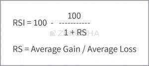

# Technical Indicators

### Relative strength index (RSI) (14)

### Moving average convergence divergence (MACD) (12,26,9)

### Stochastic(20,3)

It is a momentum indicator. It shows the location of the close relative to the high-low range over a set number of periods. Time period generally considered is 20 days. Readings above 80 indicate a security is overbought. Readings between 55 & 80 indicate Bullish condition. Readings between 45 & 55 indicate Neutral condition.Readings between 20 & 45 indicate Bearish condition.Readings below 20 indicate a security is oversold.

### ROC(20)

It stands for Rate of Change. It is a momentum oscillator that takes the current price and compares it to a price "n" periods ago. Time period generally considered is 20 days. The ROC is plotted against a zero line that differentiates positive and negative values. Value above 0 indicates Bullish condition. Value below 0 indicates Bearish condition. Value equal to 0 indicates Neutral condition.

### CCI(20)

It stands for Commodity Channel Index. It gives an indication of trend change & also the momentum within the trend. Time period generally considered is 20 days.CCI is relatively high when prices are far above their average & relatively low when prices are far below their average. The CCI typically oscillates above and below a zero line, above zero line it enters into positive territory & below zero into negative territory. Normal oscillations will occur within the range of +200 and −200. Readings above 200 imply an overbought condition, while readings below −200 imply an oversold condition. CCI between -200 & -50 implies a bearish condition. CCI between -50 & 50 implies neutral condition. CCI between 50 & 200 implies bullish condition.

### Williamson%R(14)

It is a momentum indicator which indicates the current closing price of the stock in relation to its high & low of the past 14 days. Its purpose is to tell whether a stock is trading near the high or the low, or somewhere in between of its recent trading range. Readings between 0 and -20 imply an overbought condition, readings between -20 to -50 implies bulish condition, readings between -50 to -80 implies bearish condition and readings between -80 to -100 imply oversold position.

### MFI(14)

It stands for Money Flow Index. It is a momentum indicator that measures the flow of money into and out of a security. Time period generally considered is 14 days. MFI considers both price & volume to measure buying and selling pressure. Very high MFI that begins to fall below a reading of 80 while the underlying security continues to climb is a reversal signal to the downside. Conversely, a very low MFI reading that climbs above a reading of 20 while the underlying security continues to sell off is a reversal signal to the upside.

### ATR(14)

Stands for Average True Range. It is a volatility indicator which indicates the degree of price volatility at an absolute level compared with its 9 SMA. Time period generally considered is 14 days. If the value is greater than its 9 SMA it considered to be Highly Volatile. If the value is less than equal to its 9 SMA it is considered to be Less Volatile. It does not provide any indication of price trend.

### ADX(14)

It stands for Average Directional Index. It indicates only the trend strength. It is a lagging indicator; that is, a trend must have established itself before the ADX will generate a signal. Time period generally considered is 14 days. When the ADX line is rising, trend strength is increasing, and the price moves in the direction of the trend. When the line is falling, trend strength is decreasing, and the price enters a period of retracement or consolidation.A falling ADX line only means that the trend strength is weakening, but it usually does not mean the trend is reversing.

### Bollinger Band(20,2)

### VWAP (Volume Weighted Average Price) Indicator

[Intraday trading strategy for regular income | VWAP Special trading strategy | - YouTube](https://www.youtube.com/watch?v=Oqzz2ayqTpA)

It represents the average price throughout the day which is weighted by volume i.e. **price moves with higher volumes are given more weightage while calculating the indicator**. It is plotted only on intraday time frames. Institutional traders often refer the VWAP to place their trades. **They use the indicator as a benchmark to decide whether the current price is good for buying or if the stock is overpriced.**

### OBV (On Balance Volume)

The indicator relates volume flow to changes in the price of the stock. The indicator is formed by a cumulative total of positive and negative volumes

### MFI (Money Flow Index)

The money flow index is an oscillator that oscilates between 0 and 100. It uses price and volume data to identify overbought and oversold conditions. When the indicator is above 80, the price is said to be overbought, it is very similar to the RSI indicator but also includes volume.

### Donchain Channels

Donchian Channels are three lines generated by moving average calculations that comprise an indicator formed by upper and lower bands around a midrange or median band. The upper band marks the highest price of a security over N periods while the lower band marks the lowest price of a security over N periods. The area between the upper and lower bands represents the Donchian Channel.

https://www.investopedia.com/terms/d/donchianchannels.asp

## Indicators (Part 1)

A technical indicator helps a trader analyze the price movement of a security.

Indicators are independent trading systems introduced to the world by successful traders. Indicators are built on preset logic using which traders can supplement their technical study (candlesticks, volumes, S&R) to arrive at a trading decision. Indicators help in buying, selling, confirming trends, and sometimes predicting trends.

Indicators are of two types namely leading and lagging. A leading indicator leads the price, meaning it usually signals the occurrence of a reversal or a new trend in advance. While this sounds interesting, you should note, not all leading indicators are accurate. Leading indicators are notorious for giving false signals. Therefore, the trader should be highly alert while using leading indicators. In fact the efficiency of using leading indicators increases with trading experience.

A majority of leading indicators are called oscillators as they oscillate within a bounded range. Typically an oscillator oscillates between two extreme values -- for example 0 to 100. Based on the oscillator's reading (for example 55, 70 etc) the trading interpretation varies.

A lagging indicator on the other hand lags the price; meaning it usually signals the occurrence of a reversal or a new trend after it has occurred. You may think, what would be the use of getting a signal after the event has occurred? Well, it is better late than never. One of the most popular lagging indicators is the moving averages.

## Momentum

Momentum is the rate at which the price changes. For example if stock price is Rs.100 today and it moves to Rs.105 the next day, and Rs.115, the day after, we say the momentum is high as the stock price has changed by 15% in just 3 days. However if the same 15% change happened over let us say 3 months, we can conclude the momentum is low. So the more rapidly the price changes, the higher the momentum

## RSI(14) Relative Strength Index

Stands for Relative Strength Index. It is a momentum indicator used to identify overbought or oversold condition in the stock.Time period generally considered is 14 days. RSI reading below 25 is interpreted as oversold. RSI between 25 & 45 is interpreted as a bearish condition. RSI between 45 & 55 is interpreted as a neutral condition.RSI between 55 & 75 is interpreted as a bullish condition. RSI reading greater than 75 is interpreted as an overbought.

Relative strength Index or just RSI, is a very popular indicator developed by J.Welles Wilder. RSI is a leading momentum indicator which helps in identifying a trend reversal. RSI indicator oscillates between 0 and 100, and based on the latest indicator reading, the expectations on the markets are set.

Used to predict the short term movement in the market

The term "Relative Strength Index" can be a bit misleading as it does not compare the relative strength of two securities, but instead shows the internal strength of the security. RSI is the most popular leading indicator, which gives out strongest signals during the periods of sideways and non trending ranges.

The formula to calculate the RSI is as follows:

The objective of using RSI is to help the trader identify over sold and overbought price areas. Overbought implies that the positive momentum in the stock is so high that it may not be sustainable for long and hence there could be a correction. Likewise, an oversold position indicates that the negative momentum is high leading to a possible reversal.

When the RSI reading is between 30 and 0, the security is supposed to be oversold and ready for an upward correction. When the security reading is between 70 and 100, the security is supposed to be heavily bought and is ready for a downward correction.

fewer the days you use to calculate the RSI, the more volatile the indicator would be.

- If the RSI value is fixed in a region for a prolonged period, it indicates excess momentum and hence instead of taking a reversed position, the trader can consider initiating a trade in the same direction.

## MACD(12,26,9)

- MACD Crossover
- MACD Crossunder

Stands for **Moving Average Convergence Divergence**.It is a trend following momentum indicator. For calculation three moving averages are taken which are 9 day EMA, 12 day EMA & 26 day EMA. The 26 day EMA subtracted from the 12 day EMA alongwith the 9 day EMA which is the "signal line", together give buy/sell signals. If the MACD is above 0 and crosses above the signal line it is considered to be a bullish signal. If the MACD is below 0 and crosses below the signal line it is considered to be a bearish signal.

1. When the MACD Line crosses the center line from the negative territory to positive territory, it means there is divergence between the two averages. This is a sign of increasing bullish momentum; therefore one should look at buying opportunities.

2. When the MACD line crosses the center line from positive territory to the negative territory it means there is convergence between the two averages. This is a sign of increasing bearish momentum; therefore one should look at selling opportunities.

9 day signal line is a exponential moving average (EMA) of the MACD line.

With these two lines, a trader can follow a simple 2 line crossover strategy

1. The sentiment is bullish when the MACD line crosses the 9 day EMA wherein MACD line is greater than the 9 day EMA. When this happens, the trader should look at buying opportunities

2. The sentiment is bearish when the MACD line crosses below the 9 day EMA wherein the MACD line is lesser than the 9 day EMA. When this happens, the trader should look at selling opportunities

## Bollinger Band(20,2)

Stands for Bollinger Bands. It is a technical analysis tool defined by a set of lines plotted two standard deviations (positively and negatively) away from a simple moving average.The upper and lower bands are typically 2 standard deviations +/- from a 20-day simple moving average.It is believed the closer the prices move to the upper band, the **more overbought the market**, and the closer the prices move to the lower band, the **more oversold the market**. Approximately 90% of price action occurs between the two bands. Any breakout above or below the bands is a major event. The breakout is not a trading signal.

Introduced by John Bollinger in the 1980s, Bollinger bands (BB) is perhaps one of the most useful indicators used in technical analysis. BB are used to determine overbought and oversold levels, where a trader will try to sell when the price reaches the top of the band and will execute a buy when the price reaches the bottom of the band.

The BB has 3 components:

1. Middle line which is The 20 day simple moving average of the closing prices
2. An upper band -- this is the +2 standard deviation of the middle line
3. A lower band -- this is the -2 standard deviation of the middle line

The standard deviation (SD) is a statistical concept; which measures the variance of a particular variable from its average. In finance, the standard deviation of the stock price represents the volatility of a stock. For example, if the standard deviation of a stock is 12%, it is as good as saying that the volatility of the stock is 12%.

while most of the signals works quite well, there was a phase when the price stuck to the upper band. In fact the price continued to drift higher, and therefore even the upper band expanded. This is called an envelope expansion.

The BB's upper and lower band together forms an envelope. The envelope expands, whenever the price drifts in a particular direction indicating a strong momentum. The BB signal fails when there is an envelope expansion. This leads us to an important conclusion; BB works well in sideways markets, and fails in a trending market.

Personally whenever, I use BB I expect the trade to start working in my favor almost immediately. If it does not, I start validating the possibility of an envelope expansion.

[Bollinger Bands - find market Top and Bottom | Maximum profit strategy by Power of stocks |](https://www.youtube.com/watch?v=nOg6dkejCyo)

## Fibonacci retractments

Along with the above points, if the stoploss also coincides with the Fibonacci level then I know the trade setup is well aligned to all the variables and hence I would go in for a strong buy. The usage of the word 'strong' just indicates the level of conviction in the trade set up. The more confirming factors we use to study the trend and reversal, more robust is the signal. The same logic can also be applied for the short trade.

[10. Technical indicators](https://youtu.be/veWVgyucBqU)
