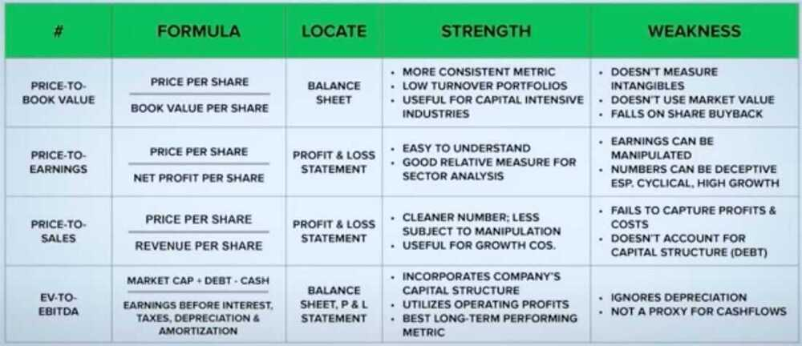

# Valuation Metrics

[4 Most Popular Valuation Metrics That Every Investor Must Know | ET Money](https://www.youtube.com/watch?v=kqNaY3woTeE)

- **Price to Book Ratio**
- **Price to Earnings Ratio**
- **Price to Sales Ratio**
- **EV to EBITDA**

## Macroeconomic Indicators

- m-cap-to-GDP ratio - [Sensex, Nifty: Red flag! This Warren Buffett's indicator suggests stock market still is expensive](https://www.businesstoday.in/markets/stocks/story/sensex-nifty-red-flag-this-warren-buffetts-indicator-suggests-stock-market-still-is-expensive-466589-2025-03-04)

## Multiple ratios can be combined to choose companies

- PB Ratio < 2, and PE Ratio < 15
- EV-to-EBITDA Ratio < 10 and PS Ratio < 5

## EBITDA

Earnings before interest, tax, depreciation and amortization (EBITDA) is a measure of a company's operating performance/profitability (i.e., how much profit it makes with its present assets and its operations on the products it produces and sells, as well as providing a proxy for cash flow). Essentially, it's a way to evaluate a company's performance without having to factor in financing decisions, accounting decisions or tax environments.

https://en.wikipedia.org/wiki/Earnings_before_interest,_taxes,_depreciation,_and_amortization

## Price to Book Ratio (P/B Ratio / PB Ratio)

Total amount of money a company can generate if it were to be liquidated

Book Value = Total Assets - Intangible Assets - Liabilities

Book Value = Shareholder's common equity - Preferred stock

P/B Ratio = Current price per share / Book value per share

Good for low turnover portfolio

**Cons**

- Doesn't take intangible assets into account
- Keeps assets at acquisition value & not at market value
- Doesn't factor in profits, sales & growth
- Penalizes good capital allocation decision at times

[Price-to-Book (P/B) Ratio: Meaning, Formula, and Example](https://www.investopedia.com/terms/p/price-to-bookratio.asp)

## Price to Earnings Ratio (P/E Ratio / PE Ratio)

The price-to-earnings ratio (P/E ratio) is the ratio for valuing a company that measures its current share price relative to its per-share earnings ([EPS](https://www.investopedia.com/terms/e/eps.asp)). The price-to-earnings ratio is also sometimes known as the price multiple or the earnings multiple.

P/E ratios are used by investors and analysts to determine the relative value of a company's shares in an apples-to-apples comparison. It can also be used to compare a company against its own historical record or to compare aggregate markets against one another or over time.

PE Ratio = Current Price Per Share / Earnings Per Share = 200/8 = 25

Earnings per share

1. Last completed FY earnings (annual report)
2. 12 months training basis (net profit earned last 4 quarters)
3. Equity analysts (forward pe ratio)
4. Averaging (last 5-6 years of earnings)

**Pros**

1. Simple to understand
2. Factors in profitability
3. Excellent relative comparison measure

**Cons**

1. Potential manipulation of earnings
2. Can hide company's true worth
3. Misleading impression regarding cyclical stocks

**KEY TAKEAWAYS**

- The price-earnings ratio (P/E ratio) relates a company's share price to its earnings per share.
- A high P/E ratio could mean that a company's stock is over-valued, or else that investors are expecting high growth rates in the future.
- Companies that have no earnings or that are losing money do not have a P/E ratio since there is nothing to put in the denominator.
- Two kinds of P/E ratios, forward and trailing P/E, are used in practice

https://www.investopedia.com/terms/p/price-earningsratio.asp

[Why the PE of One is Mohnish Pabrai’s Best Investing Strategy? PE Ratio Valuation with Example](https://www.youtube.com/watch?v=YzyM8AK9xj8)

[United States Stock Market: current P/E Ratio](https://worldperatio.com/area/united-states/)

## PEG Ratio

The price/earnings to growth ratio (PEG ratio) is a stock's price-to-earnings (P/E) ratio divided by the growth rate of its earnings for a specified time period.

- The PEG ratio enhances the P/E ratio by adding in expected earnings growth into the calculation.
- The PEG ratio is considered to be an indicator of a stock's true value, and similar to the P/E ratio, a lower PEG may indicate that a stock is undervalued.
- The PEG for a given company may differ significantly from one reported source to another, depending on which growth estimate is used in the calculation, such as one-year or three-year projected growth.

https://www.investopedia.com/terms/p/pegratio.asp

https://www.investopedia.com/investing/use-pe-ratio-and-peg-to-tell-stocks-future

## Price to Sales Ratio (PS Ratio)

PS Ratio = Current Market Capitalization / Total Revenue (Sales)

Total Revenue (Sales)

1. Last financial year sales
2. Trailing 12 months sales
3. Forward 12 months (projected sales)
4. Average sales (last 5 years)

- Comes in handy when examining companies in cyclical industries
- PS Ratio is not as subjective to manipulation as PE ratio

**Cons**

- Does not consider debt

## EV to EBITDA Ratio

EV - Enterprise Value

EV = Market Capitalization + Debt - Cash

**Pros**

- Incorporates company's capital structure in its entirely
- Uses the operating profits
- Best long-term performing metric

**Cons**

- Ignores depreciation

## Graham Number

The Graham number or Benjamin Graham number is a figure used in [securities](https://en.wikipedia.org/wiki/Securities) investing that measures a stock's so-called fair value. Named after [Benjamin Graham](https://en.wikipedia.org/wiki/Benjamin_Graham), the founder of [value investing](https://en.wikipedia.org/wiki/Value_investing), the Graham number can be calculated as follows:

The final number is, theoretically, the maximum price that a defensive investor should pay for the given stock. Put another way, a stock priced below the Graham Number would be considered a good value, if it also meets a number of other criteria.

https://en.wikipedia.org/wiki/Graham_number

## [8 Valuation Techniques for Beginners incl. Discounted Cash Flow | How to Value a Business?](https://www.youtube.com/watch?v=PgV9w6MS1B8)

- Cost Based Valuation
- Comparable Company Valuation
- Book Value
- Revenue Multiplier
- Earnings Multiplier
- Discounted Cash Flow Model
- Intangible Assets
- Liquidation Value

[Valuation](https://www.youtube.com/playlist?list=PLUkh9m2BorqnKWu0g5ZUps_CbQ-JGtbI9)

Value Driver

1. Revenue Growth
2. Operating Margin
3. Capital Ratio
4. Cost of Capital
