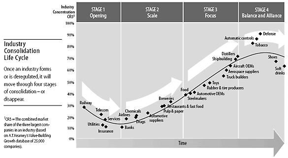

# Economics Mental Models

## To read

- http://beyondthetechrevolution.com/technological-revolutions-and-financial-capital

University of Berkshire Hathaway

- the rise and fall of american growth
- the myth of capitalism

## Others

- [Common Knowledge](https://en.wikipedia.org/wiki/Common_knowledge)
- [Incentives (Reward and Punishment)](https://en.wikipedia.org/wiki/Incentive)

Something that motivates an individual to perform an action." (related:[carrot and stick](https://en.wikipedia.org/wiki/Carrot_and_stick) - "a policy of offering a combination of rewards and punishment to induce behavior.")

Incentive Bias

- Right incentive can ensure right behavior

https://fs.blog/bias-incentives-reinforcement

When people say they don't want to change what they really mean is they don't have an incentive to change.

Change the incentives and the behavior follows suit.

## Comparative Advantage

Thelaworprinciple of comparative advantageholds that under [free trade](https://en.wikipedia.org/wiki/Free_trade), an agent will produce more of and consume less of a good for which they have a comparative advantage. Comparative advantageis the economic reality describing the work [gains from trade](https://en.wikipedia.org/wiki/Gains_from_trade) for individuals, firms, or nations, which arise from differences in their [factor endowments](https://en.wikipedia.org/wiki/Factor_endowments) or [technological progress](https://en.wikipedia.org/wiki/Technological_progress).In an [economic model](https://en.wikipedia.org/wiki/Economic_model), [agents](https://en.wikipedia.org/wiki/Agent_(economics)) have a comparative advantage over others in producing a particular [good](https://en.wikipedia.org/wiki/Goods_(economics)) if they can produce that good at a lower relative [opportunity cost](https://en.wikipedia.org/wiki/Opportunity_cost) or [autarky](https://en.wikipedia.org/wiki/Autarky) price, i.e. at a lower relative [marginal cost](https://en.wikipedia.org/wiki/Marginal_cost) prior to trade.One does not compare the monetary costs of production or even the resource costs (labor needed per unit of output) of production. Instead, one must compare the [opportunity costs](https://en.wikipedia.org/wiki/Opportunity_cost) of producing goods across countries.

[David Ricardo](https://en.wikipedia.org/wiki/David_Ricardo) developed the classical theory of comparative advantage in 1817 to explain why countries engage in [international trade](https://en.wikipedia.org/wiki/International_trade) even when one country's workers are more efficient at producingeverysingle good than workers in other countries. He demonstrated that if two countries capable of producing two commodities engage in the [free market](https://en.wikipedia.org/wiki/Free_market), then each country will increase its overall consumption by exporting the good for which it has a comparative advantage while importing the other good, provided that there exist differences in [labor productivity](https://en.wikipedia.org/wiki/Labor_productivity) between both countries.Widely regarded as one of the most powerfulyet counter-intuitiveinsights in economics, Ricardo's theory implies that comparative advantage rather than [absolute advantage](https://en.wikipedia.org/wiki/Absolute_advantage) is responsible for much of international trade.

[Comparative Advantage](https://en.wikipedia.org/wiki/Comparative_advantage#More_recent_evidence) - "An agent has a comparative advantage over another in producing a particular good if they can produce that good at a lower relative opportunity cost or autarky price, i.e. at a lower relative marginal cost prior to trade."

https://en.wikipedia.org/wiki/Comparative_advantage

https://dariusforoux.com/opportunity-cost

## Diversification

In finance, diversificationis the process of allocating capital in a way that reduces the exposure to any one particular asset or risk. A common path towards diversification is to reduce [risk](https://en.wikipedia.org/wiki/Financial_risk) or volatility by [investing](https://en.wikipedia.org/wiki/Investment) in a variety of [assets](https://en.wikipedia.org/wiki/Asset). If asset prices do not change in perfect synchrony, a diversified [portfolio](https://en.wikipedia.org/wiki/Portfolio_(finance)) will have less variance than the [weighted average](https://en.wikipedia.org/wiki/Weighted_mean) variance of its constituent assets, and often less volatility than the least volatile of its constituents.

Diversification is one of two general techniques for reducing investment risk. The other is [hedging](https://en.wikipedia.org/wiki/Hedge_(finance))

https://en.wikipedia.org/wiki/Diversification_(finance)

## Hedge

Ahedgeis an investment position intended to offset potential losses or gains that may be incurred by a companion investment. In simple language, a hedge is a [risk management](https://en.wikipedia.org/wiki/Risk_management) technique used to reduce any substantial losses or gains suffered by an individual or an organization.

https://en.wikipedia.org/wiki/Hedge_(finance)

## Economies of scale

In [microeconomics](https://en.wikipedia.org/wiki/Microeconomics), economies of scaleare the cost advantages that enterprises obtain due to their scale of operation (typically measured by amount of output produced), with cost per unit of output decreasing with increasing scale. (In economics, "scale" is synonymous with quantity.)

Economies of scale apply to a variety of organizational and business situations and at various levels, such as a business or manufacturing unit, plant or an entire enterprise. When average costs start falling as output increases, then economies of scale are occurring. If a firm's [marginal cost](https://en.wikipedia.org/wiki/Marginal_cost) of producing a good or service is beneath its [average cost](https://en.wikipedia.org/wiki/Average_cost) of producing that good or service, then the firm is experiencing economies of scale. Some economies of scale, such as capital cost of manufacturing facilities and friction loss of transportation and industrial equipment, have a [physical or engineering basis](https://en.wikipedia.org/wiki/Economies_of_scale#Physical_and_engineering_basis).

Another source of scale economies is the possibility of purchasing inputs at a lower per-unit cost when they are purchased in large quantities.

https://en.wikipedia.org/wiki/Economies_of_scale

## Efficient market hypothesis (EMH)

The efficient-market hypothesis (EMH) is a theory in [financial economics](https://en.wikipedia.org/wiki/Financial_economics) that states that [asset](https://en.wikipedia.org/wiki/Asset) prices fully reflect all available information. A direct implication is that it is impossible to "beat the market" consistently on a risk-adjusted basis since market prices should only react to new information.

The efficient-market hypothesis was developed by [Eugene Fama](https://en.wikipedia.org/wiki/Eugene_Fama) who argued that stocks always trade at their fair value, making it impossible for investors to either purchase undervalued stocks or sell stocks for inflated prices.As such, it should be impossible to outperform the overall market through expert stock selection or market timing, and that the only way an investor can possibly obtain higher returns is by chance or by purchasing riskier investments.His 2012 study with [Kenneth French](https://en.wikipedia.org/wiki/Kenneth_French) supported this view, showing that the distribution of abnormal returns of US mutual funds is very similar to what would be expected if no fund managers had any skill - a necessary condition for the EMH to hold.

There are three variants of the hypothesis: "weak", "semi-strong", and "strong" form. The weak form of the EMH claims that prices on traded [assets](https://en.wikipedia.org/wiki/Asset)(e.g., [stocks](https://en.wikipedia.org/wiki/Stock), [bonds](https://en.wikipedia.org/wiki/Bond_(finance)), or property) already reflect all past publicly available [information](https://en.wikipedia.org/wiki/Information). The semi-strong form of the EMH claims both that prices reflect all publicly available information and that prices instantly change to reflect new public information. The strong form of the EMH additionally claims that prices instantly reflect even hidden "insider" information.

There is no quantitative measure of market efficiency and testing the idea is difficult. So-called "effect studies" provide some of the best evidence, but they are open to other interpretations. Critics have blamed the belief in [rational markets](https://en.wikipedia.org/wiki/Rational_expectations) for much of the [late-2000s financial crisis](https://en.wikipedia.org/wiki/Late-2000s_financial_crisis).In response, proponents of the hypothesis have stated that market efficiency does not mean not having any uncertainty about the future; that market efficiency is a simplification of the world which may not always hold true; and that the market is practically efficient for investment purposes for most individuals.

https://en.wikipedia.org/wiki/Efficient-market_hypothesis

## Game Theory

Game theory is the study of [mathematical models](https://en.wikipedia.org/wiki/Mathematical_model) of strategic interaction between rational decision-makers.It has applications in all fields of [social science](https://en.wikipedia.org/wiki/Social_science), as well as in [logic](https://en.wikipedia.org/wiki/Logic) and [computer science](https://en.wikipedia.org/wiki/Computer_science). Originally, it addressed [zero-sum games](https://en.wikipedia.org/wiki/Zero-sum_game), in which one person's gains result in losses for the other participants. Today, game theory applies to a wide range of behavioral relations, and is now an [umbrella term](https://en.wikipedia.org/wiki/Umbrella_term) for the [science](https://en.wikipedia.org/wiki/Science) of logical decision making in humans, animals, and computers.

- Patience - If you go to a car dealer and ask that you need a car urgent then he is not going to give you any offers, but if you say that I need a car but you will wait for the best offer and it's not urgent, then he will give you a good offer.

- Take it or leave it deal

- Competitive Game Theory
- Cooperative Game Theory (for friends)

https://en.wikipedia.org/wiki/Game_theory

## Scarcity

The tension between infinite wants and finite resources

Scarcityis the limited availability of a [commodity](https://en.wikipedia.org/wiki/Commodity), which may be in demand in the market. Scarcity also includes an individual's lack of resources to buy commodities

## Supply and Demand

In [microeconomics](https://en.wikipedia.org/wiki/Microeconomics), supply and demandis an [economic model](https://en.wikipedia.org/wiki/Economic_model) of [price determination](https://en.wikipedia.org/wiki/Price_determination) in a [market](https://en.wikipedia.org/wiki/Market_(economics)). It postulates that, [holding all else equal](https://en.wikipedia.org/wiki/Ceteris_paribus), in a [competitive market](https://en.wikipedia.org/wiki/Perfect_competition), the [unit price](https://en.wikipedia.org/wiki/Unit_price) for a particular [good](https://en.wikipedia.org/wiki/Good_(economics)), or other traded item such as labor or liquid financial assets, will vary until it settles at a point where the quantity demanded (at the current price) will equal the quantity supplied (at the current price), resulting in an [economic equilibrium](https://en.wikipedia.org/wiki/Economic_equilibrium) for price and quantity transacted. However, this model does not hold in cases with [positive feedback](https://en.wikipedia.org/wiki/Positive_feedback) which can lead to an [economic bubble](https://en.wikipedia.org/wiki/Economic_bubble) as in the housing market in the early 21st century that led to the [subprime mortgage crisis](https://en.wikipedia.org/wiki/Subprime_mortgage_crisis).

## Greater Fool Theory

In [finance](https://en.wikipedia.org/wiki/Finance) and [economics](https://en.wikipedia.org/wiki/Economics), thegreater fool theory states that the [price](https://en.wikipedia.org/wiki/Price) of an object is determined not by its [intrinsic value](https://en.wikipedia.org/wiki/Intrinsic_value_(finance)), but rather by the local and relative demand of a specific consumer. In an inflated market, a consumer, despite having broader market knowledge might pay an inflated price because of their needs and the local related-market value. Another consumer relative to their needs and assessment of market value may deem the price excessive. Thus to one consumer the commodity has a greater value than to another making the former look like a fool to the latter.

https://en.wikipedia.org/wiki/Greater_fool_theory

## The Reward to Risk Ratio (RRR)

A good trade should be characterised by a rich RRR. In other words, for every Rs.1/- you risk on a trade your expected return should be at least Rs.1.3/- or higher, otherwise it is simply not a worth the risk.

## Value added manufacturing

Input of raw materials vs output of finished goods.

Industries/factories produce value and add value to economy

Nobel Laureate Thomas Schelling, a game theorist, coined the term **"value of a statistical life"** (VSL) in 1968

## Paradox of Thrift

The paradox of thrift, or paradox of savings, is an economic theorywhich posits that personal savings are a net drag on the economy during a recession. This theory relies on the assumption that prices do not clear or that producers fail to adjust to changing conditions, contrary to the expectations of classical microeconomics. The paradox of thrift was popularized by British economist John Maynard Keynes.

https://www.investopedia.com/terms/p/paradox-of-thrift.asp

## Rule of three (Bruce Henderson of the Boston Consulting Group)

A stable competitive market never has more than three significant competitors, the largest of which has no more than four times the market share of the smallest.

I prefer a slightly different variant. Jagdish Sheth and Rajendra Sisodia, in 2002, described it like this:

1. A competitive market usually gravitates towards three major players. These three players are 'generalists', and control a significant share of the market - usually upwards of 70%.

2. The rest of the market is composed of niche specialists with tiny market shares but strong financial positions.

3. Any attempts by these specialists to become a generalist by increasing market share is risky, and can result in death.

## Industry consolidation life cycle

## Cantillon effect

Cantillon effect explains how changes in the supply of money in an economy can affect the prices of different goods in different proportions. This is because the real purchasing power of individuals is not affected uniformly by the changes in money supply. The theory was proposed by Richard Cantillon, an Irish-French economist, as a counter to John Locke's crude quantity theory of money - which saw prices of all goods being affected proportionately by changes in money supply. Cantillon proposed the idea to argue that the differential effect of changes in the money supply on prices leads to booms and busts in the economy.

## Investing

- [Fear of Missing Out](https://en.wikipedia.org/wiki/Fear_of_missing_out)(FOMO) - "A pervasive apprehension that others might be having rewarding experiences from which one is absent."
- DWTCAFK - Don’t Want To Catch A Falling Knife
- [Preferred Stock](https://en.wikipedia.org/wiki/Preferred_stock) vs [Common Stock](https://en.wikipedia.org/wiki/Common_stock) - "Preferred stock is a type of stock which may have any combination of features not possessed by common stock including properties of both an equity and a debt instrument, and is generally considered a hybrid instrument."
- [Margin of Safety](https://en.wikipedia.org/wiki/Margin_of_safety_(financial)) - "The difference between the intrinsic value of a stock and its market price."
    - [3 Unique Methods of Calculating Margin of Safety of a Business & Stock | The Intelligent Investor](https://www.youtube.com/watch?v=Bm3w9YmAF2E)
- [Investing vs Speculation](http://www.investopedia.com/ask/answers/09/difference-between-investing-speculating.asp) - "Typically, high-risk trades that are almost akin to gambling fall under the umbrella of speculation, whereas lower-risk investments based on fundamentals and analysis fall into the category of investing."
- [Compound Interest](https://en.wikipedia.org/wiki/Compound_interest) - "Interest on interest. It is the result of reinvesting interest, rather than paying it out, so that interest in the next period is then earned on the principal sum plus previously-accumulated interest."
- [Inflation](https://en.wikipedia.org/wiki/Inflation) - "A sustained increase in the general price level of goods and services in an economy over a period of time." (related:[real vs nominal value](https://en.wikipedia.org/wiki/Real_versus_nominal_value_%28economics%29), [hyperinflation](https://en.wikipedia.org/wiki/Hyperinflation), [deflation](https://en.wikipedia.org/wiki/Deflation), [debasement](https://en.wikipedia.org/wiki/Debasement))
- [Efficient-Market Hypothesis](https://en.wikipedia.org/wiki/Efficient-market_hypothesis#Criticism_and_behavioral_finance) - "Asset prices fully reflect all available information...Investors, including the likes of Warren Buffett, and researchers have disputed the efficient-market hypothesis both empirically and theoretically." (related:[alpha](https://en.wikipedia.org/wiki/Alpha_(finance)))
- [Purchasing Power Parity](https://en.wikipedia.org/wiki/Purchasing_power_parity) - "Allows one to estimate what the exchange rate between two currencies would have to be in order for the exchange to be at par with the purchasing power of the two countries' currencies."
- [Insider Trading](https://en.wikipedia.org/wiki/Insider_trading) - "The trading of a public company's stock or other securities (such as bonds or stock options) by individuals with access to nonpublic information about the company."
- [Poison Pill](https://en.wikipedia.org/wiki/Shareholder_rights_plan) - "A type of defensive tactic used by a corporation's board of directors against a takeover. Typically, such a plan gives shareholders the right to buy more shares at a discount if one shareholder buys a certain percentage or more of the company's shares." (related:[proxy fight](https://en.wikipedia.org/wiki/Proxy_fight)).

## Business

- [Minimum Viable Product](https://en.wikipedia.org/wiki/Minimum_viable_product)(MVP) - "A product with just enough features to gather validated learning about the product and its continued development." (related:[perfect is the enemy of good](https://en.wikipedia.org/wiki/Perfect_is_the_enemy_of_good);[de-risking](https://codingvc.com/how-to-de-risk-a-startup);[Customer Development](https://en.wikipedia.org/wiki/Customer_Development), "Get out of the building.")

https://www.freecodecamp.org/news/minimum-viable-product-between-an-idea-and-the-product

- [Product/Market Fit](https://en.wikipedia.org/wiki/Product/market_fit) - "the degree to which a product satisfies a strong market demand." (related:[pivot](https://en.wikipedia.org/wiki/Lean_startup#Pivot) - "structured course correction designed to test a new fundamental hypothesis about the product, strategy, and engine of growth.", "rebuilding year")
- [Reversible vs Irreversible Decisions](https://steveblank.com/2009/04/10/good-enough-decision-making/) - For reversible decisions: "If the decision was a bad call you can unwind it in a reasonable period of time. An irreversible decision is firing an employee, launching your product, a five-year lease for an expensive new building, etc. These are usually difficult or impossible to reverse." (related: Jeff Bezos on [Type 1, Type 2 decisions](http://www.businessinsider.com/jeff-bezos-on-type-1-and-type-2-decisions-2016-4))
- [Capital Allocation Options](https://www.amazon.com/gp/customer-reviews/RXJG9ONYO8ZAT/ref=cm_cr_arp_d_rvw_ttl?ie=UTF8&ASIN=1422162672) - "Five capital allocation choices CEOs have: 1) invest in existing operations; 2) acquire other businesses; 3) issue dividends; 4) pay down debt; 5) repurchase stock. Along with this, they have three means of generating capital: 1) internal/operational cash flow; 2) debt issuance; 3) equity issuance."
- [Open Platform](https://en.wikipedia.org/wiki/Open_platform) vs [Closed Platform](https://en.wikipedia.org/wiki/Closed_platform) - "A closed platform, walled garden or closed ecosystem is a software system where the carrier or service provider has control over applications, content, and media, and restricts convenient access to non-approved applications or content. This is in contrast to an open platform, where consumers generally have unrestricted access to applications, content, and much more."
- [Freemium](https://en.wikipedia.org/wiki/Freemium) - "a pricing strategy by which a product or service (typically a digital offering or application such as software, media, games or web services) is provided free of charge, but money (premium) is charged for proprietary features, functionality, or virtual goods." (related: "If you're not paying for it, you're the product.";[pay to play](https://en.wikipedia.org/wiki/Pay_to_play))
- [Luck Surface Area](http://www.codusoperandi.com/posts/increasing-your-luck-surface-area) - "When you do something you're excited about you will naturally pull others into your orbit. And the more people with whom you share your passion, the more who will be pulled into your orbit."
- [Hunting Elephants vs Flies](https://medium.com/point-nine-news/five-ways-to-build-a-100-million-business-82ac6ea8ffd9) - "Salespeople sometimes refer to 'elephants', 'deers' and 'rabbits' when they talk about the first three categories of customers. To extend the metaphor to the 4th and 5th type of customer, let's call them 'mice" and "flies'. So how can you hunt 1,000 elephants, 10,000 deers, 100,000 rabbits, 1,000,000 mice or 10,000,000 flies?" (related:[brontosaurus, whale, and microbe](http://christophjanz.blogspot.com/2014/11/three-more-ways-to-build-100-million.html))
- [Secrets](http://genius.com/Peter-thiel-zero-to-one-chapter-8-secrets-annotated) - "Every one of today's most famous and familiar ideas was once unknown and unsuspected...There are many more secrets left to find, but they will yield only to relentless searchers."
- (3) Strategic Acquisition vs Financial Acquisition vs Aquihire - Different motivations for an acquiring company typically have significantly different valuation models. (related:[rollup](https://en.wikipedia.org/wiki/Rollup) - "a technique used by investors (commonly private equity firms) where multiple small companies in the same market are acquired and merged.", [P/E-driven acquisitions](https://en.wikipedia.org/wiki/Price%E2%80%93earnings_ratio#The_P.2FE_ratio_in_business_culture), [auction](https://en.wikipedia.org/wiki/Auction))
- **Velocity of money -** the frequency at which one unit of currency is used to purchase domestically- produced goods and services within a given time period. In other words, it is the number of times one dollar is spent to buy goods and services per unit of time.

## Competing

- [Supply and Demand](https://en.wikipedia.org/wiki/Supply_and_demand) - "An economic model of price determination in a market. It concludes that in a competitive market, the unit price for a particular good, or other traded item such as labor or liquid financial assets, will vary until it settles at a point where the quantity demanded (at the current price) will equal the quantity supplied (at the current price), resulting in an economic equilibrium for price and quantity transacted." (related:[perfect competition](https://en.wikipedia.org/wiki/Perfect_competition);[arbitrage](https://en.wikipedia.org/wiki/Arbitrage) - "the practice of taking advantage of a price difference between two or more markets.")
- (2) Winner Take All Market - A market that tends towards one dominant player. (related:[lock-in](https://en.wikipedia.org/wiki/Lock-in_%28decision-making%29);[monopoly](https://en.wikipedia.org/wiki/Monopoly);[monopsony](https://en.wikipedia.org/wiki/Monopsony))
- [Two-sided Market](https://en.wikipedia.org/wiki/Two-sided_market) - "Economic platforms having two distinct user groups that provide each other with network benefits."
- [Barriers to Entry](https://en.wikipedia.org/wiki/Barriers_to_entry) - "A cost that must be incurred by a new entrant into a market that incumbents don't or haven't had to incur."
- [Price Elasticity](https://en.wikipedia.org/wiki/Elasticity_(economics)) - "The measurement of how responsive an economic variable is to a change in another. It gives answers to questions such as 'If I lower the price of a product, how much more will sell?'" (related:[Giffen good](https://en.wikipedia.org/wiki/Giffen_good) - "a product that people consume more of as the price rises and vice versa.")
- [Market Power](https://en.wikipedia.org/wiki/Market_power) - "The ability of a firm to profitably raise the market price of a good or service over marginal cost."
- [Creative Destruction](https://en.wikipedia.org/wiki/Creative_destruction) - "Process of industrial mutation that incessantly revolutionizes the economic structure from within, incessantly destroying the old one, incessantly creating a new one." (related:[Software is Eating the World](http://www.wsj.com/articles/SB10001424053111903480904576512250915629460) - "in many industries, new software ideas will result in the rise of new Silicon Valley-style start-ups that invade existing industries with impunity.")
- [First-mover advantage](https://en.wikipedia.org/wiki/First-mover_advantage) vs [First-mover disadvantage](https://en.wikipedia.org/wiki/First-mover_advantage#First-mover_disadvantages) - "the advantage gained by the initial ("first-moving") significant occupant of a market segment." (related:[Why now?](https://pando.com/2013/02/20/sequoias-why-now/))

Substitution Effect - As prices rise consumers will replace more expensive items with less costly alternatives

Perfectly Inelastic Demand - Van Gogh Painting (There are only a fixed number of items)

Relatively Inelastic Demand - Oil (there are not a lot of alternatives)

Elastic Demand - Pizza (since there are a lot of substitutes)

Consumer choice

## Tragedy of the commons / Externalities

Public goods are rarely cared for.

An externality is the cost or benefit that affects a party who did not choose to incur that cost or benefit." (related: **[tragedy of the commons](https://en.wikipedia.org/wiki/Tragedy_of_the_commons)**--- "A situation within a shared-resource system where individual users acting independently according to their own self-interest behave contrary to the common good of all users by depleting that resource through their collective action"; [free rider problem](https://en.wikipedia.org/wiki/Free_rider_problem) - "when those who benefit from resources, goods, or services do not pay for them, which results in an under-provision of those goods or services."; [Coase theorem](https://en.wikipedia.org/wiki/Coase_theorem) - "if trade in an externality is possible and there are sufficiently low transaction costs, bargaining will lead to a Pareto efficient outcome regardless of the initial allocation of property."; [NIMBY](https://en.wikipedia.org/wiki/NIMBY) - "Not In My Back Yard")

The economic problem of overconsumption and depletion of shared resources

[Externalities](https://en.wikipedia.org/wiki/Externality)

[Tragedy of the Uncommon](https://www.drorpoleg.com/tragedy-of-the-uncommon/)

## Market Failure

- [Social vs Market Norms](https://en.wikipedia.org/wiki/Predictably_Irrational#Being_Paid_vs._A_Friendly_Favor) - "People are happy to do things occasionally when they are not paid for them. In fact there are some situations in which work output is negatively affected by payment of small amounts of money."
- [Information Asymmetry](https://en.wikipedia.org/wiki/Information_asymmetry) - "The study of decisions in transactions where one party has more or better information than the other." (related: **[adverse selection](https://en.wikipedia.org/wiki/Adverse_selection)**--- "when traders with better private information about the quality of a product will selectively participate in trades which benefit them the most."; [moral hazard](https://en.wikipedia.org/wiki/Moral_hazard) - "when one person takes more risks because someone else bears the cost of those risks.")

## Rebound effect

The rebound effect says that the benefits of energy efficiency might be reduced as people change their behavior

## Quantitative Easing

The introduction of new money into the money supply by a central bank.

Quantitative easing is an unconventional [monetary policy](https://www.investopedia.com/terms/m/monetarypolicy.asp) in which a central bank purchases [government securities](https://www.investopedia.com/terms/g/governmentsecurity.asp) or other securities from the market in order to lower interest rates and increase the money supply. Quantitative easing increases the [money supply](https://www.investopedia.com/terms/m/moneysupply.asp) by flooding financial institutions with capital in an effort to promote increased lending and [liquidity](https://www.investopedia.com/terms/l/liquidity.asp). When short-term interest rates are at or approaching zero, and when the printing of new [banknotes](https://www.investopedia.com/terms/b/banknote.asp) isn't an option, quantitative easing can be considered.

## Money Supply / Money Stock

The money supply is the entire stock of [currency](https://www.investopedia.com/terms/c/currency.asp) and other liquid instruments circulating in a country's economy as of a particular time. The money supply can include cash, coins and balances held in checking and savings accounts. Economists analyze the money supply and develop policies revolving around it through controlling [interest rates](https://www.investopedia.com/terms/i/interestrate.asp) and increasing or decreasing the amount of money flowing in the economy.

## Cost Push Inflation

Cost-push inflation occurswhen overall prices increase (inflation)due to increases in the cost of wages and raw materials. Cost-push inflation can occur when higher costs of production decrease the aggregate supply (the amount of total production) in the economy.

## Richard Thaler, Nobel Laureate 2017

- Behavioral economics (analogy - bowl of cashews in party, removed, happy, otherwise kept eating)
- Nudges

## Paradox of Skill

While someone may be improving on an absolute basis, they are often getting worse relative to their competition. Michael Mauboussin refers to this concept as the "[Paradox of Skill](https://research-doc.credit-suisse.com/docView?language=ENG&format=PDF&source_id=em&document_id=805456950&serialid=LsvBuE4wt3XNGE0V%2B3ec251NK9soTQqcMVQ9q2QuF2I%3D)", which simply means that even though people may becoming more skilled at a certain pursuit, it is oftenmoredifficult for them to succeed because their competition is also becoming more skilled. This means that eventually the most talented people end up competing against one another, making it very difficult to become a bonafide superstar. Hence the paradox.

[How to make massive returns!](https://www.youtube.com/watch?v=2Ms2gG27wyA)

- The BCG Growth-Share matrix (BCG - Boston Consulting Group)
    - The BCG growth-share matrix is a tool used internally by management to assess the current state of value of a firm's units or product lines.
    - The growth-share matrix aids the company in deciding which products or units to either keep, sell, or invest more in.
    - The BCG growth-share matrix contains four distinct categories: "dogs," "cash cows," "stars," and "question marks."

https://www.bcg.com/about/overview/our-history/growth-share-matrix

https://www.investopedia.com/terms/b/bcg.asp

- Risk-Reward Equation should be positive. You should know the BAONW (Best Alternative of Not Winning). Do not take insensible risk at the start of your career.
- Risk taking comes from practice. Start experimenting with 10% of your time and 10% of your money.
- Take Asymmetric Risks
- You will make mistakes. Learn from it.
- Use First Principles

## Consumption

Poor's have a high marginal propensity to consume

Ex - if govt gives direct fund transfer to every citizen, then poor households will most likely be spending that money, rather than richer household which will just save that money

## The Deadweight Loss of Gift Giving

Gifting actually destroys value

Last year, I got a pen because my Santa figured that I write every day. And it’s now tucked away in a drawer (sorry!). It could happen to you as well. Maybe your aunt buys you a ₹10,000 Amazon Kindle because she figures you love books. But you actually hate reading on a screen. You like real books. And so, the Kindle slowly starts to gather dust.

Gifting can be quite inefficient.

It’s the value (or price) that’s destroyed when the gift changes hands. Or put more simplistically, it’s the gap between how much the gift giver spent and how much the receiver values the gift.

[The economics of wasteful spending: The deadweight loss of Christmas](https://www.pbs.org/newshour/economy/the-economics-of-wasteful-spending-the-dead-weight-loss-of-christmas)

[Deadweight Loss](https://en.wikipedia.org/wiki/Deadweight_loss) - "A loss of economic efficiency that can occur when equilibrium for a good or service is not achieved or is not achievable."

[The Best Gifts, According to Science - YouTube](https://www.youtube.com/watch?v=v4tcXeKlhAk)

- Complement is the best gift

## Baumol Effect

In economics, the **Baumol effect**, also known as **Baumol's cost disease**, is the rise of wages in jobs that have experienced little or no increase in labor productivity, in response to rising salaries in other jobs that have experienced higher productivity growth.

The rise of wages in jobs without productivity gains derives from the requirement to compete for workers with jobs that have experienced productivity gains and so can naturally pay higher salaries, just as classical economics predicts. For instance, if the retail sector pays its managers low wages, they may decide to quit and get jobs in the automobile sector, where wages are higher because of higher labor productivity. Thus, retail managers' salaries increase not due to labor productivity increases in the retail sector, but due to productivity and corresponding wage increases in other industries.

Baumol helps us understand not only today’s economy but also a likely path for the economy’s future. He explained why labor-intensive services get more and more expensive as the economy grows. And those kinds of services are likely to be the future of the global economy.

[Baumol effect - Wikipedia](https://en.wikipedia.org/wiki/Baumol_effect)

[Taylor Swift and the Baumol Effect](https://finshots.in/archive/taylor-swift-and-the-baumol-effect/)

[William Baumol, whose famous economic theory explains the modern world, has died - Vox](https://www.vox.com/new-money/2017/5/4/15547364/baumol-cost-disease-explained)

[Why Are the Prices So Damn High? | Mercatus Center](https://www.mercatus.org/students/research/books/why-are-prices-so-damn-high)

## Rentseeking behaviour

The concept refers to the attempts to gain economic benefits without producing new wealth. Rather than creating a better product or offering a more efficient service, the actors in this scenario extracted vast wealth through manipulative practices.

## Jevons paradox

In economics, the **Jevons paradox** (sometimes **Jevons effect**) occurs when [technological progress](https://en.wikipedia.org/wiki/Technological_change "Technological change") or government policy increases the [efficiency](https://en.wikipedia.org/wiki/Efficiency "Efficiency") with which a [resource](https://en.wikipedia.org/wiki/Resource_(economics) "Resource (economics)") is used (reducing the amount necessary for any one use), but the falling cost of use [induces increases in demand](https://en.wikipedia.org/wiki/Induced_demand) enough that resource use is increased, rather than reduced. Governments typically assume that efficiency gains will lower [resource consumption](https://en.wikipedia.org/wiki/Resource_consumption "Resource consumption"), ignoring the possibility of the paradox arising.

[Jevons paradox - Wikipedia](https://en.wikipedia.org/wiki/Jevons_paradox)

## Lipstick index

The lipstick index is an economic theory that suggests that people buy small luxuries, like cosmetics, when the economy is struggling. The term was coined by Leonard Lauder, the former chairman of Estée Lauder.

- The theory suggests that people buy affordable luxuries to treat themselves and escape financial problems.
- The lipstick index is based on the idea that people want to feel good and satisfy psychological desires, even when times are hard.
- The lipstick index is supported by sales data, but some say it doesn't capture the whole picture of consumer splurging.

## Men's Underwear Index (MUI)

The Men's Underwear Index (MUI) is an economic indicator that suggests that an increase in men's underwear sales indicates a healthy economy. The MUI is based on the idea that people are more likely to buy non-essential items like underwear when they feel optimistic about their financial situation. Former US Federal Reserve chairman Alan Greenspan is credited with coining the MUI.

## 7 Signs You’re Moving From Middle Class To Rich, According To Psychology

1. The Time-Money Paradigm Shift
2. From Income Focus to Asset Building
3. Your Social Circle Naturally Elevates
4. Strategic Risk-Taking Becomes Normal
5. Quality-Focused Spending Patterns Emerge
6. Continuous Learning Becomes Non-Negotiable
7. Work Transforms From Necessity to Choice

[7 Signs You're Moving From Middle Class To Rich, According To Psychology - New Trader U](https://www.newtraderu.com/2025/01/04/7-signs-youre-moving-from-middle-class-to-rich-according-to-psychology/)

## Links

- [Marginal Utility / Analysis](marginal-utility-analysis)
- [Recession Shapes / Recovery](recession-shapes-recovery)
- [The elephant in the brain](../../book-summaries/the-elephant-in-the-brain)
- [Economics for the common good](../../book-summaries/economics-for-the-common-good)
- [Dollars and sense](../../book-summaries/dollars-and-sense)
- [Everyday Millionaires](../../book-summaries/everyday-millionaires)
- [Consumerism](psychology/consumerism.md)
