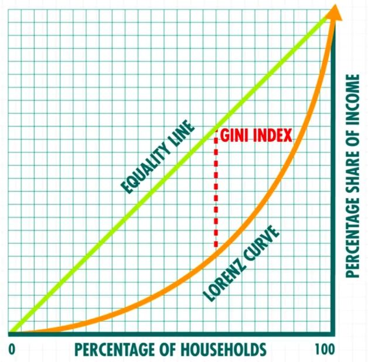

# Inequality

## Gini Coefficient

In [economics](https://en.wikipedia.org/wiki/Economics), theGini coefficient, sometimes called theGini indexorGini ratio, is a [measure of statistical dispersion](https://en.wikipedia.org/wiki/Statistical_dispersion#Measures_of_statistical_dispersion) intended to represent the [income](https://en.wikipedia.org/wiki/Income_distribution) or [wealth distribution](https://en.wikipedia.org/wiki/Wealth_distribution) of a nation's residents, and is the most commonly used measurement of [inequality](https://en.wikipedia.org/wiki/Economic_inequality). It was developed by the Italian [statistician](https://en.wikipedia.org/wiki/Statistics) and [sociologist](https://en.wikipedia.org/wiki/Sociology) [Corrado Gini](https://en.wikipedia.org/wiki/Corrado_Gini) and published in his 1912 paper Variability and Mutability.

The Gini coefficient measures the inequality among values of a [frequency distribution](https://en.wikipedia.org/wiki/Frequency_distribution)(for example, levels of [income](https://en.wikipedia.org/wiki/Income)). A Gini coefficient of zero expresses perfect equality, where all values are the same (for example, where everyone has the same income). A Gini coefficient of one (or 100%) expresses maximal inequality among values (e.g., for a large number of people, where only one person has all the income or consumption, and all others have none, the Gini coefficient will be very nearly one).For larger groups, values close to one are very unlikely in practice. Given the normalization of both the cumulative population and the cumulative share of income used to calculate the Gini coefficient, the measure is not overly sensitive to the specifics of the income distribution, but rather only on how incomes vary relative to the other members of a population. The exception to this is in the [redistribution of income](https://en.wikipedia.org/wiki/Redistribution_of_income) resulting in a minimum income for all people. When the population is sorted, if their income distribution were to approximate a well-known function, then some representative values could be calculated.

The Gini coefficient was proposed by Gini as a measure of [inequality](https://en.wikipedia.org/wiki/Social_inequality) of [income](https://en.wikipedia.org/wiki/Income_inequality_metrics) or [wealth](https://en.wikipedia.org/wiki/Wealth_concentration).For [OECD countries](https://en.wikipedia.org/wiki/Organisation_for_Economic_Co-operation_and_Development), in the late 20th century, considering the effect of taxes and [transfer payments](https://en.wikipedia.org/wiki/Transfer_payments), the income Gini coefficient ranged between 0.24 and 0.49, with Slovenia being the lowest and Mexico the highest.African countries had the highest pre-tax Gini coefficients in 2008--2009, with South Africa the world's highest, variously estimated to be 0.63 to 0.7, although this figure drops to 0.52 after social assistance is taken into account, and drops again to 0.47 after taxation.The global income Gini coefficient in 2005 has been estimated to be between 0.61 and 0.68 by various sources.

There are some issues in interpreting a Gini coefficient. The same value may result from many different distribution curves. The demographic structure should be taken into account. Countries with an aging population, or with a baby boom, experience an increasing pre-tax Gini coefficient even if real income distribution for working adults remains constant. Scholars have devised over a dozen variants of the Gini coefficient.

https://en.wikipedia.org/wiki/Gini_coefficient

https://www.investopedia.com/terms/g/gini-index.asp

[What Is The Most Equal Country on Earth? - YouTube](https://www.youtube.com/watch?v=Zwn6fqbNRLo)

## Lorenz Curve

The Lorenz curve is a graphical representation of [income inequality](https://www.investopedia.com/terms/i/income-inequality.asp) or wealth inequality developed by American economistMax Lorenz in 1905. The graph plotspercentiles of the population on the horizontal axis according to income or wealth. It plots cumulativeincome or wealth on the vertical axis, so that an x-value of 45 and a y-value of 14.2 would mean that the bottom 45% of the population controls 14.2% of the total income or wealth.

https://www.investopedia.com/terms/l/lorenz-curve.asp

## Links

[Capitalism Doesn't Need Consumers | Economics Explained - YouTube](https://www.youtube.com/watch?v=XySs_KgzyDc&ab_channel=EconomicsExplained)

- Economic value of human will be negative

[Why Inequality Starts Becoming A Problem Now | Economics Explained - YouTube](https://www.youtube.com/watch?v=BtVNO0H7yLU)
