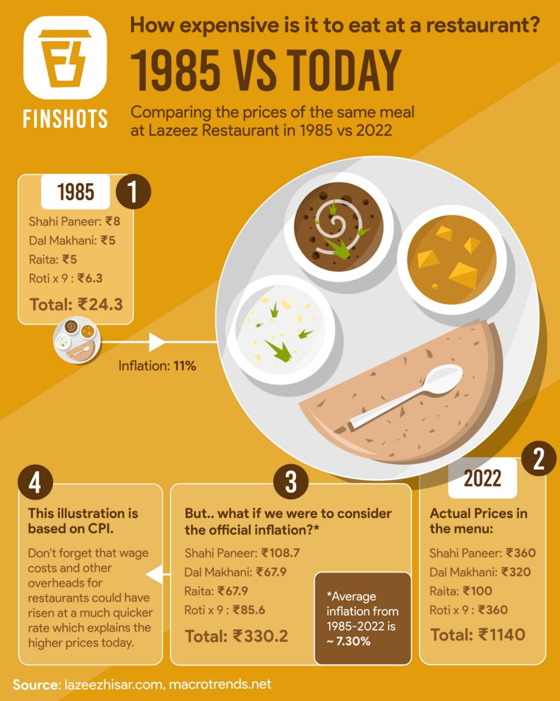
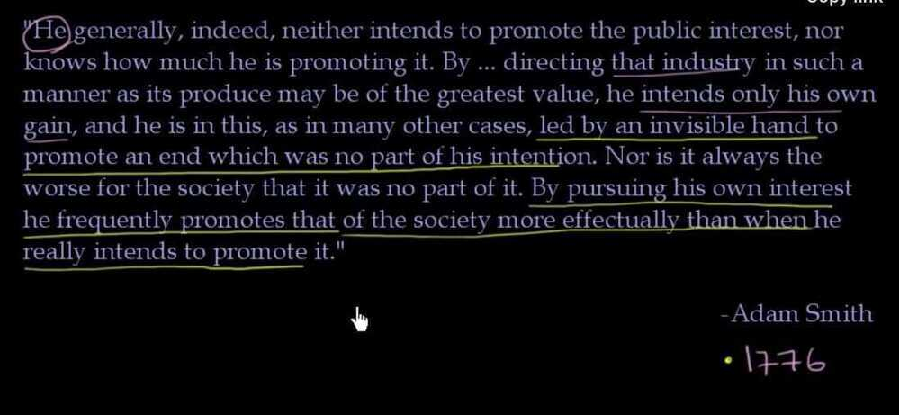
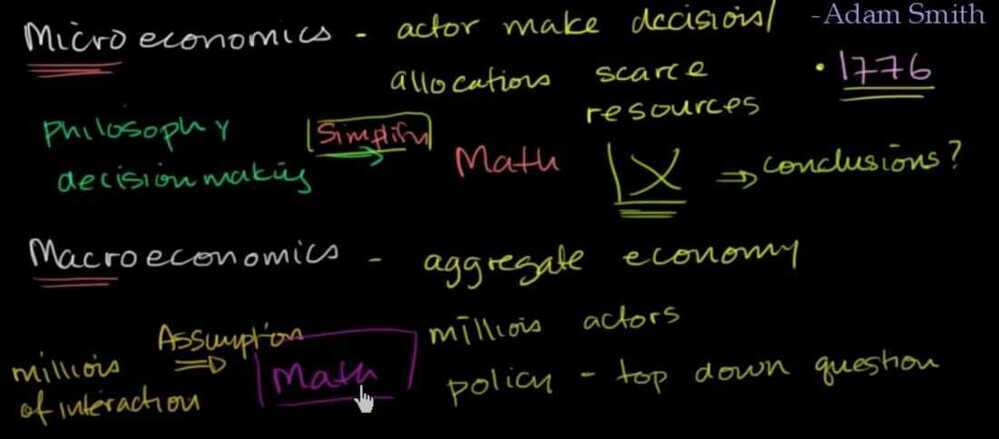
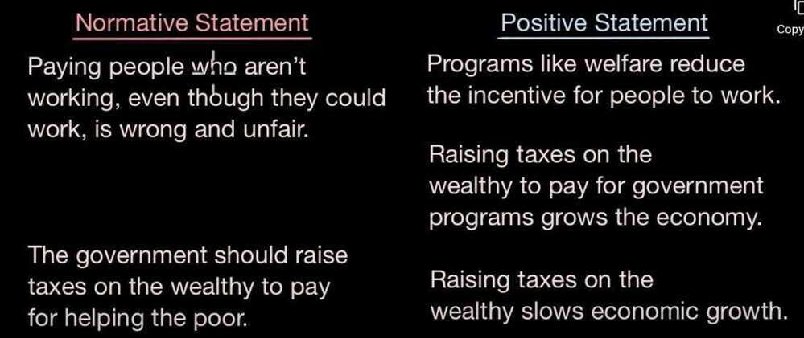
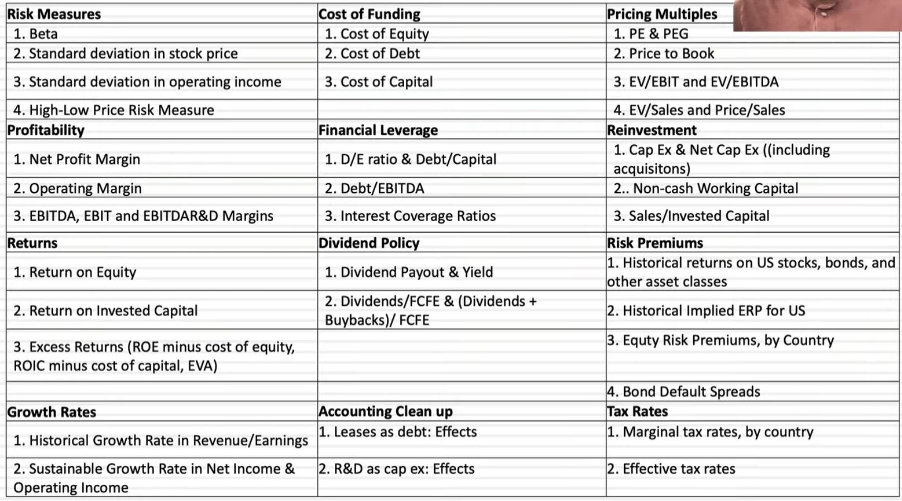

# Macroeconomics

Macroeconomics (from the Greek prefixmakro-meaning "large" +economics) is a branch of [economics](https://en.wikipedia.org/wiki/Economics) dealing with the performance, structure, behavior, and decision-making of an [economy](https://en.wikipedia.org/wiki/Economy) as a whole. This includes regional, national, and global economies. Macroeconomists study aggregated indicators such as [GDP](https://en.wikipedia.org/wiki/Gross_domestic_product), [unemployment rates](https://en.wikipedia.org/wiki/Unemployment#Measurement), [national income](https://en.wikipedia.org/wiki/National_income), [price indices](https://en.wikipedia.org/wiki/Price_index), and the interrelations among the different sectors of the economy to better understand how the whole economy functions. They also develop models that explain the relationship between such factors as [national income](https://en.wikipedia.org/wiki/National_income), [output](https://en.wikipedia.org/wiki/Output_(economics)), [consumption](https://en.wikipedia.org/wiki/Consumption_(economics)), [unemployment](https://en.wikipedia.org/wiki/Unemployment), [inflation](https://en.wikipedia.org/wiki/Inflation), [saving](https://en.wikipedia.org/wiki/Saving), [investment](https://en.wikipedia.org/wiki/Investment_(macroeconomics)), [international trade](https://en.wikipedia.org/wiki/International_trade), and [international finance](https://en.wikipedia.org/wiki/International_finance).

While macroeconomics is a broad field of study, there are two areas of research that are emblematic of the discipline: the attempt to understand the causes and consequences of short-run fluctuations in national income (the [business cycle](https://en.wikipedia.org/wiki/Business_cycle)), and the attempt to understand the determinants of long-run [economic growth](https://en.wikipedia.org/wiki/Economic_growth)(increases in national income).[Macroeconomic models](https://en.wikipedia.org/wiki/Macroeconomic_model) and their forecasts are used by governments to assist in the development and evaluation of [economic policy](https://en.wikipedia.org/wiki/Economic_policy).

- What will we produce?
- How will we produce it?
- Who gets it?

<https://en.wikipedia.org/wiki/Macroeconomics>

## Money Supply / Money Stock

In [macroeconomics](https://en.wikipedia.org/wiki/Macroeconomics), the **money supply**(or**money stock**) refers to the total volume of [money](https://en.wikipedia.org/wiki/Money) held by the public at a particular point in time in an economy. There are several ways to define "money", but standard measures usually include [currency in circulation](https://en.wikipedia.org/wiki/Circulation_(currency)) and [demand deposits](https://en.wikipedia.org/wiki/Demand_deposits)(depositors' easily accessed [assets](https://en.wikipedia.org/wiki/Asset) on the books of [financial institutions](https://en.wikipedia.org/wiki/Financial_institution)). The [central bank](https://en.wikipedia.org/wiki/Central_bank) of each country may use a definition of what constitutes money for its purposes.

Money supply data is recorded and published, usually by the government or the central bank of the country.[Public](https://en.wikipedia.org/wiki/Public_sector) and [private sector](https://en.wikipedia.org/wiki/Private_sector) analysts monitor changes in the money supply because of the belief that such changes affect the [price levels](https://en.wikipedia.org/wiki/Price_level) of [securities](https://en.wikipedia.org/wiki/Security_(finance)), [inflation](https://en.wikipedia.org/wiki/Inflation), the [exchange rates](https://en.wikipedia.org/wiki/Exchange_rate), and the [business cycle](https://en.wikipedia.org/wiki/Business_cycle).

The relationship between money and prices has historically been associated with the [quantity theory of money](https://en.wikipedia.org/wiki/Quantity_theory_of_money). There is strong [empirical](https://en.wikipedia.org/wiki/Empirical) evidence of a direct relationship between the growth of the money supply and long-term price inflation, at least for rapid increases in the amount of money in the economy.For example, a country such as [Zimbabwe](https://en.wikipedia.org/wiki/Zimbabwe) which saw extremely rapid increases in its money supply also saw extremely rapid increases in prices ([hyperinflation](https://en.wikipedia.org/wiki/Hyperinflation)). This is one reason for the reliance on [monetary policy](https://en.wikipedia.org/wiki/Monetary_policy) as a means of controlling inflation.

The [Reserve Bank of India](https://en.wikipedia.org/wiki/Reserve_Bank_of_India) defines the monetary aggregates as:

- **Reserve money(M0):** Currency in circulation, plus bankers' deposits with the RBI and 'other' deposits with the RBI. Calculated from net RBI credit to the government plus RBI credit to the commercial sector, plus RBI's claims on banks and net foreign assets plus the government's currency liabilities to the public, less the RBI's net non-monetary liabilities. M0 outstanding was₹30.297 trillion as on March 31, 2020.
- **M1:** Currency with the public plus deposit money of the public (demand deposits with the banking system and 'other' deposits with the RBI). M1 was 184 per cent of M0 in August 2017.
- **M2:** M1 plus savings deposits with post office savings banks. M2 was 879 per cent of M0 in August 2017.
- **M3(the broad concept of money supply):** M1 plus time deposits with the banking system, made up of net bank credit to the government plus bank credit to the commercial sector, plus the net foreign exchange assets of the banking sector and the government's currency liabilities to the public, less the net non-monetary liabilities of the banking sector (other than time deposits). M3 was 555 per cent of M0 as on March 31, 2020(i.e.₹167.99 trillion.)
- **M4:** M3 plus all deposits with post office savings banks (excluding [National Savings Certificates](https://en.wikipedia.org/wiki/National_Savings_Certificates_(India))).

## New Monetary Aggregates

The RBI has started publishing a set of new monetary aggregates following the recommendations of the [Working Group on Money Supply](https://m.rbi.org.in/Scripts/PublicationsView.aspx?id=9455): Analytics and Methodology of Compilation (Chairman: Dr. Y.V. Reddy) which submitted its report in June 1998.

The Working Group recommended compilation of four monetary aggregates on the basis of the balance sheet of the banking sector in conformity with the norms of progressive liquidity:

- **NM0 (monetary base)**
- **NM1 (narrow money)**
- **NM2**
- **NM3 (broad money)**

<https://www.clearias.com/monetary-aggregates>

<https://en.wikipedia.org/wiki/Money_supply>

<https://www.investopedia.com/terms/m/moneysupply.asp>

## Inflation

Why inflation occurs - Too much money chasing too few goods

People are spending more instead of saving, losing trust on paper money and parking money in assets

## Demand pull inflation

Demand-pull inflation is the upward pressure on prices that follows a shortage in [supply](https://www.investopedia.com/terms/s/supply.asp), a condition that economists describe as "too many dollars chasing too few goods."

- When demand surpasses supply, higher prices are the result. This is demand-pull inflation.
- A low unemployment rate is unquestionably good in general, but it can cause inflation because more people have more disposable income.
- Increased government spending is good for the economy, too, but it can lead to scarcity in some goods and inflation will follow.

<https://www.investopedia.com/terms/d/demandpullinflation.asp>

## Cost push inflation

- Cost-push inflation occurs when overallprices increase (inflation) due to increases in the cost of wages and raw materials.
- Cost-push inflation can occur when higher costs of production decrease the aggregate supply (the amount of total production) in the economy.
- Since the demand for goods hasn't changed, the price increases from production are passed onto consumers creating cost-push inflation.

The [wage-price spiral](https://www.investopedia.com/terms/w/wage-price-spiral.asp) is a take on cost-push inflation argues that as wages rise, it creates more demand, which leads to higher prices. These higher prices thus incentivize workers to demand even higher wages, and so the cycle repeats.

<https://www.investopedia.com/terms/c/costpushinflation.asp>

## Impossible trinity / Impossible Trilemma

The **impossible trinity** (also known as **the impossible [trilemma](https://en.wikipedia.org/wiki/Trilemma "Trilemma")** or the **Unholy Trinity**) is a concept in [international economics](https://en.wikipedia.org/wiki/International_economics "International economics") which states that it is impossible to have all three of the following at the same time:

- a fixed [foreign exchange rate](https://en.wikipedia.org/wiki/Foreign_exchange_rate "Foreign exchange rate")
- free [capital](https://en.wikipedia.org/wiki/Capital_(economics) "Capital (economics)") movement (absence of [capital controls](https://en.wikipedia.org/wiki/Capital_control "Capital control"))
- an independent [monetary policy](https://en.wikipedia.org/wiki/Monetary_policy "Monetary policy")

- **Side A**: A country can choose to fix exchange rates with one or more countries and have a free flow of capital with others. If it chooses this scenario, independent monetary policy is not achievable because interest rate fluctuations would create currency arbitrage stressing the currency pegs and causing them to break.
- **Side B**: The country can choose to have a free flow of capital among all foreign nations and also have an autonomous monetary policy. Fixed exchange rates among all nations and the free flow of capital are mutually exclusive. As a result, only one can be chosen at a time. So, if there is a free flow of capital among all nations, there cannot be fixed exchange rates.
- **Side C**: If a country chooses fixed exchange rates and independent monetary policy it cannot have a free flow of capital. Again, in this instance, fixed exchange rates and the free flow of capital are mutually exclusive.

[What Is a Trilemma and How Is It Used in Economics? With Example](https://www.investopedia.com/terms/t/trilemma.asp)

[Impossible trinity - Wikipedia](https://en.wikipedia.org/wiki/Impossible_trinity)

## Demographic Crisis

[Demographic crisis - the impact of an aging society - YouTube](https://www.youtube.com/watch?v=MZTsBU5Nigg)

## Links

[Data Update 1 for 2023: Setting the table](https://www.youtube.com/watch?v=RKJ1c442AcY)

[Data Update 4 for 2023: Country Risk](https://www.youtube.com/watch?v=qLm-JNEmWBA)

[Data Update 5 for 2023: Profitability, Returns and Value](https://www.youtube.com/watch?v=qfssMonQ8Ek)

[Data Update 6 for 2023: The Upside and Downside of Debt - YouTube](https://www.youtube.com/watch?v=rtIEgXLx6MI&ab_channel=AswathDamodaran)

[Data Update 7 for 2023: Dividends, Buybacks and Cashflows - YouTube](https://www.youtube.com/watch?v=QKJt3cv7c2k)
