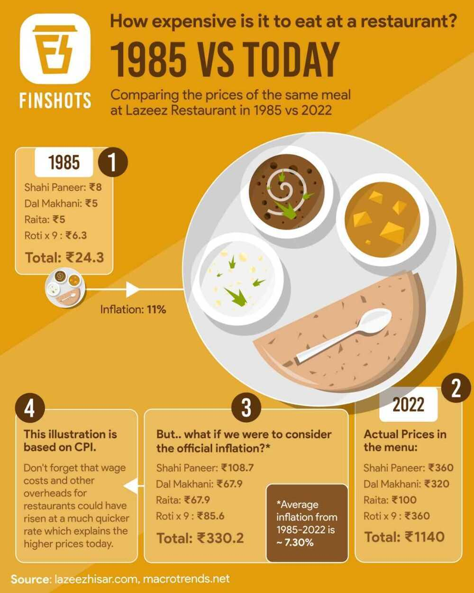

# Macroeconomics

Macroeconomics (from the Greek prefix makro-meaning "large" +economics) is a branch of [economics](https://en.wikipedia.org/wiki/Economics) dealing with the performance, structure, behavior, and decision-making of an [economy](https://en.wikipedia.org/wiki/Economy) as a whole. This includes regional, national, and global economies. Macroeconomists study aggregated indicators such as [GDP](https://en.wikipedia.org/wiki/Gross_domestic_product), [unemployment rates](https://en.wikipedia.org/wiki/Unemployment#Measurement), [national income](https://en.wikipedia.org/wiki/National_income), [price indices](https://en.wikipedia.org/wiki/Price_index), and the interrelations among the different sectors of the economy to better understand how the whole economy functions. They also develop models that explain the relationship between such factors as [national income](https://en.wikipedia.org/wiki/National_income), [output](https://en.wikipedia.org/wiki/Output_(economics)), [consumption](https://en.wikipedia.org/wiki/Consumption_(economics)), [unemployment](https://en.wikipedia.org/wiki/Unemployment), [inflation](https://en.wikipedia.org/wiki/Inflation), [saving](https://en.wikipedia.org/wiki/Saving), [investment](https://en.wikipedia.org/wiki/Investment_(macroeconomics)), [international trade](https://en.wikipedia.org/wiki/International_trade), and [international finance](https://en.wikipedia.org/wiki/International_finance).

While macroeconomics is a broad field of study, there are two areas of research that are emblematic of the discipline: the attempt to understand the causes and consequences of short-run fluctuations in national income (the [business cycle](https://en.wikipedia.org/wiki/Business_cycle)), and the attempt to understand the determinants of long-run [economic growth](https://en.wikipedia.org/wiki/Economic_growth)(increases in national income).[Macroeconomic models](https://en.wikipedia.org/wiki/Macroeconomic_model) and their forecasts are used by governments to assist in the development and evaluation of [economic policy](https://en.wikipedia.org/wiki/Economic_policy).

- What will we produce?
- How will we produce it?
- Who gets it?

https://en.wikipedia.org/wiki/Macroeconomics

## Money Supply / Money Stock

In [macroeconomics](https://en.wikipedia.org/wiki/Macroeconomics), the **money supply**(or**money stock**) refers to the total volume of [money](https://en.wikipedia.org/wiki/Money) held by the public at a particular point in time in an economy. There are several ways to define "money", but standard measures usually include [currency in circulation](https://en.wikipedia.org/wiki/Circulation_(currency)) and [demand deposits](https://en.wikipedia.org/wiki/Demand_deposits)(depositors' easily accessed [assets](https://en.wikipedia.org/wiki/Asset) on the books of [financial institutions](https://en.wikipedia.org/wiki/Financial_institution)). The [central bank](https://en.wikipedia.org/wiki/Central_bank) of each country may use a definition of what constitutes money for its purposes.

Money supply data is recorded and published, usually by the government or the central bank of the country.[Public](https://en.wikipedia.org/wiki/Public_sector) and [private sector](https://en.wikipedia.org/wiki/Private_sector) analysts monitor changes in the money supply because of the belief that such changes affect the [price levels](https://en.wikipedia.org/wiki/Price_level) of [securities](https://en.wikipedia.org/wiki/Security_(finance)), [inflation](https://en.wikipedia.org/wiki/Inflation), the [exchange rates](https://en.wikipedia.org/wiki/Exchange_rate), and the [business cycle](https://en.wikipedia.org/wiki/Business_cycle).

The relationship between money and prices has historically been associated with the [quantity theory of money](https://en.wikipedia.org/wiki/Quantity_theory_of_money). There is strong [empirical](https://en.wikipedia.org/wiki/Empirical) evidence of a direct relationship between the growth of the money supply and long-term price inflation, at least for rapid increases in the amount of money in the economy.For example, a country such as [Zimbabwe](https://en.wikipedia.org/wiki/Zimbabwe) which saw extremely rapid increases in its money supply also saw extremely rapid increases in prices ([hyperinflation](https://en.wikipedia.org/wiki/Hyperinflation)). This is one reason for the reliance on [monetary policy](https://en.wikipedia.org/wiki/Monetary_policy) as a means of controlling inflation.

The [Reserve Bank of India](https://en.wikipedia.org/wiki/Reserve_Bank_of_India) defines the monetary aggregates as:

- **Reserve money(M0):** Currency in circulation, plus bankers' deposits with the RBI and 'other' deposits with the RBI. Calculated from net RBI credit to the government plus RBI credit to the commercial sector, plus RBI's claims on banks and net foreign assets plus the government's currency liabilities to the public, less the RBI's net non-monetary liabilities. M0 outstanding was ₹30.297 trillion as on March 31, 2020.
- **M1:** Currency with the public plus deposit money of the public (demand deposits with the banking system and 'other' deposits with the RBI). M1 was 184 per cent of M0 in August 2017.
- **M2:** M1 plus savings deposits with post office savings banks. M2 was 879 per cent of M0 in August 2017.
- **M3 (the broad concept of money supply):** M1 plus time deposits with the banking system, made up of net bank credit to the government plus bank credit to the commercial sector, plus the net foreign exchange assets of the banking sector and the government's currency liabilities to the public, less the net non-monetary liabilities of the banking sector (other than time deposits). M3 was 555 per cent of M0 as on March 31, 2020(i.e.₹167.99 trillion.)
- **M4:** M3 plus all deposits with post office savings banks (excluding [National Savings Certificates](https://en.wikipedia.org/wiki/National_Savings_Certificates_(India))).

## New Monetary Aggregates

The RBI has started publishing a set of new monetary aggregates following the recommendations of the [Working Group on Money Supply](https://m.rbi.org.in/Scripts/PublicationsView.aspx?id=9455): Analytics and Methodology of Compilation (Chairman: Dr. Y.V. Reddy) which submitted its report in June 1998.

The Working Group recommended compilation of four monetary aggregates on the basis of the balance sheet of the banking sector in conformity with the norms of progressive liquidity:

- **NM0 (monetary base)**
- **NM1 (narrow money)**
- **NM2**
- **NM3 (broad money)**

https://www.clearias.com/monetary-aggregates

https://en.wikipedia.org/wiki/Money_supply

https://www.investopedia.com/terms/m/moneysupply.asp

## Inflation

Why inflation occurs - Too much money chasing too few goods

People are spending more instead of saving, losing trust on paper money and parking money in assets

## Demand pull inflation

Demand-pull inflation is the upward pressure on prices that follows a shortage in [supply](https://www.investopedia.com/terms/s/supply.asp), a condition that economists describe as "too many dollars chasing too few goods."

- When demand surpasses supply, higher prices are the result. This is demand-pull inflation.
- A low unemployment rate is unquestionably good in general, but it can cause inflation because more people have more disposable income.
- Increased government spending is good for the economy, too, but it can lead to scarcity in some goods and inflation will follow.

https://www.investopedia.com/terms/d/demandpullinflation.asp

## Cost push inflation

- Cost-push inflation occurs when overallprices increase (inflation) due to increases in the cost of wages and raw materials.
- Cost-push inflation can occur when higher costs of production decrease the aggregate supply (the amount of total production) in the economy.
- Since the demand for goods hasn't changed, the price increases from production are passed onto consumers creating cost-push inflation.

The [wage-price spiral](https://www.investopedia.com/terms/w/wage-price-spiral.asp) is a take on cost-push inflation argues that as wages rise, it creates more demand, which leads to higher prices. These higher prices thus incentivize workers to demand even higher wages, and so the cycle repeats.

https://www.investopedia.com/terms/c/costpushinflation.asp

## Impossible trinity / Impossible Trilemma

The **impossible trinity** (also known as **the impossible [trilemma](https://en.wikipedia.org/wiki/Trilemma "Trilemma")** or the **Unholy Trinity**) is a concept in [international economics](https://en.wikipedia.org/wiki/International_economics "International economics") which states that it is impossible to have all three of the following at the same time:

- a fixed [foreign exchange rate](https://en.wikipedia.org/wiki/Foreign_exchange_rate "Foreign exchange rate")
- free [capital](https://en.wikipedia.org/wiki/Capital_(economics) "Capital (economics)") movement (absence of [capital controls](https://en.wikipedia.org/wiki/Capital_control "Capital control"))
- an independent [monetary policy](https://en.wikipedia.org/wiki/Monetary_policy "Monetary policy")

- **Side A**: A country can choose to fix exchange rates with one or more countries and have a free flow of capital with others. If it chooses this scenario, independent monetary policy is not achievable because interest rate fluctuations would create currency arbitrage stressing the currency pegs and causing them to break.
- **Side B**: The country can choose to have a free flow of capital among all foreign nations and also have an autonomous monetary policy. Fixed exchange rates among all nations and the free flow of capital are mutually exclusive. As a result, only one can be chosen at a time. So, if there is a free flow of capital among all nations, there cannot be fixed exchange rates.
- **Side C**: If a country chooses fixed exchange rates and independent monetary policy it cannot have a free flow of capital. Again, in this instance, fixed exchange rates and the free flow of capital are mutually exclusive.

[What Is a Trilemma and How Is It Used in Economics? With Example](https://www.investopedia.com/terms/t/trilemma.asp)

[Impossible trinity - Wikipedia](https://en.wikipedia.org/wiki/Impossible_trinity)

## Demographic Crisis

[Demographic crisis - the impact of an aging society - YouTube](https://www.youtube.com/watch?v=MZTsBU5Nigg)

## India

[Indian Influencers Are WRONG About India! - YouTube](https://www.youtube.com/watch?v=-smxznU1eUI)

[Lies You've Been Told About INDIA & The Truth You Need to Know! - YouTube](https://www.youtube.com/watch?v=oHVgxbvkojw)

[As India’s red hot economy set to be world no. 3, reality check on how it stacks up with China, US - YouTube](https://www.youtube.com/watch?v=BYp1HnYUiAo)

[Seeking wisdom in the Indian Stock Markets | SOIC](https://soic.in/blog-description/top-10-learnings-for-october)

## Tools

[The Atlas of Economic Complexity](https://atlas.cid.harvard.edu/)

## Others

[Part 2 of a Two-Part Look at: 1. Principles for Navigating Big Debt Crises, and 2. How These Principles Apply to What’s Happening Now](https://www.linkedin.com/pulse/part-2-two-part-look-1-principles-navigating-big-debt-ray-dalio/)

- The debt-money-economic dynamic
- The internal conflict dynamic
- The external conflict dynamic
- Acts of nature (droughts, floods, and pandemics)
- Human invention and technology development

## Links

- [Finshots Recap - The best stories on economics](https://finshots.in/archive/recap-2022-the-best-stories-on-economics/)
- [Data Update 1 for 2023: Setting the table](https://www.youtube.com/watch?v=RKJ1c442AcY)
- [Data Update 4 for 2023: Country Risk](https://www.youtube.com/watch?v=qLm-JNEmWBA)
- [Data Update 5 for 2023: Profitability, Returns and Value](https://www.youtube.com/watch?v=qfssMonQ8Ek)
- [Data Update 6 for 2023: The Upside and Downside of Debt - YouTube](https://www.youtube.com/watch?v=rtIEgXLx6MI&ab_channel=AswathDamodaran)
- [Data Update 7 for 2023: Dividends, Buybacks and Cashflows - YouTube](https://www.youtube.com/watch?v=QKJt3cv7c2k)
- [The Two Big Economics Lies You Still Believe | Economics Explained - YouTube](https://www.youtube.com/watch?v=zOYLiTj4vag&ab_channel=EconomicsExplained)
- [Should We Be Worried About The BRICS? | Economics Explained - YouTube](https://www.youtube.com/watch?v=wBjmgkeit6I)
- [Did Washing Machines Change The Global Economy More Than The Internet? - YouTube](https://www.youtube.com/watch?v=_gvsz_vc7B0)
- [The Inequality Problem Nobody Likes To Talk About | Economics Explained](https://www.youtube.com/watch?v=QaL-ocOtooM)
- [How the World’s Most Dangerous Country Solved Murder - YouTube](https://www.youtube.com/watch?v=WtkI-QAgM6w)
- [The Big Economic Problem of Shrinking Cities | Economics Explained - YouTube](https://www.youtube.com/watch?v=qJbIlaqTMT0)
- [The Next Global Superpower Isn't Who You Think | Ian Bremmer | TED - YouTube](https://www.youtube.com/watch?v=uiUPD-z9DTg)
- [AI Winners, Losers and Wannabes: Valuing AI's Boost to NVIDIA's Value! - YouTube](https://www.youtube.com/watch?v=2N0IDShsTyc)
- [Why Is Europe Always Lagging Behind The US? | Economics Explained - YouTube](https://www.youtube.com/watch?v=tsahMxXdW30)
- [How Corruption Led to Lebanon's Brutal Collapse - YouTube](https://www.youtube.com/watch?v=fvVeslmt1-E)
- [Finland Redefines Economic Success | Economics Explained - YouTube](https://www.youtube.com/watch?v=hl-woY7mQVg)
- [That Time the Soviets Tried to Abolish Money - YouTube](https://www.youtube.com/watch?v=bWWqhsh848E)
- [The Growing Revolt Against the US Dollar - YouTube](https://www.youtube.com/watch?v=g6rFff2MAxM)
- [What Everyone Gets Wrong About Global Debt | Economics Explained - YouTube](https://www.youtube.com/watch?v=IAqj30s4lH8)
- [Ray Dalio Explains How the U.S. Economic Crisis is Unfolding. - YouTube](https://www.youtube.com/watch?v=-2Rn4JeHKHs)
- [Age of Easy Money (full documentary) | FRONTLINE - YouTube](https://www.youtube.com/watch?v=EpMLAQbSYAw)
- [Stories from 2008's Great Recession | 60 Minutes Full Episodes - YouTube](https://www.youtube.com/watch?v=fsSCnYPyb1A)
- [How Finance Works: The HBR Guide to Thinking Smart About the Numbers - Mihir Desai - YouTube](https://www.youtube.com/watch?v=8RxBbls_81U)
- [This Company Printed Your MONEY!! The Hidden Story!! - YouTube](https://www.youtube.com/watch?v=obXUfKhgkco)
- [End of the Road: How Money Became Worthless - YouTube](https://www.youtube.com/watch?v=Co_tVd9gA2I)
- [Country Risk: A 2023 Mid-year Update - YouTube](https://www.youtube.com/watch?v=F-6_XeUxbmI)
- [What’s Happening with the Economy? The Great Wealth Transfer](https://www.linkedin.com/pulse/whats-happening-economy-great-wealth-transfer-ray-dalio/)
- [Skills Wars Are The New Trade Wars | Economics Explained - YouTube](https://www.youtube.com/watch?v=pynhu7kY480)
- [Should The USA Isolate To Save Its Economy? | Economics Explained - YouTube](https://www.youtube.com/watch?v=mWk-5TvzQSU)
- [Worst Cases of Hyperinflation: What It’s Like & How To Survive!! - YouTube](https://www.youtube.com/watch?v=EShqOy1dgek)
- [The Game Theory Of Military Spending | Economics Explained - YouTube](https://www.youtube.com/watch?v=Vg9Aiz2piew)
- [China Needs to Engineer a Beautiful Deleveraging](https://www.linkedin.com/pulse/china-needs-engineer-beautiful-deleveraging-ray-dalio/)
- [In Search of Safe Havens: The Trust Deficit and Risk-free Investments! - YouTube](https://www.youtube.com/watch?v=XcywXZAbB8U)
- [Why Indian Economy is Bleeding Talent? : Socio-economic case study - YouTube](https://www.youtube.com/watch?v=KYFdxuLFVyQ)
- [When Economic Policies Go Wrong | Economics Explained - YouTube](https://www.youtube.com/watch?v=6OTPa66ytm0)
- [Why the Rich World is Dying and How to Save It - YouTube](https://www.youtube.com/watch?v=x6e03HWI2nQ)
- [How The UN Destroyed Iraq For Oil | Epic Economics - YouTube](https://www.youtube.com/watch?v=PM3ZMWtbBag)
- [Watch Out! They’re LYING To You About Inflation & The Economy!! - YouTube](https://www.youtube.com/watch?v=SUE1mNNjcZc)
- [The Thinking Behind Why Cash Is Now Good (and not Trash)](https://www.linkedin.com/pulse/thinking-behind-why-cash-now-good-trash-ray-dalio)
- [**Post Labor Economics**: How will the economy work after AGI? Recent thoughts and conversations - YouTube](https://www.youtube.com/watch?v=eD5GlCIS0sA) - Status game, Status economy
- [Person of the Year 2023 by Navneet Munot](https://www.hdfcfund.com/insights/md-ceo-desk/person-year-2023)
- [Something Terrible Is Happening in France | Economics Explained - YouTube](https://www.youtube.com/watch?v=oUVrVEviaHo)
- [2024: A Pivotal Year on the Brink | Ray Dalio | LinkedIn](https://www.linkedin.com/pulse/2024-pivotal-year-brink-ray-dalio-fwgie/)
- [Are We in a Stock Market Bubble?](https://www.linkedin.com/pulse/we-stock-market-bubble-ray-dalio-zpdre/)
- [Mukesh Ambani’s smooth succession plan, to avoid battle he had with brother Anil - YouTube](https://www.youtube.com/watch?v=eBzYhMmUdN0)
- [In China: The 100-Year Storm on the Horizon and How the Five Big Forces Are Playing Out](https://www.linkedin.com/pulse/china%2D100%2Dyear%2Dstorm%2Dhorizon%2Dhow%2Dfive%2Dbig%2Dforces%2Dplaying%2Dray%2Ddalio%2Dwysbc/)
- [How I Made Millions As The World’s Best Trader | Minutes With - YouTube](https://www.youtube.com/watch?v=kdThScj7VPs&ab_channel=LADbibleTV)
- [The Loss Of Trust In The Democratic Party And Next Steps](https://www.linkedin.com/pulse/loss-trust-democratic-party-next-steps-ray-dalio-zmnfe/)
- [To Answer the Question of Why I Invest in China](https://www.linkedin.com/pulse/answer-question-why-i-invest-china-ray-dalio-bmsxe/)
- [Country Risk: The 2024 Update - YouTube](https://www.youtube.com/watch?v=h1Q2Mg48y0I&ab_channel=AswathDamodaran)
- [Compute and the role it plays in AI](https://mlops.substack.com/p/compute-and-the-role-it-plays-in)
- [Americans Distrusting Capitalism!! | Lessons For India?? | Deshbhakt Conversation With Ruchir Sharma - YouTube](https://www.youtube.com/watch?v=mEIo91ZHrFU)
- [Where Will the Money and Productivity Come From?](https://www.linkedin.com/pulse/where-money-productivity-come-from-ray-dalio-fetve/)
- [Fed up with Fed Talk: Central Banking Fairy Tales and Facts! - YouTube](https://www.youtube.com/watch?v=RpuuRS6mkx8&ab_channel=AswathDamodaran)
- [‘Capitalism Without Capital’ Finds Strength in India - Marcellus](https://marcellus.in/blogs/capitalism-without-capital-finds-strength-in-india/)
- [A Beautiful Deleveraging with Chinese Characteristics?](https://www.linkedin.com/pulse/beautiful-deleveraging-chinese-characteristics-ray-dalio-d7aue/)

## End
