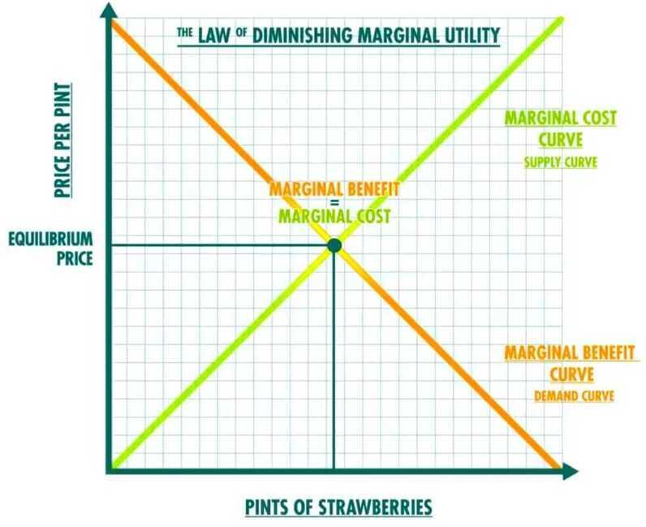

# Marginal Utility / Analysis

## Marginal Analysis

- Marginal analysis is an examination of the additional benefits of an activity compared to the additional costs incurred by that same activity. Marginal refers to the focus on the cost or benefit of the next unit or individual, for example, the cost to produce one more widget or the profit earned by adding one more worker.
- Companies use marginal analysis as a decision-making tool to help them maximize their potential profits.
- When a manufacturer wishes to expand its operations, either by adding new product lines or increasing the volume of goods produced from the current product line, a marginal analysis of the costs and benefits is necessary.

## Utils - A unit used to quantify satisfaction; they are completely subjective

## Utility

- Satisfaction, or happiness people get from consuming a good or service
- Law of diminishing marginal utility (difference between 200 and 201 parks is very less)
- Law of decreasing additional satisfaction

### Marginal Utility

the benefit gained from consuming one additional unit of a product or service.

"the law of marginal utility states that the first x is worth more than the second x (be it dollars, hours of free time, video games, pieces of food, etc.)"

Marginal utility quantifies the added satisfaction that a [consumer](https://www.investopedia.com/articles/pf/10/know-your-consumer-protection-laws.asp) garners from consuming additional units of goods or services. The concept of marginal utility is used by economists to determine how much of an item consumers are willing to purchase. Positive marginal utility occurs when the consumption of an additional item increases the total utility, while negative marginal utility occurs when the consumption of an additional item decreases the total utility.

Ex - For instance, you like eating pizza, the second piece of pizza brings you more satisfaction than only eating one piece of pizza. It means your marginal utility from purchasing pizza is positive. However, after eating the second piece you feel full, and you would not feel any better from eating the third piece. This means your marginal utility from eating pizza is zero. Moreover, you might feel sick if you eat more than three pieces of pizza. At this time, your marginal utility is negative.In other words, a negative marginal utility indicates that every unit of goods or service consumed will do more harm than good, which will lead to the decrease of overall utility level, while the positive marginal utility indicates that every unit of goods or services consumed will increase the overall utility level

- **Zero marginal utility**is when having more of an item brings no extra measure of satisfaction. For example, if you receive two copies of the same issue of a magazine, that extra copy has little added value.
- **Positive marginal utility**is when buying extra versions of an item is satisfying. One such example would be a store promotion where customers can walk out with a free pair of shoes if they buy two pairs up front.
- **Negative marginal utility**is where too much of an item is actually detrimental. For example, while the correct dose of antibiotics can kill harmful bacteria, too much can harm a person's body.

Diminishing Marginal Utility (DMU)

https://www.investopedia.com/terms/m/marginalutility.asp

## Diamond water paradox / Paradox of Value

What if we told you that we’re doing a Finshots giveaway of a diamond solitaire?

Now imagine that we told you that we’re giving away a bottle of mineral water. How would that make you feel? Meh, we’re guessing.

And that’s probably to do with how expensive diamonds are. But have you ever thought why the inconsequential diamond is costlier than a life-saving liquid like water?

Well, Adam Smith (the father of modern economics) did. In 1776, he pondered over this conundrum in his book An Inquiry into the Nature and Causes of the Wealth of Nations. And he couldn’t quite put a finger on it.

Economists tried to explain it using various theories. Such as the labour theory. Meaning, the more labour it takes to produce something, the pricier it is. After all, water was available in abundance. In streams, rivers, everywhere. Whereas diamonds were rarer, they were deep underground and hard to get. You needed more manpower for the job. So diamonds naturally were more expensive.

But not everyone was convinced. Because there were places where even water was rare. Like the deserts. So why didn’t water prices reach stratospheric levels in the desert?

Well, it took 100 years, but Alfred Marshall finally cracked the paradox and put the debate to rest. He said it’s not the absolute level of utility of the product but rather the diminishing marginal utility which matters.

In simple terms, the first litre of water is precious. It will quench your thirst. But what will you do with another 5 litres of water? You could store it for use but the more water you have, the less you start valuing it.

But that’s not the case with diamonds. Each additional diamond has the same allure. No one says no to the extra bling. You put this and its scarcity together and boom, you have a high price!

So yeah, that’s the Diamond-Water Paradox for you in a nutshell.
