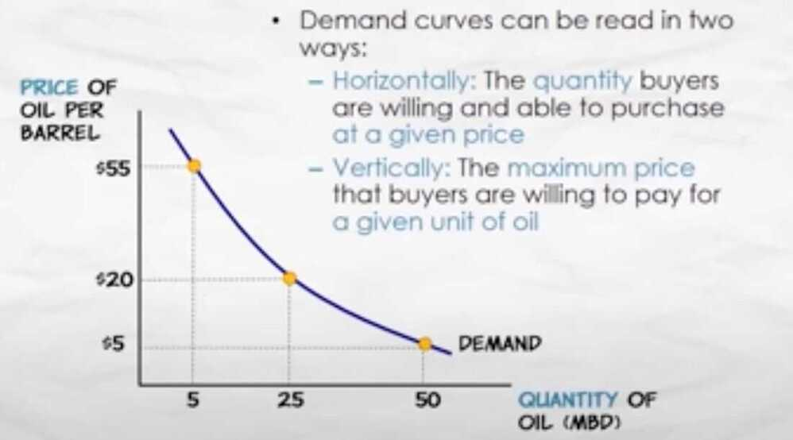

# Microeconomics

Microeconomics (from Greek prefixmikro-meaning "small" +economics) is a branch of [economics](https://en.wikipedia.org/wiki/Economics) that studies the behaviour of individuals and [firms](https://en.wikipedia.org/wiki/Theory_of_the_firm) in making decisions regarding the allocation of [scarce resources](https://en.wikipedia.org/wiki/Scarcity) and the interactions among these individuals and firms.

One goal of microeconomics is to analyze the [market mechanisms](https://en.wikipedia.org/wiki/Market_mechanism) that establish [relative prices](https://en.wikipedia.org/wiki/Relative_price) among goods and services and allocate limited resources among alternative uses. Microeconomics shows conditions under which free markets lead to desirable allocations. It also analyzes [market failure](https://en.wikipedia.org/wiki/Market_failure), where markets fail to produce [efficient](https://en.wikipedia.org/wiki/Financial_market_efficiency) results.

https://en.wikipedia.org/wiki/Microeconomics

https://www.edx.org/course/microeconomics

14.100x Microeconomics coversthe fundamentals of microeconomicsat an advanced undergraduate level. Topics include supply and demand, market equilibrium, consumer theory, production and the behavior of firms, monopoly, oligopoly, welfare economics, public goods, and externalities.

## DEDP (Data, Economics, and Development Policy (DEDP) Program) Program Curriculum

Core Courses:

- [14.100x: Microeconomics](https://www.edx.org/course/microeconomics-0)
- [JPAL 102x: Designing and Running Randomized Evaluations](https://www.edx.org/course/foundations-of-development-policy-0)
- [14.310x: Data Analysis for Social Scientists](https://www.edx.org/course/data-analysis-for-social-scientists-0)

Elective Courses (choose 2 of 3):

- [14.73x: The Challenges of Global Poverty](https://www.edx.org/course/the-challenges-of-global-poverty-0)
- [14.740x: Foundations of Development Policy](https://www.edx.org/course/foundations-of-development-policy-0)
- [14.750x: Political Economy and Economic Development](https://www.edx.org/course/political-economy-and-economic-development-2)

## The Demand Curve

- A Demand Curve is a function that shows the quantity demanded at different prices
    - The Quantity Demanded is the quantity that buyers are willing (and able) to purchase at a particular price
- Demand curves can be read in two ways
    - Horizontally - The quantity buyers are willing and able to purchase at a given price
    - Vertically - the maximum price that buyers are willing to pay for a given unit of oil

- **Consumer surplus** is the consumer's gain from exchange
    - the difference between the mazimum price a consumer is willing to pay for a given quantity and the market price
- **Total consumer surplus** is the sum of consumer surplus of all buyers
- Graphically, total consumer surplus is measured by the **area below the demand curve and above the price.**

- An **increase in demand** means an increase in quantity demanded at every given price or (in other words) an increase in the maximum willingness to pay for each given quantity
- What would cause an increase in demand?
    - Anything that increases the quantity demanded at a given price or that increases the maximum willingness to pay for a given quantity
- A **decrease in demand** means a decrease in quantity demanded at every given price or (in other words) a decrease in the maximum willingness to pay for each given quantity

### Demand Shifters (Income, Population, Substitutes, Complements, Expectations, Tastes)

- The effect of changes in income on demand **depends on the nature of the good in question**
- A **Normal Good:** demand increases when income increases (and vice versa)
- An **Inferior Good:** demand decreases when income increases (and vice versa)
- Ex - When I was a student, I used to eat more at McD, but now when my income increased I eat at better restaurants, so McD consumption decreases with the rise in income.
- Two goods are **Substitutes** if an increase in the price of one good leads to an increase in demand for the other good (or vice versa)
- Two goods are **Complements** if an increase in the price of one good leads to an decrease in the demand for the other (or vice versa)
    - Ex - Petrol car and Petrol (if price increases for one, there is a decrease in demand for the other)
- The **expectation** of a higher (lower) price for a good in the future increases (decreases) current demand for the good
    - Consumers will adjust their current spending **in anticipation of the direction of future prices** in order to obtain the lowest possible price.
- Tastes and preferences are subjective and will vary among consumers

### Change in Demand vs Change in Quantity Demanded

### Elasticity of Demand

#### Elastic demand

- Price = -10%
- Demand = +15%

Elasticity of demand = 1.5

#### Inelastic demand

- Price = -10%
- Demand = +5%

Elasticity of demand = 0.5

## The supply curve

- Supply represents the behavior of sellers
- A **Supply Curve** is a function that shows the quantity supplied at different prices
    - The **Quantity Supplied** is the quantity that producers are willing and able to sell at a particular price

## The equilibrium price and quantity

The market process works like an invisible hand to promote the social good -- Adam Smith

## Discretionary Expense

A discretionary [expense](https://www.investopedia.com/terms/e/expense.asp) is a cost that a business or household can survive without, if necessary. Discretionary expenses are often defined as nonessential spending. This means a business or household is still able to maintain itself even if all discretionary [consumer spending](https://www.investopedia.com/terms/c/consumer-spending.asp) stops.

Meals at restaurants and entertainment costs are examples of discretionary expenses.

https://www.investopedia.com/terms/d/discretionary-expense.asp

https://www.khanacademy.org/economics-finance-domain/microeconomics

https://mru.org/courses/principles-economics-microeconomics

[Principles of Economics: Microeconomics](https://www.youtube.com/playlist?list=PL-uRhZ_p-BM4XnKSe3BJa23-XKJs_k4KY)
