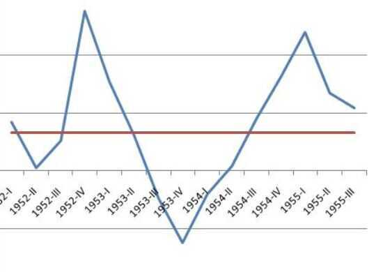
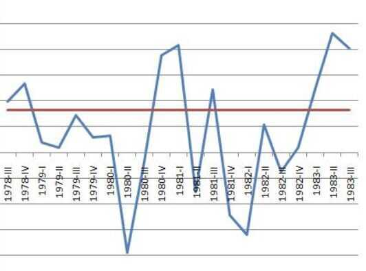
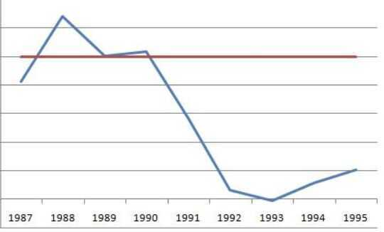

# Recession shapes (Recovery types)

## V-shaped recession

## U-shaped recession

## W-shaped recession (double-dip recession)

## L-shaped recession

## K Shaped recovery

What 'K' means is those at the top are seeing things go up, and those at the middle and below are seeing things go down and get worse

A K-shaped recovery occurs when an economy recuperates unevenly, and there's a separate trajectory for two segments of the society. While the financial markets recover and grow, the real economy, or the flow of goods and services, gets worse. That's worrying, because [84% of the stock market](https://www.nytimes.com/2018/02/08/business/economy/stocks-economy.html) is owned by 10% of households. While the market continued to rise even amid a global pandemic, GDP and employment rates fell.

## J Curve

The [J Curve](https://www.investopedia.com/terms/j/j-curve-effect.asp) is an economic theory which states that, under certain assumptions, a country's [trade deficit](https://www.investopedia.com/terms/t/trade_deficit.asp) will initially worsen after the [depreciation of its currency](https://www.investopedia.com/terms/c/currency-depreciation.asp)-mainly because higher prices on imports will be greater than the reduced volume of imports.

The J Curve operates under the theory that the trading volumes of imports and exports first only experience [microeconomic](https://www.investopedia.com/terms/m/microeconomics.asp) changes. But as time progresses, export levels begin to dramatically increase, due to their more attractive prices to foreign buyers. Simultaneously, domestic consumers purchase less imported products, due to their higher costs.

These parallel actions ultimately shift the [trade balance](https://www.investopedia.com/terms/b/bot.asp), to present an increased surplus and smaller deficit, compared to those figures before the [devaluation](https://www.investopedia.com/terms/d/devaluation.asp). Naturally, the same economic rationale applies to the opposite scenarios, where a country experiences a currency appreciation, which would consequently result in an inverted J Curve.

## Links

https://www.investopedia.com/terms/j/jcurve.asp
