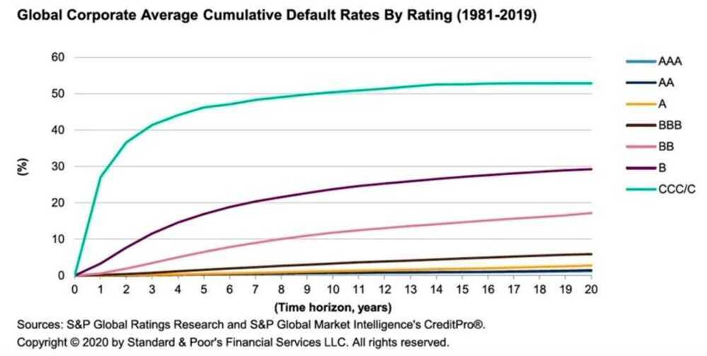

# Debt Mutual Funds Analysis

[How to select a debt mutual fund?](https://www.youtube.com/watch?v=8R4yoe2dRIQ)

[Debt Mutual Funds for Beginners Part 2 | Use YTM & Modified Duration to Improve Returns & Lower Risk](https://www.youtube.com/watch?v=1BTke9iLuYg&ab_channel=ETMONEY)

- Coupon rate / Interest rate on bonds
- Debt fund factsheet
- Yield to maturity (YTM) / book yield / redemption yield
    - Face value
    - Market price / Par value / At par
    - At discount (better yields)
    - At premium (lower yields)
    - Time value of money (Since the interest will get reinvested, interest at 1st year will be invested for 9 years, whereas interest received at 9th year, will be invested only for 1 year)

Yield to maturity (YTM) is the total return anticipated on a bond if the bond is held until it matures. Yield to maturity is considered a long-term [bond yield](https://www.investopedia.com/terms/b/bond-yield.asp) but is expressed as an annual rate. In other words, it is the [internal rate of return](https://www.investopedia.com/terms/i/irr.asp)(IRR) of an investment in a bond if the investor holds the bond until maturity, with all payments made as scheduled and reinvested at the same rate.

- Yield to maturity (YTM) is the total rate of return that will have been earned by a bond when it makes all interest payments and repays the original principal.
- YTM is essentially a bond's internal rate of return (IRR) if held to maturity.
- Calculating the yield to maturity can be a complicated process, and it assumes all coupon or interest, payments can be reinvested at the same rate of return as the bond.
- If the YTM is higher than the coupon rate, this suggests that the bond is being sold at a discount to its par value. If, on the other hand, the YTM is lower than the coupon rate, then the bond is being sold at a premium.

https://www.investopedia.com/terms/y/yieldtomaturity.asp

[What is Yield to Maturity? | How to Calculate YTM? | CA Rachana Ranade](https://www.youtube.com/watch?v=xifvYllUGso)

## Yield Curve

[The Yield Curve Just Inverted. What Next For Investors?](https://youtu.be/1d2NGMKxhj4)

Inverse relationship between price of bond and yield, if price of bond goes up yield comes down and vice versa

[Hint Before The Market Storm | CA Rachana Ranade](https://www.youtube.com/watch?v=xa-PCSXfVAU)

Inverted yield curve

## Average maturity

## Macaulay duration

The Macaulay duration is the [weighted average](https://www.investopedia.com/terms/w/weightedaverage.asp)[term to maturity](https://www.investopedia.com/terms/t/termtomaturity.asp) of the cash flows from a [bond](https://atlas.dotdash.com/terms/b/bond.asp). The weight of each cash flow is determined by dividing the present value of the cash flow by the price. Macaulay duration is frequently used by [portfolio managers](https://atlas.dotdash.com/terms/p/portfoliomanager.asp) who use an immunization strategy.

## Modified duration

The modified duration (measured in years) of a bond is essentially the sensitivity of the bond's price to the change in interest rate. So if a bond has a modified duration of 3.2 years, then

- A 1% increase in interest rate decreases the bond's price by 3.2%. A 1.5% increase in the interest rate, lower the bond's price by 4.8%
- A 1% decrease in interest rate increases the bond's price by 3.2%. A 1.5% decrease in bond price, increases the bond's price by 4.8%

## Conditional Probabilities: Bond Rating and Default Rates

## A Probit Model: Hostile Acquisitions

- While there are no easy pathways to making money, it seems clear that investors in companies that are targeted in acquisitions (especially hostile ones) earn high returns, but only if they invest before the event
- There are probit models for predicting companies that will be targeted, and they involve:
    - You start with all firms that publicly traded at the start of a period
    - The dependent variable becomes the stand-in for whether a firm is targeted in a hostile acquisition
    - The independent variables reflect what you believe are key drivers of hostile acquisitions, including poor stock price performance, lagging accounting returns and managers with little or no shareholdings
    - You build a probit model that will yield as output an equation that resembles a regression, but will yield a probability of a hostile acquisition

## Links

[Analyzing debt mutual funds - YouTube](https://www.youtube.com/watch?v=1_2tzQVUqpM)
