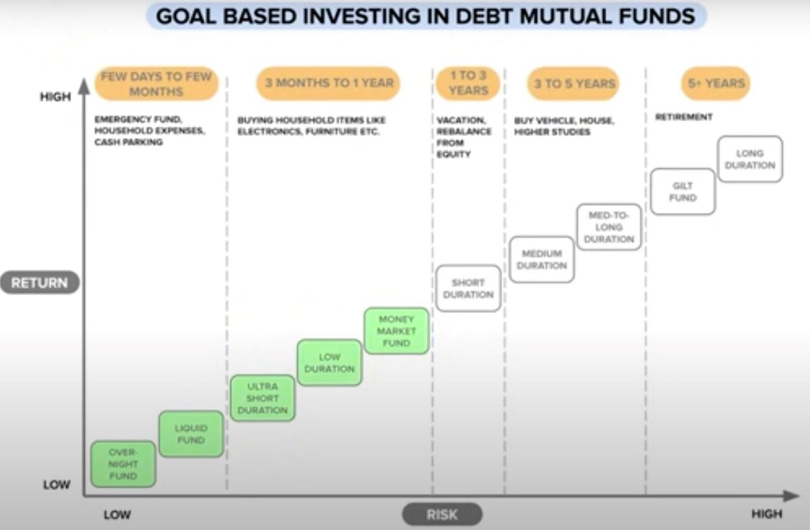

# Debt Mutual Funds

- The debt part of the portfolio is to provide stability to the portfolio, not to generate a higher return. If investors want a higher return from their portfolio, they should ideally increase equity allocation in the portfolio.
- Employee Provident Fund (EPF), Public Provident Fund (PPF) and Sukanya Samriddhi Yojana (SSY) are the best products for the debt part of the long-term portfolio for retail investors.
- Investors should use debt mutual funds in their long-term portfolios only after the optimum use of EPF, PPF and SSY. Investors can use debt funds to maintain some liquidity in their long-term portfolios.
- If you are a senior citizen, your debt portfolio should have a Senior Citizen Savings Scheme.
- Investors can safely use bank fixed and recurring deposits if they require the amount within three years. There is no tax benefit in debt funds as against bank fixed deposits if all the amount is redeemed within three years.

## Advantages of Debt Mutual Funds

Here are the benefits of debt mutual funds over bank fixed deposits, company fixed deposits and individual bonds.

- You can deposit money and withdraw whenever you want. You can choose how much money to deposit and withdraw.
- Unlike fixed deposits, in debt funds, you pay tax only when you withdraw. Because of the deferred tax, all the gains in debt funds are available for compounding. The impact of this over 15 years is huge if debt funds generate the same return as bank fixed deposit interest rates.
- Debt funds provide better diversification and reduce single-entity risk in the portfolio.

## Debt Funds / Income Funds / Bond Funds

- Quantum Liquid Fund + ICICI Arbitrage Fund

They are a type of mutual funds that invest primarily in fixed income instruments (such as bonds) issued by government, public and private companies. These funds get interest from these borrowers, which is then reflected in the returns of debt investments.

Debt funds, alternatively known as fixed-income funds or credit funds, come under the fixed income asset category of mutual funds. They are low-risk investments vehicles and are comparatively more secure than equity funds which are subject to volatile market forces.

There are several avenues through which you can invest in the best performing debt funds for higher returns. It can be long-term or short-term bonds, monthly income plans (MIPs), floating-rate debt, money market instruments, fixed maturity plans (FMPs) or security products.

Debt Mutual Funds can be broadly classified into:

- **Theme based:** SEBI has defined some categories based on the kind of instruments the mutual fund invests in, for example, corporate bonds, Government bonds, etc.
- **Duration based:** These funds are based on maturity or Macaulay duration of the fund. The Macaulay Duration is the time taken for a bond to repay its own purchase price in present value terms.

Below are ten such duration based categories of debt funds as defined by SEBI:

| **Category of Schemes** | **Macaulay Duration [Volatility increases with duration]** | **3 Year Annualised Returns** |
| ----------------------- | ---------------------------------------------------------- | ----------------------------- |
| Overnight Funds         | Maturity up to 1 Day                                       | 6.39 %                        |
| Liquid Funds | Maturity up to 91 Days | 6.85 % |
| Ultra Short Duration Funds| Between 3 to 6 Months | 7.34 % |
| Low Duration Funds | Between 6 to 12 Months | 7.88 % |
| Money Market Funds | Maturity up to 1 Year | 7.31 % |
| Short Duration Funds | Between 1 to 3 Years | 7.74 % |
| Medium Duration Funds| Between 3 to 4 Years | 7.90 % |
| Medium to Long Duration Funds | Between 4 to 7 Years | 7.05 % |
| Long Duration Funds | Greater than 7 Years | 8.60 % |
| Dynamic Bond Fund |  |  |
| Corporate Bond Fund |  |  |
| Credit Risk Fund |  |  |
| Banking and PSU Fund |  |  |
| Gilt Fund |  |  |
| Gilt with 10Y constant duration fund |  |  |
| Floater Fund |  |  |
| IDCW - Income Distribution cum Capital Withdrawal / Dividend plans |  |  |

[https://www.hdfcfund.com/investor-desk/hdfc-mf-weekend-bytes/idcw-or-swp-mutual-funds](https://www.hdfcfund.com/investor-desk/hdfc-mf-weekend-bytes/idcw-or-swp-mutual-funds)

[The best debt fund to invest now | Debt funds | Mutual fund investing - YouTube](https://www.youtube.com/watch?v=j8sQ7gI_70E)

**Recurring deposits and fixed deposits can be terribly tax-inefficient for those in the 20% and 30% slabs. Primarily because the gains have to declared and tax paid each financial year. A debt mutual fund is a natural choice.**

Debt mutual fund schemes that invest in fixed income instruments, such as Bonds, and money market instruments etc. that offer capital appreciation.

There are three options with debt funds:

- Stick to money market funds like liquid, overnight or very short-term bond funds with reasonable credit quality. The risk of loss is low(er) but over the long term, returns will gradually head south.
- Avoid all credit risk and use only long term gilt funds. See for example [SBI Magnum Constant Maturity Fund: A Debt Fund With Low Credit Risk for long term goals!](https://freefincal.com/sbi-magnum-constant-maturity-fund/) The NAV here will be highly volatile and the investor must practice and mix of annual rebalancing (aka strategic) and tactical rebalancing as per bond yield movements. This does not involve much effort.
- Take on a mix of credit and interest rate risk. The management effort is less, returns can be higher than money market funds but there is always a risk of bond defaults. To negate that, choice of fund selection and monthly monitoring of the portfolio is crucial.

It is important for investors to understand that there is no escape from risk whatever choice they make. It is only a question of **familiar risk vs unfamiliar risk**. **Comfortable risk vs uncomfortable risk**. Sadly, when it comes to returns, we study the past and take it seriously. When it comes to risk, we ignore the past and assume what did not cause a loss is not risky.

https://freefincal.com/fixed-income-investment-retirement

1. Do not use debt funds if you do not have an idea of how volatile they can be.
    - You can use the [Multi-index Mutual Fund Rolling Returns Calculator](https://freefincal.com/multi-index-mutual-fund-rolling-returns-calculator/) to get the above graphs for the fund that hold or aim to invest in.
2. The average maturity of the portfolio should be much lower than the investment duration of the fund.
    - If your investment duration is 3 years, then an average maturity of a few months is good (liquid funds)
    - If your investment duration is 10 years, then an average maturity of 1-2 years is good.
        - Ultra-short-term funds ~ 1Y.
        - Short-term gilts ~1-3Y if you want to avoid credit risk.
        - Income funds from solid bonds from banks and PSUs or a bit of corporate debt ~ 1-3Y is also okay.
3. A fixed deposit is a wonderful product for investment durations less than 3 years. After all, [there is more to investing than obtaining real returns](https://freefincal.com/there-is-more-to-investing-than-obtaining-real-returns/)

https://freefincal.com/are-debt-mutual-funds-an-alternative-to-fixed-deposits

[Best Liquid Fund 2025 | Top Liquid Fund 2025 - YouTube](https://www.youtube.com/watch?v=ejkekhSsttU&ab_channel=pranjalkamra)

- **Axis liquid fund direct growth** - (0.15%, Fund size - 33183.3 Cr, Good returns)
- Quantum liquid fund

## Gilt funds

Gilt funds are debt funds that invest in government securities. The government bonds used to be issued in golden-edged certificates. The nickname gilt comes from gilded edge certificates. As per Sebi norms, gilt funds have the mandate to invest at least 80% of their assets in government securities.

There are two kinds of gilt funds

1. gilt funds that invest mostly in government securities across maturities.
2. gilt funds with constant maturity of 10 years -- these funds must invest at least 80% of their assets in government securities with a maturity of 10 years.

Investors should keep in mind that since these schemes invest in government securities, they have zero default risk. However, they have very high interest rate risk. In fact, government securities set the tone for interest rates in the money market and economy. The mostly traded 10-year government security is considered the benchmark. Its yield movement sets the tone for trading in the bond market. For example, traders look for trading opportunities based on the spread or interest rate difference between government bonds and corporate bonds or between the 10-year bond and other government bonds.

Finally, invest in gilt funds only if you can keep track of the interest rate movements and time your entry and exit in these schemes. Always remember that their extreme sensitivity to interest rate movements in the economy. This means gilt schemes may start going up or down, depending on the interest rate outlook. The RBI action might come later.

https://economictimes.indiatimes.com/mf/analysis/what-are-gilt-funds/articleshow/76425288.cms

An arbitrage fund held for several years might be an underutilization of funds. I wanted the possibility of a bit more return than arbitrage -- meaning more volatility but not as much equity.

There two categories here: the 10-year gilts and the normal gilts. The 10-year gilt is the closest we have to a debt index fund but is the most volatile among the lot.

https://freefincal.com/why-i-partially-switched-from-icici-multi-asset-fund-to-icici-gilt-fund

[What are Gilt Funds, when to use them, how to select them](https://www.youtube.com/watch?v=rzVPsRGZeBY)

## Funds

### Nippon India ETF Nifty 8-13 yr G-Sec Long Term Gilt

- NSE - LTGILTBEES

[Check Nippon India ETF Nifty 8-13 yr G-Sec Long Term Gilt Fund's latest information like performance, NAV, returns, expense](https://mf.nipponindiaim.com/FundsAndPerformance/Pages/NipponIndia-ETF-Nifty-8-13-yr-G-Sec-Long-Term-Gilt.aspx)

[groww.in/mutual-funds/nippon-india-etf-long-term-gilt-idcw](https://groww.in/mutual-funds/nippon-india-etf-long-term-gilt-idcw)

### [Parag Parikh Dynamic Asset Allocation Fund](https://amc.ppfas.com/schemes/parag-parikh-dynamic-asset-allocation-fund/) (PPDAAF)

| Type of Instruments                                                                             | Normal Allocation (% of Net Assets) | Risk Profile    |
| ----------------------------------------------------------------------------------------------- | ----------------------------------- | --------------- |
| Equities & Equity related instruments                                                           | 0-100                               | Very High       |
| Debt securities & Money Market instruments including Units of Debt oriented mutual fund schemes | 0-100                               | Low to Moderate |

The fund will predominantly invest in debt instruments and endeavour to maintain equity allocation between 35% and 65% (some of it will be hedged via approved derivative instruments as permitted by SEBI from time to time)

It is a credible and tax-efficient* alternative to certain fixed income instruments (like bank fixed deposits), offering the scope to earn income along with the prospect of growth in Net Asset Value (NAV) when held for a reasonably long period.

According to the CEO, this fund may be "ideal" for those desiring debt allocation with indexation benefits and those who avoid actively trading in debt securities.

Taxation - LTCG - If holding is more than 36 months) - Debt Fund (20% with Indexation benefit)

- [Webinar to discuss the NFO of Parag Parikh Dynamic Asset Allocation Fund - YouTube](https://www.youtube.com/watch?v=iCVFUX9QUoc&ab_channel=PPFASMutualFund)
- [How does Parag Parikh Dynamic Asset Allocation Fund (PPDAAF) provide indexation benefit? CEO explains - The 1% News](https://news.onepercentclub.io/invest/how-does-parag-parikh-dynamic-asset-allocation-fund-ppdaaf-provide-indexation-benefit-ceo-explains/1064/)
- [Parag Parikh Dynamic Asset Allocation Fund: Who should invest?](https://freefincal.com/parag-parikh-dynamic-asset-allocation-fund-who-should-invest/)
- [Parag Parikh Dynamic Asset Allocation Fund vs Parag Parikh Conservative Hybrid Fund](https://freefincal.com/parag-parikh-dynamic-asset-allocation-fund-vs-parag-parikh-conservative-hybrid-fund/)

## Debt Funds vs FD

[Fixed Deposits vs. Debt Mutual Funds: Which is Better?](https://www.wintwealth.com/fixed-deposit/fd-vs-debt-mutual-funds/)

## Links

- Stable Money
- https://www.thefixedincome.com
- https://www.bharatbond.in
- https://zerodha.com/varsity/chapter/the-debt-funds-part-1
- https://zerodha.com/varsity/chapter/government-securities
- [Getting started with debt mutual funds - YouTube](https://www.youtube.com/watch?v=7jLip-C8SQs)
- [Important debt fund jargon - YouTube](https://www.youtube.com/watch?v=A3eDo9O5K4w)
- [Should I Move Money from FD to Debt Funds? | Mutual Fund Monday | Gaurav Jain - YouTube](https://www.youtube.com/watch?v=fOBaa2e3mcI&ab_channel=YadnyaInvestmentAcademy)
- [Make 15% RETURN on Debt Mutual Funds & GOI Bonds | Just 10% LTCG Tax | RBI Repo Rate 2024 - YouTube](https://www.youtube.com/watch?v=p6WjOkhB1dY&ab_channel=ShankarNath)
- [Should I pay tax as per slab if my fund’s equity holdings drop to 35% for one month?](https://freefincal.com/should-i-pay-tax-as-per-slab-if-my-funds-equity-holdings-drop-to-35-for-one-month/)
- [An introduction to debt mutual funds for new investors](https://freefincal.com/an-introduction-to-debt-mutual-funds-for-new-investors/)
- [Should you invest in debt funds as interest rate cut inches closer? | Simply Save](https://www.moneycontrol.com/news/business/personal-finance/should-you-invest-in-debt-funds-as-interest-rate-cut-inches-closer-simply-save-12814406.html)
