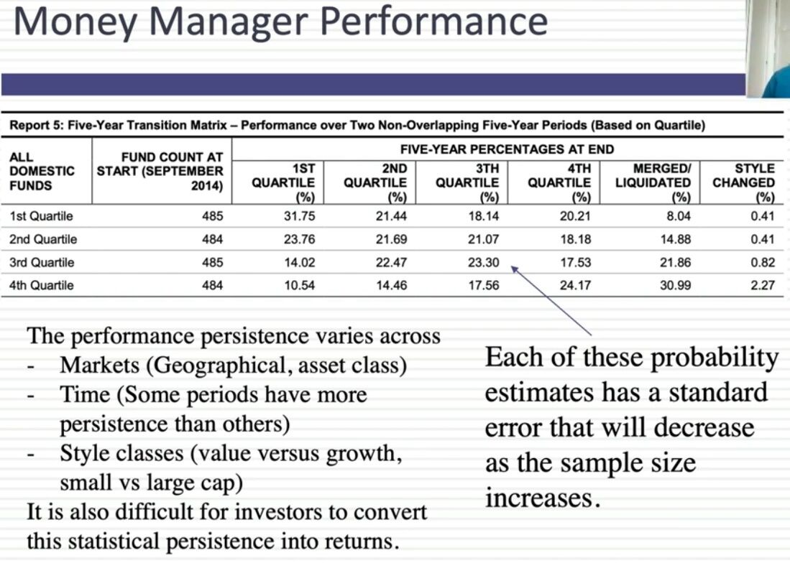

# Equity Mutual Funds

## Equity funds or growth funds

### Common Names

- Bluechip’ and ‘large-cap’ are the same thing.
- ‘Long-term equity’, ‘tax saver’, ‘tax plan’, ‘tax relief’, and ‘ELSS’ are all the same thing - they are funds that help you save tax under section 80C.
- ‘Emerging large-cap’ is the same as ‘large & mid-cap’.

### What is difference in Multi Asset Fund & other Hybrid funds?

Hybrid funds are mutual funds that invest in both equity (shares) and debt (fixed income securities, bonds, etc).

They are also called balanced funds.

There are a few kinds of hybrid funds.

Multi-asset funds are also hybrid in nature but there’s one major difference. They have to invest in at least 3 different assets and must invest at least 10% in each of those assets.

For example, a multi-asset fund might invest in equity, debt, as well as gold.

### ## Multi-Cap Funds vs Flexi-Cap Funds

| Particulars                 | Multi-Cap Funds                                                                                                                                                                                                                                                                                                                                                                                                                                                                                                                                                                                                                                 | Flexi-Cap Funds                                                                                                                                                                                                                                                                                                                                                                                                                                                                                                                                                                       |
| --------------------------- | ----------------------------------------------------------------------------------------------------------------------------------------------------------------------------------------------------------------------------------------------------------------------------------------------------------------------------------------------------------------------------------------------------------------------------------------------------------------------------------------------------------------------------------------------------------------------------------------------------------------------------------------------- | ------------------------------------------------------------------------------------------------------------------------------------------------------------------------------------------------------------------------------------------------------------------------------------------------------------------------------------------------------------------------------------------------------------------------------------------------------------------------------------------------------------------------------------------------------------------------------------- |
| **Meaning**                 | This equity-oriented fund, namely Multi-Cap Funds' mandate is to maintain a diversified portfolio of large, mid-cap, and small-cap corporations, as the name would imply.                                                                                                                                                                                                                                                                                                                                                                                                                                                                       | An open-ended, dynamic equity program is called a Flexi-Cap Fund. It makes investments in businesses without any market capitalization. Specifically large, mid-size, and small-cap companies.                                                                                                                                                                                                                                                                                                                                                                                        |
| **Equity Exposure**         | Multi-Cap Funds require a minimum of 75% in Equities. This means that at least 75% of the scheme's total assets must be invested in equity and instruments that relate to equity.                                                                                                                                                                                                                                                                                                                                                                                                                                                               | Flexi-Cap Funds require a minimum of 65% in Equities. This means that at least 65% of the scheme's total assets must be allocated to investments in equity and instruments with an equity component.                                                                                                                                                                                                                                                                                                                                                                                  |
| **Market Cap Allocation**   | Multi-Cap Funds are required to have a minimum 25% allocation of their portfolio in large-cap, mid-cap, and small-cap companies, as per SEBI.                                                                                                                                                                                                                                                                                                                                                                                                                                                                                                   | Flexi-Cap Funds are free to invest in any market cap because they have no mandate. Flexi-Cap Funds invest in stocks of companies with a range of capitalizations without having a set percentage allocated to anyone.                                                                                                                                                                                                                                                                                                                                                                 |
| **Fund Manager Discretion** | In Multi-Cap Funds, the fund manager has the freedom to select stocks and [market capitalization](https://groww.in/p/market-capitalisation).                                                                                                                                                                                                                                                                                                                                                                                                                                                                                                    | In Flexi-Cap Funds, only the stocks with the specified market cap are available for the fund manager to select.                                                                                                                                                                                                                                                                                                                                                                                                                                                                       |
| **Risks**                   | A Multi-Cap Fund, by definition, invests in the stocks of large-cap, mid-cap, and small-cap corporations. As a result, these plans are riskier than large-cap plans, which invest mainly in large corporations.                                                                                                                                                                                                                                                                                                                                                                                                                                 | Flexi-Cap Funds offer exposure to a wide range of equity securities, covering all industries and business entities. This could result in a portfolio with a strong mix of stocks that produces moderate returns. Furthermore, if held for a long time, this fund offers a lot of flexibility in managing the risk associated with [market volatility](https://groww.in/p/volatility).                                                                                                                                                                                                 |
| **Tax Implications**        | The post-tax returns are what count. To determine that, you should be aware of the taxation of Multi-Cap Funds. Depending on how long you held the investment, you may or may not have to pay taxes on the capital gains you made when selling your Multi-Cap Fund. The gains on your investments are considered short-term capital gains (STCG) and are subject to a 15 per cent tax if you sell them within a year. The gains on any Multi-Cap investment held for longer than a year are categorized as taxable term capital gains (LTCG). Gains up to Rs. 1 lakh is exempt from taxes. Gains over one lakh rupees are subject to a 10% tax. | A Flexi-Cap Fund is regarded as an [Equity Mutual Fund](https://groww.in/p/equity-funds) under the Income Tax Act, making gains from investments in this category subject to a lower tax rate. Any profit realized within a year is considered short-term and is subject to a flat [tax](https://groww.in/p/tax) of 15%. Profits realized on such a fund after a year are considered long-term [capital gains](https://groww.in/p/capital-gains) and are fully exempt up to Rs. 1 lakh annually, after which the remaining amount is subject to a flat tax of 10% without indexation. |
| **Who Should Invest?**      | Multi-Cap Funds are appropriate for those who are willing to take on more risk in exchange for greater profits. You'll need a longer investment horizon of at least 5-7 years due to the greater mid-cap and small-cap components.                                                                                                                                                                                                                                                                                                                                                                                                              | Flexi-Cap Funds may be of interest to investors looking for a large-cap-focused fund with a tactical allocation to mid-cap and small-cap stocks and invest money into the sector within a 5-year time horizon.                                                                                                                                                                                                                                                                                                                                                                        |
| **Benefits**                | Multi-Cap Funds each have a unique area of expertise. The fund manager has discretion in this. Large-cap, mid-cap, and small-cap investments are all available. The long-term risk is additionally lower in Multi-Cap Funds. Additionally, the risk is lower compared to small-cap and mid-cap funds.                                                                                                                                                                                                                                                                                                                                           | Flexi-Cap Funds have a lot of advantages. Flexi-Cap Funds, for instance, lower the risk of market volatility. In addition, it becomes simpler for the fund manager to adjust the exposure to market capitalization, and it is also simpler for investors to balance their portfolios. For small investors, this is also a good plan. Good stock investments are beneficial. Additionally, it offers the benefit of higher returns with lower risk.                                                                                                                                    |

[Multi-Cap Funds Vs Flexi-Cap Funds – How Are They Different?](https://groww.in/blog/multi-cap-funds-vs-flexi-cap-funds)

## Active Equity MFs

- PPFAS LTE
- HDFC Hybrid Equity
- Quantum Long Term Equity
- **Motilal Oswal Focused 25 Fund**

## Midcap funds

- **HDFC Mid cap opportunities fund**
- **Kotak emerging equity fund**
- Edelweiss midcap fund
- SBI magnum midcap fund
- Motilal Oswal midcap fund
- Nippon india growth fund

[Best midcap mutual fund 2023 | Detail Comparison of best performing midcap funds - YouTube](https://www.youtube.com/watch?v=gxPrsLCq0H4)

[The Rising Mid-Cap Star You Can’t Ignore | Edelweiss Mid Cap Fund Review - YouTube](https://www.youtube.com/watch?v=SUjCGbVUtnA)

## Toppers in different categories by 1-year returns

- Mid Cap: Motilal Oswal Midcap
- Large & Midcap: Motilal Oswal Large & Midcap
- Flexi Cap: Motilal Oswal Flexi Cap

## Momentum Investing

Active - Quant Momentum Fund

### Types of momentum

1. Absolute momentum - A stock's recent performance is compared to it's historical performance
2. Relative momentum - A stock's recent performance is compared to it's sector or broad market index

### Types of momentum Strategies

1. Price momentum - Assets with strong recent price performance
2. Relative strength momentum - Compares an asset's performance to its benchmark
3. Cross sectional momentum - Compares price movements of two stocks within the same sector
4. Time series momentum - Capitalizing on continuation of existing price trends
5. 52-week high momentum - Focuses on assets reaching new hight over a 52-week period
6. Dual momentum - Combines both relative and absolute momentum signals
7. Volatility momentum - Investing based on momentum of market volatility levels
8. Earning momentum - Assets with strong and consistently growing earnings
9. Fundamental momentum - Selects assets based on fundamental factors like earnings growth, revenue, etc
10. Smart beta momentum - Alternative weighting schemes to capture momentum in asset prices
11. Global macro momentum - Invest based on macroeconomic factors like GDP, interest rates, inflation, trade balance, etc across global markets

[Why Momentum Investing is now 15% of My Portfolio? | How to Find Momentum Stocks | Momentum Funds - YouTube](https://www.youtube.com/watch?v=xbRiKHchqFg&ab_channel=ShankarNath)

[Learn to build momentum portfolio in 6 easy steps | What is momentum & h...](https://youtu.be/_BonDIAu0s0)

[Which Are the Top-Performing Momentum Mutual Funds? - YouTube](https://www.youtube.com/watch?v=e18Ib2_YRVo&ab_channel=MutualFundsatGroww)

## Funds

https://www.moneycontrol.com/mutual-funds/nav/icici-prudential-nifty-index-fund/MPI031

https://www.moneycontrol.com/mutual-funds/nav/parag-parikh-flexi-cap-fund-direct-plan-growth/MPP002

https://www.moneycontrol.com/mutual-funds/nav/hdfc-mid-cap-opportunities-fund-direct-plan-growth/MHD1161

SBI smallcap mutual fund - https://twitter.com/etmoney/status/1590690695408676865

[Is it time to exit small cap mutual funds?](https://freefincal.com/is-it-time-to-exit-small-cap-mutual-funds/)

## Categories of actively managed equity mutual fund schemes

- Largecap: At least 80% in largecap
- Midcap: At least 65% in midcap
- Smallcap: At least 65% in smallcap
- Large & midcap: At least 35% each in largecap and midcap
- **Multicap: At least 65% in equities and no market-cap wise restriction**

In the multicap category, the allocation decision is left to the fund manager who is better equipped to take allocation decision compared to retail investors and their advisers. The fund manager doesn't have a restricted mandate, and therefore, he is free to invest where he finds better opportunities.

- Sectoral/Thematic: At least 80% in the chosen sector stocks
- Focused: At least 65% in equities and a maximum of 30 stocks in the portfolio.
- Dividend Yield: At least 65% in equities but in dividend-yielding stocks
- Value/Contra: At least 65% in equities, the scheme should follow value or contra investment strategy.
- ELSS: At least 80% in equities, lock-in of 3 years and tax benefit under section 80C

## Smallcase

[True cost of Smallcase Investing EXPOSED | Ankur Warikoo](https://www.youtube.com/watch?v=RwKEqGOpqQs)

### Smallcases

1. Windmill Capital - Straight Flush
2. Windmill Capital - Value and Momentum
3. Windmill Capital - Brand Value
4. Low risk smart beta: https://www.smallcase.com/smallcase/low-risk-smart-beta-SCSB_0003
5. Weekend Investing - Smallcase Weekend Investing - Mi_NNF10
6. Smallcase Capitalmind Momentum
7. Dividend Aristocrat
8. Dividend stars
9. SmartNifty index
10. Gulaq - https://www.gulaq.com

## Analysis

[How to analyze an equity mutual fund? - YouTube](https://www.youtube.com/watch?v=k6wLmbWgies)

## Links

[Getting started with equity mutual funds - YouTube](https://www.youtube.com/watch?v=nW5DTqJ7REY)

[I'll Select These TWO Mutual Funds for my Lifetime Investing Portfolio - YouTube](https://www.youtube.com/watch?v=aYHRTPTDtNk)

- Momentum - Nifty 200 Momentum 30 Index
- Value fund - Nifty 500 Value 50 Index

[List of worst equity mutual funds (Jan 2013 to Dec 2023)](https://freefincal.com/list-of-worst-equity-mutual-funds-jan-2013-to-dec-2023/)

[Flexi-cap funds vs. focused equity funds: Which is better? | Value Research](https://www.valueresearchonline.com/stories/53730/do-focused-funds-give-better-returns-than-flexi-cap-funds/)

[What you need to know about small cap mutual fund stress tests](https://freefincal.com/what-you-need-to-know-about-small-cap-mutual-fund-stress-tests/)

[Motilal Defence Fund breaks record at Rs 1676 cr but is it worth investing? | Personal Finance - Business Standard](https://www.business-standard.com/amp/finance/personal-finance/motilal-defence-fund-breaks-record-at-rs-1676-cr-but-is-it-worth-investing-124070500104_1.html)

[Best Large & Midcap Mutual Fund for 2025 - YouTube](https://www.youtube.com/watch?v=sjmK6BrFQy0&ab_channel=pranjalkamra)

- Kotak equity opportunities fund
