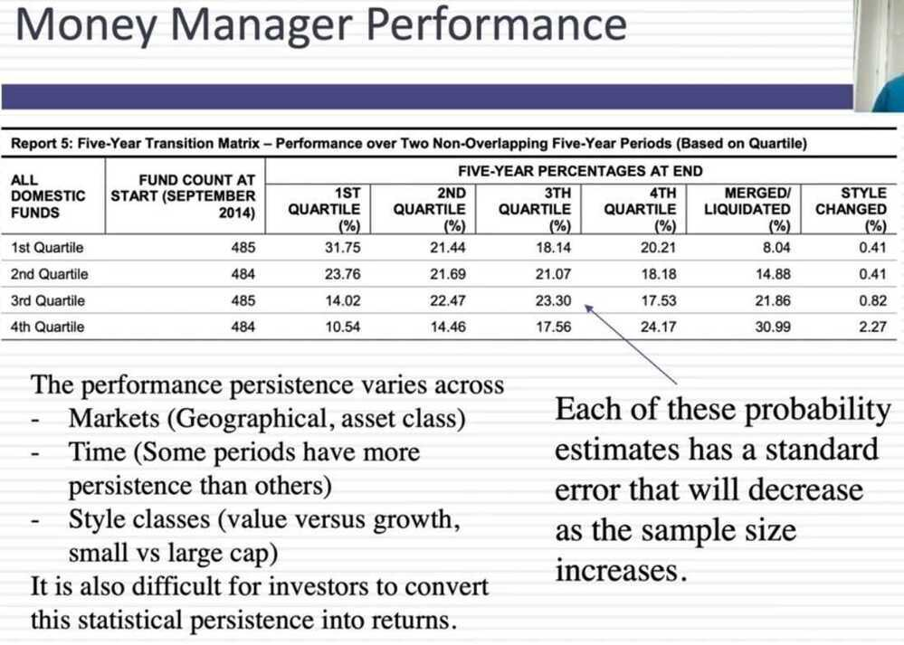

# Equity Mutual Funds

## Equity funds or growth funds

### Common Names

- Bluechip’ and ‘large-cap’ are the same thing.
- ‘Long-term equity’, ‘tax saver’, ‘tax plan’, ‘tax relief’, and ‘ELSS’ are all the same thing - they are funds that help you save tax under section 80C.
- ‘Emerging large-cap’ is the same as ‘large & mid-cap’.

### What is difference in Multi Asset Fund & other Hybrid funds?

Hybrid funds are mutual funds that invest in both equity (shares) and debt (fixed income securities, bonds, etc).

They are also called balanced funds.

There are a few kinds of hybrid funds.

Multi-asset funds are also hybrid in nature but there’s one major difference. They have to invest in at least 3 different assets and must invest at least 10% in each of those assets.

For example, a multi-asset fund might invest in equity, debt, as well as gold.

### Multi-Cap Funds vs Flexi-Cap (Flexicap) Funds

Flexi-cap and multi-cap funds both invest across large, mid, and small-cap stocks, but **multi-cap funds have a mandate to invest a minimum of 25% in each market cap category**, while flexi-cap funds have more flexibility in allocating investments across market caps.

| Particulars                 | Multi-Cap Funds                                                                                                                                                                                                                                                                                                                                                                                                                                                                                                                                                                                                                                 | Flexi-Cap Funds                                                                                                                                                                                                                                                                                                                                                                                                                                                                                                                                                                       |
| --------------------------- | ----------------------------------------------------------------------------------------------------------------------------------------------------------------------------------------------------------------------------------------------------------------------------------------------------------------------------------------------------------------------------------------------------------------------------------------------------------------------------------------------------------------------------------------------------------------------------------------------------------------------------------------------- | ------------------------------------------------------------------------------------------------------------------------------------------------------------------------------------------------------------------------------------------------------------------------------------------------------------------------------------------------------------------------------------------------------------------------------------------------------------------------------------------------------------------------------------------------------------------------------------- |
| **Meaning**                 | This equity-oriented fund, namely Multi-Cap Funds' mandate is to maintain a diversified portfolio of large, mid-cap, and small-cap corporations, as the name would imply.                                                                                                                                                                                                                                                                                                                                                                                                                                                                       | An open-ended, dynamic equity program is called a Flexi-Cap Fund. It makes investments in businesses without any market capitalization. Specifically large, mid-size, and small-cap companies.                                                                                                                                                                                                                                                                                                                                                                                        |
| **Equity Exposure**         | Multi-Cap Funds require a minimum of 75% in Equities. This means that at least 75% of the scheme's total assets must be invested in equity and instruments that relate to equity.                                                                                                                                                                                                                                                                                                                                                                                                                                                               | Flexi-Cap Funds require a minimum of 65% in Equities. This means that at least 65% of the scheme's total assets must be allocated to investments in equity and instruments with an equity component.                                                                                                                                                                                                                                                                                                                                                                                  |
| **Market Cap Allocation**   | Multi-Cap Funds are required to have a minimum 25% allocation of their portfolio in large-cap, mid-cap, and small-cap companies, as per SEBI.                                                                                                                                                                                                                                                                                                                                                                                                                                                                                                   | Flexi-Cap Funds are free to invest in any market cap because they have no mandate. Flexi-Cap Funds invest in stocks of companies with a range of capitalizations without having a set percentage allocated to anyone.                                                                                                                                                                                                                                                                                                                                                                 |
| **Fund Manager Discretion** | In Multi-Cap Funds, the fund manager has the freedom to select stocks and [market capitalization](https://groww.in/p/market-capitalisation).                                                                                                                                                                                                                                                                                                                                                                                                                                                                                                    | In Flexi-Cap Funds, only the stocks with the specified market cap are available for the fund manager to select.                                                                                                                                                                                                                                                                                                                                                                                                                                                                       |
| **Risks**                   | A Multi-Cap Fund, by definition, invests in the stocks of large-cap, mid-cap, and small-cap corporations. As a result, these plans are riskier than large-cap plans, which invest mainly in large corporations.                                                                                                                                                                                                                                                                                                                                                                                                                                 | Flexi-Cap Funds offer exposure to a wide range of equity securities, covering all industries and business entities. This could result in a portfolio with a strong mix of stocks that produces moderate returns. Furthermore, if held for a long time, this fund offers a lot of flexibility in managing the risk associated with [market volatility](https://groww.in/p/volatility).                                                                                                                                                                                                 |
| **Tax Implications**        | The post-tax returns are what count. To determine that, you should be aware of the taxation of Multi-Cap Funds. Depending on how long you held the investment, you may or may not have to pay taxes on the capital gains you made when selling your Multi-Cap Fund. The gains on your investments are considered short-term capital gains (STCG) and are subject to a 15 per cent tax if you sell them within a year. The gains on any Multi-Cap investment held for longer than a year are categorized as taxable term capital gains (LTCG). Gains up to Rs. 1 lakh is exempt from taxes. Gains over one lakh rupees are subject to a 10% tax. | A Flexi-Cap Fund is regarded as an [Equity Mutual Fund](https://groww.in/p/equity-funds) under the Income Tax Act, making gains from investments in this category subject to a lower tax rate. Any profit realized within a year is considered short-term and is subject to a flat [tax](https://groww.in/p/tax) of 15%. Profits realized on such a fund after a year are considered long-term [capital gains](https://groww.in/p/capital-gains) and are fully exempt up to Rs. 1 lakh annually, after which the remaining amount is subject to a flat tax of 10% without indexation. |
| **Who Should Invest?**      | Multi-Cap Funds are appropriate for those who are willing to take on more risk in exchange for greater profits. You'll need a longer investment horizon of at least 5-7 years due to the greater mid-cap and small-cap components.                                                                                                                                                                                                                                                                                                                                                                                                              | Flexi-Cap Funds may be of interest to investors looking for a large-cap-focused fund with a tactical allocation to mid-cap and small-cap stocks and invest money into the sector within a 5-year time horizon.                                                                                                                                                                                                                                                                                                                                                                        |
| **Benefits**                | Multi-Cap Funds each have a unique area of expertise. The fund manager has discretion in this. Large-cap, mid-cap, and small-cap investments are all available. The long-term risk is additionally lower in Multi-Cap Funds. Additionally, the risk is lower compared to small-cap and mid-cap funds.                                                                                                                                                                                                                                                                                                                                           | Flexi-Cap Funds have a lot of advantages. Flexi-Cap Funds, for instance, lower the risk of market volatility. In addition, it becomes simpler for the fund manager to adjust the exposure to market capitalization, and it is also simpler for investors to balance their portfolios. For small investors, this is also a good plan. Good stock investments are beneficial. Additionally, it offers the benefit of higher returns with lower risk.                                                                                                                                    |

- [Multi-Cap Funds Vs Flexi-Cap Funds – How Are They Different?](https://groww.in/blog/multi-cap-funds-vs-flexi-cap-funds)
- [Top 5 flexi cap funds with returns up to 38% in 5 years as on Mar 26, 2025 \| EconomicTimes](https://economictimes.indiatimes.com/wealth/web-stories/top-5-flexi-cap-funds-with-returns-up-to-38-in-5-years-as-on-mar-26-2025/slideshow/119902124.cms?from=mdr)
	- Parag Parikh Flexi Cap Fund (PPFCF)
	- HDFC Flexi Cap Fund (new addition)
	- UTI Flexi Cap Fund
	- PGIM India Flexi Cap Fund
	- Aditya Birla Sun Life Flexi Cap Fund
	- SBI Flexi Cap Fund
	- Canara Robeco Flexi Cap Fund
- [Parag Parekh Flexi Cap Fund vs HDFC Flexi Cap Fund: Which Fund Delivered Higher Returns?](https://www.angelone.in/news/parag-parekh-flexi-cap-fund-vs-hdfc-flexi-cap-fund-which-fund-delivered-highest-returns)
- [Parag Parikh Flexi Cap Vs HDFC Flexi Cap: Which One Should You Choose? - YouTube](https://youtu.be/JM6UJYvQizQ)
- [New Zerodha Multi Asset Passive FoF: Invest in large-cap, mid-cap, gold & bonds with one fund - YouTube](https://youtu.be/bzMB9mnrc4g)
- [Flexicap vs. Multicap: After 10 years, the winner is clear. (It's Not What You Think) - Money News \| The Financial Express](https://www.financialexpress.com/money/flexicap-vs-multicap-funds-2025-parag-parikh-quant-hdfc-10-year-performance-4040822/)

#### PPFAS / PPFCF

- [Will Parag Parikh Flexi Cap Fund's large AUM affect its performance?](https://freefincal.com/will-parag-parikh-flexi-cap-funds-large-aum-affect-its-performance/)
- [PPFAS new moves: New stock entry & 4 stake increases signal value opportunities? - Stock Insights News \| The Financial Express](https://www.financialexpress.com/market/stock-insights/ppfas-new-moves-new-stock-entry-4-stake-increases-signal-value-opportunities/3875334/)
- [Dividend Option in PPFAS Flexicap Fund – Is this useful? - YouTube](https://www.youtube.com/watch?v=a4bIkrfiUDw)
- [Dividend Option in PPFAS Flexicap Fund - Is this useful?](https://freefincal.com/dividend-option-in-ppfas-flexicap-fund-is-this-useful/)

## Active Equity MFs

- PPFAS LTE
- HDFC Hybrid Equity
- Quantum Long Term Equity
- **Motilal Oswal Focused 25 Fund**

## Midcap funds

- **HDFC Mid cap opportunities fund**
- **Kotak emerging equity fund**
- Edelweiss midcap fund
- SBI magnum midcap fund
- Motilal Oswal midcap fund
- Nippon india growth fund

[Best midcap mutual fund 2023 | Detail Comparison of best performing midcap funds - YouTube](https://www.youtube.com/watch?v=gxPrsLCq0H4)

[The Rising Mid-Cap Star You Can’t Ignore | Edelweiss Mid Cap Fund Review - YouTube](https://www.youtube.com/watch?v=SUjCGbVUtnA)

## Toppers in different categories by 1-year returns

- Mid Cap: Motilal Oswal Midcap
- Large & Midcap: Motilal Oswal Large & Midcap
- Flexi Cap: Motilal Oswal Flexi Cap

## Momentum Investing

Active - Quant Momentum Fund

### Types of momentum

1. Absolute momentum - A stock's recent performance is compared to it's historical performance
2. Relative momentum - A stock's recent performance is compared to it's sector or broad market index

### Types of momentum Strategies

1. Price momentum - Assets with strong recent price performance
2. Relative strength momentum - Compares an asset's performance to its benchmark
3. Cross sectional momentum - Compares price movements of two stocks within the same sector
4. Time series momentum - Capitalizing on continuation of existing price trends
5. 52-week high momentum - Focuses on assets reaching new hight over a 52-week period
6. Dual momentum - Combines both relative and absolute momentum signals
7. Volatility momentum - Investing based on momentum of market volatility levels
8. Earning momentum - Assets with strong and consistently growing earnings
9. Fundamental momentum - Selects assets based on fundamental factors like earnings growth, revenue, etc
10. Smart beta momentum - Alternative weighting schemes to capture momentum in asset prices
11. Global macro momentum - Invest based on macroeconomic factors like GDP, interest rates, inflation, trade balance, etc across global markets

[Why Momentum Investing is now 15% of My Portfolio? | How to Find Momentum Stocks | Momentum Funds - YouTube](https://www.youtube.com/watch?v=xbRiKHchqFg&ab_channel=ShankarNath)

[Learn to build momentum portfolio in 6 easy steps | What is momentum & h...](https://youtu.be/_BonDIAu0s0)

[Which Are the Top-Performing Momentum Mutual Funds? - YouTube](https://www.youtube.com/watch?v=e18Ib2_YRVo&ab_channel=MutualFundsatGroww)

## Funds

- https://www.moneycontrol.com/mutual-funds/nav/icici-prudential-nifty-index-fund/MPI031
- https://www.moneycontrol.com/mutual-funds/nav/parag-parikh-flexi-cap-fund-direct-plan-growth/MPP002
- https://www.moneycontrol.com/mutual-funds/nav/hdfc-mid-cap-opportunities-fund-direct-plan-growth/MHD1161
- SBI smallcap mutual fund - https://twitter.com/etmoney/status/1590690695408676865
- [Is it time to exit small cap mutual funds?](https://freefincal.com/is-it-time-to-exit-small-cap-mutual-funds/)
- Kotak equity opportunities fund (large + mid cap - balanced fund)
- Axis small cap direct plan growth (best mutual fund pranjal kamra 2023)
- Mirae asset faang+ ETF or fund of fund (best international fund 2023)
- Flexicap - ppfcf
- Mid cap + large cap - kotak equity opportunities fund
- Multi cap - no multicap
- Momentum and value are complimentary
- Mirae Asset S&P 500 TOP 50 ETF
- Quant Infrastructure Fund Direct Growth

## Categories of actively managed equity mutual fund schemes

- Largecap: At least 80% in largecap
- Midcap: At least 65% in midcap
- Smallcap: At least 65% in smallcap
- Large & midcap: At least 35% each in largecap and midcap
- **Multicap: At least 65% in equities and no market-cap wise restriction**

In the multicap category, the allocation decision is left to the fund manager who is better equipped to take allocation decision compared to retail investors and their advisers. The fund manager doesn't have a restricted mandate, and therefore, he is free to invest where he finds better opportunities.

- Sectoral/Thematic: At least 80% in the chosen sector stocks
- Focused: At least 65% in equities and a maximum of 30 stocks in the portfolio.
- Dividend Yield: At least 65% in equities but in dividend-yielding stocks
- Value/Contra: At least 65% in equities, the scheme should follow value or contra investment strategy.
- ELSS: At least 80% in equities, lock-in of 3 years and tax benefit under section 80C
	- [What should I do with ELSS MFs after switching to the new tax regime?](https://freefincal.com/what-should-i-do-with-elss-mfs-after-switching-to-the-new-tax-regime/)

## 10(10D) Funds

Section 10(10D) of the Indian Income Tax Act, 1961, allows for a **tax exemption on certain sums received** from a life insurance policy. This can include death benefits, maturity amounts, and bonuses. While death benefits are generally fully tax-exempt, the exemption for maturity or surrender benefits is subject to conditions related to the annual premium paid relative to the sum assured. For policies issued after April 1, 2012, the premium must not exceed 10% of the sum assured, and for policies issued between April 1, 2003, and March 31, 2012, the limit is 20%. Policies for individuals with disability or specific ailments issued after April 1, 2013, have a 15% premium limit.

### Limits

Recent amendments introduced premium caps for tax-free maturity benefits on high-value policies. For ULIPs issued on or after February 1, 2021, the aggregate annual premium should not exceed ₹2.5 lakh for tax-free maturity. For non-linked policies (excluding ULIPs) issued on or after April 1, 2023, the aggregate annual premium limit for tax-free maturity is ₹5 lakh. If these premium limits are exceeded, maturity proceeds become taxable. The sum received on the death of the insurer is always tax-free irrespective of the premium paid.

The Section 10(10D) exemption does not apply to amounts from a Keyman insurance policy, benefits received under disability-related sections, or annuity/pension payouts. Other relevant tax sections include Section 80C for premium deductions and Section 80D for health-related riders.

As per the amendments, [**ULIP plans**](https://www.tataaia.com/life-insurance-plans/wealth-solutions.html) will be categorised as capital assets. All maturity, surrender, or partial withdrawal proceeds will be taxed to the policyholder as Capital Gains.

### Are the life insurance maturity benefits taxable?

In accordance with Section 10(10D), life insurance maturity benefits will be tax-free. But there are two conditions to qualify for the tax exemptions:

- If the policy was acquired before April 1, 2012, the premium amount should not exceed 20% of the insurance coverage.
- If the policy was obtained after April 1, 2012, **the premium amount should not be more than 10% of the insurance coverage.**

### Policies / ULIPs

ULIP's are a scam and trash - No its not. Ulips via RM is trash. There is a separate category of ULIPs which are direct and not available via RM. You pay mortality charges until your corpus is less than cover, after that around 1.5% fund management charges and no capital gains. 5 year lockin. Pay via cc, and 0 premium allocation charges.

- 10(10)D
- Hybrid (upto 7.5L - gains total tax free) - 100 - 67 bonds, 33 markets, capital guaranteed - 5Y Investment Lock-in (ELSS) - total 37L, -> 15 years maturity - 1.47 CR
- After 5Y, 33% markets can be withdrawn - 48L capital guaranteed
- Guaranteed (5L)
- Equity (upto 2.5L) above 2.5L - 12.5%LTCG
- 20% returns, last 25% returns
- TATA AIA Multi-cap fund
- Insurance cover free of cost - 75L cover
- Fact sheet
- tax-free premium limit on maturity proceeds to ₹10 lakh.

#### Tata AIA Smart SIP - Small Cap Discovery Fund

- Since Inception CAGR - 34.09%
- Lock-in period - 5 Years
- 4 Policy plan
	- Wealth secure
	- Future secure
	- Goal secure
	- Family secure
- Option to select Waiver of Premium or income benefits
- Zero premium allocation charges
- Additional unit allocations
- Multiple funds and investment strategies to choose from
- Wellness benefits with Vitality Riders
- Tax Benefits as per applicable tax laws
- Always see - **Illustration at 4%, and 8% return, division of charges**
	- mortality charges
	- FMC (Fund Management Charges) - 1.2%
	- AUM - Top 200 funds - 27% -
		- India Consumption Fund - 2400 Cr
		- Top 200 - 2600 Cr
		- After 5Y - partial withdraw, and full withdraw with no charges
			- Partial withdraw - 25% per year - SWP can be done
			- Jayant Dua
		- **Maturity booster - 15Y Policy Term**
		- **Wealth secure - mortality charges refund**
	- Infinity Neu Infinity Card Charges
		- Premium - 5.5%
		- 5Y - 10K - 6L
		- 38K - 20K SIP - 1100 per month cashback - 13200 return

- Benefits
	- **Maturity Benefit -** Fund Value, including Top-Up Premium Fund value, if any, valued at applicable NAV on the date of Maturity
	- **Death Benefit -** In case of the death of the insured during the Tata AIA Smart SIP policy term and while the policy is in force, the nominee shall get the Highest of
- Enhanced SMART Investment Option
- Life-Stage based Portfolio Strategy

Charges

- Premium allocation charges
- Fund management charges (FMC) - 1.2%
- Policy administration charge - Huge, 6000 for 2,40,000 annual policy
- Mortality charge
- Discontinuance charges

If you are going for hdfc then go for click to wealth or click to invest. Not sampoorna nivesh. Click to wealth and invest are decent no commission plans only available directly through hdfc life or market place like policy bazaar not available through RM. Premium should be 2.5L, cover should be 25L, for tax savings. Make policy term 5-10 years. After 8-10 years your mortality charges become 0 due to cover being less than corpus. You just pay fund management fees.

- [Advise on TATA AIA Smart Value income plan : r/mutualfunds](https://www.reddit.com/r/mutualfunds/comments/1j75tm8/advise_on_tata_aia_smart_value_income_plan/)
- [Tata AIA Smart SIP Plan 2025 \| TATA AIA Smart SIP Plan Review 2025 \| TATA AIA Life Insurance - YouTube](https://www.youtube.com/watch?v=cCKOad31QVc)
- [**Tata AIA Smart SIP Plan: Good or Bad? A Detailed ULIP Review** \| Holistic Investment - YouTube](https://www.youtube.com/watch?v=1uABmexyZ8A)
- [Tata aia life smart SIP plan \| tata aia life insurance smart sip plan complete detail \| ulip plan - YouTube](https://www.youtube.com/watch?v=UDFfLBk2GlE)

Questions

- Other Charges
- Neucoins cashback on monthly vs lump sum

### Create a second income with withdrawal strategies

Earn passive income with the help of 3 partial withdrawal strategies which can be availed post lock-in period

1. **Systematic Withdrawal Plan (SWP):** With this strategy you can withdraw your money in a structured manner. The withdrawal amount can be a pre-defined amount/ pre-defined percentage of Fund Value.
2. **Chosen-rate Withdrawal Plan (CWP):** With this strategy, you can set the minimum growth of funds that you would like to stay invested with and withdraw the additional growth. Fund value basis actual growth and your required growth shall be compared, and any additional amount shall be paid out to you.
3. **Index-based Withdrawal Plan (IWP):** The strategy is very similar to CWP, however instead of choosing your desired rate of growth, you can choose an index whose rate shall be considered as the rate of growth for comparison.

#### Axis Max SIP - BSE 500 Dividend leaders 50 Index Fund

- 5Y CAGR - 35.83%

### Links

- [Section 10(10D) of Income Tax Act - Benefits and Exemptions \| Tata AIA](https://www.tataaia.com/knowledge-centre/income-tax/section-10-10d.html)
- [Section 10 (10D) - What is Section 10(10D) its Exemptions](https://www.iciciprulife.com/insurance-library/income-tax/section-10-10d.html)
- [Section 10(10D) Alert! Is Your Life Insurance Still Tax-Free? Budget 2025 Update \| CA Ranjeet Kunwar - YouTube](https://www.youtube.com/watch?v=6RZiMKt98I0)
- [Tax ULIP Explained: Save Big on Taxes with Smart Investments - YouTube](https://www.youtube.com/shorts/9YUOQVTRMnw)
- [Section 10(10D) Alert! Is Your Life Insurance Still Tax-Free? Budget 2025 Update \| CA Ranjeet Kunwar - YouTube](https://www.youtube.com/watch?v=6RZiMKt98I0)

## Smallcase

[True cost of Smallcase Investing EXPOSED | Ankur Warikoo](https://www.youtube.com/watch?v=RwKEqGOpqQs)

### Smallcases

1. Windmill Capital - Straight Flush
2. Windmill Capital - Value and Momentum
3. Windmill Capital - Brand Value
4. Low risk smart beta: https://www.smallcase.com/smallcase/low-risk-smart-beta-SCSB_0003
5. Weekend Investing - Smallcase Weekend Investing - Mi_NNF10
6. Smallcase Capitalmind Momentum
7. Dividend Aristocrat
8. Dividend stars
9. SmartNifty index
10. Gulaq - https://www.gulaq.com

## Analysis

- [How to analyze an equity mutual fund? - YouTube](https://www.youtube.com/watch?v=k6wLmbWgies)
- [Is there a factor index that is consistently less risky than broad-based indices?](https://freefincal.com/is-there-a-factor-index-that-is-consistently-less-risky-than-broad-based-indices/)

## Links

- [Getting started with equity mutual funds - YouTube](https://www.youtube.com/watch?v=nW5DTqJ7REY)
- [I'll Select These TWO Mutual Funds for my Lifetime Investing Portfolio - YouTube](https://www.youtube.com/watch?v=aYHRTPTDtNk)
	- Momentum - Nifty 200 Momentum 30 Index
	- Value fund - Nifty 500 Value 50 Index
- [List of worst equity mutual funds (Jan 2013 to Dec 2023)](https://freefincal.com/list-of-worst-equity-mutual-funds-jan-2013-to-dec-2023/)
- [Flexi-cap funds vs. focused equity funds: Which is better? | Value Research](https://www.valueresearchonline.com/stories/53730/do-focused-funds-give-better-returns-than-flexi-cap-funds/)
- [What you need to know about small cap mutual fund stress tests](https://freefincal.com/what-you-need-to-know-about-small-cap-mutual-fund-stress-tests/)
- [Motilal Defence Fund breaks record at Rs 1676 cr but is it worth investing? | Personal Finance - Business Standard](https://www.business-standard.com/amp/finance/personal-finance/motilal-defence-fund-breaks-record-at-rs-1676-cr-but-is-it-worth-investing-124070500104_1.html)
- [Best Large & Midcap Mutual Fund for 2025 - YouTube](https://www.youtube.com/watch?v=sjmK6BrFQy0&ab_channel=pranjalkamra)
	- Kotak equity opportunities fund
- [nvesco MF - ET Money - YouTube](https://www.youtube.com/channel/UCxv9T8da7658T9R8LQT_3PQ/community?lb=UgkxRd9xCYI3jTwSMDcJoCi5L37N3oUIf8T7)
	- Invesco Contra: 31.37% vs Cat Avg: 21.97%
	- Invesco Flexi Cap: 36.51% vs 21.99%
	- Invesco Focused: 44.95 vs 21.00%
- [What mutual fund would you recommend for investors with FOMO?](https://freefincal.com/what-mutual-fund-would-you-recommend-for-investors-with-fomo/)
- [What is your mutual fund investment strategy?](https://freefincal.com/what-is-your-mutual-fund-investment-strategy/)
- [Can I use NIFTY 50 in retirement for income through SWP?](https://freefincal.com/can-i-use-nifty-50-in-retirement-for-income-through-swp/)
- [Parag Parikh Flexi Cap and Quant Small Cap among 12 equity mutual funds to offer over 20% CAGR in 3, 5, 7 years - The Economic Times](https://m.economictimes.com/mf/analysis/parag-parikh-flexi-cap-and-quant-small-cap-among-12-equity-mutual-funds-to-offer-over-20-cagr-in-3-5-7-years/amp_articleshow/125129020.cms)
- [Best Large-cap Fund 2026 \| Mutual Funds For 2026 By Finology - YouTube](https://youtu.be/-AL1tAlYFu4)
