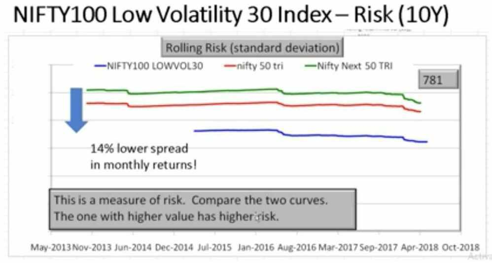

# Index Investing / ETF

## What is a factor-based index?

An index created by active stock selection using conditions such as low volatility, momentum, alpha, quality, value etc. and not market capitalization is called a factor index. Stocks in the index are weighted using these factors -- for eg. lower volatility stock has a higher weight. So this combines active stock-picking -- quantitative, rule-based -with passive investing (if an ETF or index fund follows this index).

## What is a multi-factor index?

This is an index constructed with two or more factors or rules. For example, there are four multi-factor indices launched by the NSE:

1. NIFTY Alpha Low-Volatility 30 = 50% alpha + 50% low volatility
2. NIFTY Quality Low-Volatility 30 = 50% quality + 50% low volatility
3. NIFTY Alpha Quality Low-Volatility 30 = 1/3 Alpha + 1/3 Quality + 1/3 Low Vol
4. NIFTY Alpha Quality Value Low-Volatility 30 = 25% Alpha + 25% Quality + 25% Value + 25%Low Volatility

## What is the benefit of a factor-index?

Unlike a market-cap based index, a factor-index often (not always) has a weighting cap of, for example, 5%. This lowers concentration risk. Depending on the rule used, a factor-based index can from time to time (not always) offer lower risk and/or higher returns than a market-cap based index.

## What is the benefit of a multi-factor index?

This provides diversification in the rules. When an index house or fund house projects a single factor index or ETF, they would tell you "why a single-factor is better than a usual index". They would leave out the fact that a single factor may not work all the time or can be riskier. When they a project a multi-factor index or ETF they would go "Multi-factors counters the impact of the cyclicality of single-factor indices".

## Strategic (smart beta) indices

## NIFTY Alpha 30 Index

- **Alpha =** actual return - expected return (after comparing volatility with market)
- **Higher the excess return + lower the volatility the better**

## NIFTY Quaity 30 Index

- Return on equity (ROE), Debt equity ratio (D/E) and average change in Profit After Tax (PAT) in previous 3 financial years
- 30 such stocks from Nifty 100 + Nifty Midcap 50 are chosen

## NIFTY Value 30 Index

- Business durability: High ROCE (Return on Capital Employed), low PE, low PB and high Dividend yield (DY) in the last financial year with positive PAT

## NIFTY100 Low Volatility 30 Index

- 30 least volatile stocks in the NIFTY 100
- It is a 30 stock index selected from NIFTY 100 and NIFTY Midcap 50 based on 50% Jensen's alpha and 50% low volatility. The index weight is capped at 5%.

- Just get the stocks of the index from Nifty 100 Low Vol 30

## Investing options in Strategic Indices

- Edelweiss ETF - Nifty Quality 30
- ICICI Prudential Nifty Low Vol 30 ETF (Nifty Low Vol 30)
- Reliance ETF NV20 (Nifty 50 Value 20 TRI)
- ICICI Prudential NV20 ETF (Nifty 50 Value 20 TRI)
- Kotak NV 20 ETF (Nifty 50 Value 20 TRI)

- Price of NAV is very high
- Unless you know how to trade, don't touch these

## Index Funds

[11 Different Types of Index Funds in India | How Index Funds Work | Index Funds for Beginners - YouTube](https://www.youtube.com/watch?v=6FhpZd-PAq8&ab_channel=ShankarNath)

- Broad market index funds
- Market capatalization index funds
- Equal weight index funds
- Factor baesd or smart beta index funds
- Strategy index funds
- Sector based index funds
- International index funds
- Debt index funds
- Custom index funds

An index fund is a fund that holds all the stocks in the underlying index to mimic the overall performance of that index. At present, Nifty50 and Nifty Next50 are two best index fund options available for investors in India. These funds mimic the portfolio of the Nifty and Nifty Next50 Index, respectively.

Bombay Stock Exchange (BSE) and the National Stock Exchange (NSE) are the two biggest stock exchanges in India. There are approximately 4500 listed companies on BSE and around 1600 listed companies on NSE. Most big companies are listed on both stock exchanges. Sensex is the stock market index of BSE, while Nifty is that of NSE.

The top 100 companies based on full market capitalisation listed on NSE are called Nifty100. Full market capitalisation is the current price of stock multiplied by the total number of stocks of the company. Or in simple words, it is the amount an investor needs to spend if he wants to purchase 100% ownership of the company.

Nifty50 index represents the top 50 companies from Nifty100 based on free-float market capitalisation. Free float market capitalisation is the market capitalisation calculated after excluding shares held by promoters and strategic investors.

Nifty Next50 Index represents 50 companies from Nifty100 after excluding the Nifty50 companies. Likewise, Sensex represents the top 30 companies listed on BSE by free-float market capitalisation.

The weight of each stock in the index depends on its free-float market capitalisation. Higher the free-float market capitalisation of the company, higher its allocation in the index. At present, HDFC Bank is the biggest company in India by free-float market capitalisation; therefore, its weight is highest in both Nifty and Sensex. If the free-float market capitalisation of another Nifty business is 1/10th of HDFC Bank, its weight in Nifty would be 1/10th of HDFC Bank's weight.

Since the weight of each stock in the index depends on its free-float market capitalisation, which depends on the stock price, when the stock price of any company goes up, its weight in the index goes up. Likewise, weight of any business whose stock price goes down also automatically comes down. If any company is no longer in the top 50 companies by free-float market capitalisation, it is replaced by another successful company. In any calendar year, a maximum of five businesses can be replaced. These changes in the index are done semi-annually.

Nifty50 index value is calculated using the following formula:

Nifty50 Index Value = (Current total free-float market capitalisation of Nifty50 companies/total free-float market capitalisation of Nifty50 companies on Nov 03, 1995) * 1000

Though the Nifty50 index fund mimics the portfolio of the Nifty50 index, the returns from the index fund are higher than that of the Nifty50 index return. This happens because the dividend index fund scheme receives is reinvested in the portfolio. Nifty50 value doesn't reflect the effect of dividend reinvestment.

Index funds benefit from price discovery by the collective wisdom of the market. It is tough to outguess the market and generate a higher return.

Another big reason most actively managed funds underperform index funds is their higher expenses. Actively managed funds charge significantly higher expense compared to index funds (the expense ratio of HDFC Equity Fund-Direct Plan is 1.27% per annum as against 0.1% expense of HDFC Index Fund Nifty 50 Plan-Direct Plan).

https://freefincal.com/build-equity-mutual-fund-portfolio

## Should I switch to Index Funds?

- First learn to invest with a strategy
- Select an asset allocation for your need
- Learn how to manage risk systematically
- Then once confident, you can become an index investor

## Benchmark Exchange Traded Schemes (BeEs)

[Nippon India ETF Nifty BeES vs UTI Nifty Index Fund: Which is better?](https://www.youtube.com/watch?v=1HGazJ61Qu8)

- Nippon India ETF Nifty 50 BeES, NSE: NIFTYBEES
- Nippon India ETF Nifty Next 50 Junior BeES, NSE: JUNIORBEES
- SBI-ETF 10 Year GILT
- Motilal Oswal 5 Year G-Sec ETF
- 8-13 Year Govt Bonds Basket - Nippon

## Exchange-traded fund (Index ETF)

An exchange-traded fund (ETF) is a collection of securities - such as stocks - that tracks an underlying [index](https://www.investopedia.com/terms/m/marketindex.asp).

An ETF is called an exchange-traded fund since it's traded on an exchange just like stocks. The price of an ETF's shares will change throughout the trading day as the shares are bought and sold on the market. This is [unlike mutual funds](https://www.investopedia.com/ask/answers/09/mutual-fund-etf.asp), which are not traded on an exchange, and trade only once per day after the markets close.

### What is an ETF's Market price and NAV

- The ETF market price is the price at which an ETF can be bought or sold on the exchanges during trading hours. If more buyers than sellers arise, the price will rise in the market, and the price will decline if more sellers appear.
- The net asset value (NAV) of an ETF represents the value of each share of the fund's underlying assets and cash at the end of the trading day.
- An ETF is said to trade at a **premium** when its price exceeds its NAV. An ETF is said to trade at a discount when its price is below its NAV.
- Current - 100, selling - 101 (premium), selling - 99 (discount)

### What is iNAV

- iNAV provides an intraday indicative Net Asset Value of an ETF based on the market values of its underlying constituents.
- iNAV is reported approximately every 10-15 seconds, hence it represents a near real-time view of the value of a fund..
- iNAV is a tool that helps to keep funds trading near their par value
- Reporting an iNAV can help a fund to avoid significant premium and discount trading
- [How ETF Works? | iNAV concept Explained - YouTube](https://www.youtube.com/watch?v=DpD_23GYdAQ)
- [How motilal oswal most shares nasdaq 100 etf returns are higher than nasdaq 100 index? : r/IndianStockMarket](https://www.reddit.com/r/IndianStockMarket/comments/1hl2v17/how_motilal_oswal_most_shares_nasdaq_100_etf/)
- [What is iNAV and how to view it on Kite?](https://support.zerodha.com/category/trading-and-markets/kite-web-and-mobile/others/articles/what-is-inav)
	- MON100
	- MON100INAV
- Reserve Bank of India (RBI) limits how much AMCs can invest overseas. Currently, this limit is $7 billion for the entire industry and $1 billion per AMC.

### Things to keep in mind when investing in ETF

- **iNAV** represents the "fair" price of an ETF, so paying substantially more (premium) or receiving substantially less (discount) than iNAV is generally ill-advised
- **How high is the tracking error?** - Tracking error is the difference between the returns of the fund and its benchmark index it is trying to mimic. A higher tracking error shows that the fund is not replicating the index truly.
- **How liquid is the fund?** - Liquidity can be an issue in case of ETFs as they can only be bought and sold on the exchanges. You would be able to sell only if there is enough demand and  that may not always be the case.
- **Expense Ratio?**

[How to CRUSH the Nifty by 10% Every Year? | Smart Beta ETF Strategies | Alpha, Momentum, Low Vol - YouTube](https://www.youtube.com/watch?v=F8YxDJISrEw)

## ETFs

- Mon100
- [How To Cash In On China & Hong Kong’s Market Surge I Investing In China Market - YouTube](https://www.youtube.com/watch?v=n0JbMoqoqN8&ab_channel=NDTVProfit)

## Gold ETFs

- ICICI prudential gold ETF
- Kotak Gold ETF
- HDFC Gold ETF
- UTI Gold ETF

## International ETFs

[Free ETF Screener - Search and Analyze ETFs - Stock Analysis](https://stockanalysis.com/etf/screener/)

### Technology

- QQQ - Invesco QQQ Trust, Series 1
	- Expense Ratio - 0.20%
	- Assets - $326.68B
	- The Invesco QQQ Trust Series I (QQQ) is an exchange-traded fund that is based on the NASDAQ 100 index, a modified-market-cap-weighted index of 100 NASDAQ-listed stocks. QQQ was launched on Mar 10, 1999 and is issued by Invesco.
	- [QQQ ETF Stock Price, Quote & Overview - Stock Analysis](https://stockanalysis.com/etf/qqq/)
	- [QQQ vs. VGT — ETF Comparison - Stock Analysis](https://stockanalysis.com/etf/compare/qqq-vs-vgt/)
- VGT - Vanguard Information Technology ETF (AGT ARCA)
	- Assets - $85.55B
	- **Expense Ratio - 0.10%**
	- The Vanguard Information Technology ETF (VGT) is an exchange-traded fund that mostly invests in information technology equity. The fund tracks a market cap-weighted index of companies in the US information technology sector. VGT was launched on Jan 26, 2004 and is issued by Vanguard.
	- [VGT ETF Stock Price, Quote & Overview - Stock Analysis](https://stockanalysis.com/etf/vgt/)
	- [QQQ vs. VGT — ETF Comparison - Stock Analysis](https://stockanalysis.com/etf/compare/qqq-vs-vgt/)
- Technology Select Sector SPDR Fund (XLK)
	- Assets - $72.81B
	- Expense Ratio - 0.09%
	- Holdings - 72
	- The Technology Select Sector SPDR Fund (XLK) is an exchange-traded fund that is based on the Technology Select Sector index. The fund tracks an index of S&P 500 technology stocks. XLK was launched on Dec 16, 1998 and is issued by State Street.
	- [XLK ETF Stock Price, Quote & Overview - Stock Analysis](https://stockanalysis.com/etf/xlk/)
- iShares Bitcoin Trust ETF (IBIT)
	- Assets - $59.39B
	- Expense Ratio - 0.25%
	- The iShares Bitcoin Trust ETF (IBIT) is an exchange-traded fund that mostly invests in long btc, short usd currency. The fund is a passively managed fund that seeks to track the spot price of Bitcoin. IBIT was launched on Jan 5, 2024 and is issued by BlackRock.
	- [IBIT ETF Stock Price, Quote & Overview - Stock Analysis](https://stockanalysis.com/etf/ibit/)
	- [How can Indians invest in Bitcoin ETFs in the US? BitBNS' Gaurav Dahake answers](https://economictimes.indiatimes.com/markets/expert-view/how-can-indians-invest-in-bitcoin-etfs-in-the-us-bitbns-gaurav-dahake-answers/articleshow/106944940.cms?from=mdr)
	- [Indian investors can profit from Bitcoin ETFs. Here’s how - appreciate](https://appreciatewealth.com/blog/indian-investors-can-profit-from-bitcoin-etfs-heres-how#:~:text=Tax%20implications%20of%20investing%20in,to%20Bitcoin%20ETFs%20as%20well.)

### Others

- SPDR S&P 500 ETF Trust (SPY)
	- Assets - $624.34B
	- Expense Ratio - 0.09%
	- The SPDR S&P 500 ETF Trust (SPY) is an exchange-traded fund that is based on the S&P 500 index. The fund tracks a market cap-weighted index of US large- and mid-cap stocks selected by the S&P Committee. SPY was launched on Jan 22, 1993 and is issued by State Street.
	- [QQQ vs. SPY — ETF Comparison - Stock Analysis](https://stockanalysis.com/etf/compare/qqq-vs-spy/)
- Vanguard Growth ETF (VUG)
	- Assets - $159.91B
	- Expense Ratio - 0.04%
	- The Vanguard Growth ETF (VUG) is an exchange-traded fund that is based on the CRSP US Large Growth index. The fund tracks an index of large-cap stocks in the US. Holdings are selected and weighed based on growth factors. VUG was launched on Jan 26, 2004 and is issued by Vanguard.
	- [VUG ETF Stock Price, Quote & Overview - Stock Analysis](https://stockanalysis.com/etf/vug/)
	- [VUG vs. QQQ ETF comparison analysis \| ETF Central](https://www.etfcentral.com/compare-etfs/VUG-vs-QQQ)
- Vanguard FTSE Developed Markets ETF (VEA)
	- Assets - $139.70B
	- Expense Ratio - 0.06%
	- The Vanguard FTSE Developed Markets ETF (VEA) is an exchange-traded fund that mostly invests in total market equity. The fund is passively managed to provide exposure to the developed markets ex-US equity space. It holds stocks of any market capitalization. VEA was launched on Jul 20, 2007 and is issued by Vanguard.
	- [VEA ETF Stock Price, Quote & Overview - Stock Analysis](https://stockanalysis.com/etf/vea/)
- **Vanguard Global Stock Index Fund (VT Index)**
- MSCI World Index
- MSCI All Country World Index
- S&P Global Index
- Dow Jones Industrial Average
- FTSE 100 Index (London)
- DAX 30 (Germany)
	- includes 40 major German blue-chip companies
- NIKKEI 225 (Japan)
- MEXI is Mexiso, LSE i London, ARCA is NYSE

https://www.youtube.com/watch?v=qRT917PvEns

### International Stocks

- Taiwan Semiconductor Manufacturng Co Ltd (TPE: 2330)
- Samsung Electronics Co Ltd (KRX: 005930)

### nasdaq composite vs nasdaq 100

The composition of the NASDAQ Composite is heavily weighted towards companies in the information technology sector. The Nasdaq-100, which includes 100 of the largest non-financial companies in the Nasdaq Composite, accounts for about 80% of the index weighting of the Nasdaq Composite.

## Links

- [Index Investing Options In India:](https://www.youtube.com/watch?v=IIV1Xt_rB3Y)
- [What are the risks with index investing?](https://freefincal.com/what-are-the-risks-with-index-investing/)
- [Can I continue investing in Parag Parikh Flexi Cap Fund plus UTI Nifty 50 Index fund?](https://freefincal.com/can-i-continue-investing-in-parag-parikh-flexi-cap-fund-plus-uti-nifty-50-index-fund/)
- [Should you invest in the Nifty 500 Momentum 50 Index?](https://freefincal.com/should-you-invest-in-the-nifty-500-momentum-50-index/)
- [The ‘S&P 500 Trap’, Explained. - YouTube](https://www.youtube.com/watch?v=5_kmy78Gu74&ab_channel=NewMoney)
