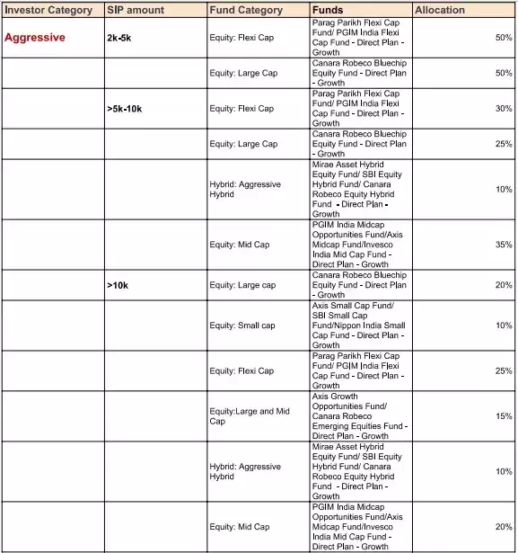

# Mutual Funds

- [Fixed Income](economics/mutual-funds/fixed-income.md)
- [Debt Mutual Funds](economics/mutual-funds/debt-mutual-funds.md)
- [Debt Mutual Funds Analysis](economics/mutual-funds/debt-mutual-funds-analysis.md)
- [Debt Mutual Funds Risks](economics/mutual-funds/debt-mutual-funds-risks.md)
- [Mutual Fund Indicators](economics/mutual-funds/mutual-funds-indicators.md)
- [Debentures / Bonds](economics/mutual-funds/debentures-bonds.md)
- [Index Investing / ETF](economics/mutual-funds/index-investing-etf.md)
- [Nifty Indexes](economics/mutual-funds/nifty-indexes-indices.md)
- [Equity Mutual Funds](economics/mutual-funds/equity-mutual-funds.md)
- [Others](economics/mutual-funds/others.md)

## Portfolios

[Best mutual fund SIP portfolios to invest in 2023](https://economictimes.indiatimes.com/mf/analysis/best-mutual-fund-sip-portfolios-to-invest-in-2023/articleshow/96612369.cms)

Recommended portfolio for aggressive investors:

## AMC Working

The other is due to the "safety of the capital". Or, in other words, the fear that someone will take our money and run away or the AMC itself would fail (like a bank).

A mutual fund in India is set up like a trust. A trust is an arrangement involving three parties (unlike a bank): the unitholder (or investor), the mutual fund company (AMC) and the mutual fund trustee.

The owner (sponsor) of the mutual fund creates a board of trustees responsible for overseeing the fund’s operations. They will have to ensure compliance with SEBI regulations. A custodian registered with SEBI holds the assets in the fund and is answerable to the trustees.

Two-thirds of the trustee board must not be part of the sponsor company. This also applies to half of the AMC directors. This arrangement makes it extremely difficult for the mutual fund to run away with unitholder money or violate SEBI regulations.

The question of a mutual fund not having enough money to pay the unitholder does not arise as the gains or losses made by the fund manager are directly passed on to the mutual fund. Also, there is monthly portfolio disclosure and periodic audits, which have to be submitted to SEBI.

Therefore, a mutual fund cannot fail like a bank. It can, however, get into trouble in other ways.

### What is the purpose of a show cause notice?

A show cause notice **signals an intention by an employer to take disciplinary action if suitable reasons are not provided for the behaviour by the employee**. A show cause notice may be given after a workplace investigation, disclosure by a third party or an admission by the employee themselves.

### AMCs

- Quant
    - [5 Secrets of Quant Mutual Fund which consistently ranks it in India’s Best Mutual Fund schemes - YouTube](https://www.youtube.com/watch?v=WqFMhqRhVbw&ab_channel=ShankarNath)
- Motilal Oswal
- Edelweiss
- Parag Parikh

## TREPS

TREPS, short for "Treasury Bills Repurchase," is a financial instrument widely used in the money market. In simple terms, it represents a short-term borrowing and lending arrangement between two parties – a borrower and a lender.

In a TREPS transaction, the borrower, often a mutual fund, pledges government securities, such as Treasury Bills, with the lender (usually a bank or a financial institution) to borrow funds. The lender provides the funds to the borrower, and in return, the borrower agrees to repurchase the pledged securities at an agreed-upon future date and price, including an interest component.

These transactions typically have short tenors, ranging from overnight to a few weeks, making them a valuable tool for managing temporary cash flow requirements.

### Why do Mutual Funds Invest in TREPS?

- Liquidity Management
- Yield Enhancement
- Short-term Financing
- Diversification of Funding Sources
- Regulatory Compliance

[TREPS: What is TREPS & Why Mutual Funds Invest in it?](https://mutualfund.adityabirlacapital.com/blog/what-is-treps-in-mutual-fund)

## Links

[Avoid these Mutual Fund Categories | ET Money](https://www.youtube.com/watch?v=4IuT2GOFiCI)

- Sectoral and Thematic Funds
- Small Cap Funds
- Multi Cap Funds
- Credit Risk Funds
- Long Term Gilt Funds and Long Duration Funds

[Solution-Oriented Funds: Should You Use for Investing for Children's Education & Your Retirement? - YouTube](https://www.youtube.com/watch?v=pTPtxE_BkAc)

[Make More from Your SIPs: The Right SIP Frequency, Best SIP Date, and SIP Timing | ET Money - YouTube](https://www.youtube.com/watch?v=OCl-z-IXXEE)

[How do Mutual Funds work? - YouTube](https://www.youtube.com/watch?v=OuYvU5m2rhQ)

[Building a mutual fund portfolio - YouTube](https://www.youtube.com/watch?v=6Zrl3ZeqqsE)

[5 Mutual Funds you must have in your portfolio | Mutual Fund investment - YouTube](https://www.youtube.com/watch?v=QiFo-Bw2dyI)

[Handpicked List of Mutual Funds Oct-Dec 2023 (PlumbLine)](https://freefincal.com/handpicked-list-of-mutual-funds-oct-dec-2023-plumbline/)

[Can I hold Rs. One Crore in a single mutual fund?](https://freefincal.com/can-i-hold-rs-one-crore-in-a-single-mutual-fund/)
