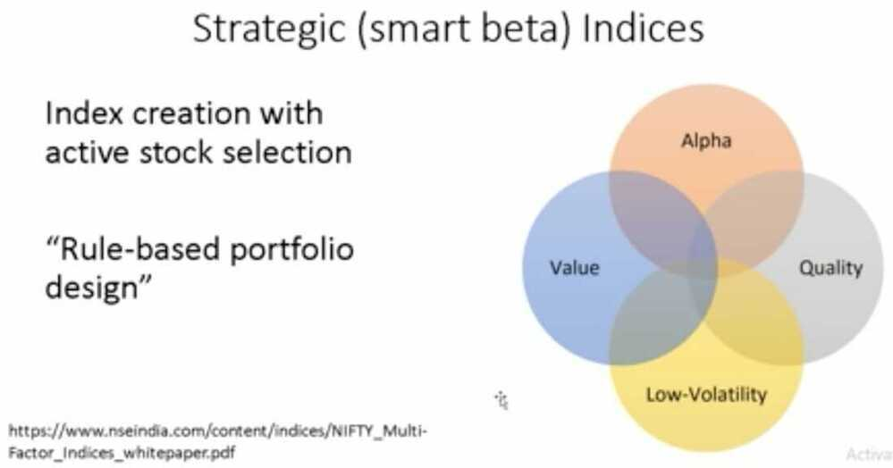
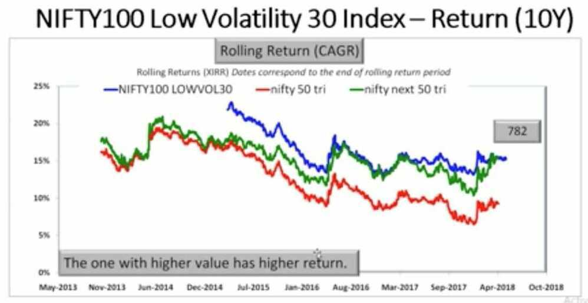
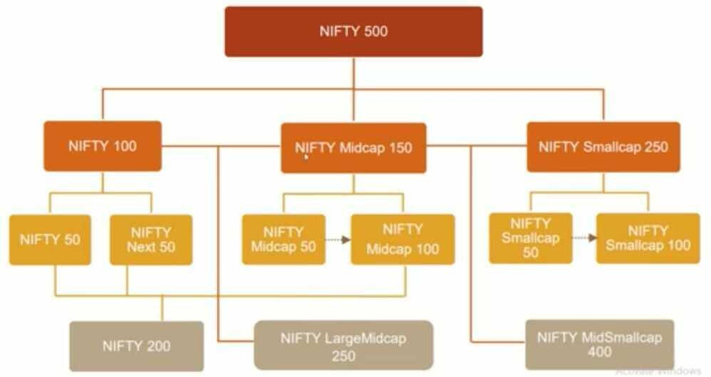
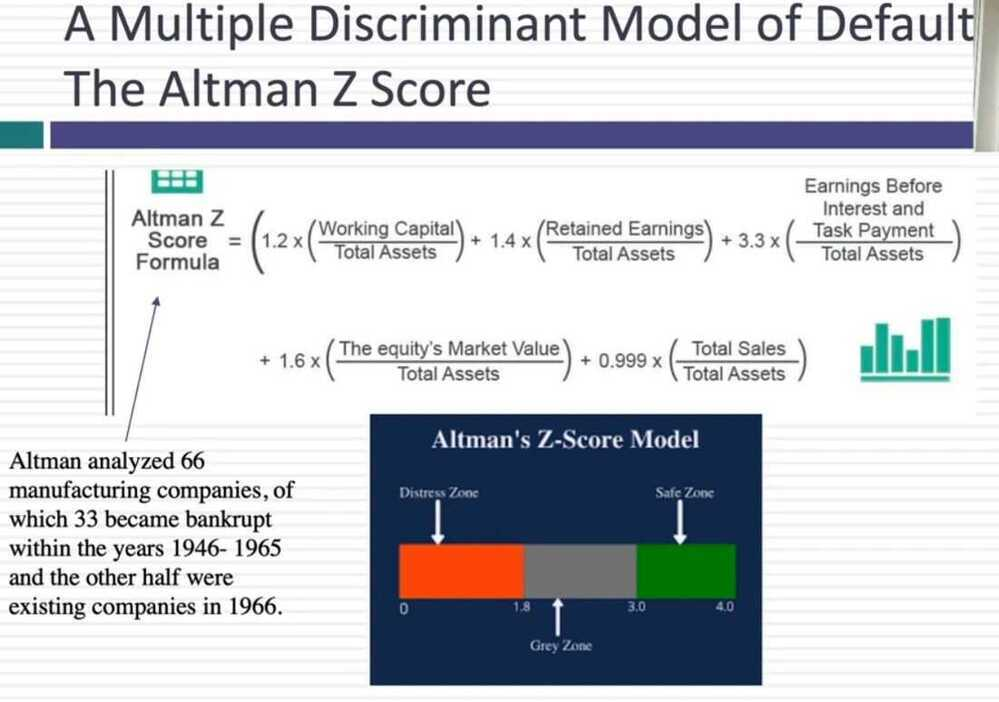

# Mutual Funds

[Index Investing Options In India:](https://www.youtube.com/watch?v=IIV1Xt_rB3Y)

TER - Total Expense Ratio

Exit Load

## Funds

<https://www.moneycontrol.com/mutual-funds/nav/icici-prudential-nifty-index-fund/MPI031>

<https://www.moneycontrol.com/mutual-funds/nav/parag-parikh-flexi-cap-fund-direct-plan-growth/MPP002>

<https://www.moneycontrol.com/mutual-funds/nav/hdfc-mid-cap-opportunities-fund-direct-plan-growth/MHD1161>

## Nifty VIX (India Volatility Index)

The India Volatility Index in short is termed India VIX. It indicates the degree of volatility or fluctuation traders expect over the next 30 days in the Nifty50 Index

[Volatility and India VIX](https://www.youtube.com/watch?v=JM_M1RPkCR8)

- Historical Volatility
- Forecasted Volatility
- Implied Volatility
- Avoid buying options when VIX is high
- Avoid selling options when VIX is low

[ET Money Answers Your Questions on Mutual Funds | ET Money](https://youtu.be/Xc2jI6A3M_0)

## Equity Risk Premium

- An equity risk premium is an excess return earned by an investor when they invest in the stock market over a risk-free rate
- This return compensates investors for taking on the higher risk of equity investing
- Determining an equity risk premium is theoretical because there's no way to tell how well equities or the equity market will perform in the future
- Calculating an equity risk premium requires using historical rates of return

<https://www.investopedia.com/terms/e/equityriskpremium.asp>

## Capital Asset Pricing Model (CAPM)

The Capital Asset Pricing Model (CAPM) describes the relationship between systematic risk and [expected return](https://www.investopedia.com/terms/e/expectedreturn.asp) for assets, particularly stocks.CAPM is widely used throughout finance for pricing risky [securities](https://www.investopedia.com/terms/s/security.asp) and generating expected returns for assets given the risk of those assets and [cost of capital](https://www.investopedia.com/terms/c/costofcapital.asp).

<https://www.investopedia.com/terms/c/capm.asp>

## What is a factor-based index?

An index created by active stock selection using conditions such as low volatility, momentum, alpha, quality, value etc. and not market capitalization is called a factor index. Stocks in the index are weighted using these factors -- for eg. lower volatility stock has a higher weight. So this combines active stock-picking -- quantitative, rule-based -with passive investing (if an ETF or index fund follows this index).

## What is a multi-factor index?

This is an index constructed with two or more factors or rules. For example, there are four multi-factor indices launched by the NSE:

1. NIFTY Alpha Low-Volatility 30 = 50% alpha + 50% low volatility
2. NIFTY Quality Low-Volatility 30 = 50% quality + 50% low volatility
3. NIFTY Alpha Quality Low-Volatility 30 = 1/3 Alpha + 1/3 Quality + 1/3 Low Vol
4. NIFTY Alpha Quality Value Low-Volatility 30 = 25% Alpha + 25% Quality + 25% Value + 25%Low Volatility

## What is the benefit of a factor-index?

Unlike a market-cap based index, a factor-index often (not always) has a weighting cap of, for example, 5%. This lowers concentration risk. Depending on the rule used, a factor-based index can from time to time (not always) offer lower risk and/or higher returns than a market-cap based index.

## What is the benefit of a multi-factor index?

This provides diversification in the rules. When an index house or fund house projects a single factor index or ETF, they would tell you "why a single-factor is better than a usual index". They would leave out the fact that a single factor may not work all the time or can be riskier. When they a project a multi-factor index or ETF they would go "Multi-factors counters the impact of the cyclicality of single-factor indices".

## ESG - Environmental, social and corporate governance

<https://www.wikiwand.com/en/Environmental,_social_and_corporate_governance>

## Balanced Funds which are a category of mutual funds that offer the best of both through a single fund as they invest in both asset types: Equity & Debt

| **BALANCED SUB CATEGORIES** | **DESCRIPTION** | **3Y CATEGORY RETURNS** |
|---|---|---|
| Aggressive | Invest 65-80% of its total assets in equity instruments and 20-35% of its total assets in debt instruments. | 8.90% - 17.15% |
| Equity Savings | Invest at least 65% of its total assets in equity and equity related instruments's at least 10% of its total assets in debt instruments. | 5.59% - 13.24% |
| Multi Asset Allocation | Invest in at least 3 different asset classes, with a minimum asset allocation of 10% in each of the three asset classes. | 5.74% - 14.98% |
| Arbitrage | Invest at least 65% of its total assets in equity and equity related instruments, with an arbitrage strategy. | 3.73% - 7.03% |
| Balanced Hybrid | Invest at least 40-60% of its total assets in each of equity and debt instruments. | 6.91% - 13.03% |
| Conservative Hybrid | Invest 75-90% of its total assets in debt instruments and 10-25% of its total assets in equity instruments. | 6.72% - 12.61% |
| Dynamic Asset Allocation | Invest in equity or debt instruments which are managed dynamically. | 6.34% - 16.04% |
| Smart Beta Funds | [Smart Beta Funds \| Factor Investing \| Momentum, Alpha, Value, Quality, Low Volatility etc. \| ETMONEY](https://www.youtube.com/watch?v=npMk-8ToJYw) | |

[Balanced Advantage vs Aggressive Hybrid Funds: When to use what](https://www.youtube.com/watch?v=1BtMJ5LigPU)

[Quant Small Cap Fund: Over 300% return in 3 years | Should You Invest In Quant Small Cap Fund? - YouTube](https://www.youtube.com/watch?v=7bxD-gVp340)

Commodity mutual funds

## Arbitrage Mutual Funds

An [arbitrage](https://www.investopedia.com/terms/a/arbitrage.asp) fund is a type of [mutual fund](https://www.investopedia.com/ask/answers/091115/are-mutual-funds-considered-equity-securities.asp) that appeals to investors who want to profit from volatile markets without taking on too much risk.

Arbitrage funds work by exploiting the price differential between assets that should theoretically have the same price. One of the most important types of arbitrage takes place between the cash and [futures markets](https://www.investopedia.com/terms/f/futuresmarket.asp). A typical fund purchases stocks with the hope of selling them later after the price has gone up. Instead, an arbitrage fund purchases stock in the cash market and simultaneously sells that interest in the futures market. The differences between stock prices and [futures contracts](https://www.investopedia.com/terms/f/futurescontract.asp) are usually very small. As a result, arbitrage funds must execute a large number of trades each year to make any substantial gains.

<https://www.investopedia.com/articles/investing/100515/what-exactly-are-arbitrage-mutual-funds.asp>

## Equity funds or growth funds

#### Common Names

- Bluechip’ and ‘large-cap’ are the same thing.
- ‘Long-term equity’, ‘tax saver’, ‘tax plan’, ‘tax relief’, and ‘ELSS’ are all the same thing — they are funds that help you save tax under section 80C.
- ‘Emerging large-cap’ is the same as ‘large & mid-cap’.

#### What is difference in Multi Asset Fund & other Hybrid funds?

Hybrid funds are mutual funds that invest in both equity (shares) and debt (fixed income securities, bonds, etc).

They are also called balanced funds.

There are a few kinds of hybrid funds.

Multi-asset funds are also hybrid in nature but there’s one major difference. They have to invest in at least 3 different assets and must invest at least 10% in each of those assets.

For example, a multi-asset fund might invest in equity, debt, as well as gold.

## Strategic (smart beta) indices

## NIFTY Alpha 30 Index

- **Alpha =** actual return - expected return (after comparing volatility with market)
- **Higher the excess return + lower the volatility the better**

## NIFTY Quaity 30 Index

- Return on equity (ROE), Debt equity ratio (D/E) and average change in Profit After Tax (PAT) in previous 3 financial years
- 30 such stocks from Nifty 100 + Nifty Midcap 50 are chosen

## NIFTY Value 30 Index

- Business durability: High ROCE (Return on Capital Employed), low PE, low PB and high Dividend yield (DY) in the last financial year with positive PAT

## NIFTY100 Low Volatility 30 Index

- 30 least volatile stocks in the NIFTY 100
- It is a 30 stock index selected from NIFTY 100 and NIFTY Midcap 50 based on 50% Jensen's alpha and 50% low volatility. The index weight is capped at 5%.

- Just get the stocks of the index from Nifty 100 Low Vol 30

## Equity MFs

- PPFAS LTE
- HDFC Hybrid Equity
- Quantum Long Term Equity
- **Motilal Oswal Focused 25 Fund**

## Investing options in Strategic Indices

- Edelweiss ETF - Nifty Quality 30
- ICICI Prudential Nifty Low Vol 30 ETF (Nifty Low Vol 30)
- Reliance ETF NV20 (Nifty 50 Value 20 TRI)
- ICICI Prudential NV20 ETF (Nifty 50 Value 20 TRI)
- Kotak NV 20 ETF (Nifty 50 Value 20 TRI)

- Price of NAV is very high
- Unless you know how to trade, don't touch these

## Index Funds

[11 Different Types of Index Funds in India | How Index Funds Work | Index Funds for Beginners - YouTube](https://www.youtube.com/watch?v=6FhpZd-PAq8&ab_channel=ShankarNath)

- Broad market index funds
- Market capatalization index funds
- Equal weight index funds
- Factor baesd or smart beta index funds
- Strategy index funds
- Sector based index funds
- International index funds
- Debt index funds
- Custom index funds

An index fund is a fund that holds all the stocks in the underlying index to mimic the overall performance of that index. At present, Nifty50 and Nifty Next50 are two best index fund options available for investors in India. These funds mimic the portfolio of the Nifty and Nifty Next50 Index, respectively.

Bombay Stock Exchange (BSE) and the National Stock Exchange (NSE) are the two biggest stock exchanges in India. There are approximately 4500 listed companies on BSE and around 1600 listed companies on NSE. Most big companies are listed on both stock exchanges. Sensex is the stock market index of BSE, while Nifty is that of NSE.

The top 100 companies based on full market capitalisation listed on NSE are called Nifty100. Full market capitalisation is the current price of stock multiplied by the total number of stocks of the company. Or in simple words, it is the amount an investor needs to spend if he wants to purchase 100% ownership of the company.

Nifty50 index represents the top 50 companies from Nifty100 based on free-float market capitalisation. Free float market capitalisation is the market capitalisation calculated after excluding shares held by promoters and strategic investors.

Nifty Next50 Index represents 50 companies from Nifty100 after excluding the Nifty50 companies. Likewise, Sensex represents the top 30 companies listed on BSE by free-float market capitalisation.

The weight of each stock in the index depends on its free-float market capitalisation. Higher the free-float market capitalisation of the company, higher its allocation in the index. At present, HDFC Bank is the biggest company in India by free-float market capitalisation; therefore, its weight is highest in both Nifty and Sensex. If the free-float market capitalisation of another Nifty business is 1/10th of HDFC Bank, its weight in Nifty would be 1/10th of HDFC Bank's weight.

Since the weight of each stock in the index depends on its free-float market capitalisation, which depends on the stock price, when the stock price of any company goes up, its weight in the index goes up. Likewise, weight of any business whose stock price goes down also automatically comes down. If any company is no longer in the top 50 companies by free-float market capitalisation, it is replaced by another successful company. In any calendar year, a maximum of five businesses can be replaced. These changes in the index are done semi-annually.

Nifty50 index value is calculated using the following formula:

Nifty50 Index Value = (Current total free-float market capitalisation of Nifty50 companies/total free-float market capitalisation of Nifty50 companies on Nov 03, 1995) * 1000

Though the Nifty50 index fund mimics the portfolio of the Nifty50 index, the returns from the index fund are higher than that of the Nifty50 index return. This happens because the dividend index fund scheme receives is reinvested in the portfolio. Nifty50 value doesn't reflect the effect of dividend reinvestment.

Index funds benefit from price discovery by the collective wisdom of the market. It is tough to outguess the market and generate a higher return.

Another big reason most actively managed funds underperform index funds is their higher expenses. Actively managed funds charge significantly higher expense compared to index funds (the expense ratio of HDFC Equity Fund-Direct Plan is 1.27% per annum as against 0.1% expense of HDFC Index Fund Nifty 50 Plan-Direct Plan).

<https://freefincal.com/build-equity-mutual-fund-portfolio>

## Should I switch to Index Funds?

- First learn to invest with a strategy
- Select an asset allocation for your need
- Learn how to manage risk systematically
- Then once confident, you can become an index investor

## REIT (Real Estate Investment Trusts) / Real Estate Mutual Funds

<https://cleartax.in/s/reit-funds>

Categories of actively managed equity mutual fund schemes

- Largecap: At least 80% in largecap
- Midcap: At least 65% in midcap
- Smallcap: At least 65% in smallcap
- Large & midcap: At least 35% each in largecap and midcap
- **Multicap: At least 65% in equities and no market-cap wise restriction**

In the multicap category, the allocation decision is left to the fund manager who is better equipped to take allocation decision compared to retail investors and their advisers. The fund manager doesn't have a restricted mandate, and therefore, he is free to invest where he finds better opportunities.

- Sectoral/Thematic: At least 80% in the chosen sector stocks
- Focused: At least 65% in equities and a maximum of 30 stocks in the portfolio.
- Dividend Yield: At least 65% in equities but in dividend-yielding stocks
- Value/Contra: At least 65% in equities, the scheme should follow value or contra investment strategy.
- ELSS: At least 80% in equities, lock-in of 3 years and tax benefit under section 80C

## Conditional Probabilities: Bond Rating and Default Rates

## A Probit Model: Hostile Acquisitions

- While there are no easy pathways to making money, it seems clear that investors in companies that are targeted in acquisitions (especially hostile ones) earn high returns, but only if they invest before the event
- There are probit models for predicting companies that will be targeted, and they involve:
  - You start with all firms that publicly traded at the start of a period
  - The dependent variable becomes the stand-in for whether a firm is targeted in a hostile acquisition
  - The independent variables reflect what you believe are key drivers of hostile acquisitions, including poor stock price performance, lagging accounting returns and managers with little or no shareholdings
  - You build a probit model that will yield as output an equation that resembles a regression, but will yield a probability of a hostile acquisition

## Smallcase

[True cost of Smallcase Investing EXPOSED | Ankur Warikoo](https://www.youtube.com/watch?v=RwKEqGOpqQs)

### Smallcases

1. Windmill Capital - Straight Flush
2. Windmill Capital - Value and Momentum
3. Windmill Capital - Brand Value
4. Low risk smart beta: <https://www.smallcase.com/smallcase/low-risk-smart-beta-SCSB_0003>
5. Weekend Investing - Smallcase Weekend Investing - Mi_NNF10
6. Smallcase Capitalmind Momentum
7. Dividend Aristocrat
8. Dividend stars
9. SmartNifty index

1. Gulaq - <https://www.gulaq.com>

## Funds

SBI smallcap mutual fund - <https://twitter.com/etmoney/status/1590690695408676865>

## Portfolios

[Best mutual fund SIP portfolios to invest in 2023](https://economictimes.indiatimes.com/mf/analysis/best-mutual-fund-sip-portfolios-to-invest-in-2023/articleshow/96612369.cms)

Recommended portfolio for aggressive investors:

## Links

[Avoid these Mutual Fund Categories | ET Money](https://www.youtube.com/watch?v=4IuT2GOFiCI)

- Sectoral and Thematic Funds
- Small Cap Funds
- Multi Cap Funds
- Credit Risk Funds
- Long Term Gilt Funds and Long Duration Funds

[Solution-Oriented Funds: Should You Use for Investing for Children's Education & Your Retirement? - YouTube](https://www.youtube.com/watch?v=pTPtxE_BkAc)
