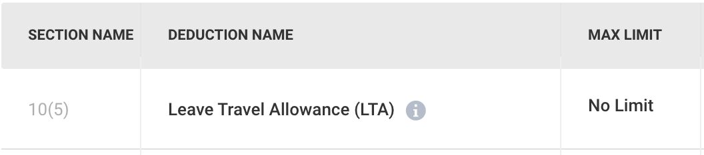
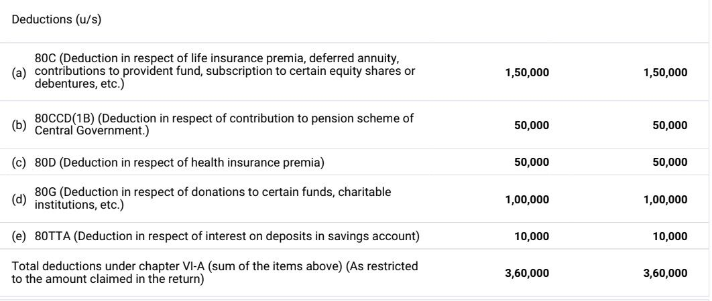

# Deductions

### Deduction U/S 10 - HRA

- House Rent - 8300 * 12 = 99600 (PAN not required)
- Parents can claim property taxes paid by them and also claim a 30% standard deduction from this rental income.
- If they are more than 60 years old, they will also enjoy a higher minimum income exemption limit (Rs.3 lakh for those who have aged above 60 years old and Rs.5 lakh for those who are aged above 80 years old).
- Individuals paying rent but not receiving house rent allowance can claim a deduction under Section 80GG. Also, the individual, spouse or children should not own a house property in the place of employment, business or location where the individual ordinarily resides for claiming this deduction.

- https://freefincal.com/tax-benefits-hra-home-loans
- [Can I pay rent to my parents to save tax?](https://cleartax.in/s/can-i-pay-rent-to-my-parents-to-save-tax)
- [House Rent Allowance (HRA) - What is House Rent Allowance, HRA Exemption And Tax Deduction](https://cleartax.in/s/hra-house-rent-allowance)

#### HRA Calculator

- [Online House Rent Allowance (HRA) Calculator | The 1% Club](https://calculators.onepercentclub.io/hra-calculator)
- [HRA Calculator - Online Calculate your House Rent Allowance](https://cleartax.in/paytax/HraCalculator)

#### TDS on rent

- https://eportal.incometax.gov.in/iec/foservices/#/login
- e-file > e-pay tax (Pay quarterly)
- New Payment
- 26 QC (TDS on Rent of Property)
- Form
    - Residential Status of the Landlord - Resident
    - Whether more than one Tenant* - No
    - PAN of landlord -
    - Flat door building -
    - Type of property - Both
    - Address details - Same
    - Period of Tenancy - 11
    - Total value of rent paid - 90000
    - Value of rent paid last month - 81000
    - Amount paid credited - 81000
    - Rate at which rent deducted - 10
    - Amount of tax deducted at source - 9000
- Netbanking - HDFC Bank

- [What is the TDS provision for rent paid by individuals above Rs 50,000?](https://news.cleartax.in/what-is-the-tds-provision-for-rent-paid-by-individuals-above-rs-50000/6672/)
- [tds penalty: Paying house rent of more than Rs 50000 per month? Penalty you will pay for not deducting TDS - The Economic Times](https://economictimes.indiatimes.com/wealth/tax/paying-house-rent-of-rs-50000-or-more-per-month-penalty-you-will-pay-for-not-deducting-tds/articleshow/104176779.cms?from=mdr)
- [TDS on Rent: Section 194I Explained and Calculation Guidelines](https://www.canarahsbclife.com/blog/tax-saving/how-to-calculate-tds-on-rent)
- [TDS on Rent payment of More Than Rs. 50000 P.M. By Individuals/ HUFs](https://taxguru.in/income-tax/tds-payment-rent-rs-50000-month-individuals-hufs.html)
- [Form 16C: TDS Certificate On Rent And Challan 26QC](https://cleartax.in/s/know-form-16c-challan-26qc-deducting-tds-rent)

#### Why 11 Months?

By keeping the lease duration to 11 months, landlords can ensure that the regulations of the Rent Control Act do not apply to their agreement. This allows for greater flexibility in dictating the terms of the lease, including the rent and the tenure of the lease.

Most rental agreements in India are 11 months long because it allows landlords to avoid the Rent Control Act's regulations, which can restrict the terms of the lease. This gives landlords more flexibility to specify the lease's terms, including the rent and the length of the lease. The agreements are typically renewed every 11 months, which gives both parties the opportunity to revise the terms as per their convenience.

An 11-month lease agreement also allows the landlord to set the rent based on the current market scenario. The parties involved don't need to pay any stamp duty and registration charges for an 11-month rent agreement. They can also easily renew such agreements using stamp duty paper of Rs. 100 when deciding to extend the rental contract.

However, the agreement doesn't have to be for 11 months. Renewable/extendable agreements of three to five years can also be made as per the assent of the parties.

Alternatively, the landlord and the tenant may mutually agree to not get the agreement registered, which can help them avoid paying the stamp duty and registration fee.

[Why Most Lease Agreements are for 11 Months in India?](https://www.linkedin.com/pulse/why-most-lease-agreements-11-months-india-realtysmartz/)

### Others

Sec 80D - Medical Insurance Premium (If the policy covers a senior citizen then exemption is Rs.50,000/-) for self and family- Existing or new policy bought between April 2019 till March 2020.

Medical Insurance 80D for Parents (Here you can claim the amount upto maximum of Rs 25,000 per annum for the premiums paid for your parents. If your parents are senior citizens, the amount is increased to Rs 30,000 per annum. You can also claim preventive health check-up amount of Rs 5,000 for your parents too.)

Sec 80DD - Handicapped Dependent (Medical Treatment on handicapped dependent, Copies of medical bills and duly completed Form 10-IA have to be submitted.)

- Rs 75,000 (Starting from the financial year 2015-16) where disability is more than 40% and less than 80%.
- Rs 1,25,000 (Starting fromthe financialyear 2015-16) where disability is more than 80%.
- These deductions are allowed irrespective of your actual expenditure.

Sec 80E - Repayment of Loan for higher education (only Interest)

Sec 80GG - Rent Paid

Sec 80U - Handicapped

### Sec 80TTA / 80TTB - Interest on saving a/c (upto 10000)

- Exemption upto 10,000 for interest earned in savings bank account (less than 60 years) - does not include fixed deposit / RD
- Exemption upto 50,000 for interest earned for term deposits / RD for age greater than 60 years

[**https://cleartax.in/s/claiming-deduction-on-interest-under-section-80tta**](https://cleartax.in/s/claiming-deduction-on-interest-under-section-80tta)

### 80DDB - Dependent Critical Illness (upto 1,00,000)

### DEDUCTION U/S 80C (Max 150000)

Contribution to Pension Fund (Jeevan Suraksha)

Life Insurance Premium on life of self/spouse/child only

Deferred Annuity

### Public Provident Fund in own name/spouse/child only

ULIP of UTI/LIC in own name or spouse and child only

Repayment of Housing Loan (Only principal)

Contribution to Pension Fund or UTI or Notified Mutual Fund

Investment in ELSS made in units of Notified Mutual Fund

Children Tuition Fee: Restricted to a max of 2 Children

Deposit in home loan account scheme of NHB/HDFC

5 yrs. Term deposit in a Sch.Bank

Others (please specify)

Others (please specify)

DEDUCTION U/S 80CCCAnnuity/Pension Plan

DEDUCTION U/S 80CCDNotified Pension Scheme (NPS) (Max 50000)

Asset Classes (Equity, Corporate debt, Government Bonds and AlternativeInvestmentFunds)

### DEDUCTION U/S 24

Interest on Housing Loan on fully constructed accomodation only (Limit - 200,000)

Interest if the loan is taken before 01/04/99 on fully constructed accomodation only (Limit - 30,000)

### 10(5) LTA

- 13739

https://economictimes.indiatimes.com/wealth/tax/how-to-claim-lta-from-your-employer/articleshow/66246473.cms?from=mdr

[Leave Travel Allowance (LTA) Rules 2024: How to claim, calculate - The 1% News](https://news.onepercentclub.io/taxation/leave-travel-allowance-lta-rules-eligibility-how-to-claim-calculate-latest-updates/3048/)

Loss from business and profession cannot be set off against income chargeable to tax under the head "Salaries". 8) Loss under the head "house property" shall be allowed to be set-off against any other head of income only to the extent of Rs. 2,00,000 for any assessment year.

## Tax

1. Max - 1.5 lakh

- PF - tax free upto 1 lakh

- Rent

[17 Best Income Tax Saving Schemes & Plans in 2023](https://scripbox.com/tax/tax-saving-options/)

https://www.etmoney.com/blog/beyond-section-80c-10-ways-to-save-taxes

## Special allowance

[Special Allowance in India: Taxation & Calculation - Tax2win](https://tax2win.in/guide/special-allowance)

[Special Allowance in India - Taxation, Exemption Limit, Calculation](https://cleartax.in/s/special-allowance-india)

[Special Allowance in India - Taxation & Calculation](https://www.bankbazaar.com/tax/special-allowance.html)

[What is Special Allowance? - Taxation and Calculation in India](https://groww.in/p/tax/special-allowance)

[Dearness Allowance - Meaning, Types, Taxation & How to Calculate?](https://scripbox.com/tax/dearness-allowance)
